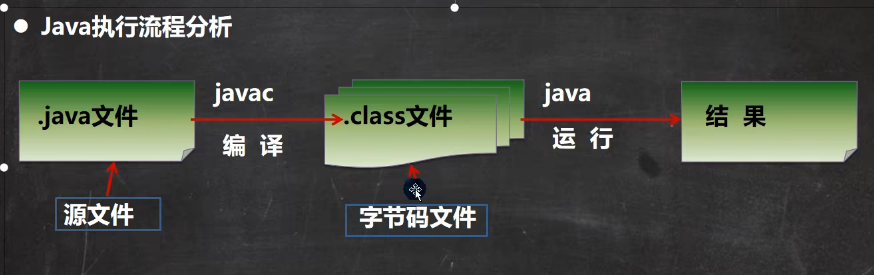

#### 1. 基本程序语法要点
以基本的helloworld程序为例说明要点
```java
public class Hello{
	public static void main(String[] args){
		System.out.println("哈哈");
	}
}
```

* **java应用程序的入口是main方法**,有固定的书写格式，具体如上面代码所示
* 每个语句的结束都必须有个`;`
* **一个源文件(.java文件)最多只能包含一个public类，其它的类个数不限**
* 编译后每一个类，都对应一个.class字节码文件
* **如果源文件最多只能有一个public类，则文件名(.java文件的名字)必须按照该类名命名**
#### 2.java执行流程分析

* **编译**：命令为javac，是将java源文件通过编译器编译为JVM可以识别的字节码文件（.class文件）
* **运行**：命令为java，通过运行工具java.exe对字节码文件进行执行，本质是.class文件装载到jvm虚拟机执行