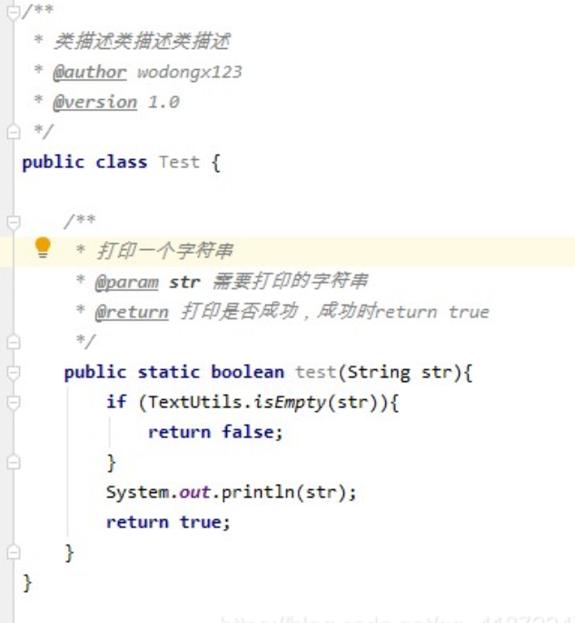

### 1）转义字符
* 在java中。转义字符的大小和char类型的大小相同都是2字节大小
* 主流的字符集现在是Unicode字符集，UTF-8编码方案是Unicode字符集其中的一种，也是目前主流的编码方案


### 2）注释
#### 1.单行注释
单行注释以“//”开头，示例如下：  
```java
//制表符\t
System.out.println("a\tb\tc\te");
```

#### 2.多行注释
示例如下：  
```java
/*制表符\t*/
System.out.println("a\tb\tc\te");
```
使用细节：  
1. 被注释的内容不会被java虚拟机执行
2. 多行注释里面不能嵌套多行注释，因为类似于悬空if else不知道注释到哪里结束

#### 3.文档注释
定义：注释内容可以被JDK提供的文档注释工具javadoc所解析，生成一套以网页文件形式体现的该程序的说明文档，一搬写在类开头等位置。  

开发人员可以在源代码中使用特定的注释标记来描述类、方法、字段等元素的用途和功能,然后利用 Javadoc 工具可以自动生成相应的 HTML 格式的文档。

基本使用：是以/\*\*开头，以\*/结尾  

使用示例如下：
```java
/**  
* @author Simon  
* @version 1.0  
*/
```
上面代码中的@后面的内容不是随便设置，而是有特定的内容，这些内容被称为javadoc标签

常用的javadoc以及用法如下  
[Javadoc写法和标签总结_javadoc标签大全-CSDN博客](https://blog.csdn.net/qq_41872247/article/details/117778467)

### 3）代码规范
#### 1.代码使用规范
1. 对于类、方法的注释，要以javadoc的方式来写    


2. 对于非javadoc的注释，也就是单行注释和多行注释，是给代码的维护者看的，着重告诉读者这段代码实在干什么
3. 使用tab操作实现整体右移操作，shift+tab实现整体左移操作，这样实现缩进，提高代码的可读性
4. 运算符和`=`两遍习惯性加一个空格，增加代码可读性。比如：
```java
int a = 1 + 3;
```
5. 源文件使用utf-8编码方式
6. 行宽不要超过80字符，多于的换行来写

#### 2.标识符命名规范
1. **标识符不能以数字开头**
1. 类名的每个单词首字母都大写，比如：HelloWorldClass
2. 变量名、对象名、方法名、包名等全部采用驼峰规则：首字母小写，其后所有单词仅首字母大写，比如：getAge
3. 常量名全部大写，并且全部由下划线隔开，比如：INT_MAX
4. 不能与关键字、以及特殊值同名，比如false、for等


