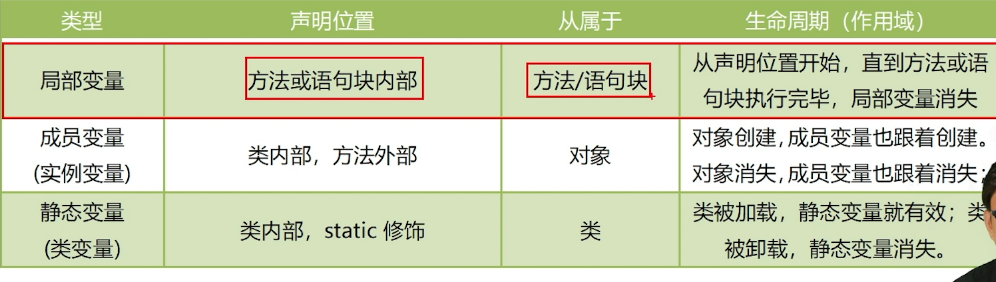

### 1）变量
变量有三种类型：局部变量，成员变量和静态变量，核心区别如下图所示：



注意：在 Java 中，**没有像 C 语言中的全局变量**（即在函数外部定义的变量，整个程序都可以访问）这样的概念。这是因为 Java 是面向对象的语言，所有变量都必须定义在类或方法中

使用细节：
1. 属性和局部变量可以重名，访问时遵循就近原则
```java
class HashMethod{   
	String string;  
	public void sum(int... num){  
		String string="ka";  
		System.out.println(string);  //输出卡而不是NUll  
	}  
  
}
```
2. 但是在同一个作用域中，比如在同一个成员方法中，两个局部变量不能重名


### 2）常量
在Java中，使用关键字final来定义一个常量，常量一旦被初始化就不能被更改，否则会报错。声明格式如下：
```java
final type varName=value;
```

使用细节：
1. 使用final关键字来定义一个常量
2. 常量命名全部用大写首字母，单词之间使用下划线隔开


### 3）键盘输入
在编程中，需要接收用户输入的数据，就可以使用键盘输入语句来获取，具体是通过创建Scanner类的对象来进行输入
**next()和nextInt()不会读入回车符，但nextLine()会，所以如果先使用nextInt()，再使用nextLine()，的话必须消除回车符**
具体步骤为：  
1. 导入该类所在的包，java.util.Scanner
2. 创建该类对象（声明变量）
3. 调用其中的功能

![[assets/03变量、常量和键盘输入/file-20250525162328006.png]]
```java
import java.util.Scanner;//表示将该类导入

//创建Scanner类的对象
Scanner s=new Scanner(System.in);/*System.in代表获得输入*/


//调用其中的各个方法 
System.out.println("请输入用户名");  
String uname=s.nextLine();/*nextline用于获得一行的输入，也就是字符串*/  
//特例：接受一个字符，要先接受成字符串类型转成字符型  
char c=s.next().charAt(0); //next() 方法可以读取输入的下一个字符串
System.out.println("请输入你的年龄");  
int age=s.nextInt();/*nextInt用于获得一个整数*/  
System.out.println("trht输入你的年薪");  
double monthSalary=s.nextDouble();/*nextDouble用于获得一个小数

