### 1）数据类型
#### 1.数据类型
java的数据类型包括基本数据类型和引用数据类型，变量类型不同，占用的空间大小不同。

1. java的基本数据类型的大小如下图所示：    
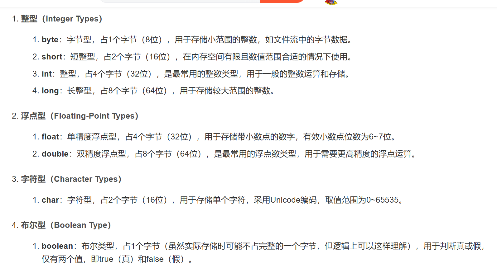

2. java的引用数据类型综述如下图所示，后面会一一进行讲解
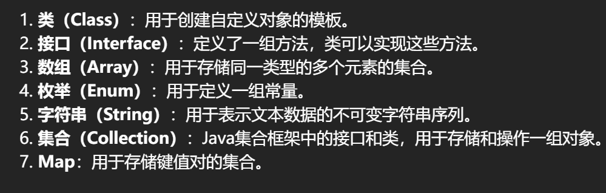
#### 2.基本数据类型介绍
整数类型的大小如下图所示

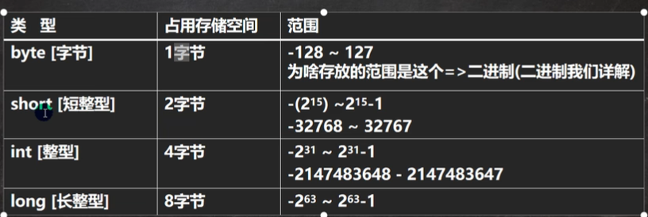

整数类型变量的使用细节：

* java的整形常量（具体值）默认为int型，声明long类型需要再后面加'l' 或 'L'  
```java
//整型常量默认类型为int，30000也为整形常量,  
int salary=30000;
//30亿超过21亿，L的意思为把整形常量定义为long类型
long yearSalary=3000000000L;
```

****

浮点类型的大小如下图所示：

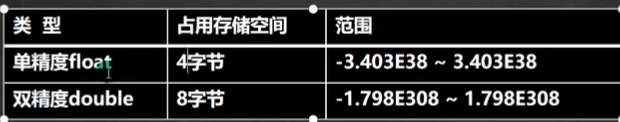

* 浮点数在机器中的存放形式：浮点数=符号位+指数位+位数位
* 位数部分可能丢失，造成精度损失(小数都是近似值)

浮点数的使用细节：

1. java的浮点型常量（具体值）默认为double型，声明float型常量，须在后面加上'f' 或  'F'
```java
// float f1=3.15;/*默认3.15是double类型，不能用float标注符号变量的类型后赋double类型的值*/  
float f1=3.15f;/*改float需要在后面加f或F*/
double d1=3.14;
```

2. 浮点型常量的两种表现形式：  
	（1）十进制形式：2.12、2.12f  
	（2）科学计数法形式：2.12e2代表212、2.12E-2代表 0.0212   
```java
double d1=3.14; 
/*科学计数法，可以用E或e来代表10的几次方*/
double d2=3.14e2;//314.0
```

3. 通常情况下，应该使用double，因为精度比float更精确


* 如果此小数精度过高，float变量会舍弃尾数的部分，变成近似值

4. 浮点数使用陷阱,看如下代码

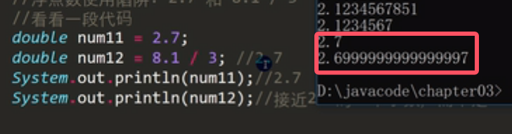
* 得到结论：当我们对**运算结果是小数**(如果不用运算直接比较两个2.7，那么可以判断相等)的进行相等判断，由于浮点数不精确，尽量不要做比较。如果非要进行比较，应该使用两个数的差值的绝对值是否在某个精度范围内来进行判断  

错误写法：  

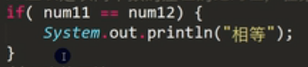

正确写法:

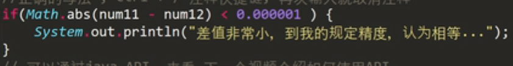
* abs是Math类的静态方法，用于求一个数的绝对值

****

字符类型可以表示单个字符，用char，大小是两个字节(可以存放英文、汉字、转义字符)，多个字符我们使用字符串String。

使用细节：

1. `char` 底层存储的是 Unicode 码点的整数值。Unicode 是一个全球通用的字符编码标准，它为每个字符分配了一个唯一的码点（整数）。**unicode字符集兼容了ascii码**，将一个整数赋值给 `char` 变量时，Java 会将其解释为对应的 Unicode 字符。


```java
char c1='a';/*字符常量用单引号''括起来*/  
char c2='中';  
char c3=97;  
System.out.println(c1);  //a
System.out.println(c2);  //中
System.out.println(c3);  //a
```

2. char类型是可以进行运算的，相当于一个整数，因为它对应有unicode码
```java
System.out.println('a' + 10);//107，注意此时‘a’是字符，并不是字符串，所以不是拼接操作
```

***

boolean类型的数据大小为一个字节，只允许取值为true和false，不可以为null
```java
boolean b1=true;  
boolean b2=false;  
if(b1){  
	System.out.println(b1);  
}  
else {  
	System.out.println(b2);  
}
```
* *与c语言不同，不能用0或非0的整数代替true和false**


### 2）加号的使用
1. 当两遍都时数值型时，做加法运算
```java
System.out.println(100 + 98);//198
```

2. 如果+两边有一方为字符串，则做拼接运算，并且运算结果仍然是字符串
```java
System.out.println("100" + 98);//10098
System.out.println("hello" + 100 + 3);//hello1003
```


3. +的运算顺序是从左到右
```java
System.out.println(100 + 3 + "hello");//103hello
```

### 3）类型转换
#### 1.自动数据类型转换
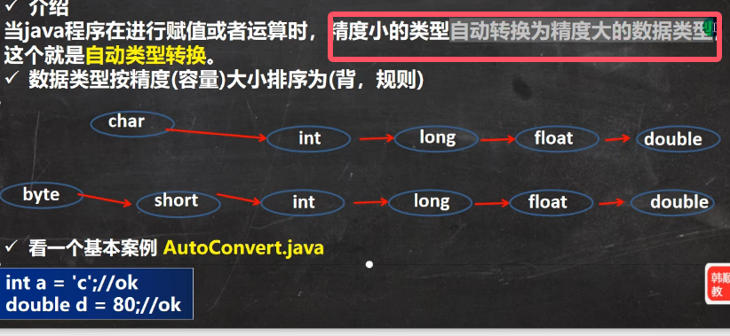

使用细节：

1. **有多种类型的数据混合运算的时候，系统首先自动将所有数据转换成容量最大的那种数据，然后再进行运算**；并且表达式结果的类型自动提升为操作数中最大的类型(自动提升规则)
```java
int n1=10;  
//float d1=n1 + 1.1;//错误：n1 + 1.1 =>结果类型是double  
double d1=n1 + 1.1;//可以

```

2. 当把容量大的数据类型赋值给容量小的数据类型时，就会报错。如果非要这样就需要使用到强制类型转换

3. (byte、short)、char之间不会相互自动转换
```java
byte s = 6;  
char l = s;//错误，byte不能自动转成char
```

4. byte、short、char他们三者可以进行计算，但在进行运算时，会首先转成int类型(第一条的特例)
```java
byte b2 = 1;  
byte b3 = 1;  
short s1 = 1;  
// short s2 = b2 + s1; //错，b2 + s1=>int  
int s2 = b2 + s1; //对  
byte b4 = b2 + b3; //错误，b2 + b3 =>int
```

5.boolean不参与类型转换

#### 2.强制数据类型转换
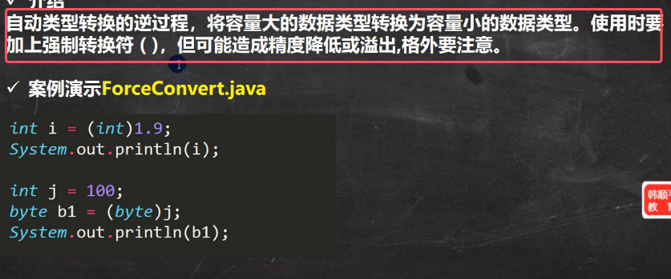

使用细节：

1. 当进行数据从大到小的转换时，就需要使用到强制转换

2. 强转操作符只对最近的操作数有效，往往使用小括号提升优先级
```java
//int x = (int)10 * 3.5 + 6 * 5;//错误  
int x1 = (int)(10 * 3.5 + 6 * 5);//正确
```

3. char类型可以保存int的常量值，但不能保存int类型的变量值，需要强转  

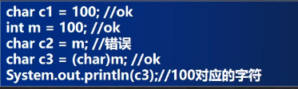

4. byte、short和char类型在进行运算时，当做int类型处理


#### 3.基本数据类型与String类型的转换
在程序开发中，我们经常需要将基本数据类型转换成String类型，或者将String类型转换成基本数据类型。

（1）将基本数据类型转换成字符串类型：将基本数据类型的值+“”即可
```java
String s=n1 + "";  
String s1=f1 + "";  
String s2=d1 + "";  
String s3=b1 + "";
```

（2）将String类型转换成基本数据类型：通过基本数据类型的包装类调用parseXXX方法即可（包装类：java中每个基本数据类型都对应一个包装类）

```java
/*字符串转基本数据类型*/  
String s5="123";  
//调用基本数据类型对应包装类的静态方法parseXXX得到基本数据类型  
int num=Integer.parseInt(s5);  
double num2=Double.parseDouble(s5);  
float num3=Float.parseFloat(s5);  
long num4=Long.parseLong(s5);  
boolean b=Boolean.parseBoolean("true");
```

注意：

* 字符串是没有办法直接转成字符的，只能直接取出字符串的某个字符，使用的是String类的静态方法charAt
```java
String s5="123";
//字符串中取出第一个字符,字符串的下标和数组下标意昂都是从0开始
System.out.println(s5.charAt(0));  
System.out.println(s5.charAt(1));  
System.out.println(s5.charAt(2));
```

* 在将String类型转成基本数据类型时，要确保String类型能够转成有效的数据，如果格式不正确，就会抛出异常，程序就会终止。比如：将“hello”转成一个整数
```java
//如果格式不正确就会抛出异常  
String h="hello";  
int h1=Integer.parseInt(h);
```
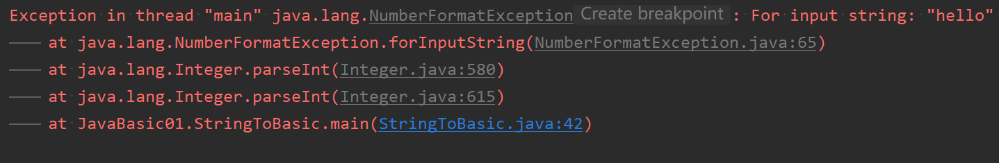


