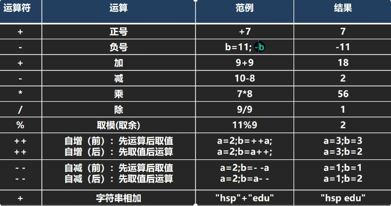
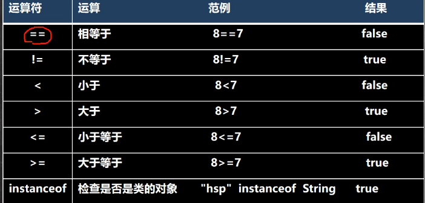
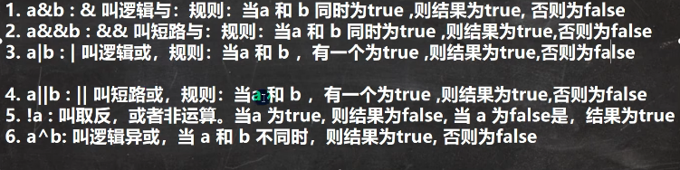
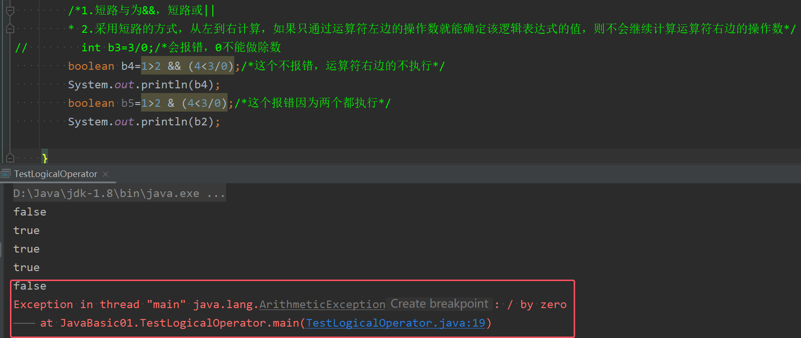
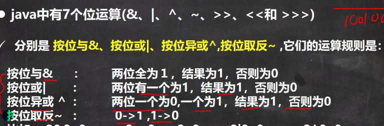
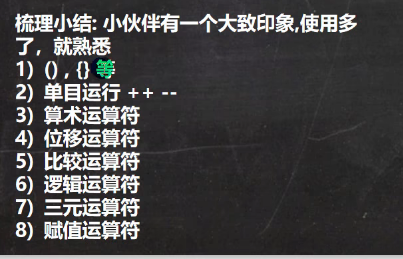

## 1.运算符
下面只会挑几种运算符中的重点难点去进行讲解
### 1）算术运算符
常用的算术运算符如下图所示：



下面只跳重点内容进行讲解

##### 1.除号/
```java
int d2=32/3;  
System.out.println(d2);  //10
double d3=32.0/3;  
System.out.println(d3);  //10.666666666666666
```
* 两个整数相除，会直接抹掉小数点，只保留整数部分，没有四舍五入
* 若两个操作数中有一个数为小数，则执行的是小数除法

##### 2.取余%
```java
int e = 10%3;  
System.out.println(e);  //1 
int e1 = -10%3;  
System.out.println(e1); //-1
int e2 = 10%-3;  
System.out.println(e2); //1
```
* 取余的结果的符号与左操作数的符号相同

#### 3.自增操作符++
```java
int g=30;  
g=10;  
int h=g++;/*注意：g++先赋值后自增*/  
System.out.println(h);  //10
System.out.println(g);  //11
g=10;  
h=++g;/*注意：++g先自增后赋值*/  
System.out.println(h);  //11
System.out.println(g);  //11
```
* 后置++是先赋值后++；前置++是先++后赋值。--同理


### 2）关系运算符
常见的运算符如下图所示：


* 关系运算符的结果都是Boolean型，也就是要么是true，要么是false

### 3）逻辑运算符
用于连接多个条件（多个关系表达式），最终的结果也是一个boolean值。

常见的逻辑运算符如下图所示：


其逻辑运算规则如下图所示：



**注意：c语言当中单个这些操作符是位操作符，而在Java中不仅是位操作符，而且是逻辑操作符，注意区分**

下面以代码为例讲解：

1. 基本逻辑符的使用
```java
boolean b1=true;  
boolean b2=false;  
System.out.println(b1&b2);//false
System.out.println(b1|b2);//true  
System.out.println(!b2);//true  
System.out.println(b1^b2);//true
```

2. 以短路与和逻辑与为例，来搞清楚短路和逻辑的区别
```java
// int b3=3/0;/*会报错，0不能做除数  
boolean b4=1>2 && (4<3/0);/*这个不报错，运算符右边的不执行*/  
System.out.println(b4);  
boolean b5=1>2 & (4<3/0);/*这个报错因为两个都执行*/  
System.out.println(b2);
```

上面的代码可以得到如下运算结果：


* &&短路与：如果第一个条件为false，那么第二个条件不会执行以及判断，就会返回最终结果false
* &逻辑与：不管第一个条件是否为false，第二个条件都会执行以及判断
* ||短路或同理：如果第一个条件为true，那么第二个条件不会执行以及判断，就会返回最终结果true，此处便不再赘述
* 开发中，我们**使用的都是短路与&&和短路或||**，效率高

### 4) 位运算符


* 在 Java 中，`^`, `~`, `&`, `|` 运算符既可以用作位运算符，也可以用作逻辑运算符，具体取决于它们的上下文和使用方式。
* 虽然这些运算符可以在位运算和逻辑运算中使用，但在 Java 中，通常 `^`, `~`, `&`, `|` 更常用于位运算，而 `&&` 和 `||` 被用作逻辑运算符。逻辑运算符 `&&` 和 `||` 通常用于布尔表达式的短路逻辑运算。
* 不管是什么运算，都是按照**补码**的形式来进行计算得
### 5）条件操作符
表达式1 ？ 表达式2：表达式3
* 如果表达式1为真，则整体表达式的值为表达式2执行的结果
* 如果表达式1为假，则整体表达式的值为表达式3执行的结果

### 6）移位运算符


### 运算符的优先级
有个大致印象就行，不确定的用括号




## 进制
整形常量的四种表现形式：  
1. 十进制：如99，-500  
2. 八进制：以0开头，如015  
3. 十六进制：以0x或0X开头，eg：0x15  
4. 二进制：要求以0b或0B开头，eg：0b01110011
```java
int a = 100;  
int b = 015;  
int c = 0xff;  
int d = 0b1111;  
System.out.println(a);   //100
System.out.println(b);  //13
System.out.println(c);  //255
System.out.println(d); //15
```

