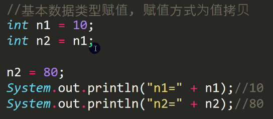
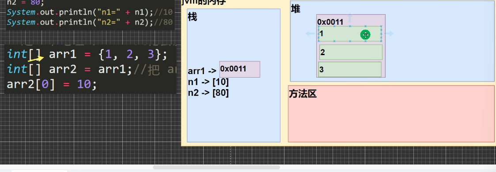
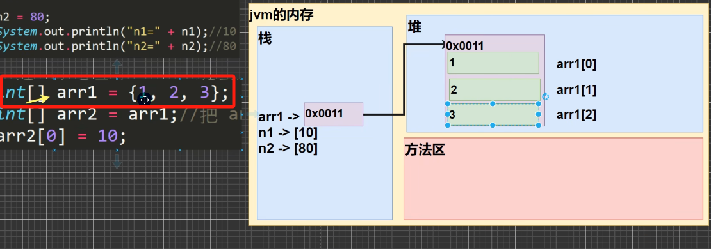
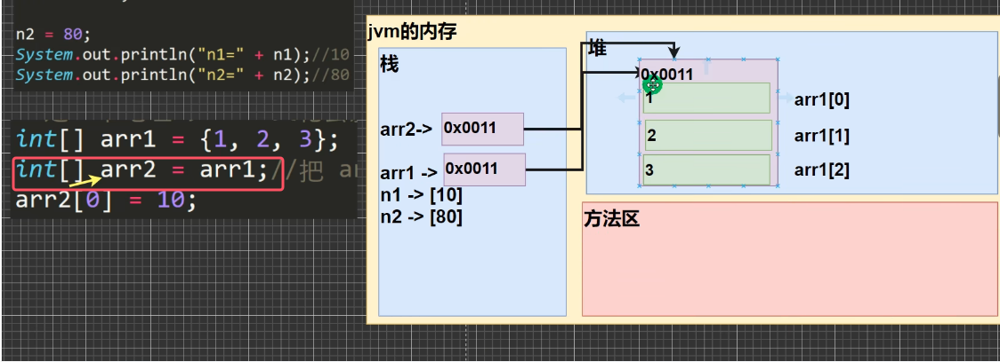
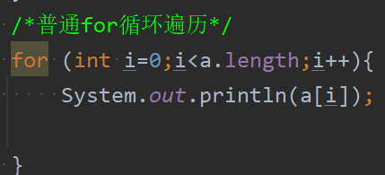
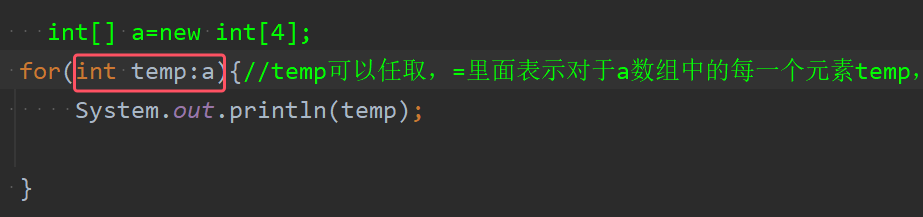
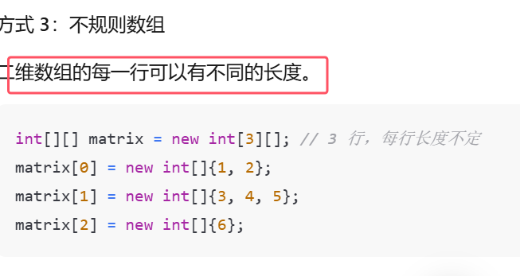
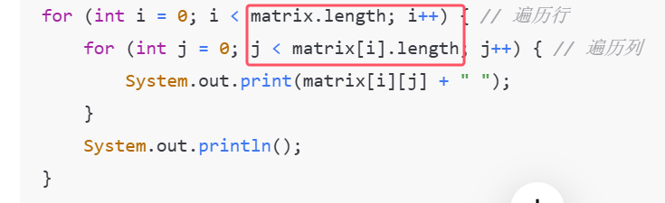

* 数组可以存放多个同一类型的数据，**数组是一种引用数据类型，数组型数据实际上是对象**
* **数组元素类型可以是任何类型**，包括基本类型和引用类型，但不能混用

### 1）数组基本用法

#### 1.数组的声明(定义)
```java
//方式一，java语言风格
type[] arr_name;  
//方式二， c语言风格  
type arr_name[];
```
注意：  
* 声明的时候并没有实例化任何对象， 只有在实例化数组对象时jvm才会分配空间  
* 声明一个数组的时候并没有真正创建  
* 构造一个数组，必须指定长度
*  **更推荐java语言风格的数组声明**

#### 2.数组的创建
```java
int[] s;//声明数组  
s=new int[10];//创建数组,此数组的属性又为int，所以初始化都为0。
```
* 创建数组时才会为其分配空间
* 对于int类型的数组，只要创建了数组，就默认初始化成全0

#### 3.数组的初始化

（1）静态初始化:在定义数组的同时就为数组元素分配空间和赋值  
```java
int[] a = {10, 20, 30, 40};//初始化并且已知元素个数为4个  
int[] d=new int[]{6,77,8,9};  
System.out.println(d[1]);//77
```
（2）动态初始化：分配空间与赋值的操作分开执行
```java
int[] b = new int[2];  
b[0] = 0;  
b[0] = 1;
```
（3）默认初始化：每个元素按照属性的方式被隐式初始化
```java
int[] a2 = new int[2];//默认值0  
double[] a3=new double[3];//默认值0.0  
boolean[] c = new boolean[2];//默认值false  
char[] m=new char[5]; //默认\u0000，也就是十进制的0
String[] s = new String[3];//默认值：null
```

#### 4.数组的赋值机制
1. 对于基本数据类型，赋值的值就是具体的数据，并且相互不影响    


* 给n2赋值n1后，改变n2的值并不会影响到n1的值，将n1赋值给n2是值拷贝

2.对于数组来说，**数组是引用数据类型，默认情况下是引用传递，赋的值是地址**(相当于c语言中的指针)，arr2变化会影响到arr1
```java
int[] arr1={1,2,3};  
int[] arr2=arr1;//让arr2指向arr1
arr2[0]=10;  
System.out.println(arr1[0]);//10  
System.out.println(arr2[0]);//10
```
* 用c语言的方式去讲解：arr2相当于1个指针，而arr1数组名代表数组首地址，所以相当与arr2指向了数组arr1的数组首地址，所以对arr2解引用也就是改变了(其实在java中也是这样的)，

==为了讲清楚为什么数组名进行赋值会是引用传递，而不是值传递，下面先对Java的内存模型进行概述，详细的内存模型会在后面专门讲述==

****

1. Java 的内存模型主要包括堆（Heap）、栈（Stack）、方法区（Method Area）等。
2. **栈中主要存放局部变量，方法的相关信息和暂存的中间计算结果**
3. **堆中主要存放对象实例和数组，无论是基本数据类型数组还是引用数据类型数组**
4. 方法区主要存储**已加载的类信息**、**常量**（编译期生成的字面量和符号引用）、**静态变量以及即时编译器编译后的代码**
具体的图示如下图所示：


那么对于数组而言，c语言当中数组的内存空间是全部在栈当中开辟的。而**对于Java，数组的内存空间是开辟在堆而不是栈当中。**

当在 Java 中创建一个数组时，**会在栈上创建一个引用变量，这个引用变量存储的是数组对象在堆上的内存地址。而数组对象的实际内容（即数组元素）是在堆上分配的**。


* 对于上图中的arr1，他其实就是在栈上的一个引用变量，它存的这个地址就是指向数组arr1在堆上开辟的空间首地址。


* 那么对于arr2他是在定义时就初始化赋值成arr1，这么一个拷贝的过程，相当于就是让arr2指向arr1。具体的说，**它并不是重新在堆上开辟出一块空间，而是把arr1存放的地址拷贝过去，相当于arr2也指向arr1在堆上开辟的数组空间。**所以对于arr2\[0\]也可以访问到这块内存空间并进行修改。这就称为引用传递或者地址拷贝

那么如何让arr2是开辟独立的地址空间，并且完成arr1数组的内容拷贝和改变arr2数组的值不会影响到arr1呢，具体代码如下：
```java
//将arr1的内容拷贝到arr2数组，  
// 要求不像上述赋值机制那样相互影响，而是两个数组的独立的地址空间  
int[] arr1={1,2,3};  
//此时不让arr2指向arr1，而是创建一个独立的数据空间  
int[] arr2=new int[arr1.length];  
//遍历数组  
for (int i=0;i<arr1.length;i++){  
	arr2[i]=arr1[i];  
	System.out.println(arr1[i]);  
}  
//验证是否是独立的地址空间  
arr2[2]=60;  
System.out.println(arr2[2]);//60  
System.out.println(arr1[2]);//3
```


### 5.数组的遍历
1. 最基本的for循环遍历，如下图所示：

1. 增强for顺序遍历：for-each循环。语法格式如下图所示
```java
for (数组元素类型 元素变量 : 数组或集合对象) {
    // 循环体，使用元素变量进行操作
    //元素变量可以任意取
}
```

* 专门用于读取数组或集合中所有元素
* for-each在遍历数组过程中只能读取不能修改某元素的值，而普通for循环可以进行修改
* for-each仅适用于遍历，不适合有关于下标索引的操作
* 增强for循环底层其实是一个迭代器，详情见[01集合综述、collection接口方法和迭代器](../05集合/01集合综述、collection接口方法和迭代器.md)


##### 二维数组





数组的基本知识点就这么多，剩下的内容需要再学习面向对象后继续进行讲解


