### 1）对象内存布局
创建一个对象时所具有的内存布局如下图所示。

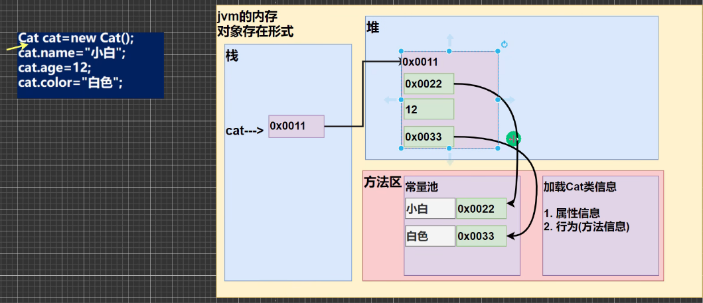
* 根据之前将Java内存模型可知，Java内存模型分为堆、栈和方法区
* 创建对象的过程：
	1. 在创建对象时，首先会将对应类的信息加载到方法区，包括该类的属性和方法。并且这个类信息只会加载一次，后面在创建此类的对象时，类信息不会再被加载
	2. 接着在堆中分配该对象实例的数据空间。根据属性的类型不一样，分配不同的数据空间，然后进行默认初始化。
	3. 最后把在堆中开辟的空间地址返回给对象实例cat
* 具体来说在创建对象时不同的数据类型如何进行分配空间。如果是字符串类型，因为字符串常量是存放在方法区中的常量池里，那么就会给对应的堆中空间分配一个地址，该地址为常量池中存放该字符串常量的地址，也就是指向常量池中的该字符串常量的内容。如果是基本数据类型，其内容就存放在堆中。

### 2）类的成员
**一个文件必须有且只有一个public class,且文件名与类名保持相同**

以下面的Stu类为例，讲解类的成员
```java
public class SxtStu {//一个文件必须有且只有一个public class,且文件名与类名保持相同  
/*属性用于定义该类对象的数据或者静态特征，并且在定义成员变量时可以初始化，若不初始化，java将使用默认的值初始化*/  
	int id=0;//默认初始化为0  
	float grade;/*默认初始化为0.0*/  
	int age;  
	String name;/*默认初始化为null*/ 
	boolean isPass//默认初始化为false 
	/*方法用于定义该类或者该类对象的行为特征和功能实现*/  
	public void study(){  
		System.out.println("正在学习，勿扰");  
	}  
	public void kickball(){  
		System.out.println("踢球中，为我加油");  
	}
}
```
#### 1.属性（也称成员变量）

属性的定义语法同变量，就是多了个访问修饰符，具体格式如下
```java
访问修饰符 属性类型 属性名
```
* 属性是类的一个组成部分，可以是基本数据类型，也可以是引用数据类型
* 属性用于定义该类对象的数据或者静态特征，上图中的id、grade、age和name都是该类的属性
* 有四种访问修饰符，private、protected、default(默认)和public，关于四种修饰符的具体内容将在后面讲解
* 定义成员变量时可以初始化，若不初始化，java将使用默认的值初始化。具体的默认初始化值如上面所示。

#### 2.方法(也称成员方法)
##### （1）方法的定义
方法用于定义该类或者该类对象的行为特征和功能实现，成员方法的定义格式如下
```java
[修饰符] 返回值类型 方法名([参数列表]) {
    // 方法体
    [return 返回值;]
}
```
* \[\]代表可有可无
* 一个方法最多只能有一个返回值
* 返回值类型可以是基本数据类型，也可以是引用数据类型(也可以返回数组，数组是引用数据类型)  

	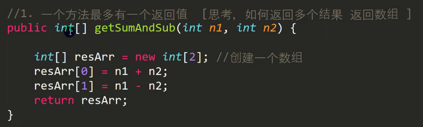
* 返回值类型必须和return的值类型一致或者兼容，传入的传入的实参和形参的类型也必须一致或者兼容（兼容具体是指能够自动类型转换）
* 如果返回值类型是void，则方法体重可以没有return语句，或者只写return;
* 方法起名要见名知意，使用驼峰命名法


##### （2）方法调用时内存布局
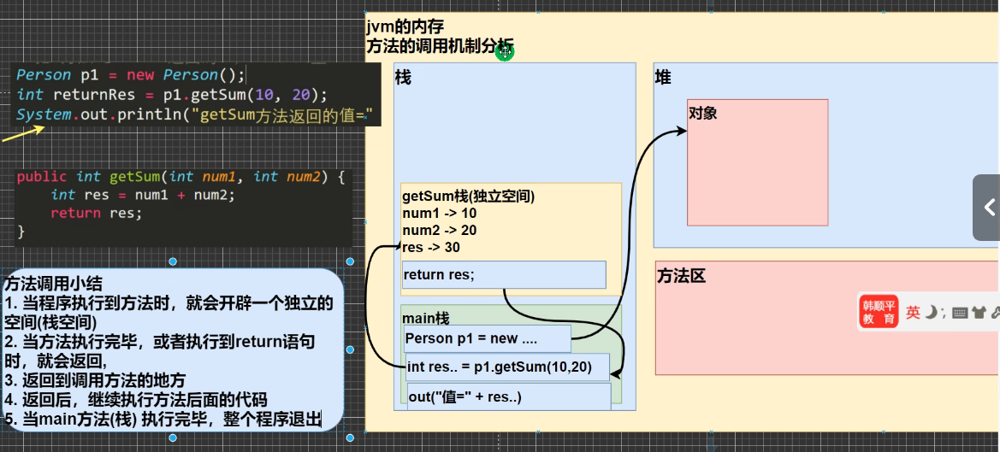
* 栈中主要存放局部变量，方法的相关信息和暂存的中间计算结果
* 当创建对象时，堆中对象的实例数据并不存放方法的内容，方法定义存储在方法区中。
* 每当程序执行一个方法时，就会开辟一个独立的栈空间；当方法执行完毕或者遇到return语句时，该栈空间就会销毁

##### （3）方法调用细节
1. 同一个类中的方法的调用（调用属性或者方法），直接调用即可(但是不能在main方法中这样写，因为main方法不知道调用类或者对象的方法)

	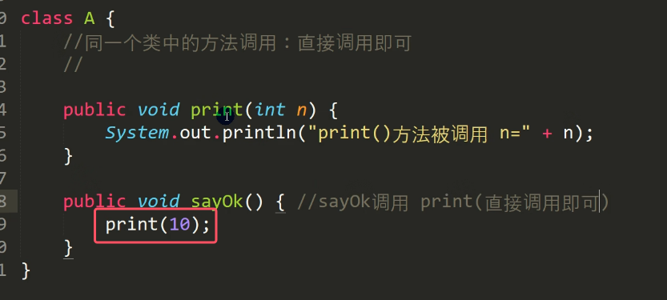

2. 跨类别中的方法A类调用B类方法：需要通过对象名调用，比如`对象名.方法名（参数）`

	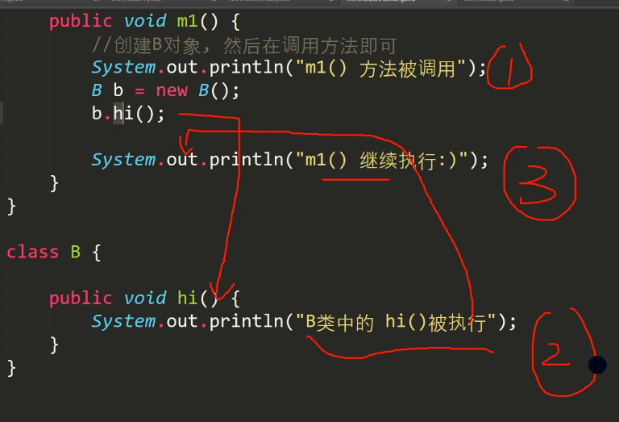

3. 跨类的方法调用与方法的访问修饰符相关，后面讲到访问修饰符的时候会详细讲解

##### （4）方法传参机制
1. 以swap方法为例子讲解基本数据类型的传参机制
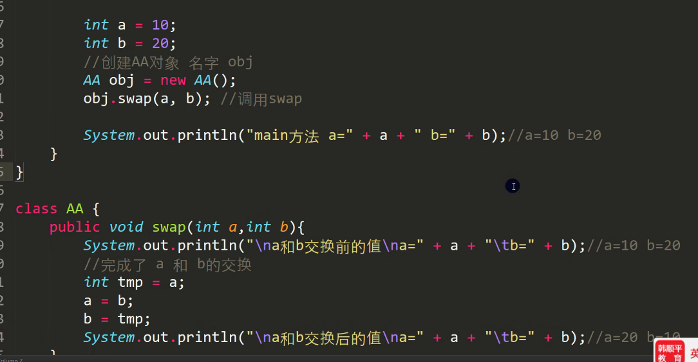
* 此处是a和b的传参机制是值传递。那么我们可以看到实参a，b的值确实传过去了，但是实参a、b和形参a，b的地址并不相同，在不同的栈中。
* 得到结论：**基本数据类型，方法调用时传递的是值（值拷贝），形参的任何改变并不影响实参**

1. 引用数据类型的传参机制

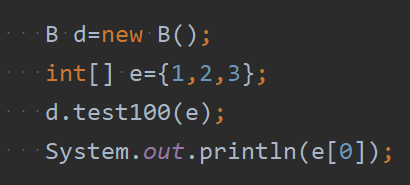
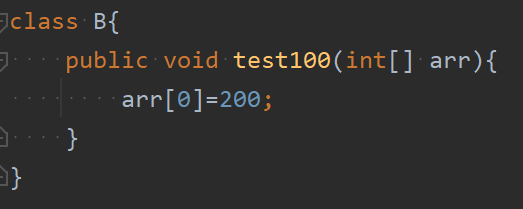
* 上图中`e[0]`打印出来结果是200
* 引用类型传递的是地址（传递也是值，但是是地址），可以通过形参影响实参
* 对于引用数据类型，栈中存的只是栈堆中对象实例的引用（内存地址)

2. 易错点

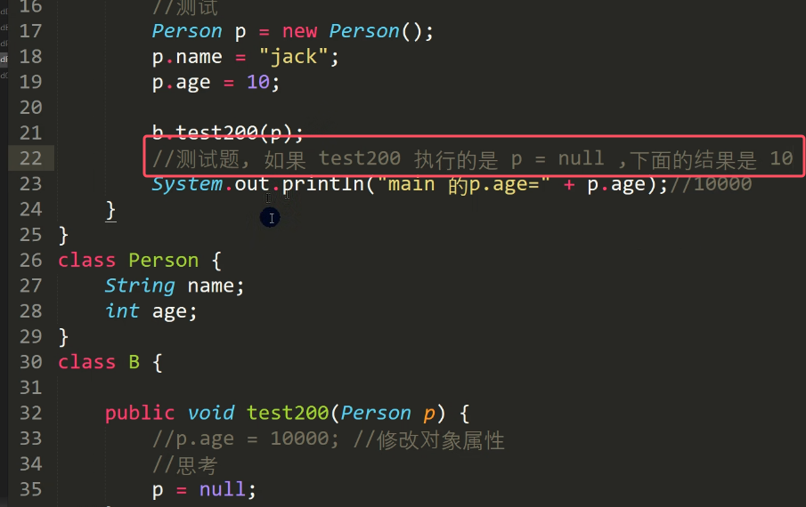
* 结果是10而不是抛异常。
* 原因只要看下面的图就能明白、

	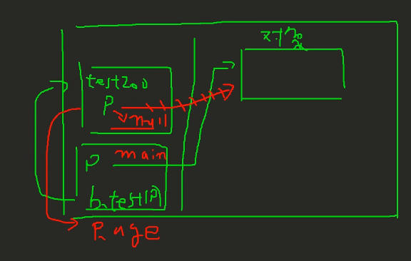

### 3）对象
#### 1.对象综述
对象是类的具体实例。对象的创建方式如下图所示

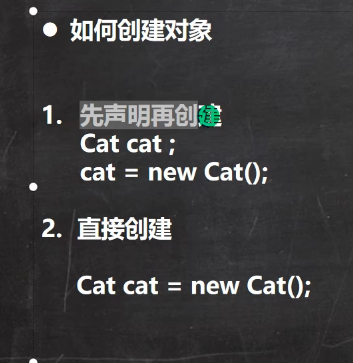
* 对象声明时并不开辟空间，只有创建时才在堆上开辟空间

对象访问属性的方法如下图所示：

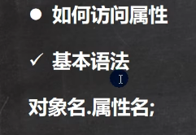

#### 2.类与对象的内存分配机制
以下图代码为例讲解

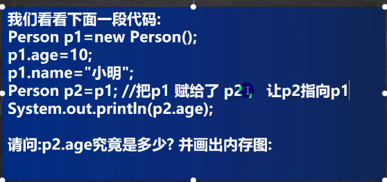
* `p2.age`为10，因为数组也是引用数据类型，对象也是，所以原因其实在数组那块讲得很清楚，对象这里也同理，详情见[07数组和Java内存模型](../01java基础/07数组和Java内存模型.md)中的数组赋值机制部分
* 内存图如下图所示，创建对象的过程具体在该笔记的对象内存布局部分。
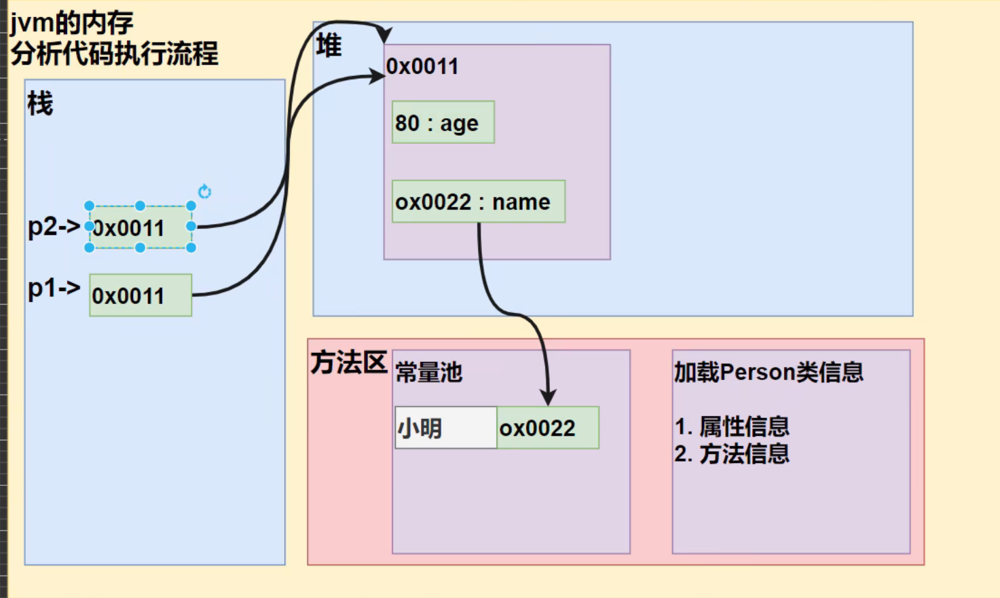


