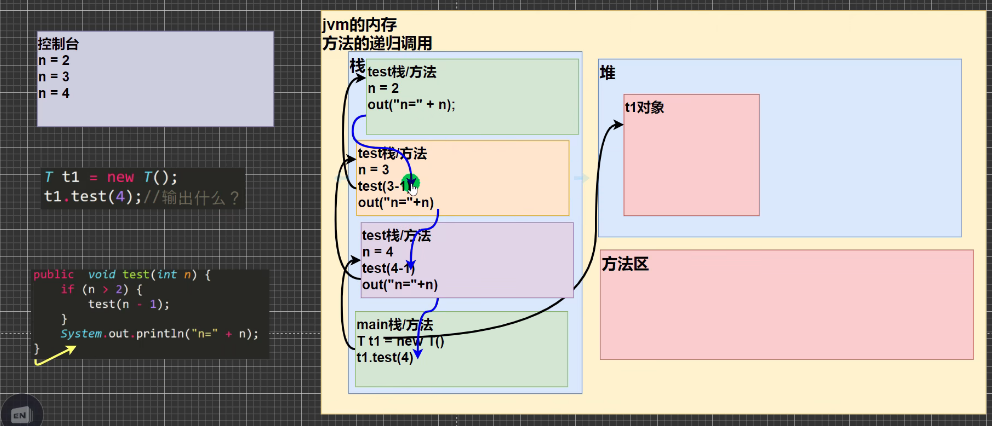

### 1）方法的递归
与c语言中的递归基本没什么差别，也就是c的内存布局与Java的内存布局有些不同，下面是一个递归代码的图解，弄明白即可



使用细节：
* ** 存在限制条件，当满足限制条件时，递归不再继续（设置递归函数的出口）**
* **每次递归调用以后越来越接近这个限制条件  **
* 当一个方法执行完毕返回的时候，遵守谁调用的此方法，就返回给谁。

### 2）方法重载
java中允许同一个类中，多个同名方法的存在，但要求形参列表不一致，例如下面的代码中一个方法的形参有多种形式
```java
System.out.println(11);  
System.out.println(1.1);  
System.out.println("java");  
System.out.println('b');
```

所以可得方法重载的定义：**一个类中多个方法的名称相同，但参数列表不同。**

下面是一个方法重载的例子
```java
public class TestOverload {  
/*java的方法类似于c语言中的函数，封装起来便于反复地调用 ,main就是一个方法*/  
public static void main(String[] args) {  
	Sum sum=new Sum();  
	System.out.println(sum.add(10,20));  
	System.out.println(sum.add(20.1,20));  
	System.out.println(sum.add(20.1,20));  
	System.out.println(sum.add(20,30,40));  
}  
}  
class Sum{  
	public int add(int a, int b){ 
		int sum=a+b;  
		return sum;  
	}  
	  
	public double add(int a, double b){
		double sum=a+b;  
		return sum;  
	}  
	  
	public double add(double a, int b){/
		return a+b;  
	}  
	  
	public int add(int a, int b, int c){
		int sum=a+b+c;  
		return sum;  
	}  
}
```

方法重载的主要表现有以下三种形式：
	1. 形参类型不同
    2. 形参个数不同
	2. 形参顺序不同。  
* 注意：只有返回值类型不同不构成方法的重载，形参名不同也不构成方法的重载、访问修饰符不同也不构成重载，只有形参列表不不同构成重载
* 方法的重载其中的方法体可以不同

### 3）可变参数
java允许将同一个类中**多个同名同功能**但**参数个数不同（各参数的类型必须相同）的方法**，封装成一个方法。
基本语法如下图所示：
```java
[修饰符] 返回值类型 方法名(数据类型... 形参名) {
    // 方法体
    [return 返回值;]
}
```
* 其中`数据类型...`表示接受的是可变参数，即可以接受多个该数据类型参数
* 使用可变参数时，可**以将参数当做数组来使用**,具体例子如下图所示
```java
/**  
* 计算若干个数的和  
*/  
public int sum(int... num){  
	int res=0;  
	for(int i=0;i<num.length;i++){  
		res+=num[i];  
	}  
	return res;  
}
```

使用细节：
1. 可变参数的实参可以为0个或者任意多个
2. 可变参数的实参可以为数组，也可以是若干个实参
3. 可变参数可和普通类型的参数放在形参列表，但必须保证可变参数放在最后（普通类型的参数类型没有限制）
4. 一个形参列表中只能出现一个可变参数  
使用细节的体现的代码如下：
```java
System.out.println(s.sum(5,6,7,8,9));  
//可变参数的实参也可以为数组  
int[] arr={0,1,2,3};  
System.out.println(s.sum(arr));
```

```java
//可变参数可和普通类型的参数放在形参列表，  
// 但必须保证可变参数放在最后  
public int sum(double x,String y,int... num){  
	int res=0;  
	for(int i=0;i<num.length;i++){  
		res+=num[i];  
	}  
	return res;  
}
```