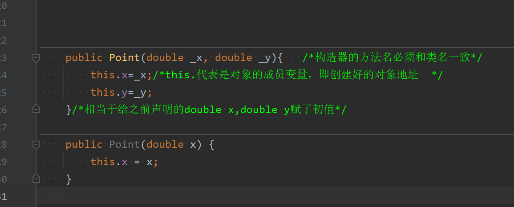
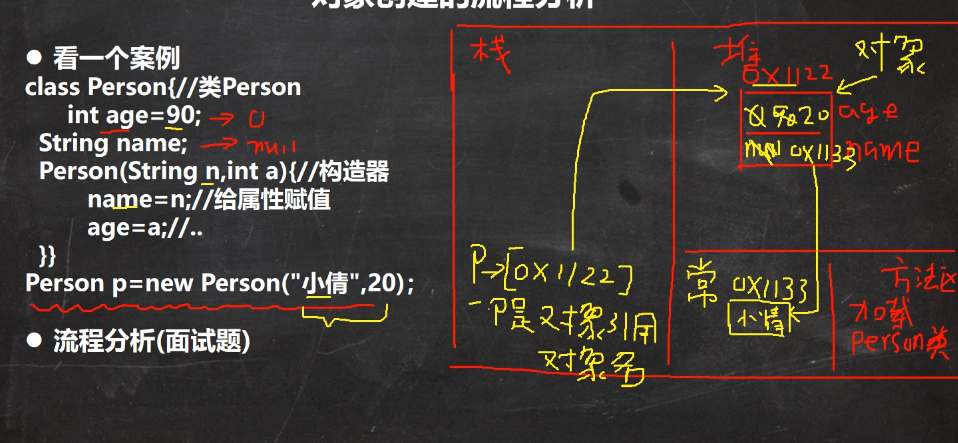
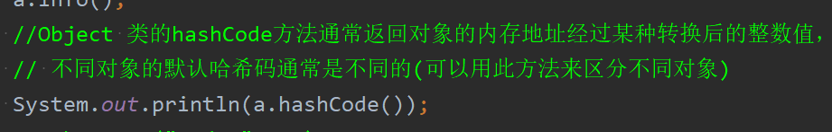
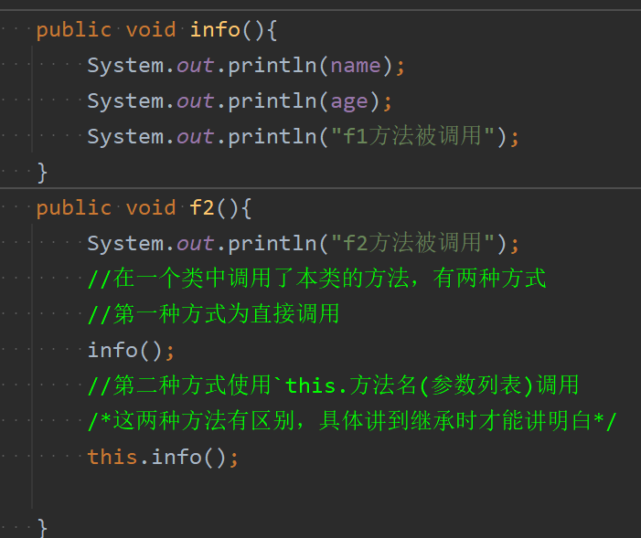
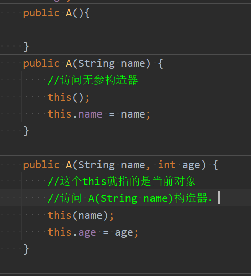

### 1）构造器
注意：
* 构造器的作用是对象中普通属性的初始化而不是建造对象。
* 构造器也叫做构造方法，构造函数，构造器本身也是方法

构造器的基本语法如下：
```java
[修饰符] 类名([参数列表]) { 
// 构造器方法体 
}
```
* 构造器的修饰符可以为访问修饰符，private、protected、default(默认)和public，关于四种修饰符的具体内容将在后面讲解
* **构造器没有返回值**
* **构造器的类名字必须一样**
* 参数列表和成员方法一样的规则
* **构造器的调用由系统来完成，在创建对象(new)的时候由系统自动调用构造器完成对象的初始化

示例代码如下
```java
public class Point{
	double x;
	double y;
	public Point(double _x, double _y){ /*构造器的方法名必须和类名一致*/  
		x=_x;
		y=_y;  
	}/*相当于给属性double x,double y赋了初值*/
}
```

构造器的调用如下
```java
Point p1=new Point(3.0,4.0);//这里传参就是给点x，y在赋初值
System.out.println(p1.x); //3.0 
System.out.println(p1.y);//4.0
```
* 当我们new一个对象时，直接通过构造器对此对象的普通属性进行初始化


构造器的使用细节如下：
1. 一个类可以定义多个不同的构造器，即**构造器也可以发生重载，但不能被重写**
	

	那么此时可以有如下两种创建对象并调用构造器的方式
```java
	Point p1=new Point(3.0,4.0);
	Point p3=new Point(56.0);
```
2. 如果程序员程序员没有定义构造器，系统会自动给类生成一个默认无参构造器，比如：`Person(){}`。**并不是没有定义就没有构造器**
3. **一旦定义了自己的构造器，默认的构造器就覆盖了**，除非进行显式定义，否则就不能再使用默认的构造器。
4. idea中可以直接生成构造器：单击右键generate，然后点击constructor,选中多个需要按shift键

### 2）对象创建过程
在引入了构造器后，对于一个对象的创建过程就可以进行完整的讲解。具体如下：


1. 将对应类的信息加载到方法区，包括该类的属性和方法。并且这个类信息只会加载一次，后面在创建此类的对象时，类信息不会再被加载
2. 接着在堆中分配该对象实例的数据空间。
3. 完成对象初始化（先进行默认初始化，再进行显式初始化（看看类中属性的是否专门写了初始化的值），然后再调用构造器去进行初始化）
4. 把对象在堆中地址返回给引用变量（真正的对象存在堆中，栈中存的只是次对象的引用）

#### 3）this关键字的本质
用代码来讲解this的本质
```java
public class TestThis {  
	public static void main(String[] args) {  
		A a=new A("lihua",165);  
		a.info();  //输出lihua和165
	}  
}  
class A{  
	String name;  
	int age;  
	  
	public A(String name, int age) {  
	//这个this就指的是当前对象的属性  
		this.name = name;  
		this.age = age;  
	}  
	  
	public void info(){  
		System.out.println(name);  
		System.out.println(age);  
	}  
}```
* **this实际上指的就是当前对象**。this.name指的是当前对象的name属性，age同理
* 通俗地讲，**哪个对象调用，this就代表哪个对象**

补充：object类的hashcode的作用下图所示



this的使用细节：
1. this关键字可以用来访问本类的属性、方法和构造器（因为this本质上就是当前对象，当然可以访问）
2. this用于区分当前类的属性和局部变量(典型体现为构造器)
3. 访问成员方法的语法：`this.方法名(参数列表)`
	
4. 访问构造器方法：`this(参数列表)`,注意：**只能使用在构造器中(也就是在构造器里访问另一个构造器)，并且必须放在构造方法的首行**
	
5. this不能在类定义的外部使用，只能在类定义的方法中使用(构造器也是特殊的方法)

补充：Object类的equals方法的用法如下：

```java
Object obj1 = new Object();  
Object obj2 = new Object();  
Object obj3 = obj1;  
//用于与当前对象进行比较，并返回一个布尔值，表示两个对象是否相等。  
System.out.println(obj1.equals(obj2)); // 输出 false
System.out.println(obj1.equals(obj3)); // 输出 true
```
* `equals` 方法是 `java.lang.Object` 类中的一个实例方法，所有 Java 类都继承了该方法
* equals方法用于与当前对象进行比较，并返回一个布尔值，表示两个对象是否相等
* equals方法的默认实现：`equals` 方法的默认实现使用 `==` 运算符来比较两个对象。`==` 运算符在比较对象时，比较的是两个对象的内存地址，也就是说，**只有当两个引用指向同一个对象时，`equals` 方法才会返回 `true`**

