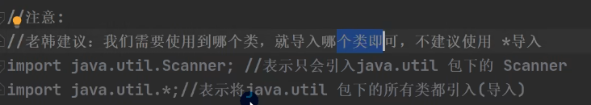
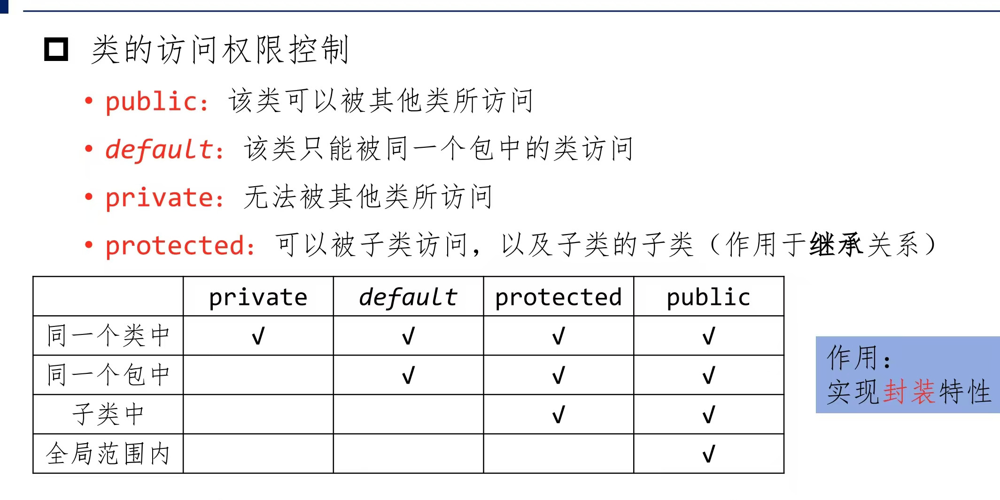

### 1）包（packege）
包的三大作用：  
1. 用于管理类和解决类的重名问题，也就是不同package下面可以有两个名字相同的类
2. 当类很多时，可以很好的管理类
3. 控制访问范围

包的命名规范：  

包的引入语法：  

JDk中主要包含的类：  
1. java.lang包：此包不用引入，直接用就行。  比如String、Math、Integer、System和Thread等java语言的核心类 Math.PI、Math.random等
2. java.awt:用于开发一个窗口的程序，包含了构成抽象窗口工具集的多个类
3. java.net:用于网络编程相关的包，包含执行与网络相关的操作的类
4. java.io:操作文件系统时用的包，用于提供多种输入/输出功能的类
5. java.util：包含一些实用工具类，如定义系统特性、使用与日期日历相关的函数，例如Scanner、Arrays

### 2）访问修饰符
Java提供四种访问修饰符，用于控制方法和属性的访问权限(范围)，具体如下图所示：（图中的访问指的是类中的属性、方法等）  

注意事项：  
* 修饰符可以修饰类中的属性、成员方法和类
* **只有默认和public才能修饰类！**并且遵循上述访问权限的特点
* 成员方法的访问规则和属性完全一样

