 **面向对象变成有三大特征：封装、继承和多态**
## 1）封装
定义：封装是指把一个对象的状态信息（也就是属性）隐藏在对象内部，不允许外部对象直接访问对象的内部信息。但是可以提供一些可以被外界访问的方法来操作属性

#### 1.实现封装的步骤：  
1. 将属性进行私有化(不能再外部直接修改此对象的属性)
2. 提供公共的（public）的get和set方法，用于获取和修改属性的值，也就是getter和setter
3. 补充：java中可以直接右键+生成getter和setter

封装的具体实现示例如下图所示：

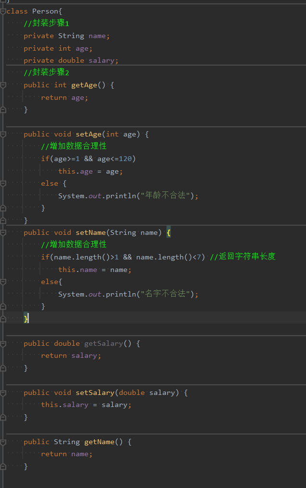


#### 2.封装与构造器的冲突解决
如果直接使用构造器去初始化设置值，那么就无法保证数据和合理性。

具体做法：将set方法写在构造器中，这样就仍然可以保证数据合理性  

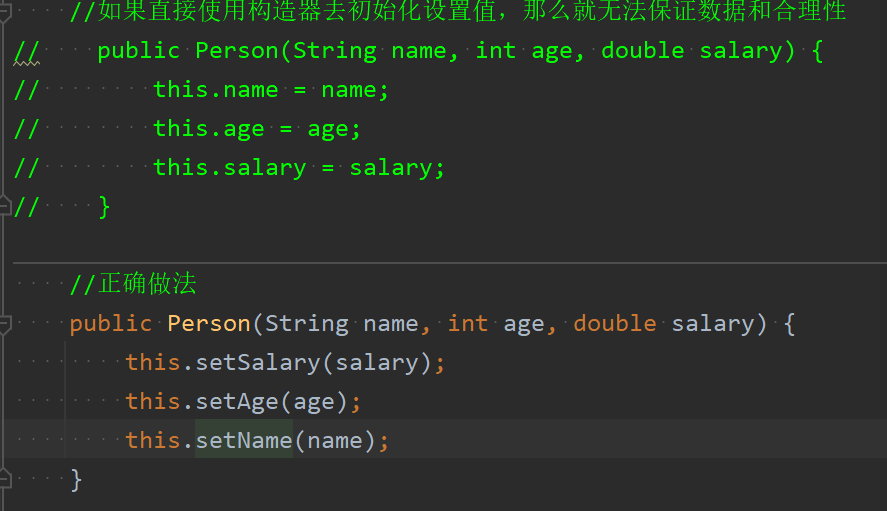

#### 3.封装的优点与好处：

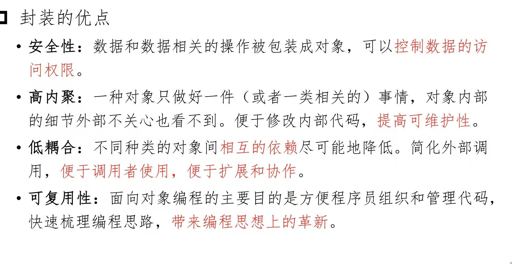


## 2）继承
继承的定义：继承是使用已存在的类的定义作为基础建立新类的技术，新类的定义可以增加新的数据或新的功能，也可以用父类的功能，但不能选择性地继承父类。

### 1.继承的基本语法：使用extends关键字实现继承
```java
class 子类 extends 父类{

}
```
* ==子类会自动拥有父类定义的属性和方法==
* 父类又叫做超类、基类
* 子类又叫做派生类

具体的使用示例如下图所示：

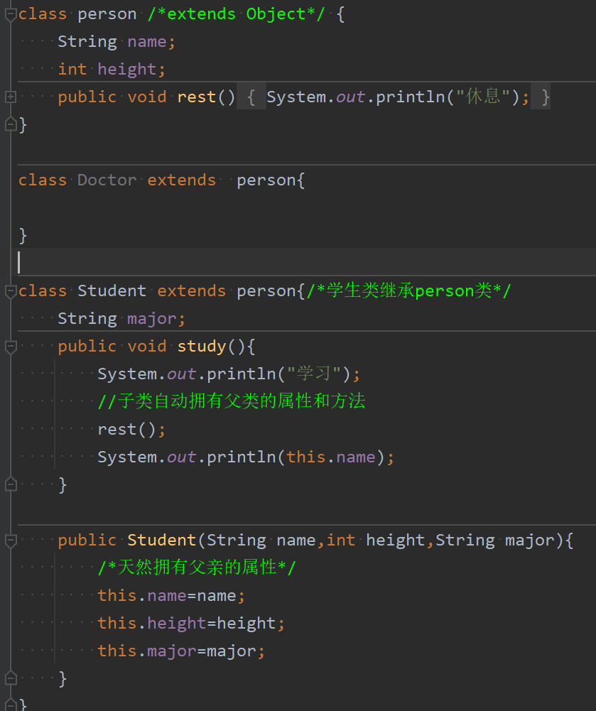

### 2.super关键字
super代表父类的引用，用于访问父类的属性、方法和构造器

#### （1）super的基本用法
1. super可以用于父类的属性，但不能访问父类的私有属性
2. 访问父类的方法，不能访问父类的private方法：`super.方法名(参数列表)`

	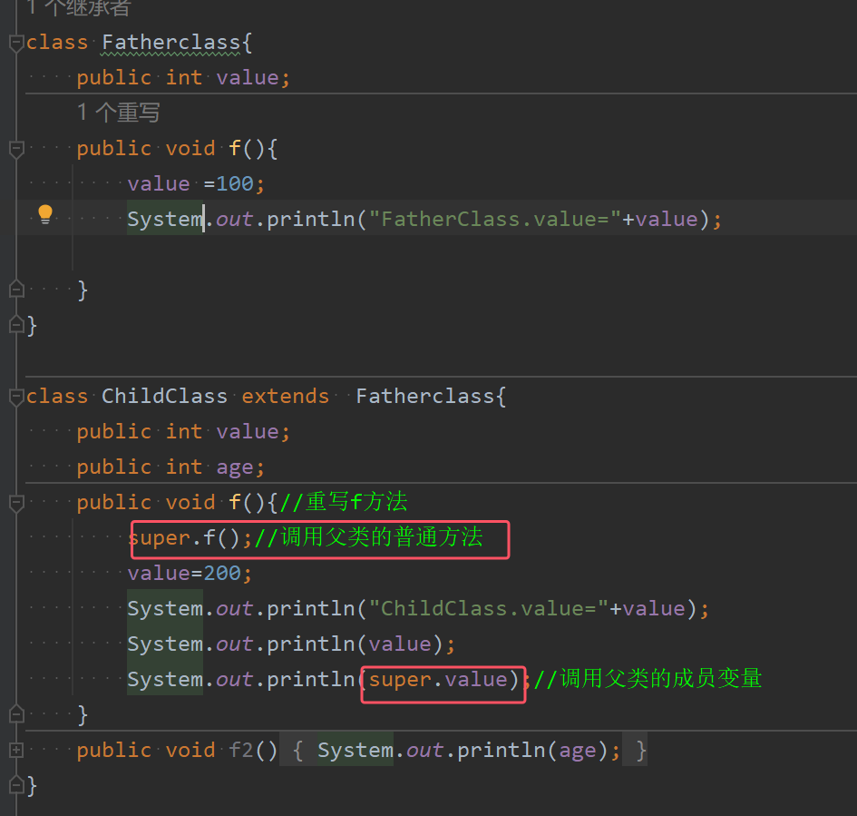
3. 访问父类的构造器：`super(参数列表)`,只能放在构造器的第一句，并且只能出现一句`

#### （2）使用细节
1. 当子类中有和父类成员（属性和方法）重名时，为了访问父类的成员，必须通过super；如果没有重名，使用super、this、直接访问是一样的效果

	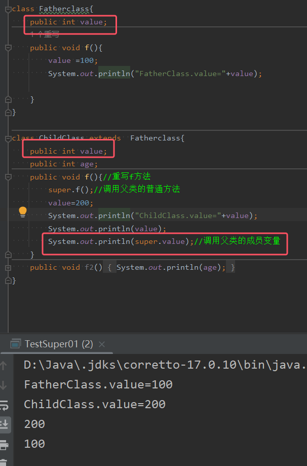
2. super查找方法的顺序是直接查找父类，其他的规则一样（详情见继承本质详解中的查找关系一栏）
3. super的访问不局限于直接父类，如果爷爷类中有同名的成员(且父类中没有定义该成员)，也可以使用super去访问爷爷类的成员；如果多个父类都有同名的成员，使用super访问遵循就近原则，当然也需要遵守访问权限的相关规则

super和this的比较如下图所示：

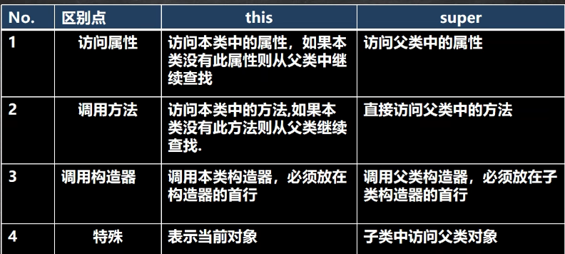
### 3.继承的使用细节：  
1. ** 子类和父类之间存在明显的`is-a-king-of`关系**，这是集成的一个明显特征
2. 子类继承了父类所有的属性和方法（除了父亲的构造方法，包括静态属性和方法），非私有的属性和方法可以在子类直接访问；但是子类不能直接访问（在父类中为private的）私有属性和方法，要通过父类提供公共的方法来进行访问。

	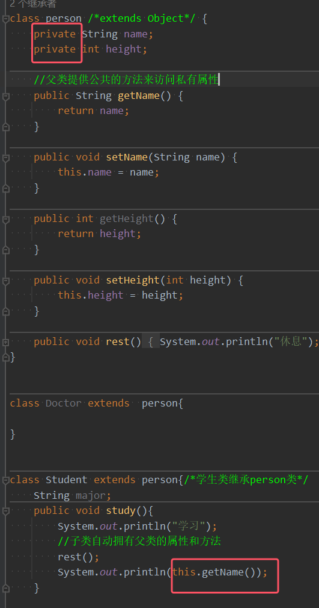

3. 子类必须调用父类的构造器，完成父类的初始化

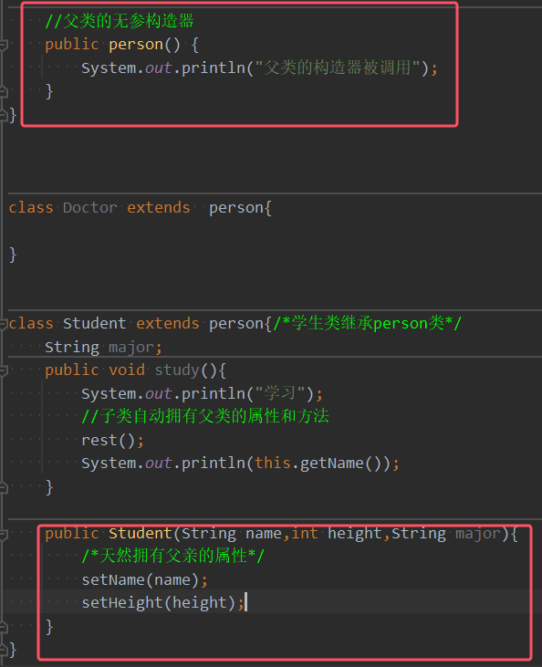
* 上图中当创建一个子类对象时，控制台会打印“父类构造器被调用”，说明父类的构造器被调用，也就是验证了第三点

4. **创建子类对象时，不管使用子类的哪个构造器，默认情况下都会先去调用父类的无参构造器，再调用子类的构造器**。如果父类没有提供无参构造器(无参构造器被覆盖，否则默认存在的无参构造器也算提供)，则必须在子类的每一个构造器中用super去指定使用父类的哪个构造器完成对父类的初始化工作。否则编译不会通过
5. 如果希望指定去调用父类的某个构造器，则显式的调用一下:`super(参数列表)`

	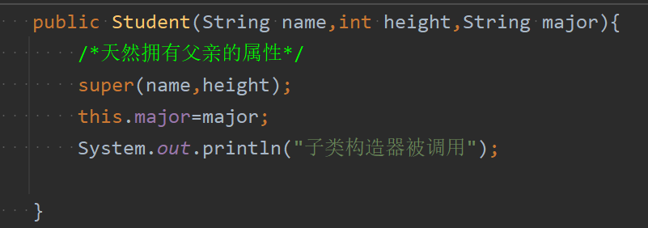
6. super在使用时必须放在构造器的第一行
7. **由于super()和this()都只能在构造器的第一行，因此这两个方法不能共存在同一个构造器中**
8. Java所有类都是Object类的子类，如果定义一个类时没有调用extends，则他的父类是java.lang.Object
9. 父类构造器的调用并不限于直接父类，而是会一直向上追溯直到Object类，之后先调用Object的构造器，再依次向下直到子类的构造器。
	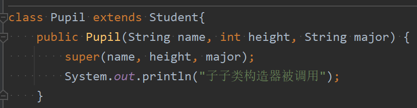
    * 将图中代码加到上面的代码中，则得到如下输出结果
	    
	    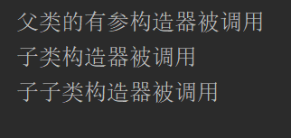
10. **java中只有单继承，子类只有一个直接的父亲**（c++支持多继承）

### 4.继承的本质详解
以下图代码为例子讲解子类创建时的内存布局

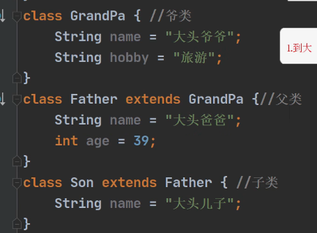
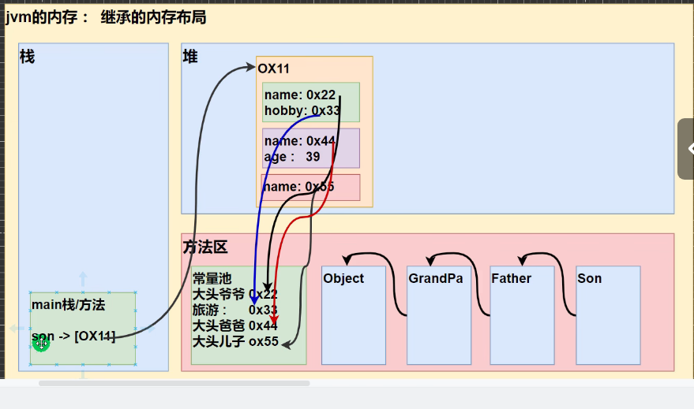
11. 在将子类信息加载方法区之前，首先会将其父类信息加载到方法区，也就是会先加载Object类，之后再依次加载Grandpa、Father，最后再加载Son类。并且这些类信息只会加载一次，后面在这些类的对象时，这些类的信息不会再被加载
12. 接着在堆中分配该对象实例的数据空间。
13. 完成对象初始化（先进行默认初始化，再进行显式初始化（看看类中属性的是否专门写了初始化的值），然后再调用构造器去进行初始化）
14. 对于步骤2.3，Jvm会首先完成GrandPa类的步骤2,3，然后再同一个数据空间里，再次对Father类重复步骤2,3，以此类一直到子类
15. 把对象在堆中地址返回给引用变量（真正的对象存在堆中，栈中存的只是次对象的引用）

那么很容易提出一个疑问：因为三个类中都有属性name，当想要访问son.name以及其他变量，他是按照什么规则进行访问的呢？

答：是按照查找关系来返回信息。具体的规则为(方法是同理的，不过属性是在堆中找，方法是在方法区中找)：
16. 首先看本类是否有该属性
17. 如果本类有属性，并且可以访问，则返回信息；如果有但不能访问，那么就会报错
18. 如果本类没有这个属性，就看父类有没有这个属性（如果父类有该属性，并且可以访问，就返回信息）
19. 如果父类没有，就按照3.的对则，继续找上级父类，直到Object...，如果还没有就报错


继承的优点：
20. 提高代码的复用性
21. 提高了程序的扩展性
22. 使类和类产生了联系，构成了多态的基础


## 3）多态

### 1.方法重写
方法重写需要满足以下条件 ：  
23. 子类的方法名和形参列表和父类方法相同，方法体内容进行重写  
24. 子类方法的返回值类型和声明异常类型必须和父类方法返回类型相同，或者是父类方法返回类型的子类
25. 子类方法的访问修饰符必须大于等于父类方法的访问权限

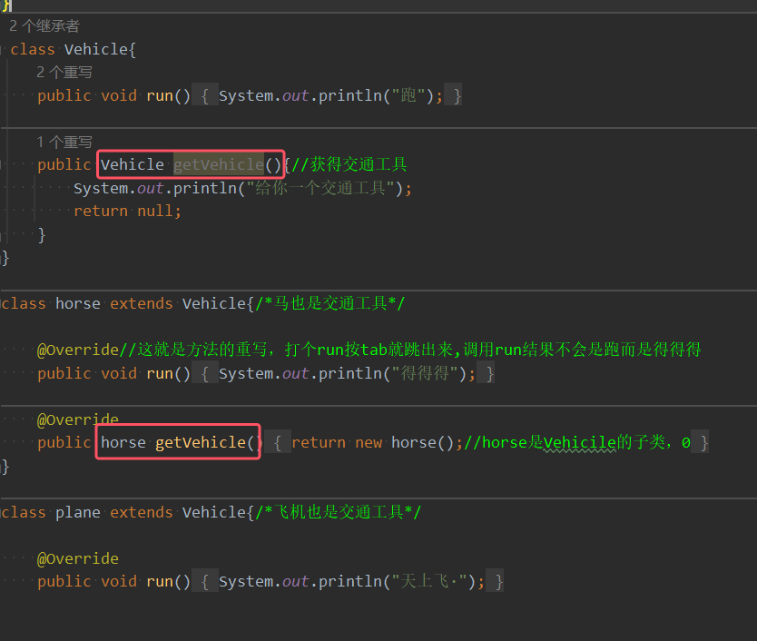
* 上图中run方法和getVehicle方法构成重写，所以执行下面的代码时，会先输出“得得得”，再输出天上飞。
```java
horse h=new horse();  
h.run();  
plane s=new plane();  
s.run();
```

方法重写和方法重载的区别如下图所示：

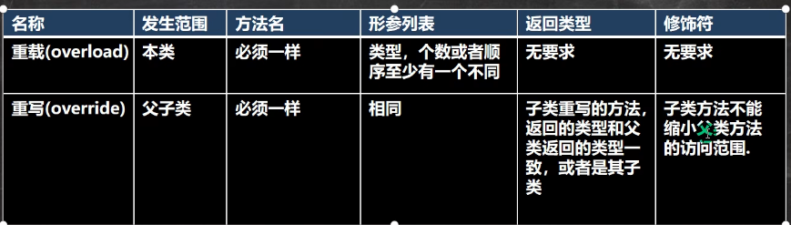

补充：  
26. instance of 修饰符的语法格式
```java
object instanceof class/interface
```
其中，`object` 是要检查的对象引用，`class/interface` 是要检查的类或接口的名称。该运算符返回一个布尔值，如果 `object`**对象的运行类型**是否 是 `class/interface` 类型或者`class/interface`的子类型是，则返回 `true`，否则返回 `false`。

27. idea如何快速进行方法的重写：鼠标右键点击生成重写方法，按shift可以多选


### 2.多态
构成多态的三个必要条件：
28. 继承
29. 方法重写
30. 父类引用指向子类对象（后面会详细介绍）

多态是方法的多态，不是属性的多态！（多态与属性无关）
#### （1）方法的多态
重写和重载就体现出方法的多态
31. 对于方法重载来说，对方法传入不同的参数，就相当于调用了方法名字一样，但是是不同的方法，体现出多态

	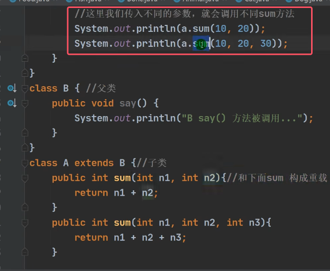

32. 对于方法的重写来说，父类对象调用特定方法和子类调用此特定方法的效果是不一样的，这也构成了方法的重写

	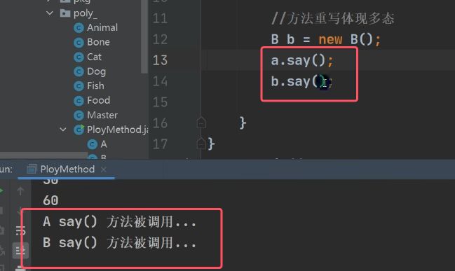

#### （2）对象的多态
##### ① 编译类型和运行类型
- **编译类型**：**也被叫做声明类型，指的是在代码中声明变量时所指定的类型**。在编译阶段，编译器会依据这个类型来检查变量能够调用哪些方法和访问哪些属性。编译类型是在编写代码时就确定下来的。例如：
```java
Animal animal = new Dog();
```
在这个例子中，变量 `animal` 的编译类型是 `Animal`，这是在声明变量 `animal` 时明确指定的类型。

- **运行类型**：**即变量实际所引用对象的类型，它是在程序运行时动态确定的。运行类型决定了变量在运行时真正能够调用的方法实现**。继续上面的例子，`animal` 变量实际引用的是 `Dog` 对象，所以它的运行类型是 `Dog`。

重点：  
33. 一个对象的编译类型和运行类型可以不一致
34. 编译类型在定义对象时，就确定了，不能改变
35. 运行类型是可以变化的
36. 编译类型看定义（或者是创建对象）时 `=` 的左边，运行类型看 `=` 右边
37. 在进行方法的调用时，**是运行类型决定了变量(对象引用)在运行时能够真正调用的方法实现**

下面是编译类型和运行类型的图解：

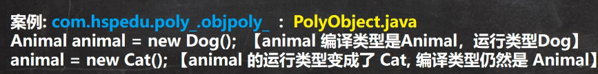

#####  ②编译类型和运行类型在多态中的作用（下面内容的一个总述）
- **编译阶段的检查依据**：**编译器在编译代码时，会根据变量的编译类型来检查代码的合法性。它只允许调用编译类型中定义的方法和访问编译类型中定义的属性**。例如：
```java
class Animal {
    public void eat() {
        System.out.println("Animal is eating.");
    }
}

class Dog extends Animal {
    @Override
    public void eat() {
        System.out.println("Dog is eating.");
    }

    public void bark() {
        System.out.println("Dog is barking.");
    }
}

public class PolymorphismExample {
    public static void main(String[] args) {
        Animal animal = new Dog();
        animal.eat(); 
        // 编译错误，因为编译类型 Animal 中没有 bark 方法
        // animal.bark(); 
    }
}
```
 在上述代码中，`animal` 的编译类型是 `Animal`，编译器只允许调用 `Animal` 类中定义的方法。虽然实际引用的是 `Dog` 对象，但由于 `bark` 方法不在 `Animal` 类中定义，所以直接调用 `animal.bark()` 会导致编译错误。

- **运行阶段的方法调用**：**在程序运行时，Java 虚拟机（JVM）会根据变量的运行类型来决定调用哪个类的方法。如果子类重写了父类的方法，那么会调用子类重写后的方法，这就是方法的动态绑定；如果子类没有重写父类的方法，那么就调用父类的方法**。在上面的例子中，`animal.eat()` 调用的是 `Dog` 类中重写后的 `eat` 方法，而不是 `Animal` 类中的 `eat` 方法，因为 `animal` 的运行类型是 `Dog`。


##### ③多态的向上转型
38. 本质：父类引用指向子类对象（子类的对象转型成父类的引用）
39. 语法：
```java
父类类型  引用名 = new 子类对象();
```
40. 特点：编译类型看左边，运行类型看右边；可以调用父类的所有成员（遵循访问权限），不能调用子类的特有成员，最终运行·结果看子类的具体实现

##### ④多态的向下转型
41. 语法：
```java
子类类型  引用名 = （子类类型）父类引用;
```
42. 只能强转父类的引用，不能强转父类的对象
43. 要求父类的引用必须原先就指向当前要强转的子类类型的对象
44. 当向下转型后，可以调用子类类型的所有成员(包括子类的定义的特有方法，也包括从父类的继承的方法，或者重写的方法)

下图为例子： 

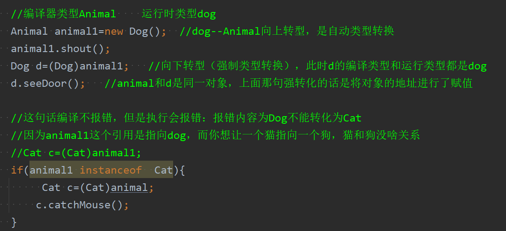
* 其中seeDoor是Dog特有的方法，catchMouse是Cat类特有的方法

##### ⑤属性重写问题
属性重写问题：属性没有重写一说，**属性的值直接看编译类型**

所以下图中的例子打印出来是10，因为编译类型是Animal，所以直接查找Animal类中的属性，而不是像方法那样是看运行类型来决定具体实现的

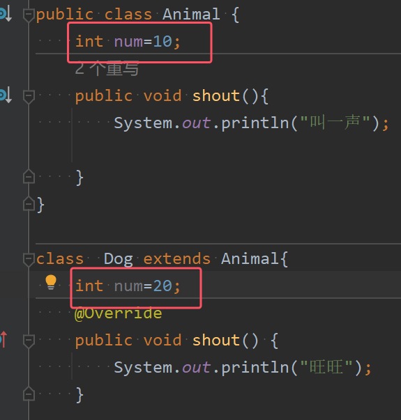
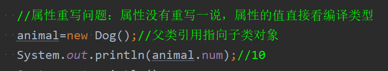

##### ⑥java动态绑定机制
机制内容：
45. 当**调用对象方法的时候**，**该方法会和该对象的内存地址/运行类型**绑定
46. 当**调用对象属性时，没有动态绑定机制，哪里声明，哪里使用**。（也就是在哪个类里面，就使用这个类里面的属性）

下面以下面的代码来讲清楚动态绑定机制的内容
```java
class A {  
	public int i = 10;  
	  
	public int sum() {  
		return getI() + 10;  
	}  
	  
	public int getI() {  
		return i;  
	}  
	  
	public int sum1() {  
		return i + 10;  
	}  
	  
}  
  
class B extends A {  
	public int i = 20;  
	  
	// public int sum() {  
		// return getI() + 20;  
	// }  
	  
	public int getI() {  
		return i;  
	}  
	  
	//public int sum1() {  
		//return i + 10;  
	//}  
	  
}
```
对于上述的类信息背景，执行下面的代码，会打印出怎么样的结果呢
```java
A a = new B();  
System.out.println(a.sum());//30
System.out.println(a.sum1());//20
```
* 如果只注销掉子类的sum()方法，那么会调用父类的sum方法时,其中的getI调用的是子类还是父类的getI呢？所以这里需要使用动态绑定机制
* 对于对象引用a，其编译类型为A，运行类型为B，而由于子类没有sum()方法，所以由于继承的查找机制会调用父类的sum()方法
* 对于调用里面的getI()方法时，根据动态绑定规则，调用对象方法时，该方法会和对象的运行类型绑定。a的运行类型是B，所以他会调用子类的getI方法。由于动态绑定机制，在调用对象属性时，哪里声明哪里使用，所以在getI方法中返回的是子类的20，也就是最终结果打印出来为30
* 如果在子类中把sum1()方法也注销了，由于继承的查找机制，他会调用父类的sum1()方法，调用了对象属性i。由于动态绑定机制，在调用对象属性时，哪里声明哪里使用，所以在sum1()中，由于sum1方法是在父类中定义的，此方法的位置位于父类，所以会返回当前这个类的i，也就是10，所以最终返回的值为20

#### (3)多态的应用——多态数组
多态数组的定义：数组的定义类型为**父类类型，里面保存的实际元素为子类类型**

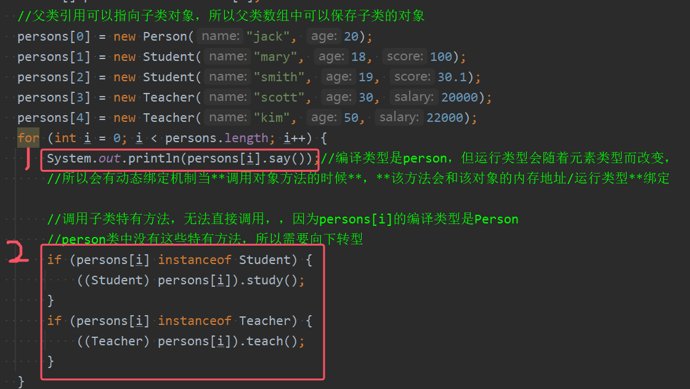
* 说明：study和teach为子类特有方法；say为都有的方法，并且子类对其进行了重写。父类只有age和name属性，子类teacher多一个salary属性，Studen类多一个score属性
47. 调用子类父类共有方法say的步骤：由于多态数组的每个元素编译类型是person，但运行类型会随着元素类型而改变，而根据动态绑定机制，对象方法是和运行类型进行绑定，所以可以直接通过一个for循环调用各自重写后的say方法
48. 调用特有方法teach何如study的方法： persons\[i]的编译类型是Person，编译类型决定了能够调用哪些方法，所以persons\[i]只能调用person类里的方法，所以无法调用特有方法。可以通过判断元素对象的的所属类别，采用向下转型来调用特有的方法

#### （4）多态的应用——多态参数
多态参数：**方法定义的形参为父类类型，实参允许为子类**，（构成多态，编译类型为父类类型，运行类型为子类类型）


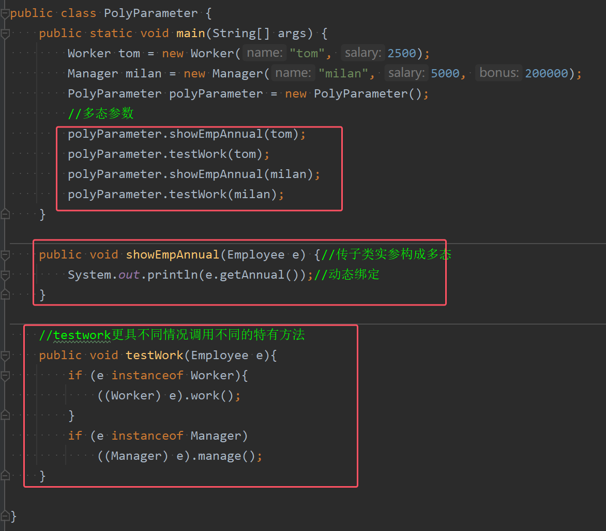
* 说明：定义员工类Emplopyee，包含姓名和月工资，以及计算年工资getAnnual的方法。普通员工和经理继承了员工，经理类多了奖金bonus属性和管理manage方法；普通员工类多了work方法，普通员工和经理类分贝要求重写getAnnual方法。
* 图中的两个方法就是使用了多态参数。


补充：多态的实现可以有三种：重写、抽象类、接口。上面讲的都是重写，下面的图给出抽象类和接口，由于所有东西基本一致，只给出图即可


抽象类：  
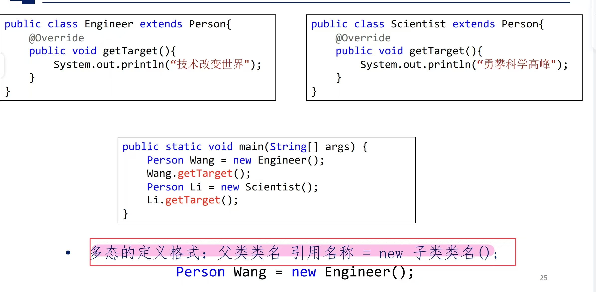

接口：  
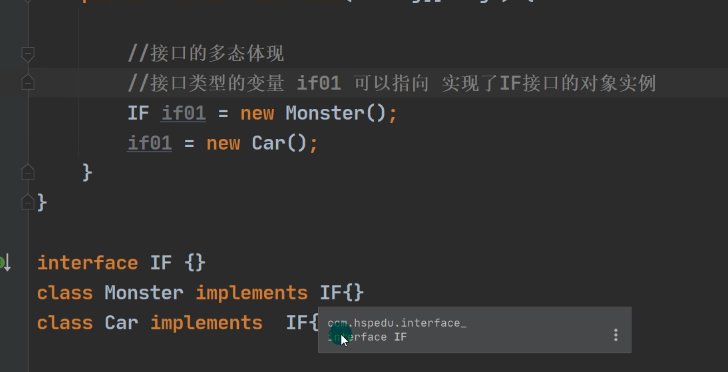


接口多态传递现象：

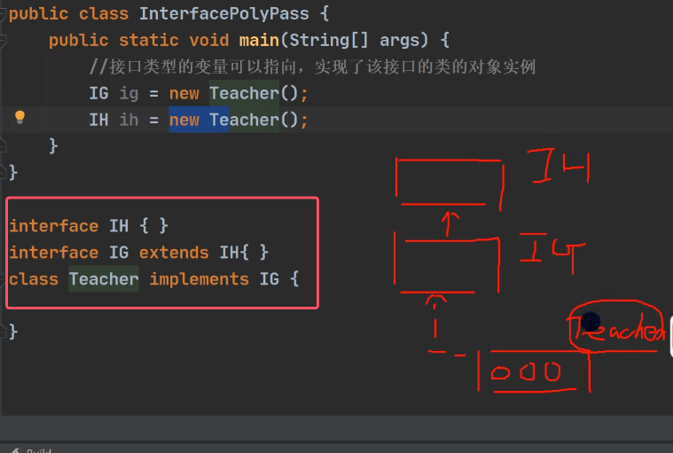
