## 1）Object类详解
* 所有类都Object类的子类，也都具备Object类的属性和方法  
* 2.如果在类的声明中未使用extends，则默认继承Object类

下面要讲解的方法如下图所示：

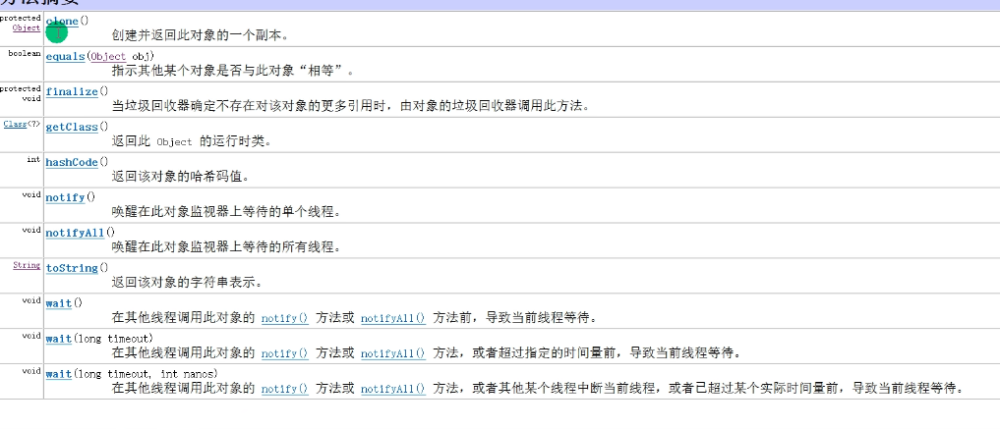

### 1.equals方法
在将equals方法之前，先讲`==`。
##### （1）\==比较运算符
对于比较运算符`==`：
1. 既可以判断基本数据类型，又可以判断引用数据类型
2. 如果判断基本数据类型，则是判断的值是否相等（对于整数和小数作比较也可以，比如65和65.0作比较就返回true而不是false）
3. 如果是判断引用类型，则是判断的地址是否相等，即是否是同一个对象
4. 只要操作数双方有一个为基本数据类型，那么就判断的是值是否相同

```java
//编译类型相同的情况  
Tested tested = new Tested();  
Tested b=tested;  
Tested c=b;  
System.out.println(tested==c);//true  
System.out.println(b==c);//true  
  
//编译类型不相同的情况  
B obj=tested;  
System.out.println(obj==c);//true
```
所以对于上面两种情况，返回结果都true。只要对象指向的地址相等，即指向的同一个对象，那么不管编译类型是什么，都是true。


##### (2)equals方法
对于equals方法：
5. 他是**Object类的普通方法，只能判断引用类型，默认判断的是对象地址是否相等，即判断两个对象是否是同一个对象**

Object类的equals方法源代码如下图所示：

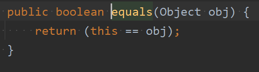


6. **子类往往回重写该方法，用于判断内容是否相等。比如**Integer、String

* Integer的重写的equals方法如下所示：
```java
public boolean equals(Object obj) {  
	if (obj instanceof Integer) {  
		return value == ((Integer)obj).intValue();  
	}  
	return false;  
}
```
* 其中intValue()方法如下图所示

	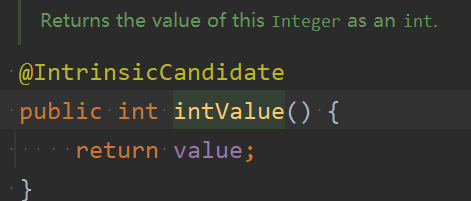
* 可以看出Integer类的equals方法也是判断两个数的值是否相等


* String类的重写的equals方法如下图所示：

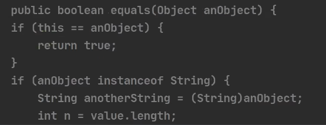
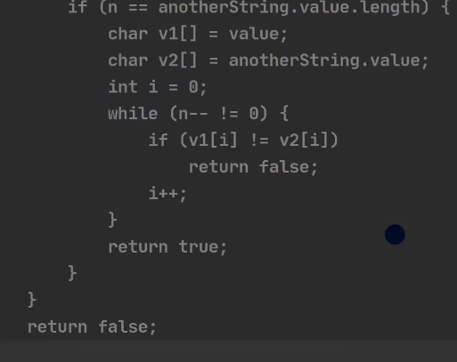
* 首先如果是同一个对象，那么返回true（因为同一个对象的字符串内容肯定相同的）
* 如果传入的形参的运行类型是String的子类或者本类，接着向下转型成String，在长度相同情况下将两个字符串转成字符数组，然后一个一个比较字符。如果两个字符串的所有字符都相同，那么就返回false（如果自己重写equals方法就可以按照此思路去重写）
* 所以String类的equals方法作用是**判断两个字符串的内容是否相同**

7. 如果一个类没有重写equals方法，那么他是继承的Object类的equals方法，也就是判断两个对象是否是同一个对象

### 2.hashcode方法

Object类的hashcode方法的接口如下所示
```java
public int hashCode();
```
它返回一个 32 位的整数，即对象的哈希码。不同对象的默认哈希码通常是不同的

hashCode的要点： 
8. 此方法提高具有哈希结构的容器的效率
9. 两个引用，如果指向的是同一个对象，则哈希值肯定一样
10. 两个引用，如果指向的是不同的对象，则哈希值是不一样
11. 哈希值主要是根据对象的内部地址转换成一个整数得来，不能完全将哈希值等价于地址
12. 后面在集合中，如果需要的话，此方法也会进行重写

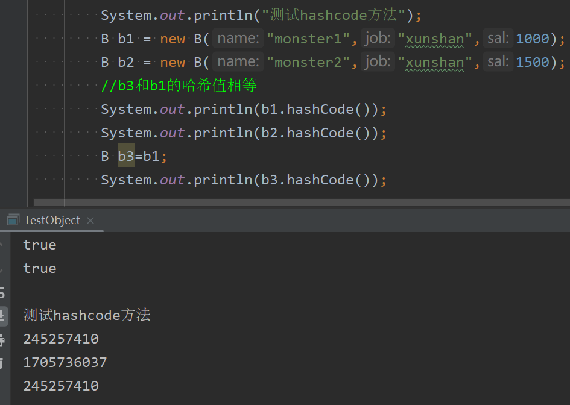

### 3.toString方法
Object类的toString方法的接口如下所示
```java
public String toString();
```
13. 该方法返回该对象的字符串表示，默认返回全类名（包名+类名）+@+对象的hashcode值的16进制表示

Object类的toString方法如下所示：
```java
public String toString() {  
return getClass().getName() + "@" + Integer.toHexString(hashCode());  
}
```

默认的toString方法的效果如下图所示：

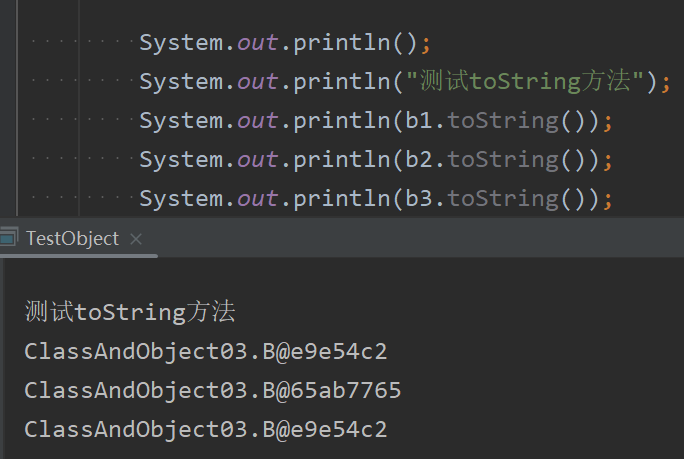

14. 子类往往重写toString方法用于返回对象的属性信息，idea中默认的重写后的代码如下所示
```java
@Override  
public String toString() {  
	return "B{" +  
	"name='" + name + '\'' +  
	", job='" + job + '\'' +  
	", sal=" + sal +  
	'}';  
	}
```

15. 当直接输出一个对象时，toString方法会被默认的调用（无论是否被重写）
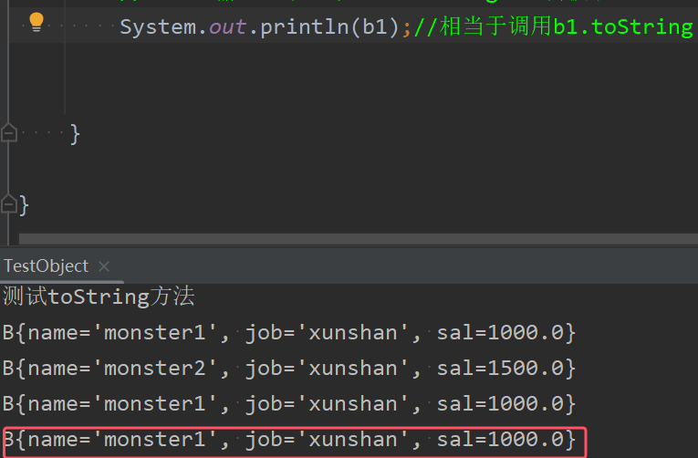


### 4.finalize方法（基本不会用，但是面试可会问）
当垃圾回收器确定不存在对该对象的更多引用时，由对象的垃圾回收器调用此方法
```java
protected void finalize() throws Throwable { }
```
在子类中可以重写该方法来实现特定的资源清理逻辑。

16. 当对象被回收时，系统自动调用该对象的finalize方法。**子类可以重写该方法，做一些释放资源的操作**（比如释放资源：数据库连接、或者打开文件）  
17. 什么时候回收：当某个对象没有任何引用时，则jvm就认为这个对象是一个垃圾对象，就会使用垃圾回收机制来销毁该对象，在销毁该对象前，就会调用finalize（垃圾回收器并不是在对象一变成垃圾就立马回收，而是由自己的一套算法，可能会程序结束后销毁对象）

为了垃圾回收可以实现，我们重写finalize方法如下所示
```java
@Override  
protected void finalize() throws Throwable {  
	super.finalize();  
	System.out.println("我们销毁此对象"+this.toString());  
	System.out.println("释放了某些资源");  
  
}
```
在程序中调用如下语句

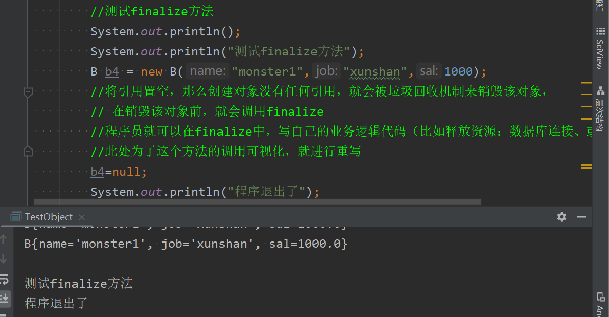
* 没有输出该方法其中的打印语句的原因：上述第二条

18. 垃圾回收机制的调用，是由系统来决定（即有自己的GC算法），也可以通过System.gc()主动触发垃圾回收机制

注：`System.gc()` 是一个静态方法，它的主要用途是向 Java 虚拟机（JVM）发出垃圾回收的请求，这意味着调用该方法并不一定会立即触发垃圾回收，JVM 会根据自身的算法和当前的内存使用情况来决定是否执行垃圾回收（所以执行该办法并不会阻塞代码）

此时加上该方法后就会打印出来

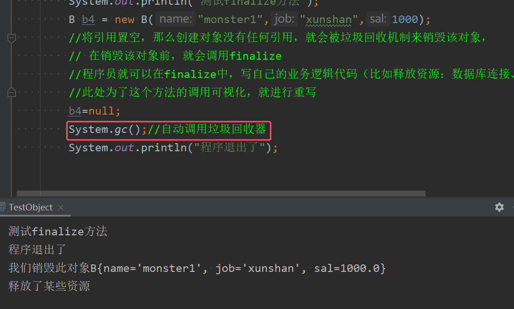
### 5.getClass方法和getName方法
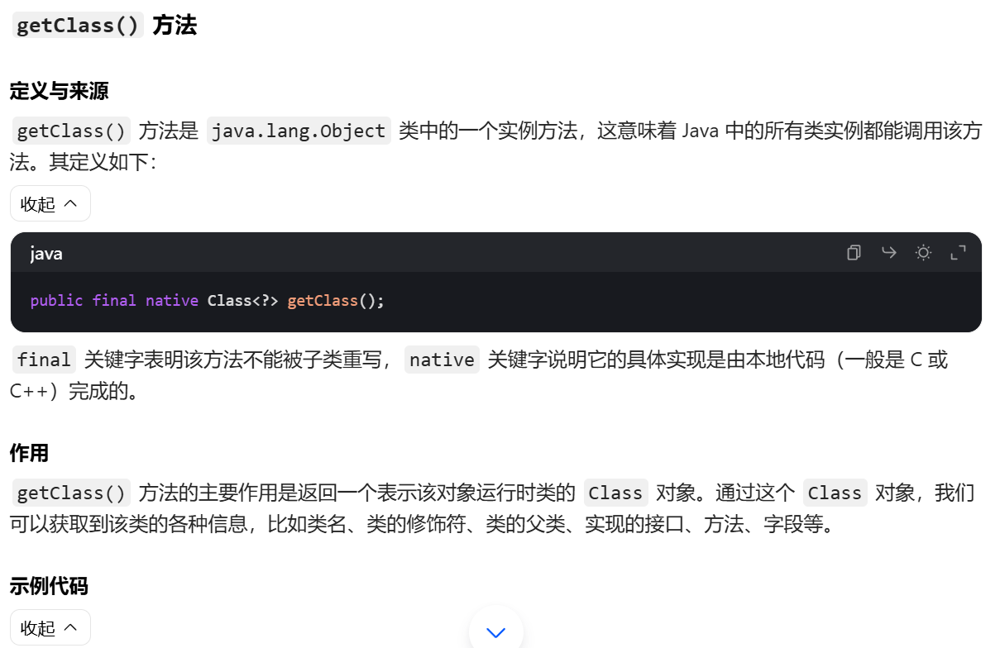
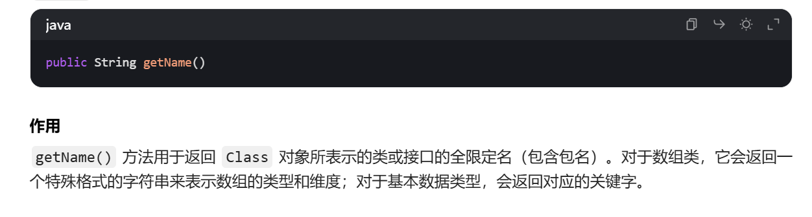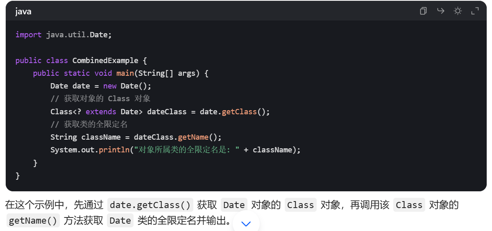


## 2）断点调试技巧
注意：**在断点调试过程中，是2运行状态，是以对象的运行类型来执行的**

断点调试快捷键

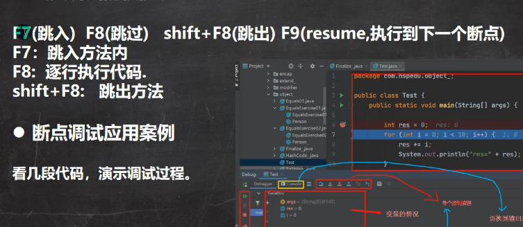
* F7也可以逐步执行，只是跳入方法体内，如果没办法积习难改，可以使用快捷键alt+shift+F7；跳出是shift+F8
* F8也是逐步执行，但是不跳入方法体内
* F9跳到下一个断点，中文也叫恢复程序
调试界面如下图所示

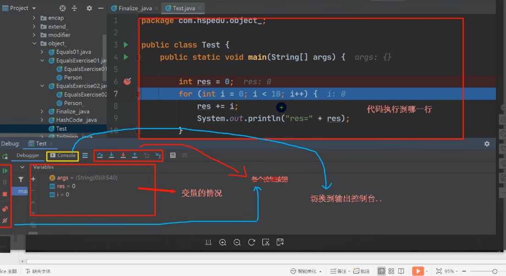

## 3）快捷键汇总：
19. `fori`可以快速写出for循环
20. `new 类名().var`可以快速创建对象
21. ctrl+alt+F可以快速格式化代码
22. 光标放在对应的类，按ctrl+H可以查看类关系，也可以使用图表来进行查看
23. 删除当前行 ctrl+d
24. 数字.for就会直接出现到数字的for循环：比如10000.for
25. ctrl+F查找，ctrl+R替换
26. ctrl+alt+T用于给选中语句块选择包围方式（比try-catch语句块或者if-else）
27. itit可以快速生成while的迭代器循环
28. 大写I可以快速写出for-each循环
29. alt+左键可以整列编辑