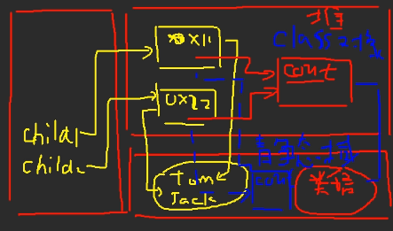
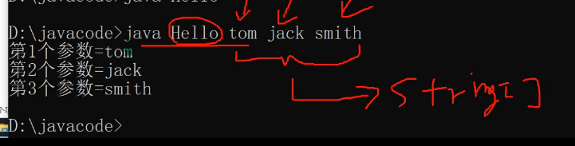
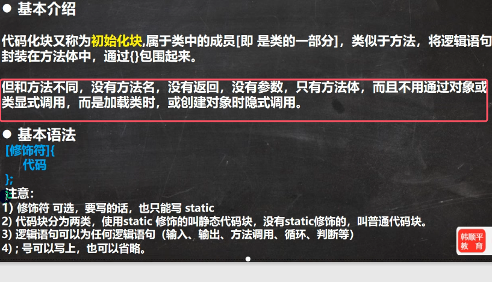
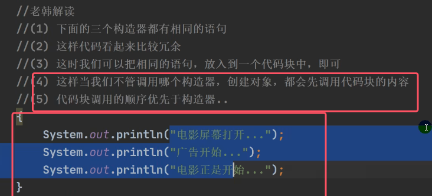
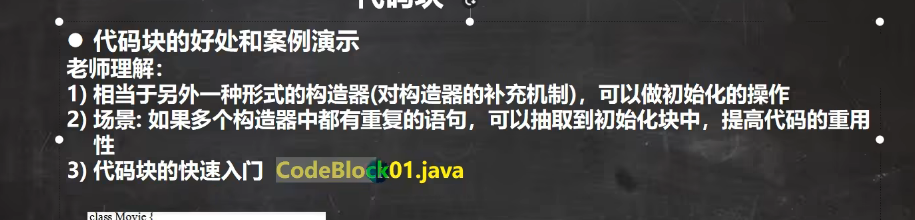
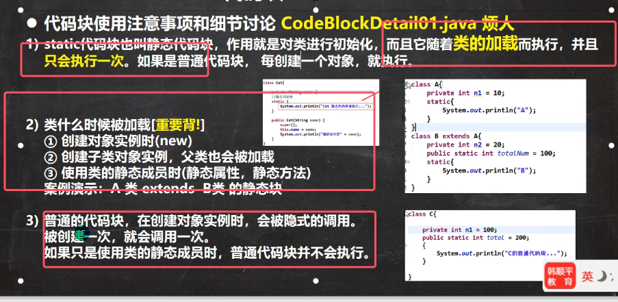
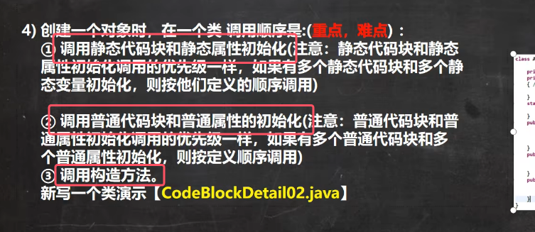
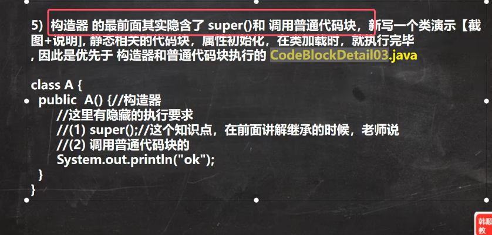
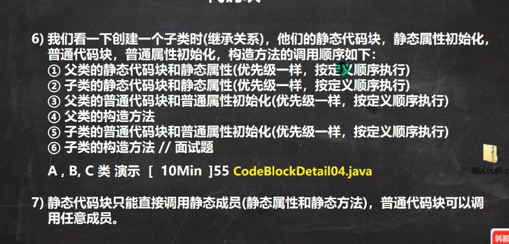

## 1）static修饰符

### 1.静态变量
`static` 变量也被称为静态变量，它是属**于类而不是属于类的某个实例的变量**

静态变量的内存布局：


* 不管静态变量是存放在堆里面，还是存放在方法区的静态域内，**有一点是可以确定：静态变量是该类的所有实例共享的，因此不影响理解以及对静态变量的使用**
* 静态变量一直存储在方法区中，只是方法区的实现可能有所不同，具体见JVM篇
从上面的内存布局可以得到下面的结论：  
* 静态变量属于类，而不是类的某个实例。
* **无论创建多少个该类的对象，静态变量都只有一份拷贝，所有对象共享这一份静态变量**
* **静态变量在类加载的时候就生成**（先于对象而存在）

定义static变量的语法如下图所示：
```java
class ClassName {
    访问修饰符 static dataType variableName;
}
```

访问类变量方式：
```java
类名.类变量名（推荐） 或者 对象名.类变量名
```

使用细节： 
1. **需要使用类变量的场景：当我们需要某个类的所有对象都共享一个变量，就可以使用类变量。比如：定义学生类，统计所有学生总共交多少钱，那么次属性就可以为静态变量**
2. 类变量是该类的所有对象共享的，而实例对象时每个对象独享的
3. 加上static类变量或静态变量，否则称为实例变量/普通变量/非静态变量
4. **静态变量的访问修饰符的访问权限和范围和普通属性是一样的**
5. 实例变量不能通过 类名.类变量名 的方式访问
6. 类变量在类加载时就初始化了，也就是说，即使没有创建对象，只要类加载了，就可以使用类变量（也就是说即使没有创建对象，那么我们也可以通过类名。类变量名的方式访问静态变量，此时JVM会自动把该类加载到方法区）
7. 类变量的生命周期是随着类加载开始，随着类消亡而销毁

### 2.静态方法
静态方法 也叫类方法。

静态方法的创建：
```java
访问修饰符 static 返回值类型 方法名(参数列表) {
    // 方法体
}
```

静态方法的调用（前提也是满足访问修饰符的权限以及访问范围）：
```java
类名.类方法名（推荐） 或者 对象名.类方法名
```

类方法的经典实用场景：当方法中不涉及到任何和对象相关的成员，或者希望不创建实例也可以调用某个方法。则可以将方法设计成静态方法，方便调用，提高开发效率。比如：工具类中的方法utils中的Math类、Arrays类等

在实际方法中，往往会将一些通用的方法，设计成静态方法，这样我们不要创建对象就可以使用了，比如打印一维数组，冒泡排序等

使用细节：
1. 类方法和普通方法都是随着类的加载而加载，将结构信息存储在方法区
2. 类方法中不可以用this和super关键字，普通方法中可以使用this和super
3. 普通方法和对象有关，需要通过对象名调用，比如对象名.方法名(参数),不能通过类名调用
4. **类方法中只能访问本类的静态变量或静态方法**，若想访问该类的非静态成员，必须创建一个该类的实例对象后，才能通过这个对象去访问类中的非静态成员
5. **普通成员方法既可以本类非静态，也可以访问静态变量和静态方法**

一句话：静态方法只能访问静态成员，非静态方法，可以访问静态成员和非静态成员（必须遵守访问权限）

### 3）静态初始化块

静态初始化块的语法格式如下
```java
static {
    // 代码块内容
}
```

静态初始化块的作用：
6. 静态初始化块用于初始化静态属性
7. 静态初始化块可以调用静态成员
8. 静态初始化块中不能直接访问非static成员，但可以通过创建类的实例对象来间接访问非静态成员
9. **静态初始化块是在类加载的时候就会被被执行，并且只会被执行一次**
## 2）main语法
main方法的语法如下所示
```java
public static void main(String[] args) {  
}
```
10. java虚拟机调用类的main()方法，所以该方法的访问权限必须是public
11. java虚拟机在执行main()方法时不必创建对象，所以该方法必须是static
12. 该方法接受String类型的数组参数，该数组中保存执行java命令传递给所运行的类的参数
13. java 执行的程序 参数1 参数2 参数3，此指令代表运行程序，示例如下图所示


特别提示：
14. **在main()方法中，我们可以直接调用main方法所在类的静态方法或者静态属性**
15. **但是不能直接访问该类的非静态成员，必须创建一个该类的实例对象后，才能通过这个对象去访问类中的非静态成员**


## 3）代码块
这块内容不太重要，并且静态初始化快在上面也已经讲过，所以下面就直接使用图片的形式进行记录


* 对于静态初始化块是加载类时调用，只调用一次；
* 而对于普通代码块，是创建对象时调用，创建一次调用一次



使用细节：  




