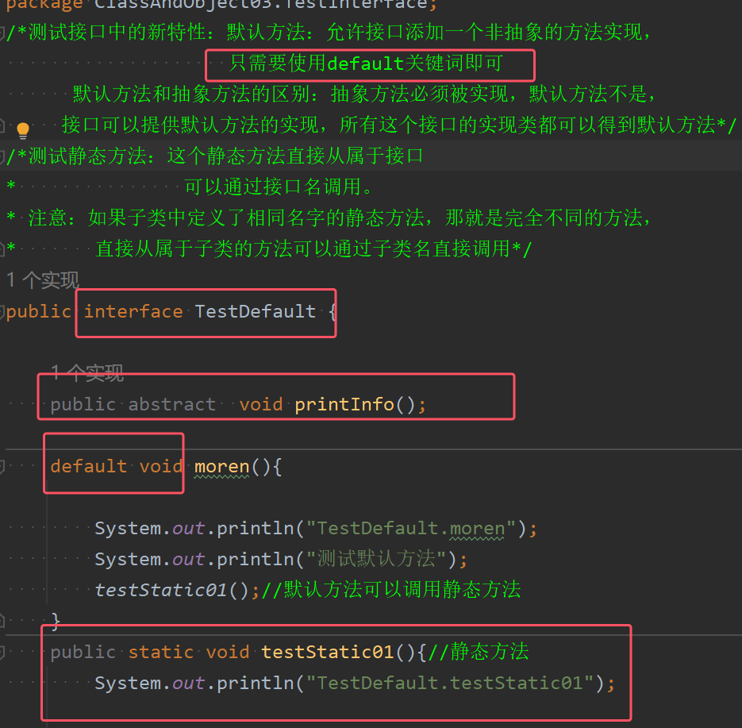
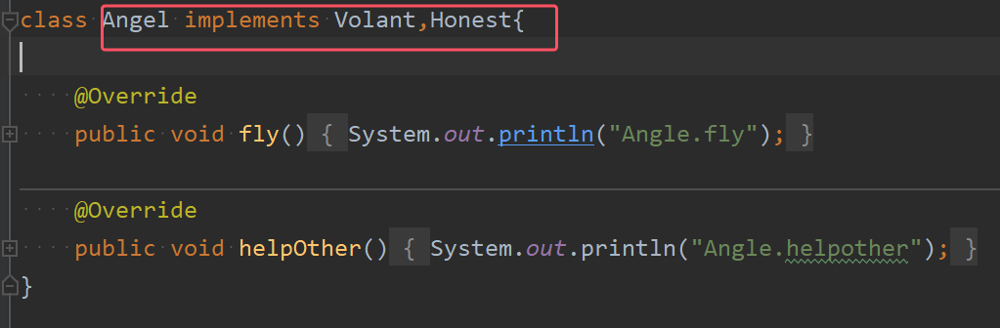
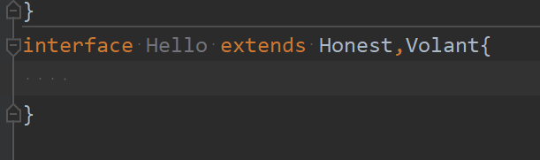

### 1）final关键字
final关键字的作用：
1. 修饰变量：被修饰的变量不可被重新赋值,  也就是常量（可以是局部变量也可以是成员变量）
2. 修饰方法：希望该方法不可被子类重写，但是可以重载  
3. 修饰类：希望修饰的类不能被继承，比如Math等

使用细节：  
1. final修饰的属性在定义时，必须赋初值，并且以后不能修改。赋值可以在如下之一：
	* 定义时，如`public final int TEX_INT=5;`
	* 在构造器中
	* 在代码块中
2. 如果final修饰的属性是静态的，那么初始化的位置只能在定义时，或者在静态代码块中。不能在构造器中赋值
3. **final类不能继承，但可以初始化对象**
4. 如果类不是final类，但是含有final方法，则该方法虽然不能重写，但是可以继承
5. 如果一个类已经是final类了，那么就没有必要再将方法修饰成final方法（都不能被继承，那么肯定不可能有子类重写）
6. final不能修饰构造方法
7. **final往往和static搭配使用，效率更高（搭配使用不会导致类被加载），底层编译器做了优化处理**
8.   包装类（Integer、Double、Float、Boolean等都是final），不能被继承，String类也是final类


### 2）抽象类
抽象类介绍：
1. 用abstract关键字修饰一个类时，这个类就叫做抽象类。语法格式如下
```java
访问修饰符 abstract 类名{

}
```
2. 用abstract关键字来修饰一个方法时，这个方法就抽象方法，其语法格式如下
```java
访问修饰符 abstract 返回类型 方法名(参数列表);//没有方法体，没有大括号
```
3. 抽象类的价值更多作用在于设计，是设计者设计好后，让子类继承并实现抽象类()

使用细节：
1. **抽象类不能被实例化**，抽象类只能用来被继承
2. 抽象类不一定要包含abstract方法，也就是说，抽象类可以没有abstract方法
3. 一旦类中包含了abstract方法，则这个类必须声明为abstract类
4. abstract只能修饰类和方法，不能修饰属性和其他的
5. 如果一个类继承了抽象类，**则它必须实现抽象类的所有抽象方法，除非它自己也声明为abstract类**
6. 抽象类可以有任意成员（**抽象类本质还是类**），比如：非抽象方法、构造器、静态属性、静态方法、普通属性等等等
7. 抽象方法不能有大括号
8. 抽象方法不能使用private、final和static来修饰，因为这些关键字都是和重写相互违背的


### 3）接口
接口：就是一组规范，所有类都要遵守，  可以看做抽象类还要抽象的抽象类，**但接口不是类**，可以更加规范的对子类进行约束


接口语法格式如下：
```java
[访问修饰符] interface 接口名 extends 父接口1，父接口2{  
常量定义；  
方法定义； 
}
```
定义接口的详细说明：  
1. 访问修饰符：只能用public或默认(default)  
2. 接口名：和类名一样单词首字母大写  
3. extends:**接口可以多继承  **
4. **常量：接口中的属性只能是常量，并且public static final修饰。不写也可以，  系统会自动识别为此修饰符**
5. **方法：接口中的方法只能是：public abstract,不写也可以，但系统也会默认是此修饰 **， 
6. **接口支持多继承**，和类的继承类似，子接口extends父接口，会获得父接口中的一切 

* 在JDK7之前，接口中的所有办法都没有方法体，即都是抽象方法
* JDK8后接口**可以有静态方法，默认方法**、也就是说接口中可以有方法的具体实现。具体的例子如下图所示：


* 默认方法如果想要使用，必须使用default关键词修饰
* 静态方法属于接口，可以直接通过结果名调用


接口的使用细节：
1. **一个类只能继承一个抽象类，但是可以实现多个接口**，就要同时实现这几个类的抽象方法

	

2. 接口不可以继承类，一个接口也可以继承多个父接口

	

3. 接口不能被实例化
4. **一个普通类实现接口，就必须将该接口的所有抽象办法都实现**
5. **抽象类实现接口，可以不实现接口的办法**
6. 接口中的属性的访问形式：接口名.属性名


