## 1）异常介绍
如果程序在没有引入异常处理机制的情况下，遇到一些情况，他就会报错并且不执行后面的代码，也就是停止执行。

* 基本概念

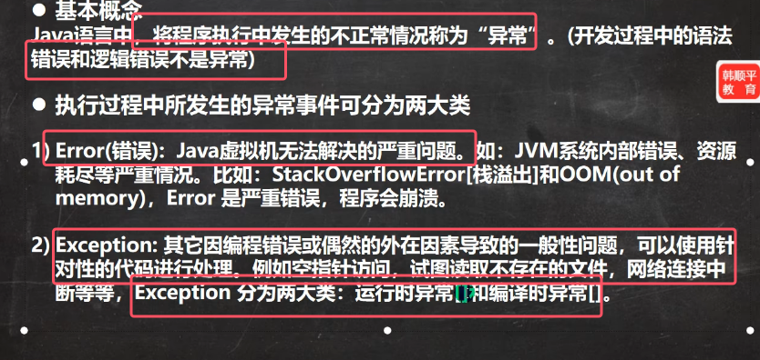

* 异常体系图介绍（重点）

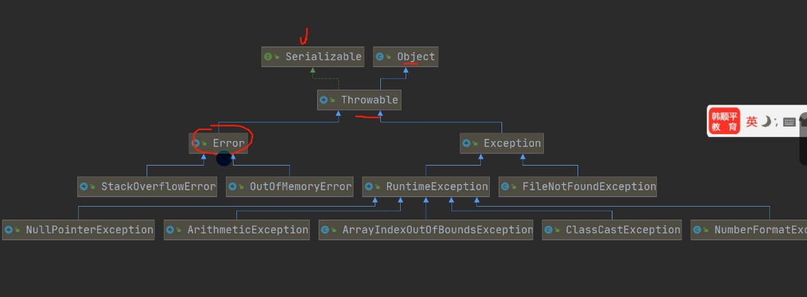
* 一旦程序发生ERROR，那么程序机会直接挂掉
* **Throwable是所有异常类和错误类的父类**
* 异常分为运行时异常和编译时异常，五大运行时异常如上图所示

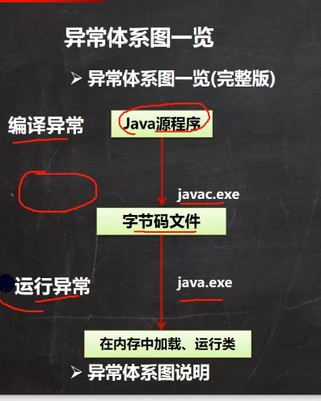
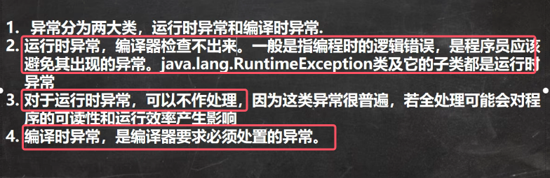

* 常见运行时异常

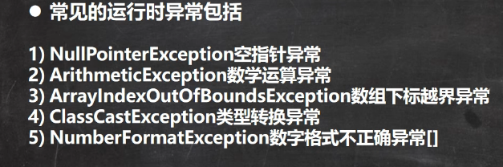
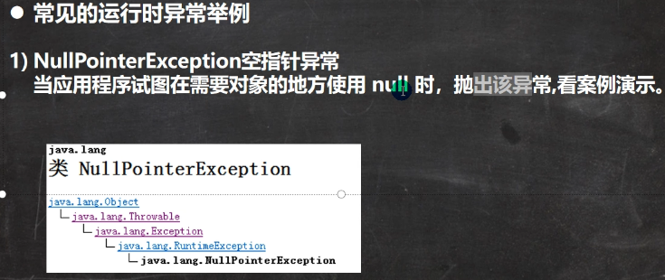
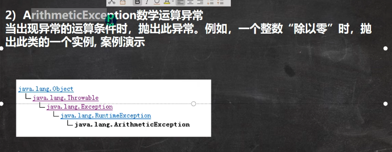
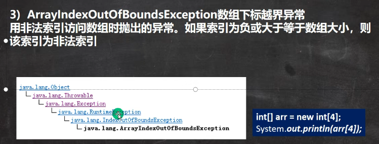
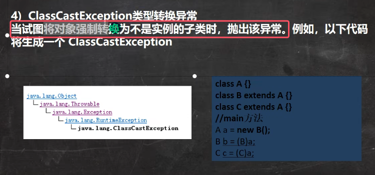
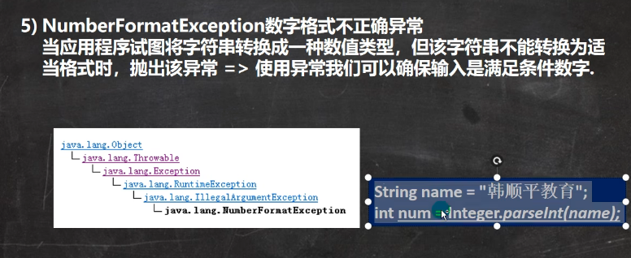

* 编译异常

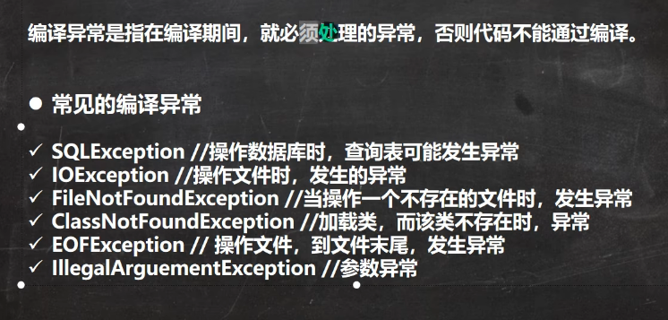

### 2）异常处理机制

### 1.机制综述
异常处理机制：**其核心目的在于提升程序的健壮性和可靠性，确保程序在遭遇各种意外情况时，仍能以合理的方式继续运行或者妥善终止。**

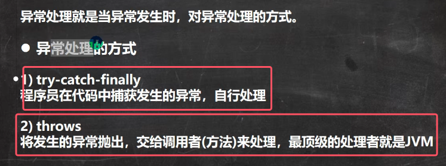

* try-catch-finally的处理机制图解

	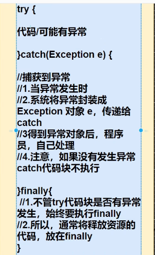

* throws处理机制图解

	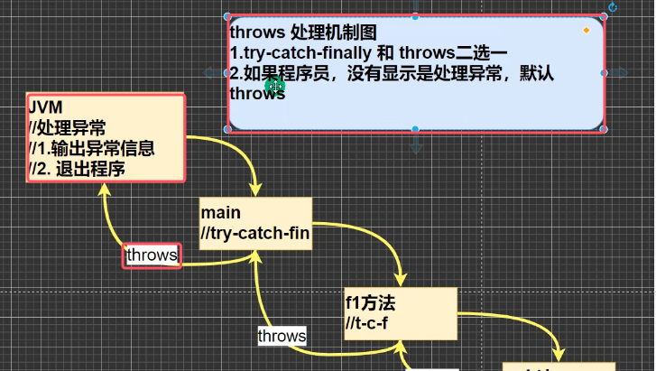
	* **JVM处理异常的方式：输出异常信息，退出程序**

### 2.try-catch异常处理
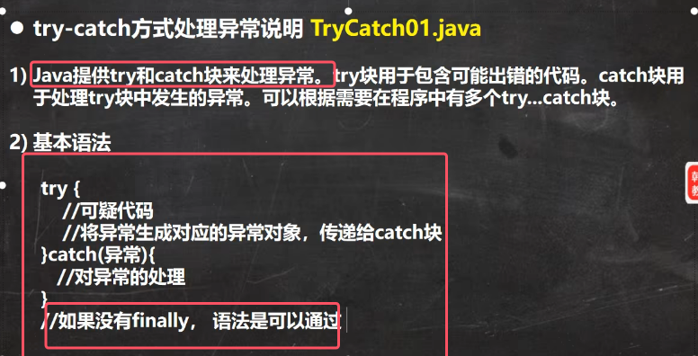

使用细节：
1. **如果没有try-catch块，系统执行到异常发生的语句就会报错并退出程序，但是try-catch块的引入，使得就是遇到异常，try-catch块后面的代码还可以继续执行，增强了代码的健壮性**
2. 如果异常发生了，**则try块中异常发生后面的代码不会执行，直接进入catch块**
3. 如果异常没有发生，则顺序执行try的代码块，不会进入到catch块
4. **如果希望无论是否发生异常，都执行某段代码（比如关闭连接、释放资源等），就使用finally块**
5. 可以有多个catch语句，捕获不同的异常做不同的处理，并对每个异常。**要求父类异常在后，子类异常在前**，比如（Exception在后，NullPointerException在前）。发生异常时，只会匹配一个catch
6. **也可以执行try-finally配合使用，相当于没有捕获异常，所以try-finally块后面的代码不会执行，程序会在执行完finally块后直接崩掉/退出，*。
7. 所以try-finally块的应用场景为：执行一段代码，不管是否发生异常，都必须执行某个业务逻辑（比如释放资源）

典型练习题：

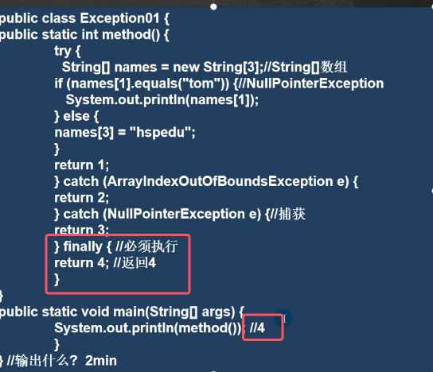
* 在 Java 的 `try-catch-finally` 语句块中，当捕获到异常时，会先执行 `catch` 块，然后再执行 `finally` 块。即便 `catch` 块中包含 `return` 语句，`finally` 块中的语句依然会执行
* **即便 `catch` 块中包含 `return` 语句，`finally` 块中的语句也会在 `return` 语句执行之前执行**，但是。不过需要注意的是，如果`finally` 块也含有return语句，那么`finally` 块中的 `return` 语句会覆盖 `catch` 块中的 `return` 语句。

所以下面联系的结果为4

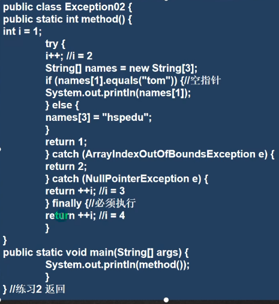

典型例题：

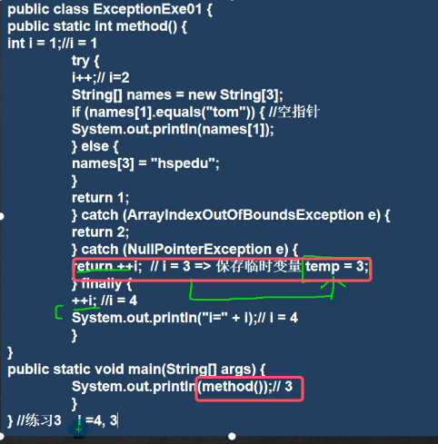

### 3.throws异常处理
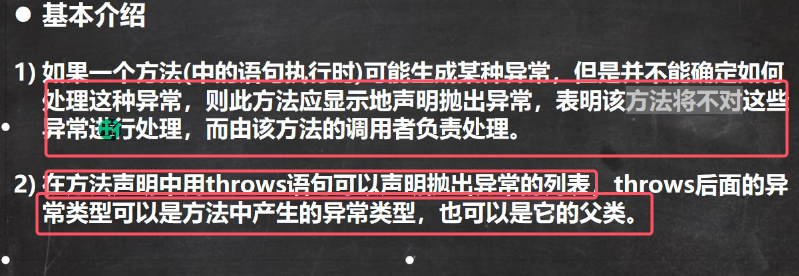
* throws关键字后可以声明抛出异常列表，也就是可以抛出多个异常
* **throws用于方法头**，表示的只是异常的声明，而throw用于方法内部，语句抛出一个异常

使用细节：  
1. **对于编译异常，程序中必须处理，使用try-catch或者throws，否则会直接报错**

	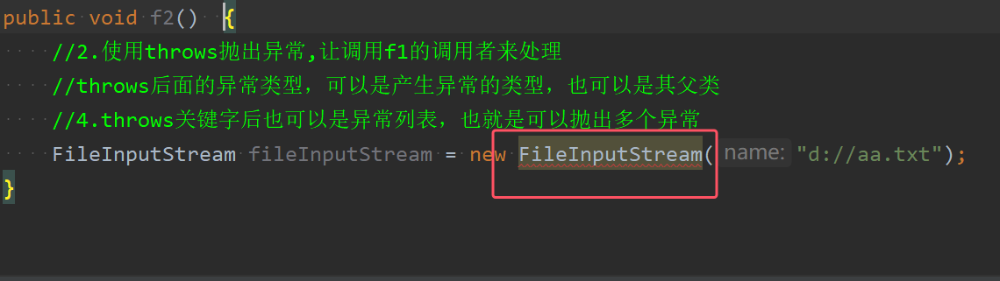
2. **对于运行时异常，程序中如果没有处理，那么默认就是throws的方式处理**
3. **子类重写父类方法时，对于抛出异常的规定：子类重写的方法，所抛出的异常类型要么和父类抛出的异常一致，要么为父类抛出异常的子类型**

	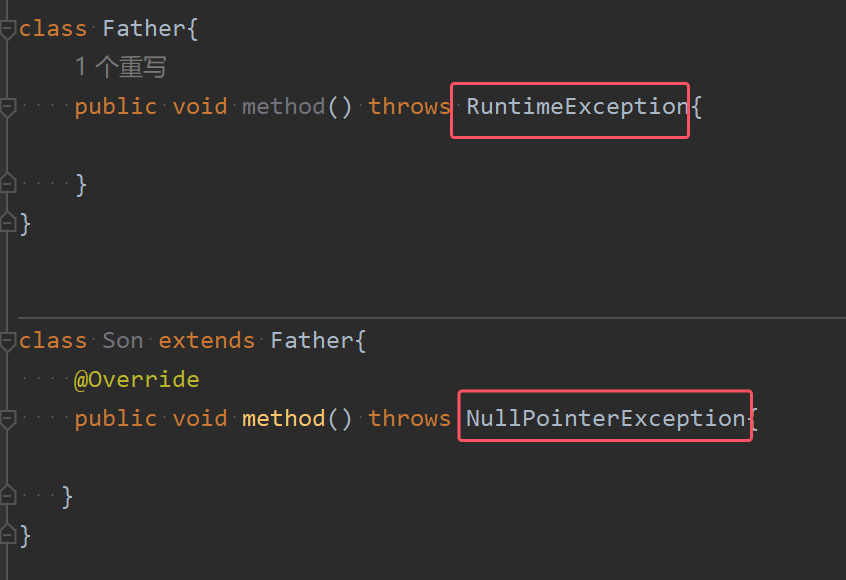
4. 在throws过程中，如果有方法try-catch，就相当于处理异常，就可以不必throws（即二选一，不能即throws又try-catch）

典型应用：在方法调用时的运行时异常和编译时异常的处理差别

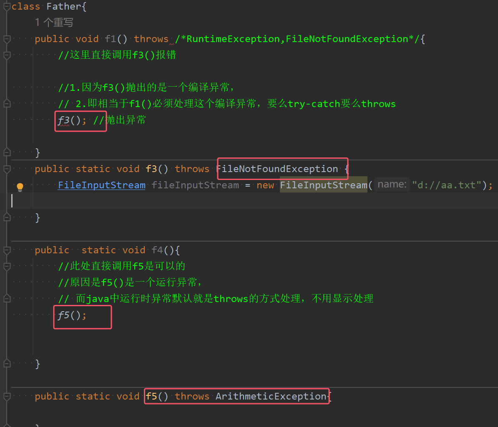

### 4.自定义异常
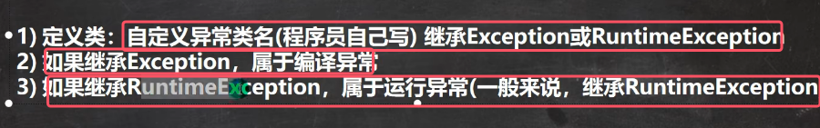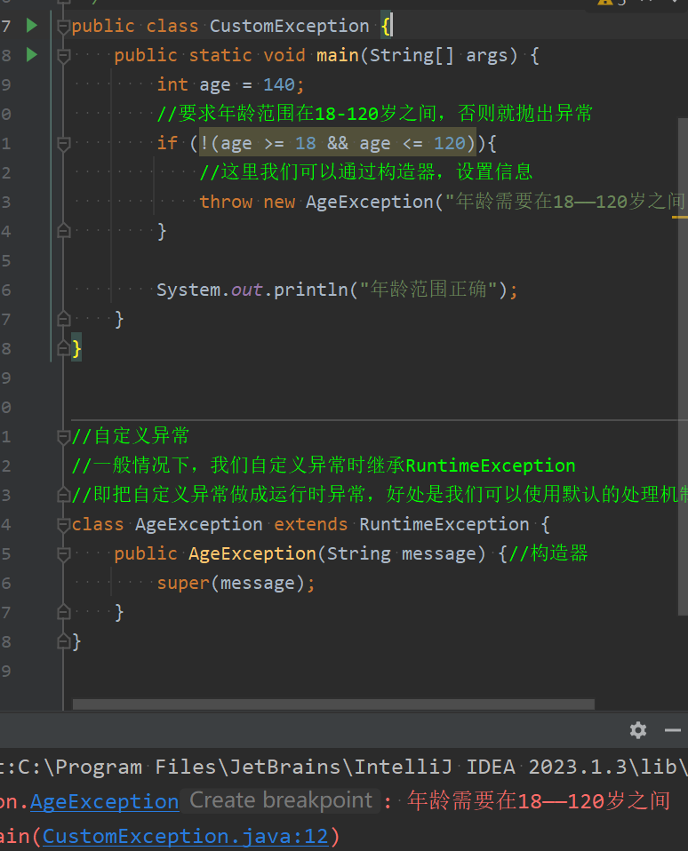

**throw和throws的区别**：

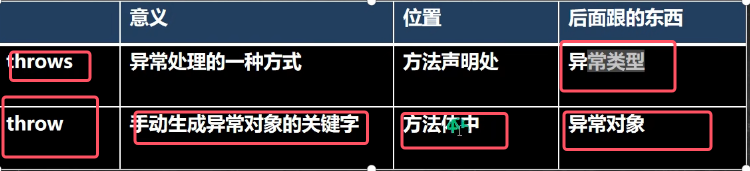

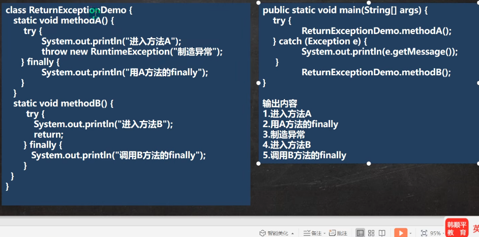