### 1.包装类介绍
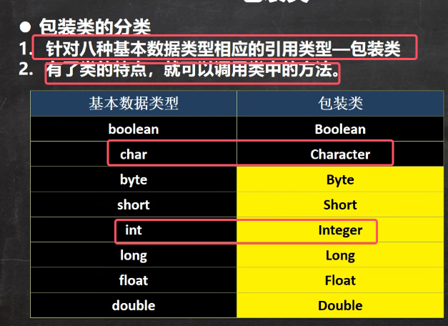
* 在这八个当中，除了char和int的有所改动，其他的只需要将基本数据类型首字母大写

包装类的继承关系：

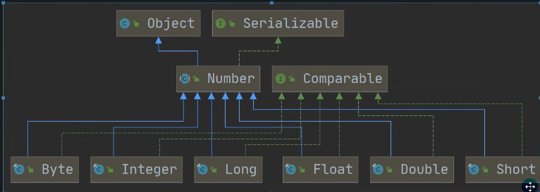
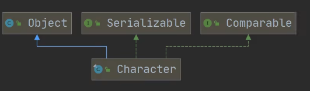
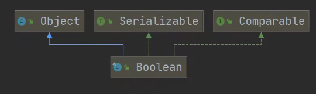
* 注意只有Boolean和Character类直接继承Object类，剩下的都是先继承number类

### 2.自动装箱和自动拆箱
装箱：基本类型->包装类型，反之就是拆箱

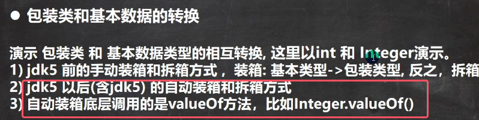

首先以int->Integer为例子来演示手动装箱和拆箱（jdk5之前）

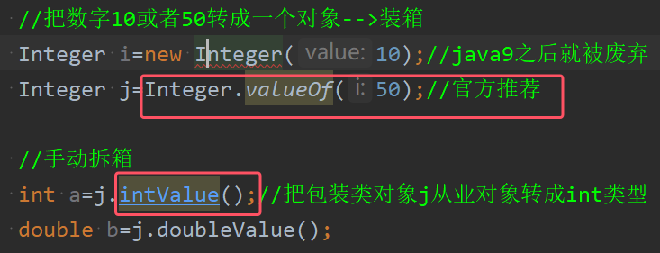

自动装箱和自动拆卸（jdk5包括5之后）

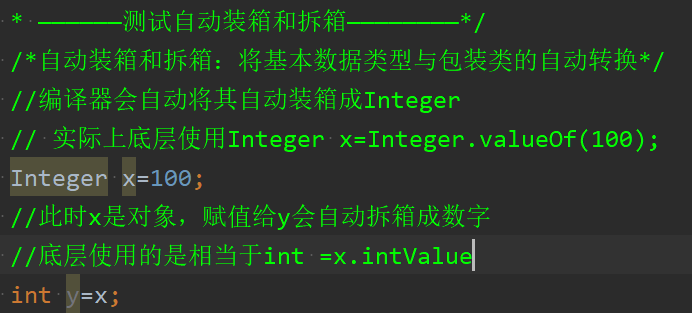

典型例题：  

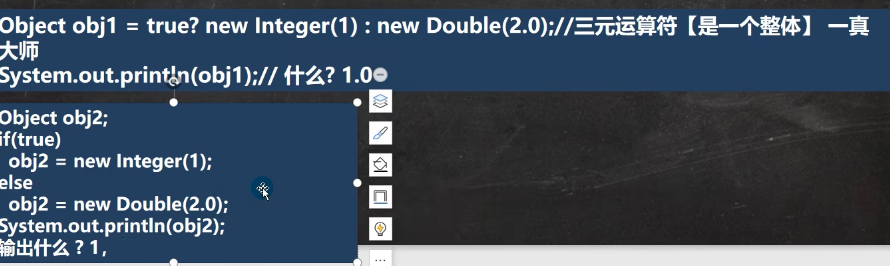

注意：虽然obj1被装箱后成为包装类的对象，但是直接输出obj1，他不会像对象一样直接默认调用toString方法，而是直接输出数值。也就是说：**直接输出包装类的对象时输出改包装类的值，因为其底层重写了toString()，直接输出对象就会调用toString()**

### 3.包装类方法
#### 1.包装类型与String类型的转换
![[assets/02包装类/file-20250525172438242.png]]
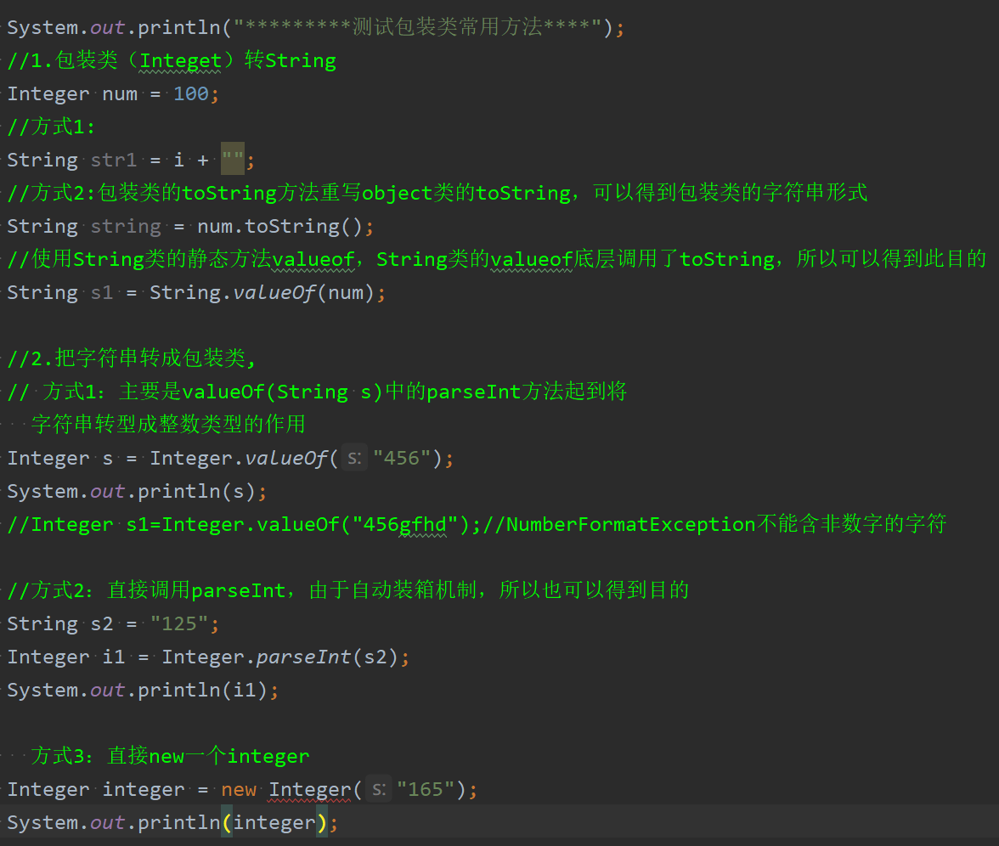
* 方便转换的话，无论是怎么转换都推荐使用：结果类的静态方法`valueOf()`

#### 2.包装类常用方法
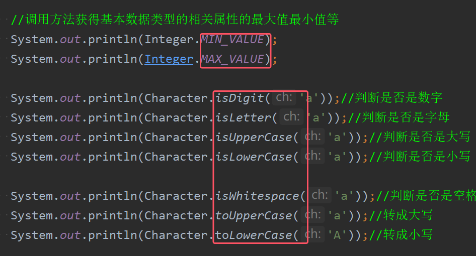
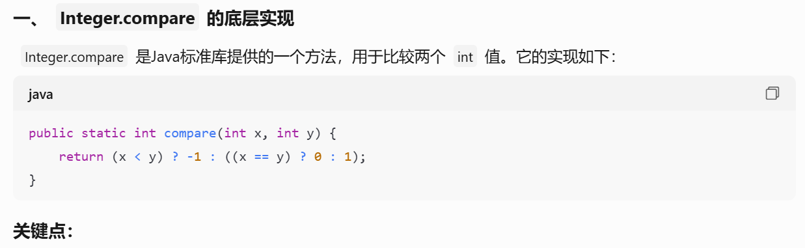

### 3.Integer的创建机制
Integer装箱底层调用valueOf()方法的源码如下图所示：

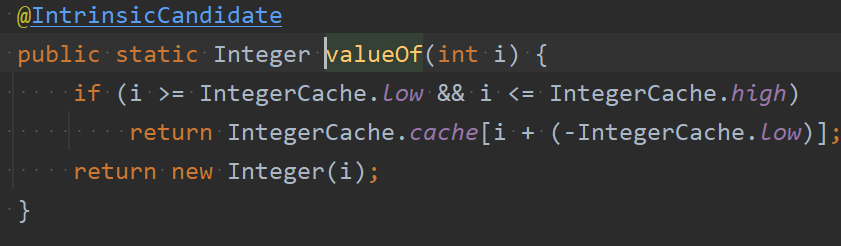
* 通过阅读源码可知，当i大于等于low，或者小于等high的时候会返回缓存数组当中的对象；如果超出这个范围才会创建新的Integer对象
* low为-128，high为127。也就是说，自动装箱时(即使用valueof)，对于\[-128、127]之间的整数有缓存，直接返回缓存数组`cache`中的对象；如果超过此范围，那么就会new Integer()并返回
* **总结：valueOf和new Integer：valueOf是超过范围才创建新对象，new Integer是直接创建新对象。二者都可以用来新建包装类对象，但现在用的最多的是valueOf。并且由于自动装箱机制的出现，直接进行赋值成为了使用最多的用法，但是其底层仍然是调用valueOf方法**

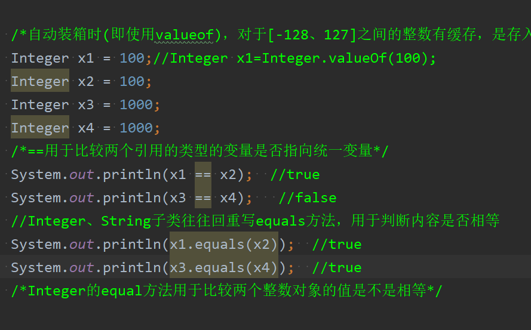

