### 1.String类综述
String类的继承关系如下：

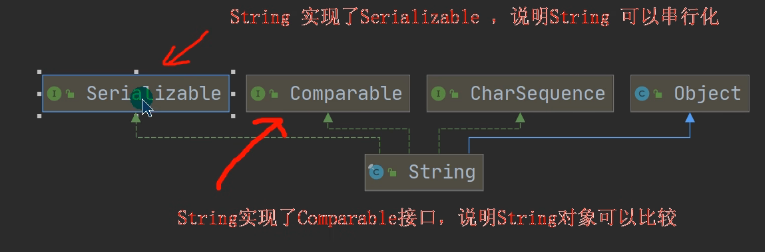

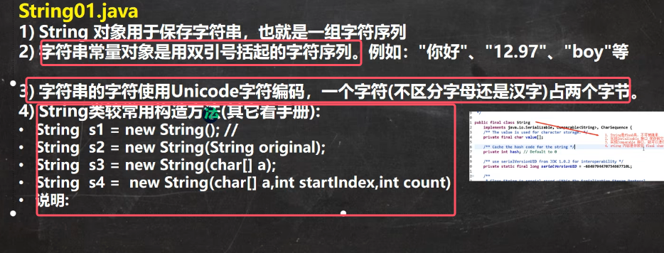

要点：

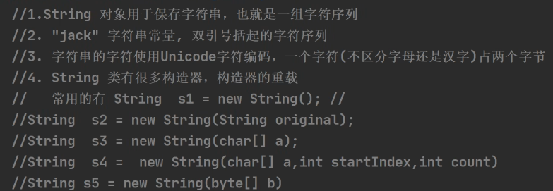
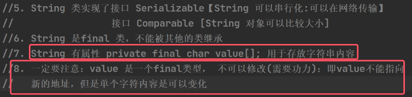
* 阅读String类的底层源码可知，String类中的成员value\[]就是用于存放字符串内容的
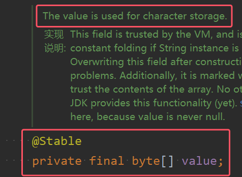

* value不可以修改是指的String类的底层代码中的value指向地址不可修改。而value指向的内容和String对象引用变量可以更改 具体体现如下图所示

	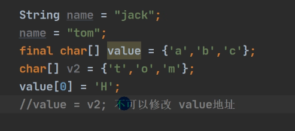

	

### 2.String创建剖析
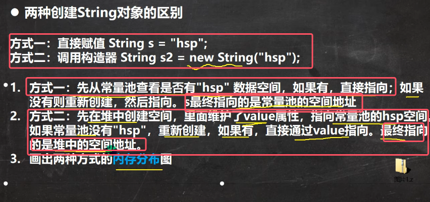
* 两种创建方式的JVM的内存布局如下图所示：

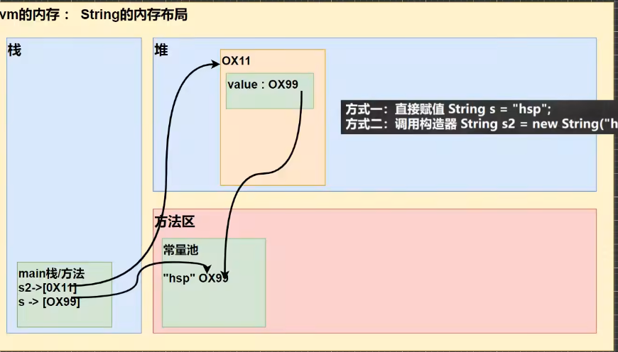
* 可以看到，**两种方式创建的对象引用指向的地址肯定是不一样的，一个指向堆，一个指向常量池**

注：    
1. **String类会重写equals方法用于比较字符串内容的值是否相同**
2. `intern()` 方法用于将字符串对象添加到字符串常量池中，并返回常量池中的字符串引用。具体来说，会根据jdk版本的不同有不同的应用，具体如下图所示。

	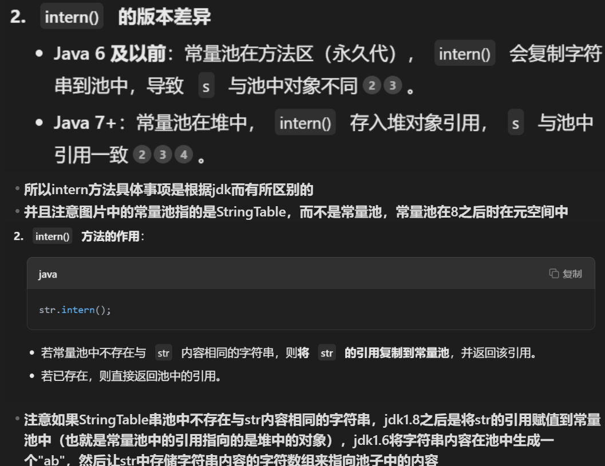

关于上述内容的一些典例：  

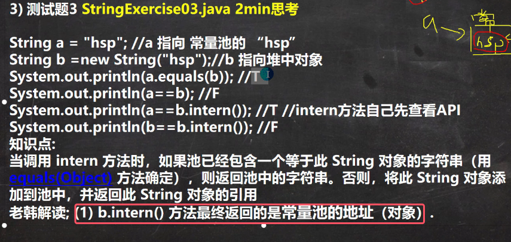
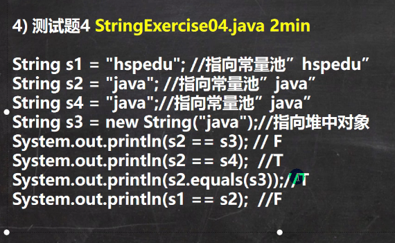
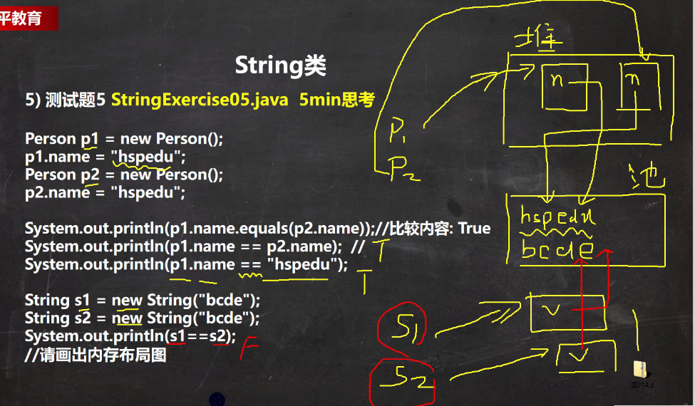

### 3.字符串特性
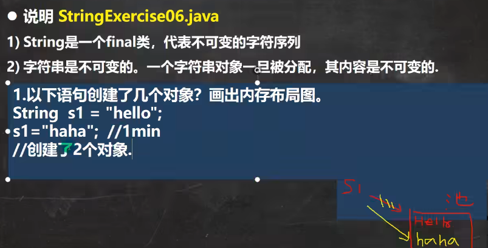

典例：

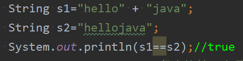
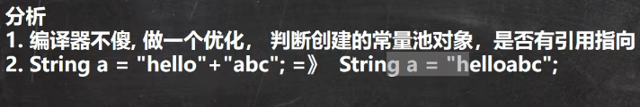
* 编译器做了底层优化，当拼接的**全部是字符串字面量**（即代码中直接写死的 `"字符串"`，不含变量）时，编译器会在编译阶段（而非运行时）直接合并这些字面量。等价于直接写 `String s1 = "hellojava"`

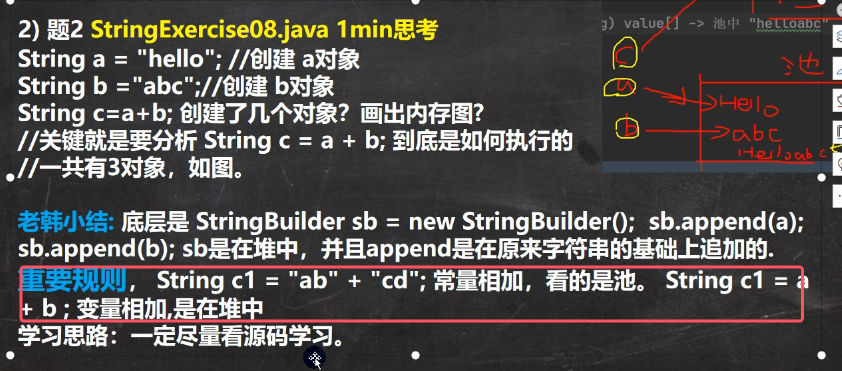

上面的题的图解如下图所示：

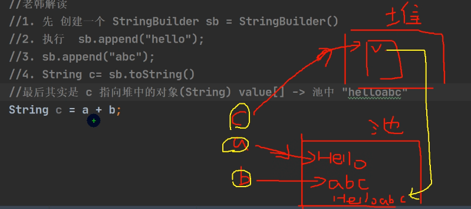
* StringBuilder的toString方法的内部实现是new了一个String

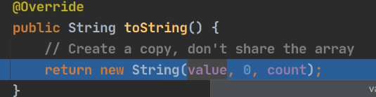

典例：

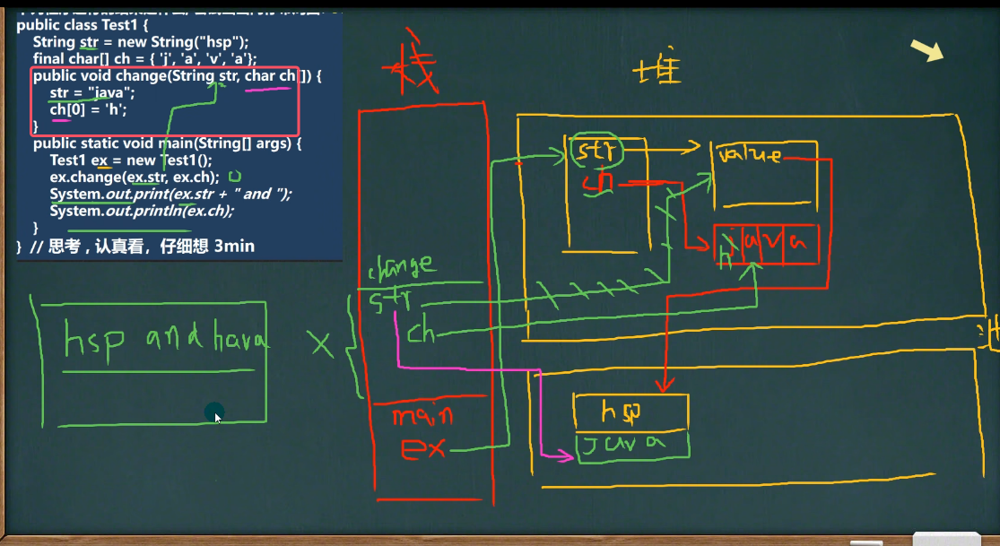
* change方法中只是修改了change中str的的指向，这个str是对象ex.str的副本，并没有修改ex.str中的指向的地址，所以仍然输出hsp

### 4.字符串方法
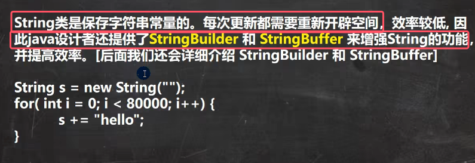

效率角度的原因：详情见上面字符串的特性

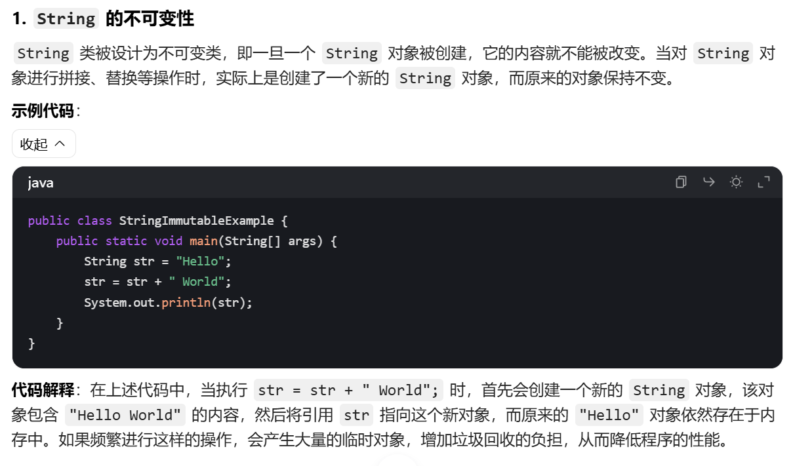

常见方法一览（**全部都是普通方法**，除了format是静态方法）：

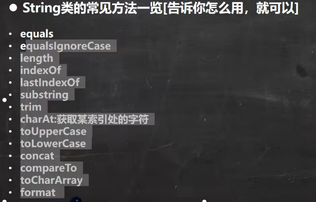
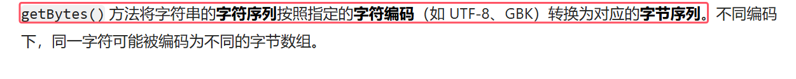
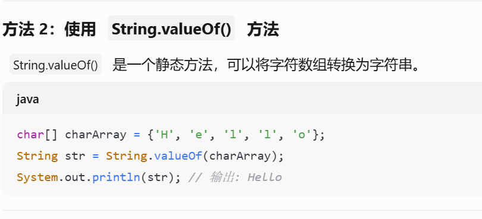
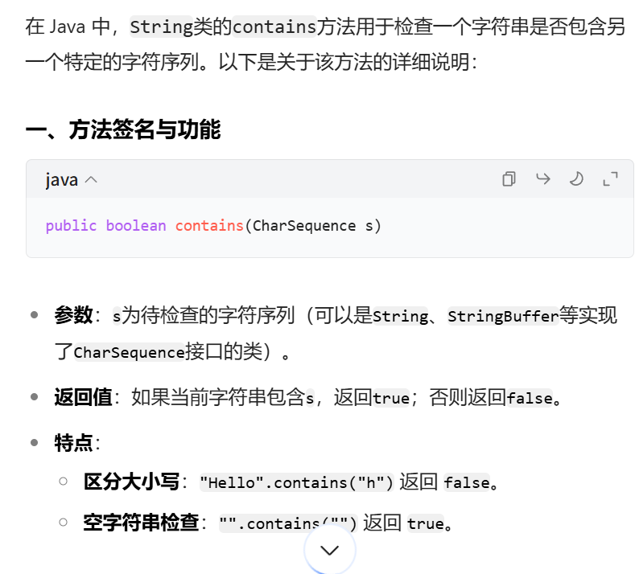
* 其他的数据类型通过该方法也可以转为字符串类型

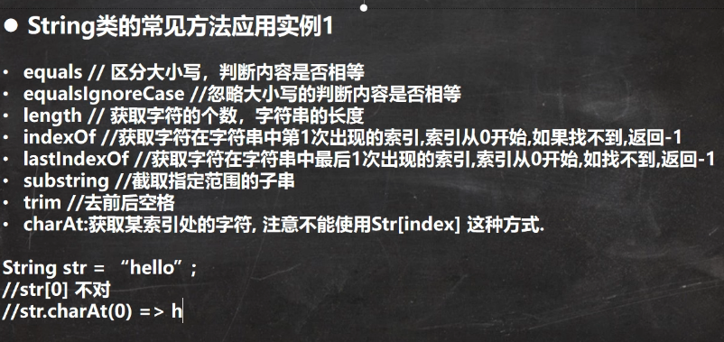
* **String类会重写equals方法用于比较字符串内容的值是否相同**
* indexOf可以可以获取字符也可以获取字符串在主串中第一次出现的索引，lastIndexOf同理
* substing(Int i)代表从下标为i的位置开始截取字符串，包括下标i；当为`substring(int beginIndex, int endIndex)`时，截取的字符串是左闭右开区间

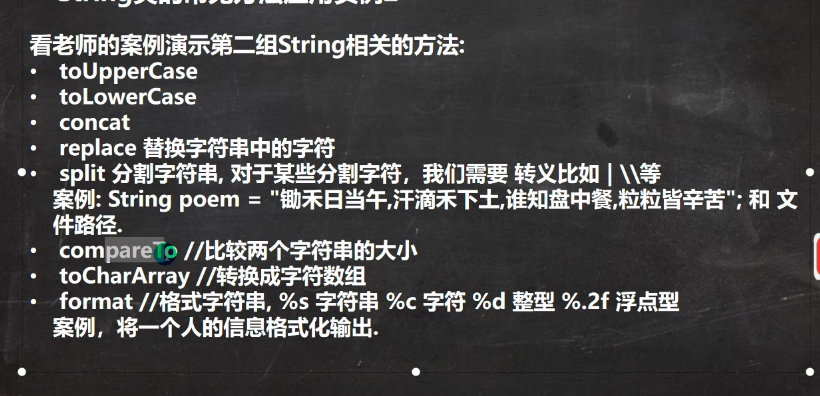
* concat用于拼接字符串
* 注意：s1.replace（）方法执行后，返回的结果才是替换过的，如果只写s1.replace('a','c')，那么不会对s1字符串有任何改动
* 在使用split()数组进行分割时，如果有特殊字符，需要加入转义符\\\

	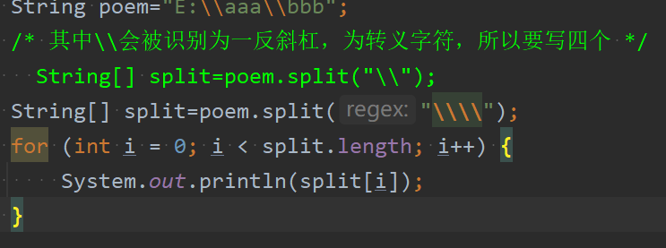
* compareTo()方法用于比较两个字符串大小。比较规则如下：
	1.  字符串长度相同且内容相同，`compareTo` 方法返回 0
	2.  字符串长度不同但较短字符串是较长字符串的前缀，`compareTo` 方法返回的结果是两个字符串长度的差值的负数（调用方法的字符串较短）或正数（调用方法的字符串较长）。
	3. 字符串长度不同且不是前缀关系，`compareTo` 方法会从两个字符串的第一个字符开始逐字符比较它们的 Unicode 值，直到找到不同的字符或者其中一个字符串结束。如果找到不同的字符，就返回这两个字符 Unicode 值的差值。
* format是静态方法，将所有的信息都拼接在一个字符串，也就是字符串使用c语言的格式化输出方法来格式化成新的字符串

	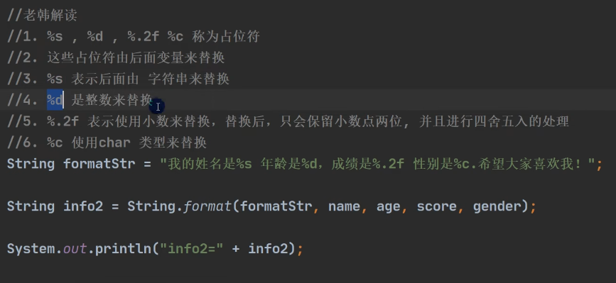