## 1）StringBuffer类
### 1.StringBuffer结构剖析
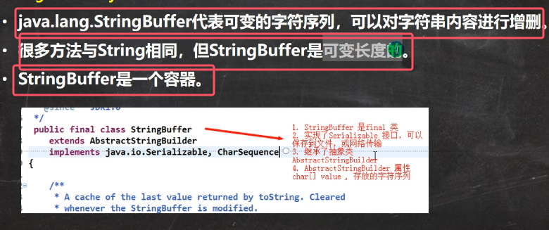

其继承关系如下：

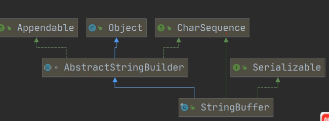
* 实现了接口Serializable，即StringBuffer的对象可以串行化
* StringBuffer的直接父类是AbstractStringBuilder
* 在其父类AbstractStringBuilder中，**有属性char\[] value，此数组存放字符串内容，并且不是final类型的**，因此，**StringBuffer字符串内容是存放在堆中的**
* StringBuffer是一个final类，不能被继承

	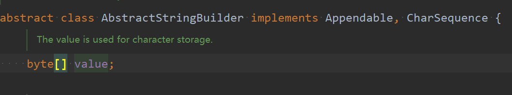

StringBuffer和String的对比： 

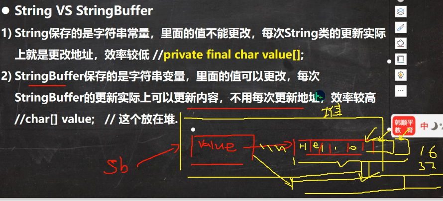
* 不用每次更新地址指的是不用每次创建新对象，所以效率高于String

### 2.StringBuffer的构造器
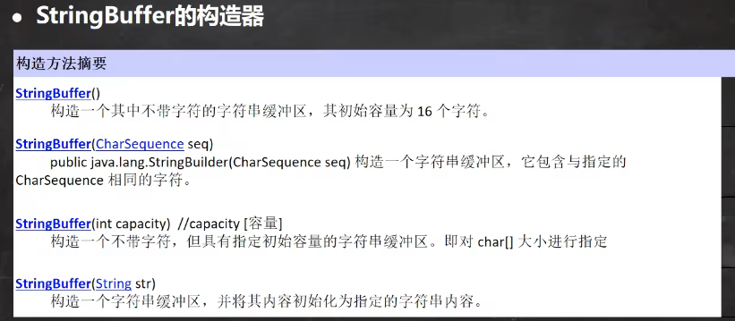

下面讲解用处较多的构造器：

1. **StringBuffer类的不带字符的无参构造器的创建的初始容量为16的底层源码如下：**

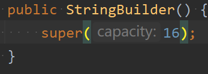
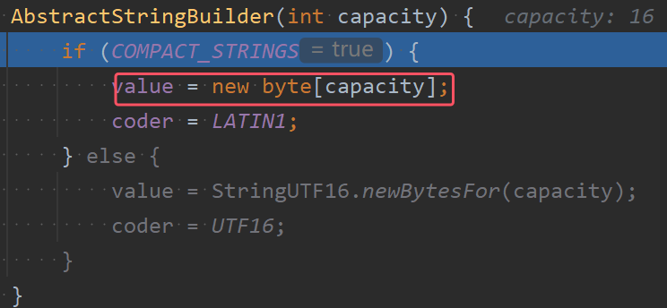

2. 通过构造器指定字符串缓冲区的的容量，也就是char\[]的大小
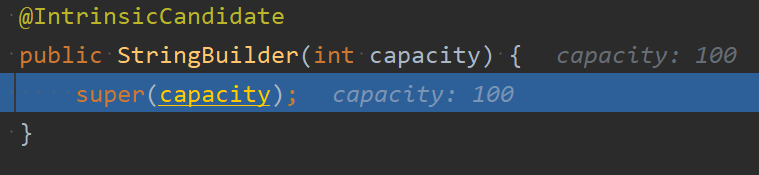

1. **直接制定一个字符串内容的构造器，容量是字符串长度+16**

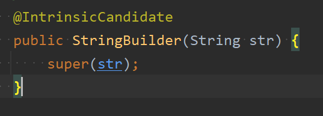
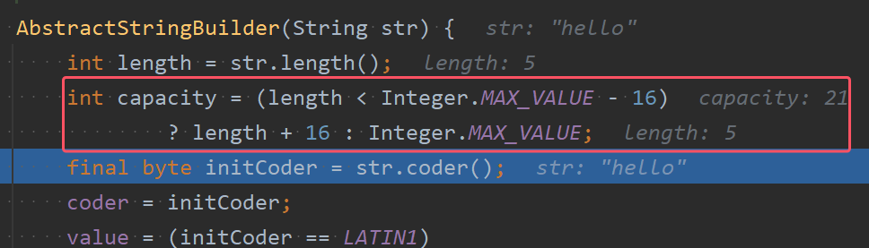

### 3.StringBuffer与String的转换
在开发中，我们经常需要Strng和StringBuffer相互转换

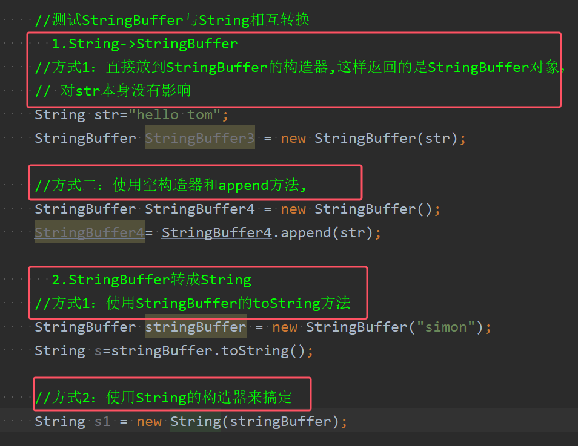
* StringBuffer和StringBuilder的toString方法是一样的，都是底层返回new String

### 4.StringBuffer的常用方法
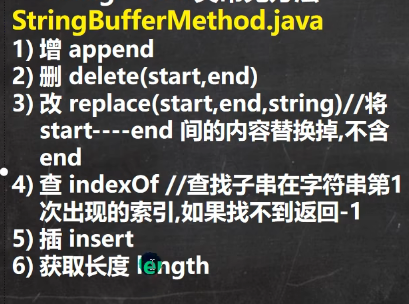
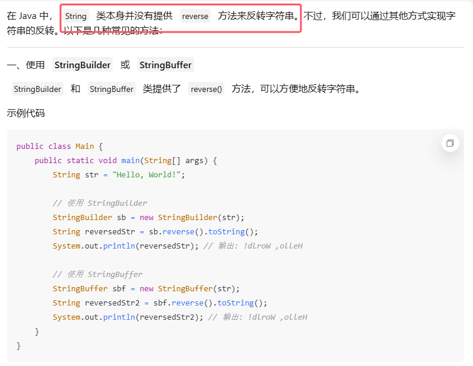
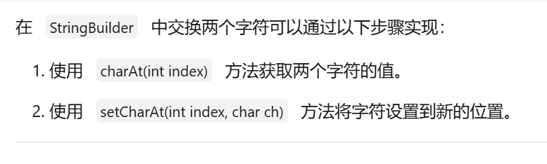
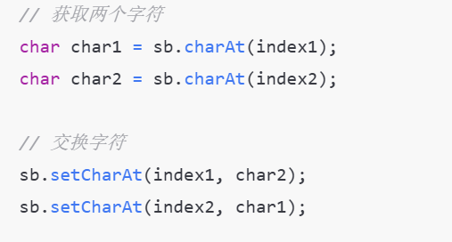
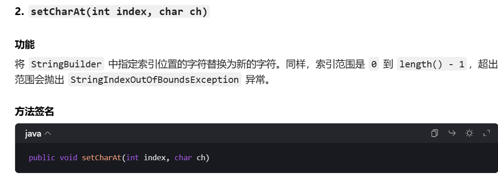
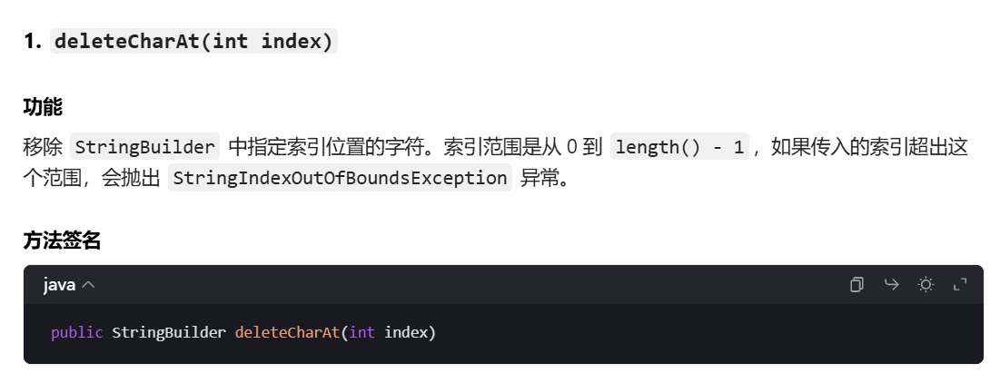

* StringBuffer类的toString方法其实是存放字符串内容的数组value\[]拷贝到一个cache中，然后将其作为内容返回一个字符串
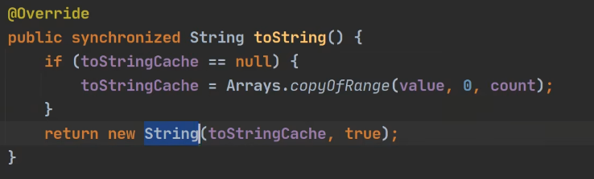
* 增：append:向字符串后追加内容,可以接受任何类型的变量，自动将其转换成字符追加
* 删除delete：填入的形参是左闭右开区间
* 更改replace：同样是左闭右开区间，如果被修改的内容与填入的字符串长度不一样，此方法会自动调整，不会去重复填入
* 查找indexof:只能是查找子串,而String是字符字符串都能查找
* 插入insert：在索引为i的位置插入指定内容，原本索引为i的内容自动后移

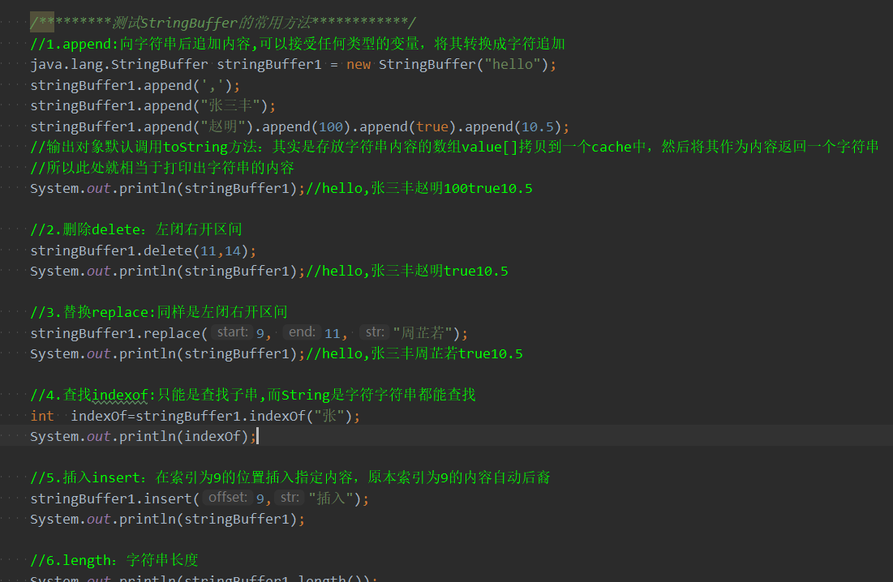

## 2）StringBuilder类
### 1.StringBuilder结构剖析
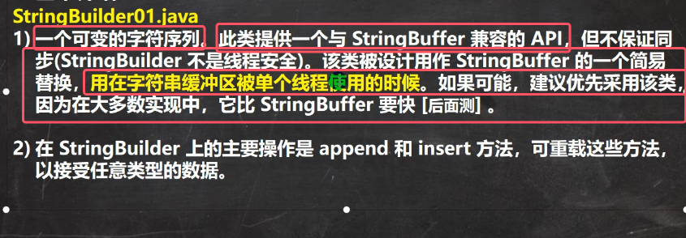
* 与StringBuffer的API完全相同，包括insert和append，也是可变字符序列
* **不是线程安全**
* **单线程的情况优先使用StringBuilder，性能更好**

StringBuilder类的继承关系如下图所示

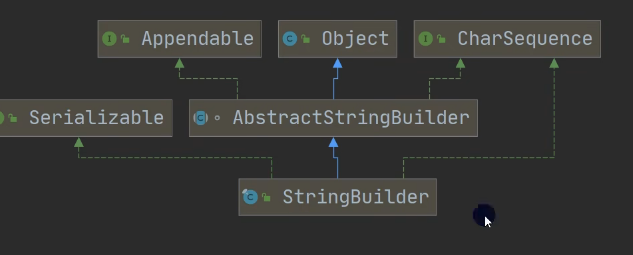
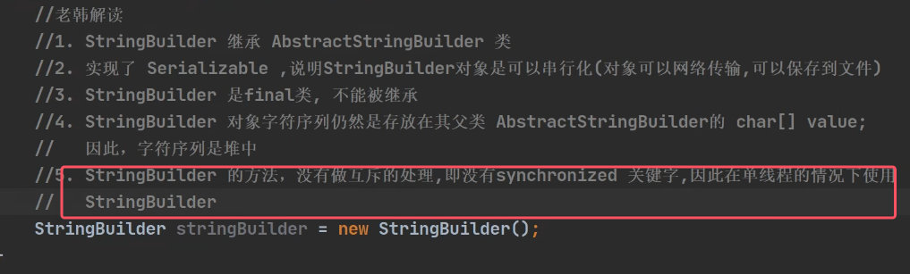

String、StringBuffer和StringBuilder对比

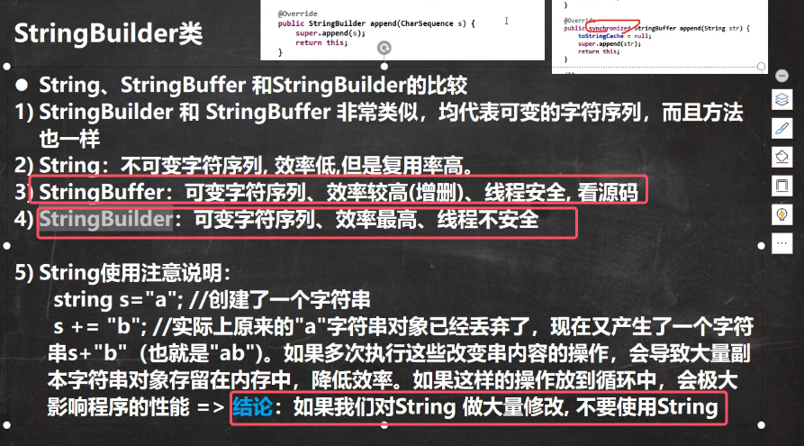

三者的应用场景：

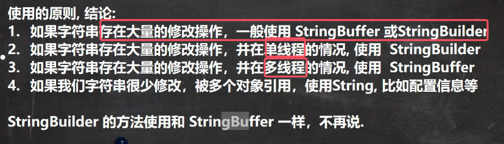