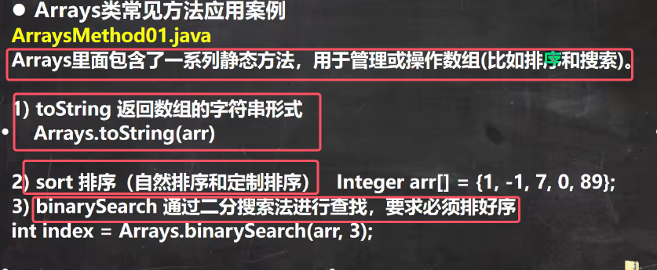
* **注意都是静态方法**

#### 1.toString方法
基本功能是将**数组的元素转换为一个字符串，元素之间用逗号和空格分隔，并用方括号 `[]` 括起来。**

打印出来的结果如下图所示：

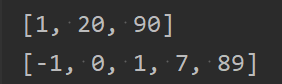

#### 2.sort方法
sort方法用于堆数组进行排序。

首先讲自然排序：  
1. 数组是引用类型，通过sort排序后会直接影响到实参。所以直接sort就会改变arr内部的值。
2. 默认是升序排列  

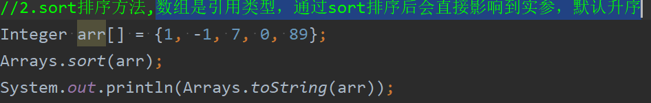

讲定制排序 ：   
* sort方法是重载的，也可以通过传入一个接口Comparator来实现定制排序（定制式升序还是降序）

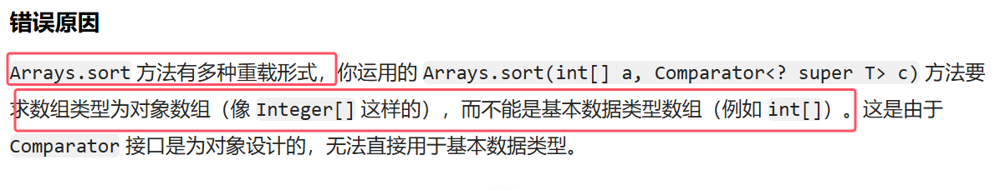
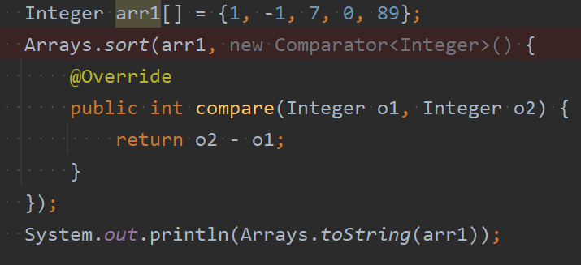

对于上图代码的解读：
1. 其实第二个参数就是实现了Comparator接口的匿名内部类，需要重写compare方法
2. 通过查看源码可以知道，`Arrays.sort(arr1, new Comparator<Integer>()` 底层会调用TimSorrt类的binarySort方法，binarySort方法会根据动态绑定机制通过匿名内部类的compare方法来决定排序的顺序。具体的调用代码块如下图所示：

	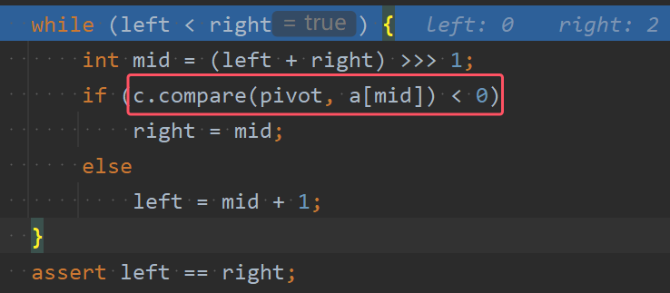

3. compare返回的值是大于0还是小于0会影响整个排序的结果
4. compare方法当中如果是o1-o2，那么会是升序排列；如果是o2-o1，那么就是降序排列

### 3.其他方法
1. Arrays.binarySearch:二分查找
	* 要求使用前必须按照升序排列
	* 返回查找的元素下标
	* 如果没找到，return -(low + 1); 其中low是如果此数存在，那么应该存在的位置的下标
	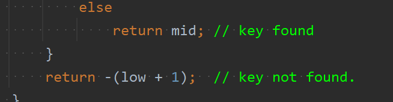

2. Arrays.copyOf：数组元素的复制

	以下图为例进行讲解:
	
	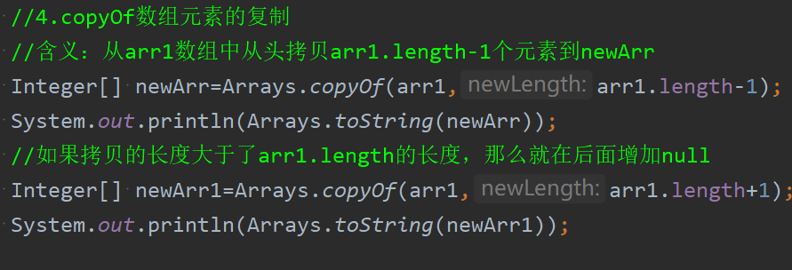
	* 方法含义：从arr1数组中从头拷贝arr1.length-1个元素到newArr，返回值：返回一个和源数组类型相同的新数组，新数组保存了复制过来的原数组内容，且长度是 `newLength`
	* 如果拷贝的长度大于了arr1.length的长度，那么就在后面增加null
	* 如果拷贝的个数为负数，那么就会报错
	* 当使用 `Arrays.copyOf` 方法将数组内容复制到自身，并且指定的新数组长度大于原数组的 `length` 时，`Arrays.copyOf` 方法会创建一个新的、长度为指定值的数组，并将原数组的元素复制到新数组中，从而实现了 “扩容” 的效果
	
	上图例子打印结果如下：  
	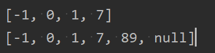

3. Arrays.fill：使用指定数字去填充num数组，也就是替换数组中所有的元素

	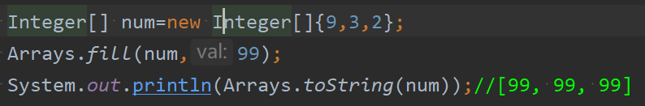

4. Arrays.equals：比较两个数组元素内容是否一致，一直返回true，不一致返回false

	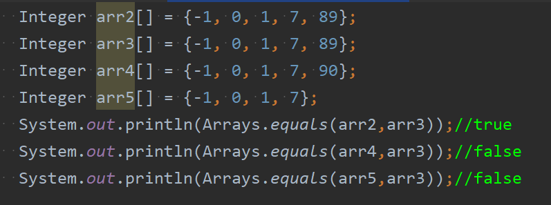

5. Arrays.aslist：将一组值转换成list
	* 调用此方法，会将(2, 3, 4, 5, 6, 7)数据转成一个list集合,

	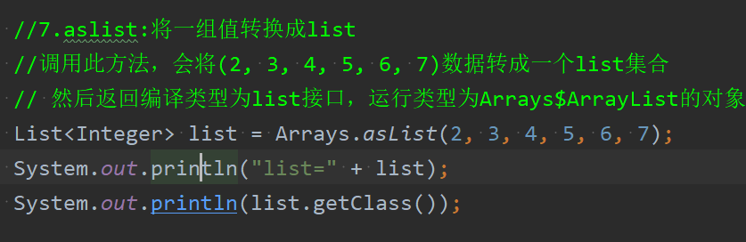
	![[assets/06Arrays类/file-20250523085154773.png]]
