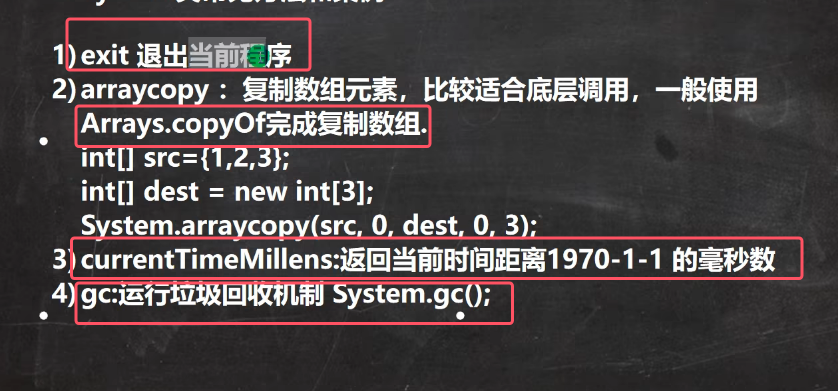
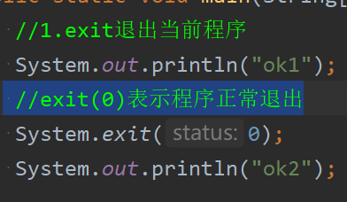
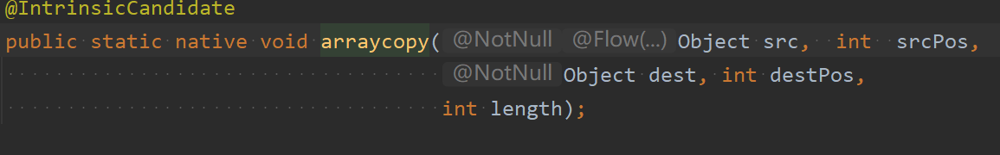
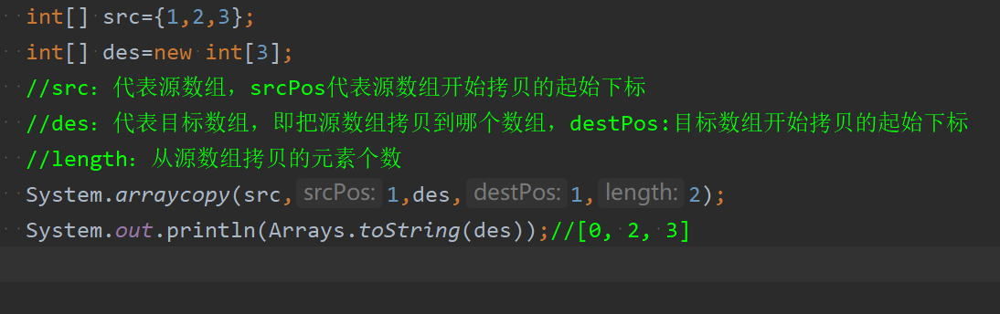
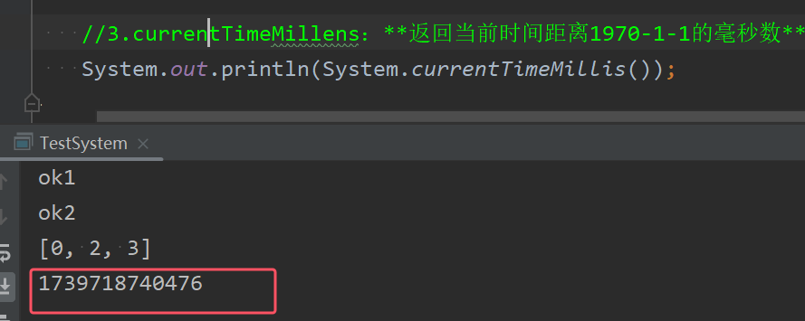

### 1）常见方法

* **注意都是静态方法**
#### 1.exit()方法
* exit退出当前程序
* exit(0)表示程序正常退出

* 图中的ok2并不会输出

#### 2.arrayCopy方法
* 用于复制数组元素，比较适合底层调用，  开发一般不适用，开发一般使用arrays.copyof完成复制数组，其省市县也是调用System.arrayCopy

接口如下图所示

* src：代表源数组，srcPos代表源数组开始拷贝的起始下标，des：代表目标数组，即把源数组拷贝到哪个数组，destPos:目标数组开始拷贝的起始下标 ；length：从源数组拷贝的元素个数

#### 3.currentTimeMillis方法
* **返回当前时间距离1970-1-1的毫秒数**

#### 4.gc()方法
此方法在讲解Object类的finalize()时讲过，详情见[06Object类详解、断点调试和idea快捷键](../02面向对象编程/06Object类详解、断点调试和idea快捷键.md)
