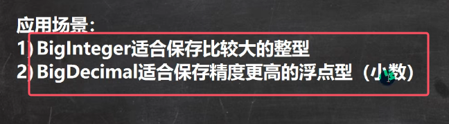
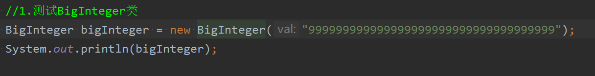
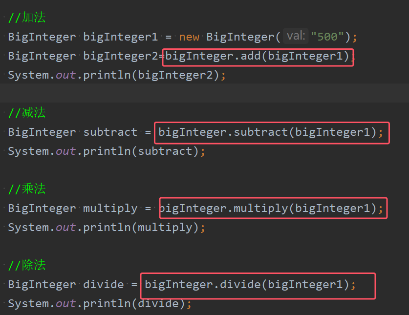
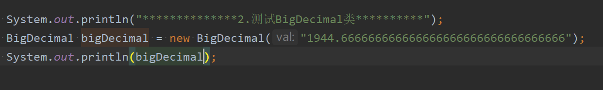
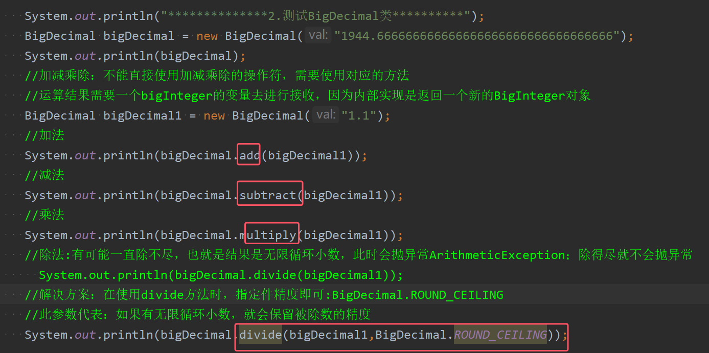

### 1.BigInteger类
在实际开发中，需要处理很大的整数，long已经不够用，这时就可以使用BigInteger类来搞定

* BigInteger类的构造器是接收大数的字符串类型，其内部将其转为数字
* 注意：直接对BigInteger类的实例对象进行输出，此时是直接输出大数数字

使用细节：  
1. **在对BigInteger类的实例对象进行加减乘除的时候，需要使用对应的方法**，不能直接使用加减乘除的操作符
2. 并且传入运算方法的参数也必须是一个BigInteger类的对象
3. 运算结果需要一个bigInteger的变量去进行接收，因为内部实现是返回一个新的BigInteger对象

#### 2.BigDecimal类
在实际开发中，我们需要保存一个精度很高的数，double不够用（能提供 15 到 17 位的十进制有效数字），就需要用到Bigdecimal类

*  BigDecimal类的构造器是同样是接收大数的字符串类型，其内部将其转为数字
* 注意：直接对BigInteger类的实例对象进行输出，此时是直接输出大数数字

使用细节：  
1. **在对BIgDecimal类的实例对象进行加减乘除的时候，需要使用对应的方法**，不能直接使用加减乘除的操作符
2. 并且传入运算方法的参数也必须是一个BigDecimal类的对象
3. 运算结果需要一个BigDecimal的变量去进行接收，因为内部实现是返回一个新的BigDecimalr对象,

* 注意：除法有可能一直除不尽，也就是结果是无限循环小数，此时会抛异常ArithmeticException；除得尽就不会抛异常
* 解决方案：在使用divide方法时，传入第二个参数`BigDecimal.ROUND_CEILING`
* 此参数代表：如果结果是无限循环小数，就会保留被除数的精度

