Java中主要有有三代日期类，接下来将会一一进行讲解

### 1）第一代日期类——Date
Date类是在`java.util`包中，并不是`java.sql`包中

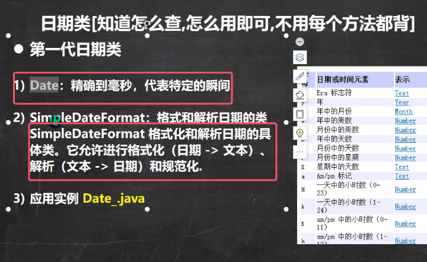

Date类的继承关系如下图所示：

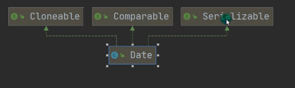

构造器解析  ：

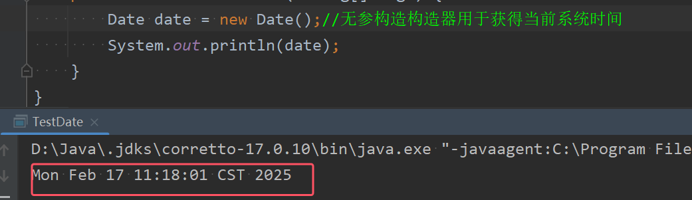
* Date的无参构造器用于获取当前系统时间。
* 从图中可以看到，**默认输出的日期格式按照国外的日期格式显示的，十分不方便，所以经常要对格式进行转换**

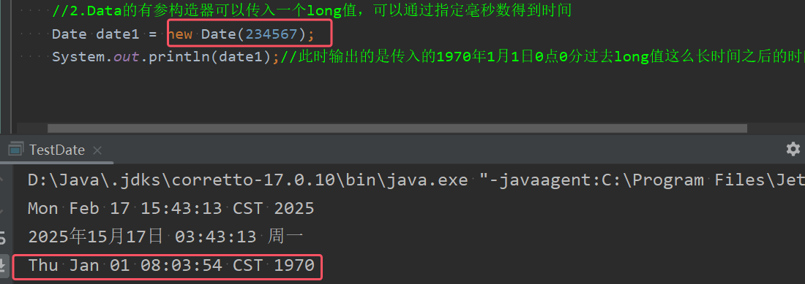
* Date的有参构造器可以传入一个long值，可以通过指定毫秒数得到时间
* 比如图中的例子，输出的就是1970年1月1日0点0分过去234567毫秒之后的时间

###### 应用实例一

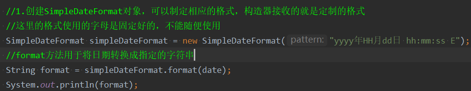
* 创建SimpleDateFormat对象，可以制定相应的格式，构造器接收的就是定制的格式  
* 这里的格式使用的字母是固定好的，不能随便使用，详情如下图所示
	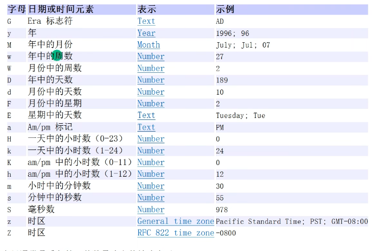
* SimpleDateFormat对象的**format方法用于将日期转换成指定格式的字符串**

###### 应用实例二
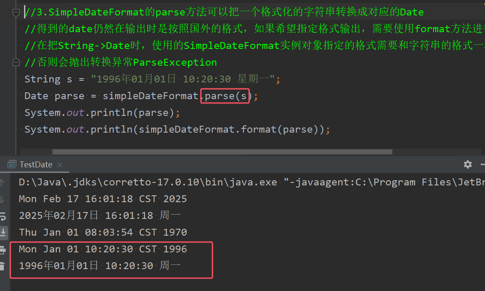
* SimpleDateFormat的**parse方法可以把一个格式化的字符串转换成对应的Date**，得到的date仍然在输出时是按照国外的格式，如果希望指定格式输出，需要使用format方法进行转换
* parse方法时不能直接使用，需要在方法中throws  ParseException才可以使用。因为此异常是编译时异常，必须要显式处理。
* 在把String->Date时，使用的SimpleDateFormat实例对象指定的格式需要和字符串的格式一样  否则会抛出转换异常ParseException

### 2）第二代日期类——Calendar
此类的结构如下图所示

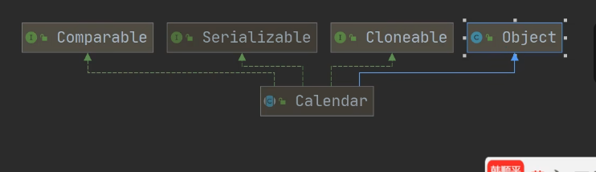

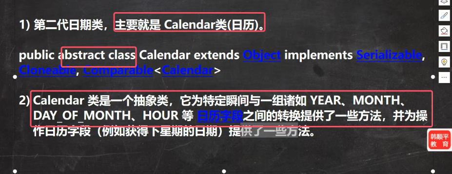

该类的部分字段：

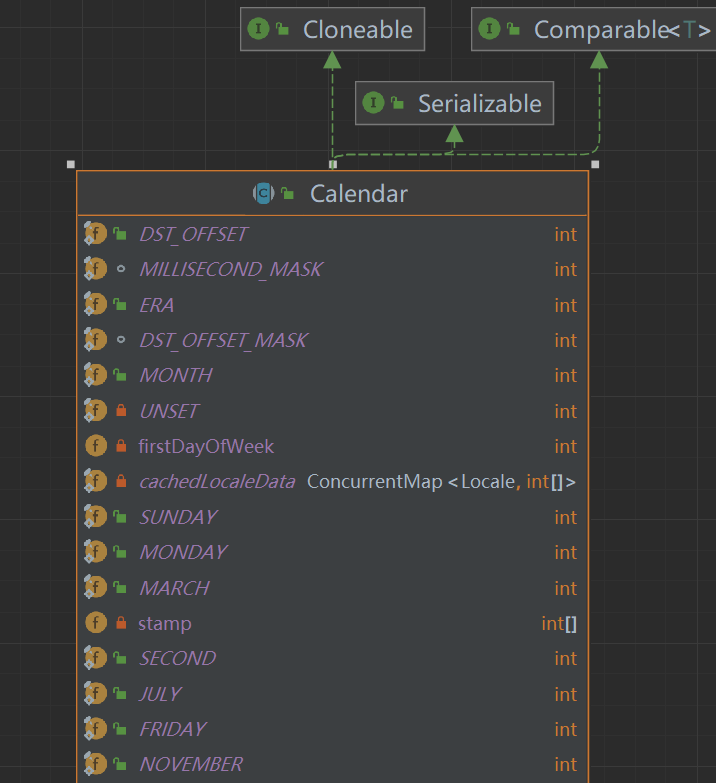

构造器的源码：

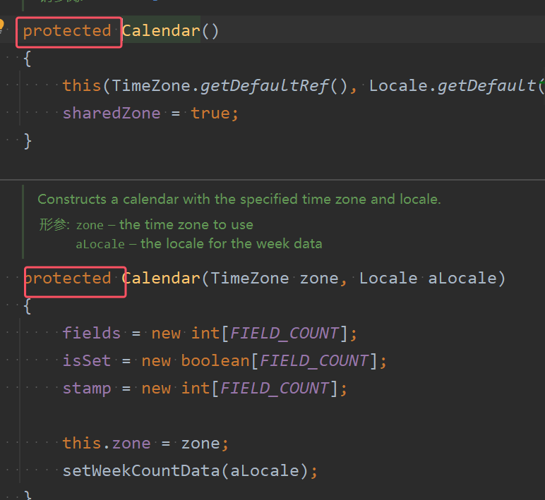

获取实例方法的源码：

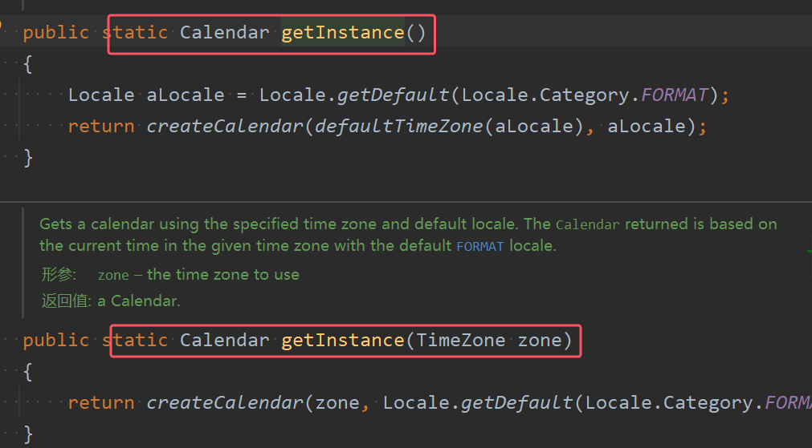
由上面信息可知：  
* **Calendar是一个抽象类，并且构造器是protected，所以没有办法直接通过new来创造Calendar实例，而是通过静态方法getInstance()来获取实例**，类似于单例模式的操作
* 提供了**大量的方法和字段给程序员，并且基本都是静态的**

###### 应用实例

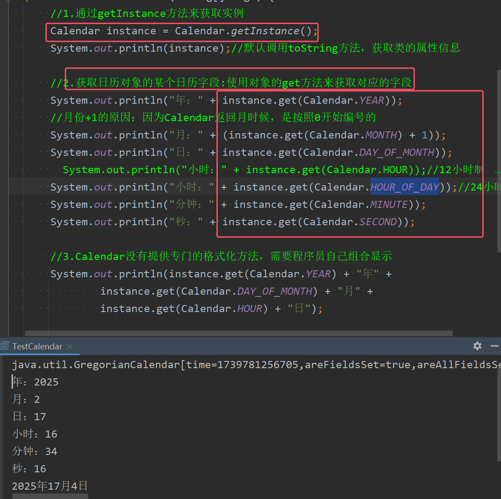
* 获取日历对象的某个日历字段方法：使用对象的get方法来获取对应的字段，不能直接获取字段
* 注意只有月份输出时需要+1。月份+1的原因：因为Calendar返回月时候，是按照0开始编号的
* Calendar没有提供专门的格式化方法，需要程序员自己组合显示
* HOUR获得得是12小时进制的小事。如果需要按照24小时来获取时间，需要获取的字段是`HOUR_OF_DAY`

### 3）第三代日期类——LoacalDate、LocalTime和LocalDateTime类
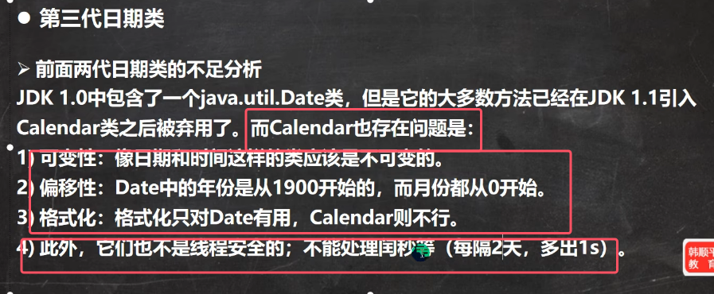

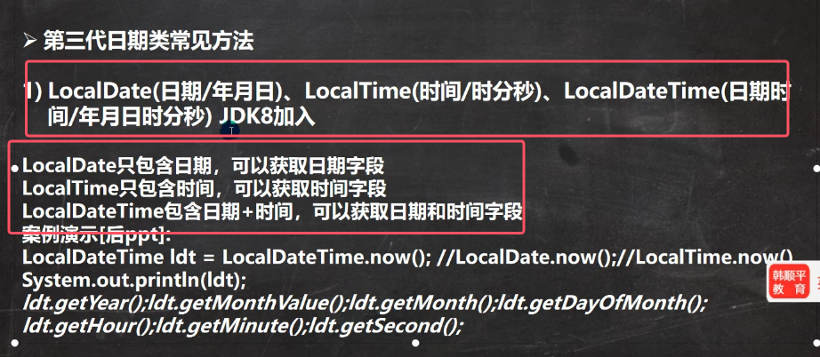
* 日期字段就是只有年月日
* 时间字段就是只有时分秒
* 日期时间就是上述字段都有
* **因为LocalDateTime类日期时间都有，所以实际开放中基本都使用该类**

LocalDateTime类的类继承关系如下图所示

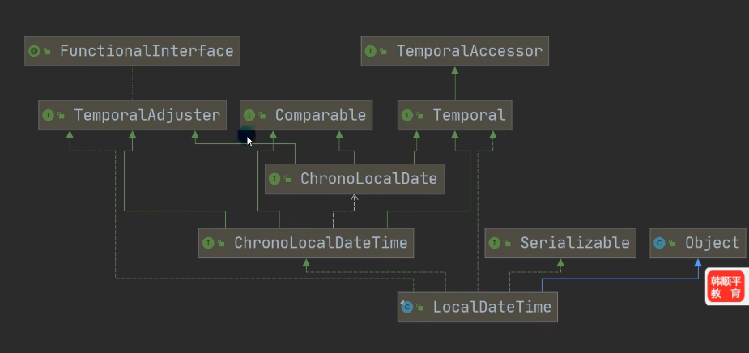

LocalDateTime类的构造方法和主要方法如下图所示

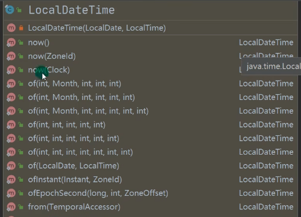

###### 使用实例

1. 可以通过静态方法now()返回表示当前日期时间的对象

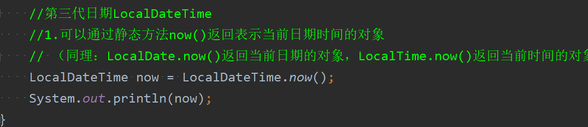

打印结果如下图所示：

 2. 若想得到其中的年月日时分秒等字段，可以使用该类提供了对应的普通方法

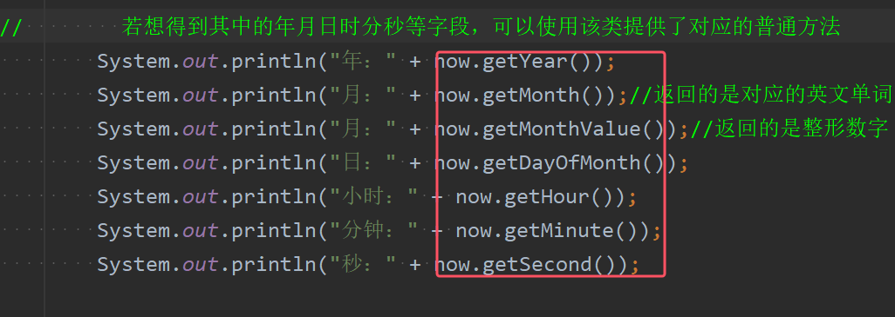
* 注意：`getMonth()`返回的是英文单词，`getMonthValue()`返回的是整形数字

3. 格式化日期，通过DateTimeFormatter类的对象来格式化

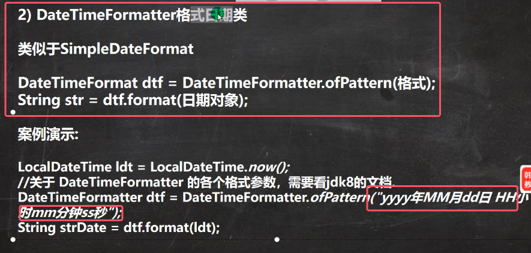
* 这里的格式使用的字母是固定好的，不能随便使用，详情如下图所示

	

使用例子如下图所示：

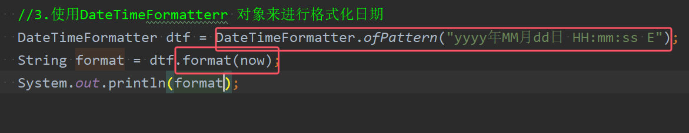
* 使用ofPattern()方法来制定相应的格式
* 通过format方法**用于将日期转换成指定格式的字符串

4. `LocalDateTime` 的 `with` 方法是用于**创建一个新的 `LocalDateTime` 实例**，其中指定的日期时间字段被修改为新值，而原实例保持不变（因为 `LocalDateTime` 是**不可变类**）  
	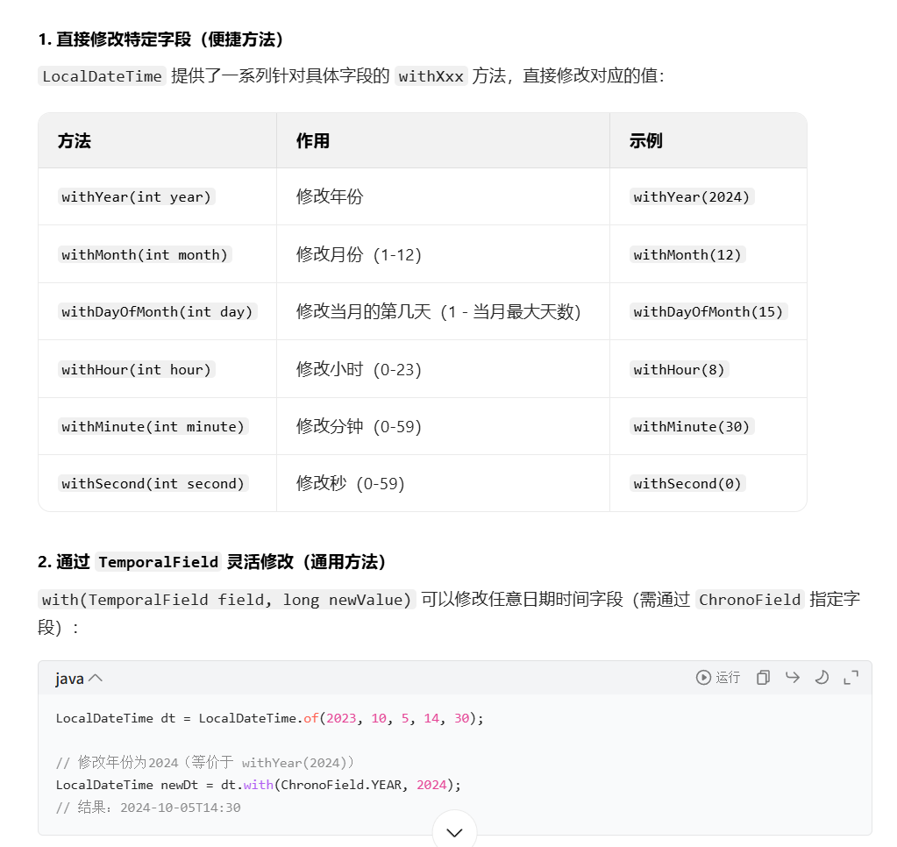

### 3）第三代日期类——Instant
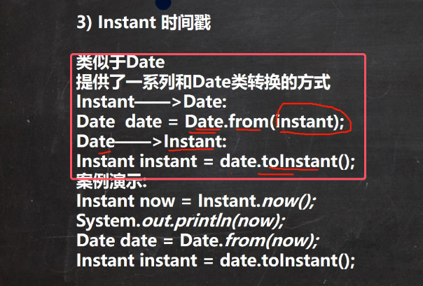

该类的继承关系图如下图所示

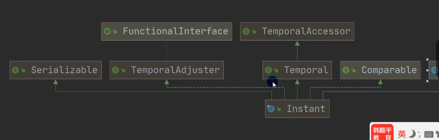

使用实例如下图所示

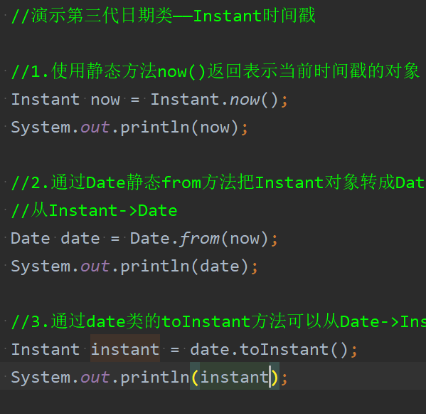

### 5）第三代日期类的更多方法
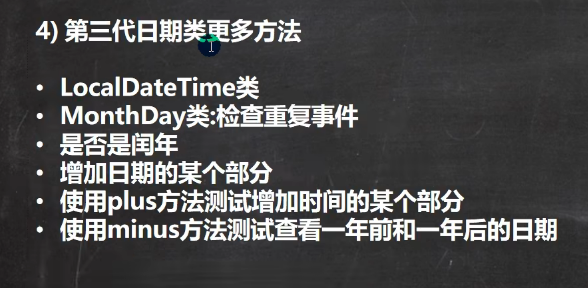

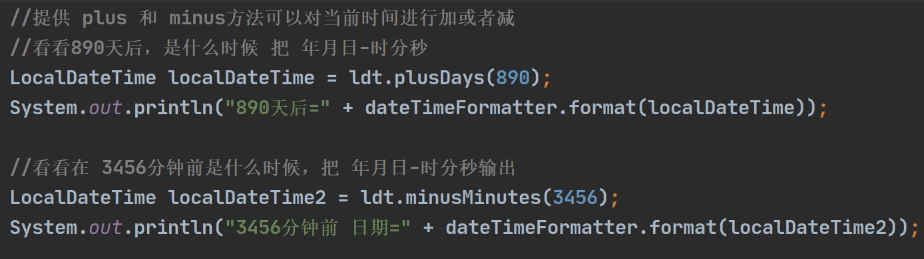