### 1）集合综述

集合的定义如下：

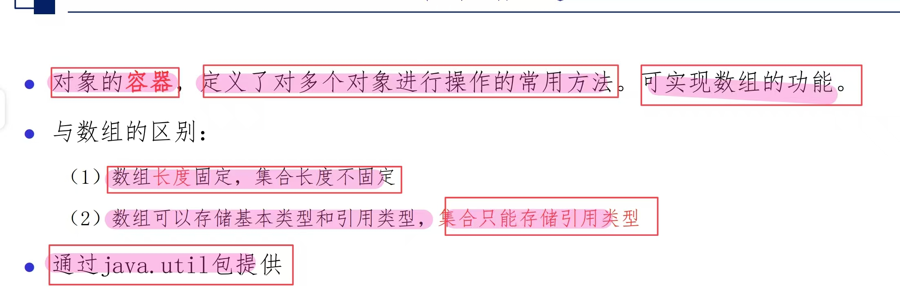

集合的体系框架图如下：

单列集合：  
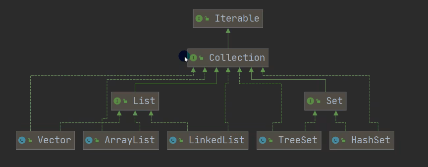
* collection接口有两个重要的子接口，List和Set，他们实现子类都是单列集合
双列集合：  
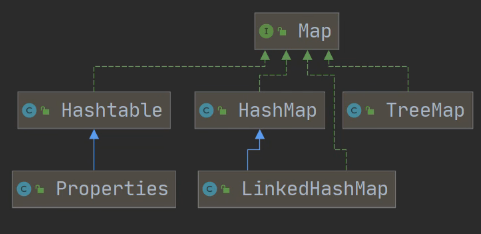
* Map接口实现的子类的都是双列集合，是存放的K-V键值对

### 2）Collection类方法
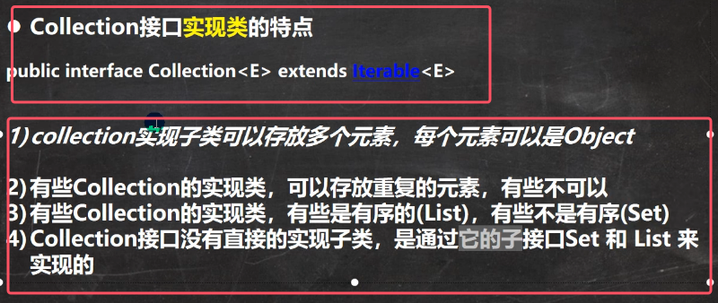

#### 1.Collection常用方法：
由于接口本身是不能被实例化的，所以一实现子类ArrayList来演示Collection常用方法

注意：**只要是实现了collection接口的类都会拥有下列方法**
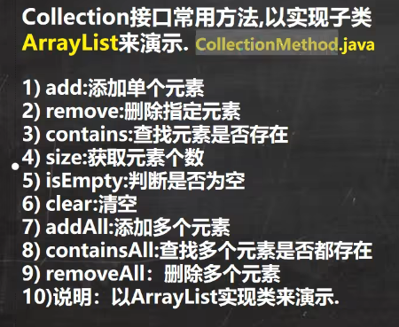
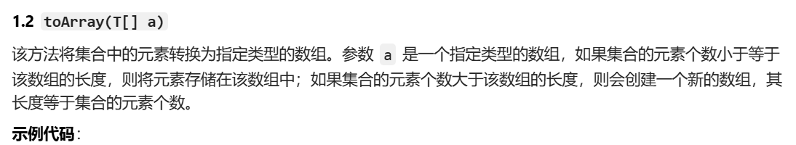
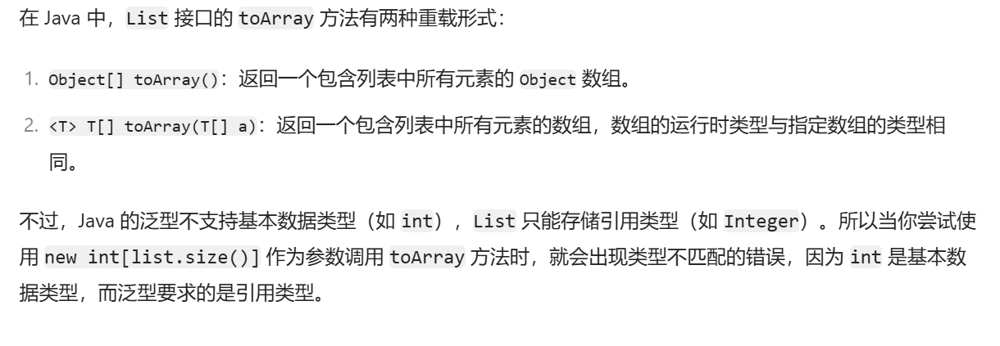
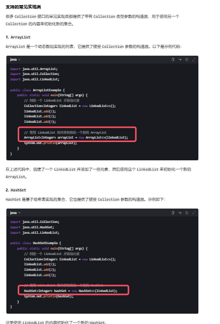
* add添加元素，只要是装的是基本数据类型，他都会有一个自动装箱的过程，因为**集合只能存储引用数据类型**
	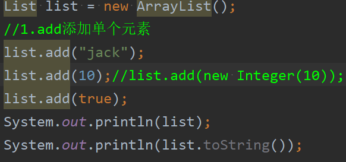

	注：直接打印list，相当于调用了toString方法，用于打印元素信息。
		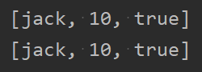
* remove方法时重载的，传入下标时代表删除指定下标的元素，返回的就是被删除的对象；传入对象时代表指定删除某个对象，返回的是boolean值，代表是否删成功
	
	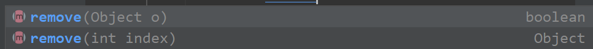
* constains方法用于查找元素是否存在于集合中
	
	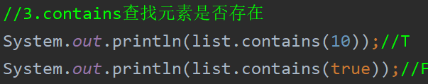
* addAll:添加多个元素,传入一个集合，代表将这个集合中的所有元素都add到调用集合中
	
	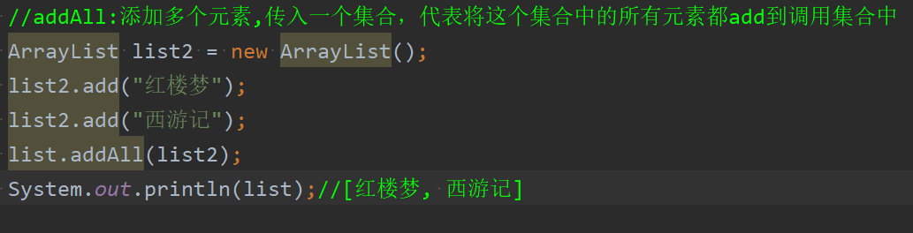
* containAll：查找多个元素是否都存在,同样是传入一个集合，代表查找此集合的元素是否都在调用集合中

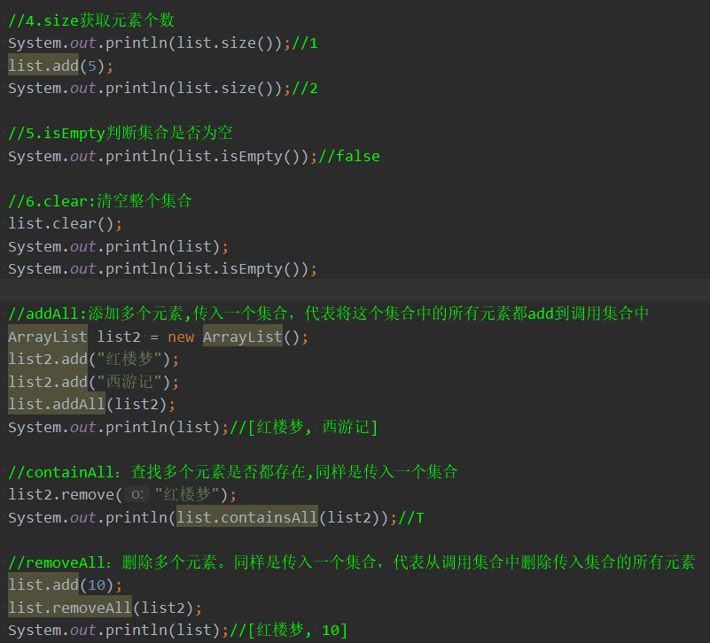

### 3）迭代器

**集合的三种遍历方式：1.普通for循环（只能是由下标的集合）、2.for-each循环、 3.迭代器遍历**

for-each增强for循环前面已经讲过，详情见[07数组和Java内存模型](../01java基础/07数组和Java内存模型.md)

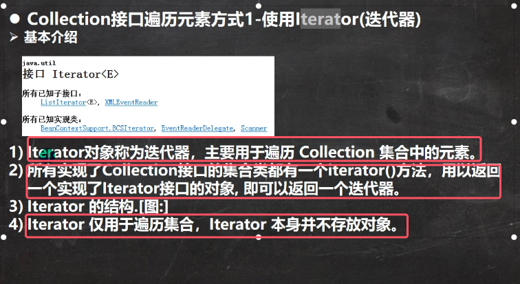
* 注意：**迭代器的由来：所有实现了collection类接口的集合类都有一个iterator方法，用以返回一个实现了Iterator接口的对象，也就是返回了一个迭代器**
* 为什么collection类接口的集合类都有iterator方法？
	因为所有的collection类都实现了接口Iterable，其中有一个方法就是iterator，子类都会去实现它，用于返回一个实现了Iterator接口的对象

	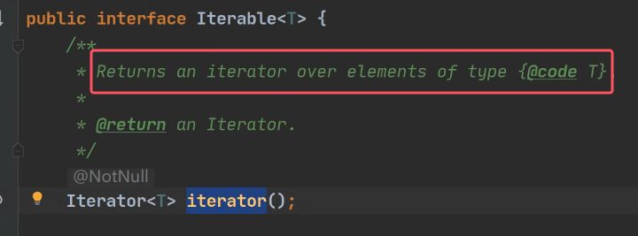

迭代器的执行原理如下：

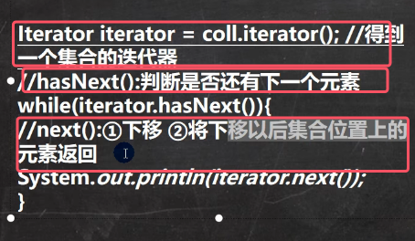

Iterator接口的方法如下：

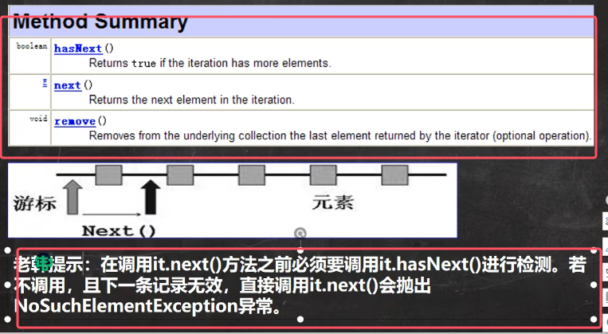
* next()：返回迭代器的下一个元素
* hasNext()用于检测集合中是否还有元素
* remove：将迭代器返回的元素删除

使用实例：

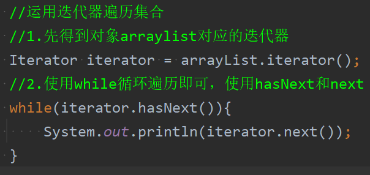
* 先iterator()运用得到对象arraylist对应的迭代器
* 使用while循环遍历即可，使用hasNext和next
* 当退出while循环后，这是iterator迭代器就指向了最后的元素。所以如果在执行next方法，则会报异常
* **如果希望再次遍历，需要重置我们的迭代器**，相当于在执行一遍iterator方法

	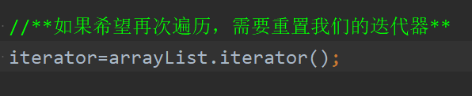