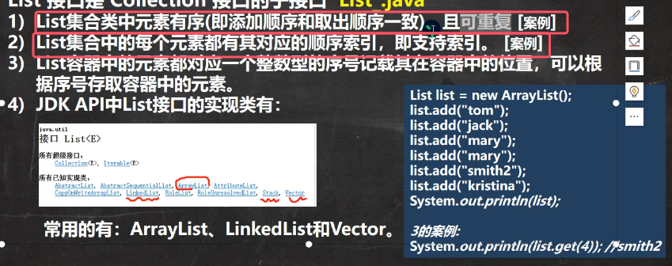
* **总结就是一句话：List接口的实现类都是有序、有下标（从0开始）、元素可以重复、存放顺序和取出顺序一致**

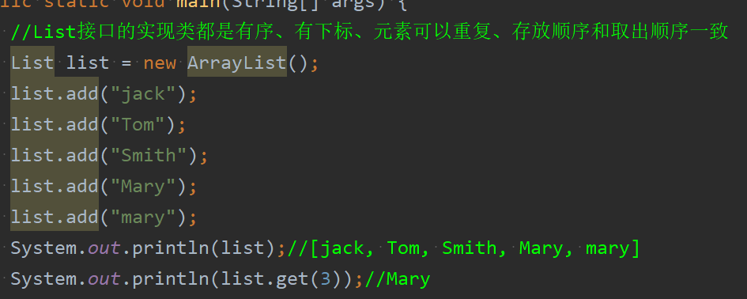

#### 2. List接口常用方法
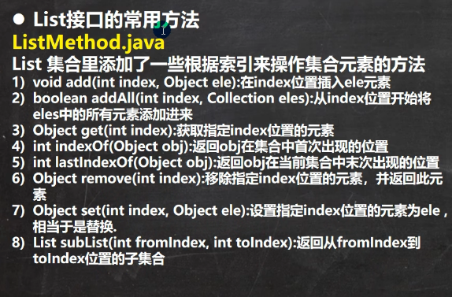
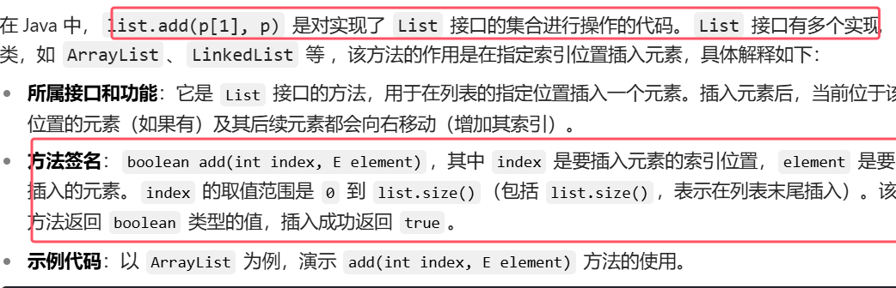
1. add(index,ele):在index位置插入element，后面的元素自动往后移(如果只有ele的话默认插入到末尾位置)
	
	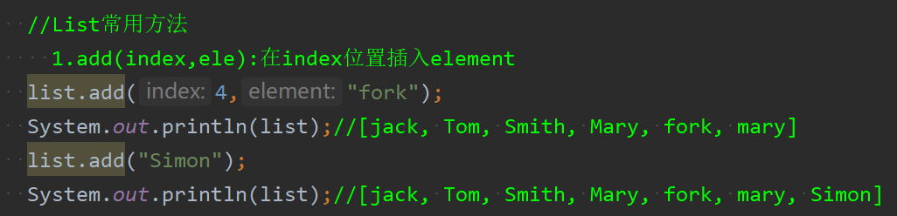
2. boolean addAll(int index,Collection eles):  从index位置开始将eles中所有元素添加进来

	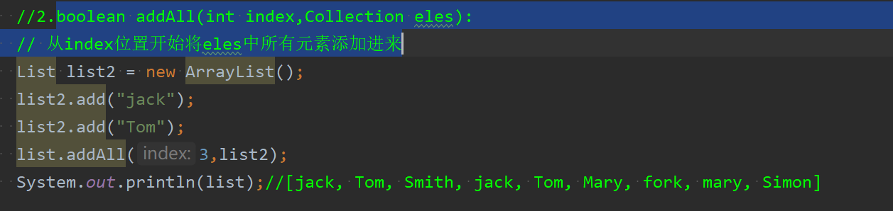
3. Object get(int index):获得指定下标位置的元素

	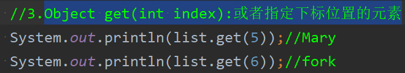
4. remove(int index):删除指定下标的元素 或者remove(object o)：顺序遍历删除第一个找到的元素，而不是删除所谓为o的元素

	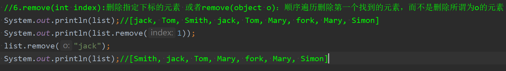
5. Object set(int index,Object ele):将index位置的元素设置为ele，相当于替换
	 
	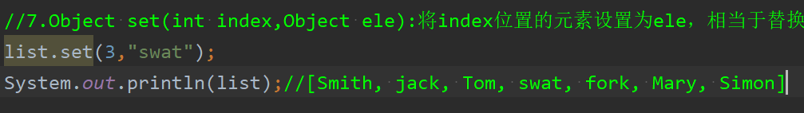
6. List subList(int fromIndex,int toIndex):返回从fromIndex到toIndex位置的子集合，是**左闭右开区间**

	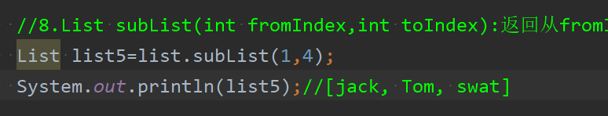

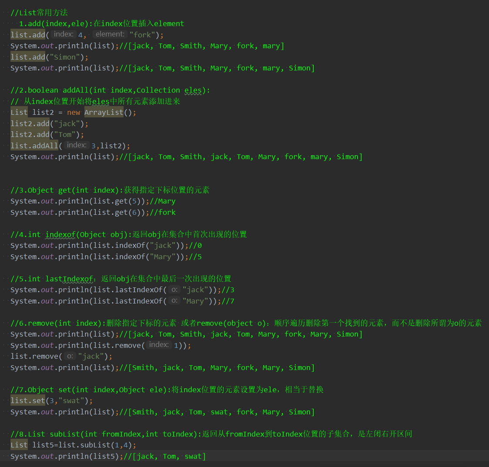

### 3.List的遍历方式
由于List接口的实现类都是有序由下标，且元素可以重复，那么其实现类（包括AttayList、LinkedList和Vector）就可以使用以下三种方式来实现遍历

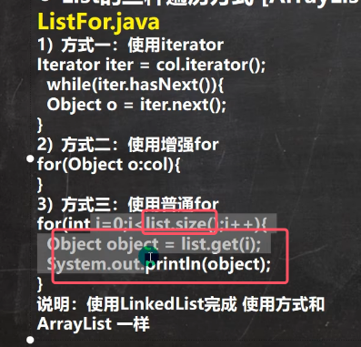