## 1）ArrayList类

### 1.注意事项
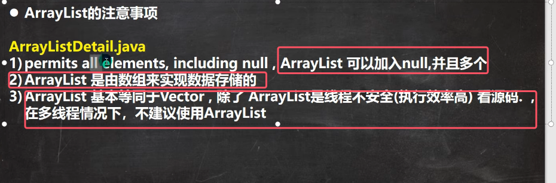
* **ArrayList底层使用数组来实现数据存储**（后面会进行源码分析）
* **ArrayList线程不安全，但效率高**。可以看到下图中方法都没有使用synchronized关键字。剩下的基本等同于Vector

	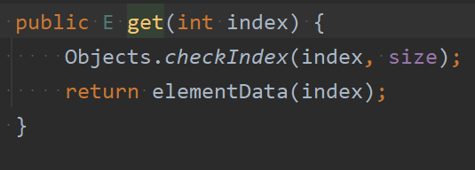
	
* **多线程使用Vector、单线程使用ArrayList**

### 2.底层操作机制
总的操作机制如下图所示：（理解要下面底层源码解析，记忆的话这张图足矣）
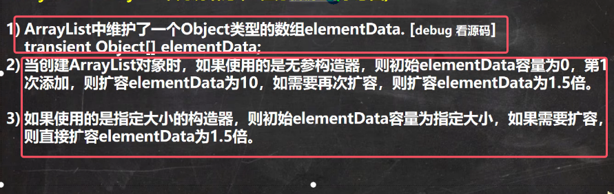
* 其中transient关键字表示对ArrayList对象进行序列化时，该属性会被忽略，不会被序列化

在讲解底层机制之前，先讲解一下ArrayList的构造方法

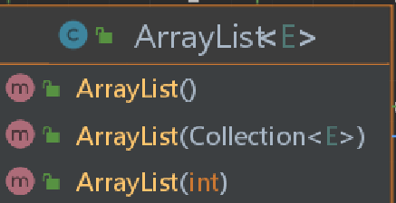
* 如图所示，该类共有3个构造方法，其中第一个和第三个较为常用
* **对于无参构造器，则初始化对象的容量为0**
* **对于有参构造器ArrayList(int)，其代表初始化对象的容量为指定大小**
* **对于有参构造起ArrayList<>(Collection)**，代表使用一个collection接口实现类中的素有元素来初始化该集合

我们将通过对以下代码进行断点调试，来讲解底层操作机制

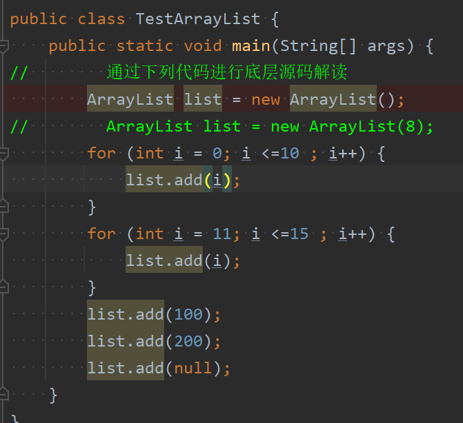

##### 情况1：使用无参构造器创建对象并进行扩容
1. 通过断点调试源源码可以知道，当使用无参构造器new一个ArrayList对象时，会执行以下代码

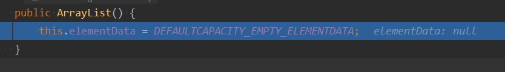
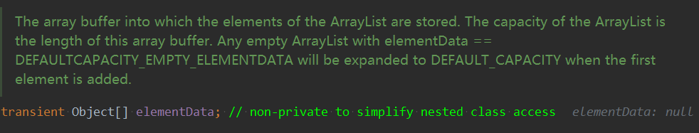
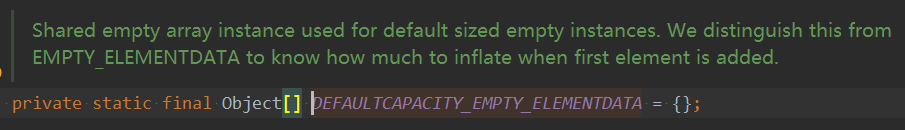
* 从构造器代码块可以看出：**ArrayList底层是维护了一个Object类型的数组elementData，用于存储元素**
* 使用无参构造器创建ArrayList对象，相当于创建了一个空的elementData，也就是说**使用无参构造器时，初始化数组elementData的容量为0**

2. 接下来当执行前十个list.add(i)操作时，将会执行以下代码

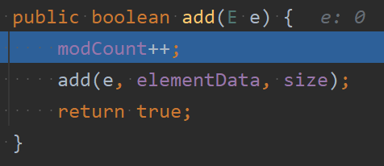
* `modCount` 是一个被声明为 `protected` 的实例变量，它的主要作用是记录 `ArrayList` 结构发生修改的次数，这里的结构修改指的是那些会改变列表大小的操作

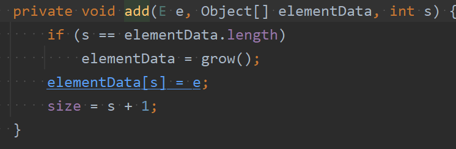
* 通过阅读第二张图片add的源码可以知道：它会先确定元素个数是否等于数组的长度，即**先确定是否要扩容，然后再执行赋值操作，也就是将数据添加到list中**
* 由于size为0，并且element.length为0，所以会进入grow()方法。

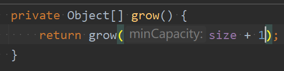
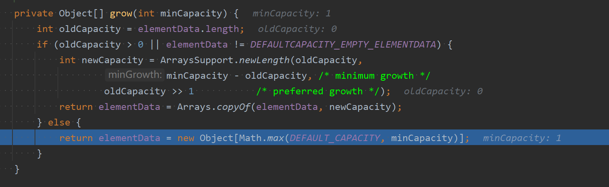
* 从图中可以看出，扩容的核心逻辑都在方法grow()中。接下来我们分析grow方法的业务逻辑
* 对于第一次add来说，他会首先判断当前的容量也就是`elementData.length`是否大于0或者`elementData`是一个空数组，显然此时就是一个空数组，所以会执行else的语句块。那么会返回一个新的Object数组，容量为`Math.max(DEFAULT_CAPACITY, minCapacity)`,其中`DEFAULT_CAPACITY`为10，minCapacity为1（因为size为0，传进来的是size+1）。所以就返回一个容量为10的新的Object数组
* 当第一次扩容完以后，并且还没有执行到第11次扩容时，代码执行到第二层add，由于size不等于`elementData.length`，并不会执行grow()方法，所以并不会扩容，就直接进行后面的赋值操作

3. 接下来执行第11次扩容（i=10）时，将会执行以下代码

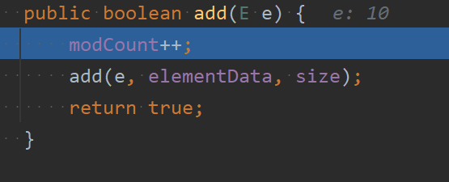
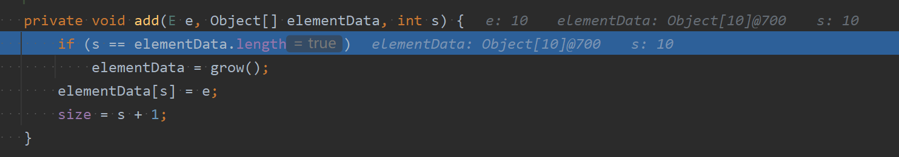

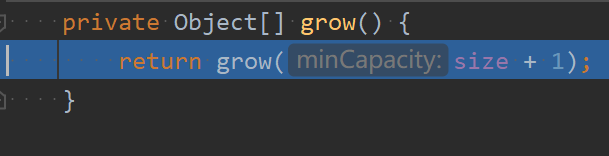
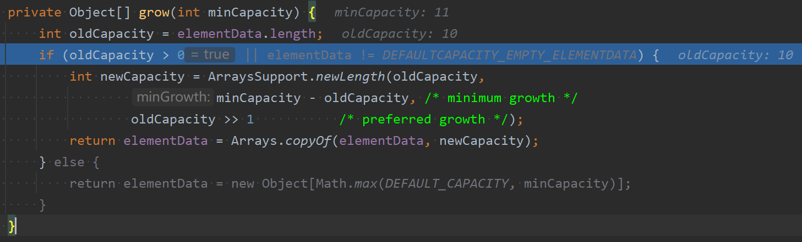
* 此时`elementData.length`=10，所以会进入if语句块。
* `oldCapacity = elementData.length`等于10，进入if语句块后调用`ArraysSupport.newLength()`方法确定新的容量
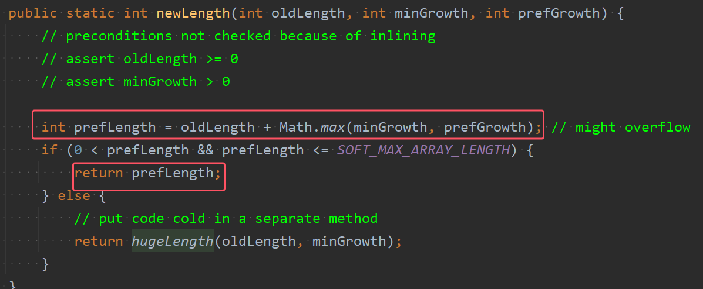
* 可以看出来进入到`ArraysSupport.newLength()`后，就直接确定新的容量为就容量的1.5倍
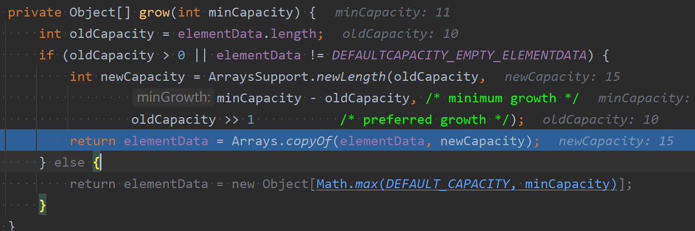
* 之后在调用`Arrays.copyOf()`方法，当使用 `Arrays.copyOf` 方法将数组内容复制到自身，并且指定的新数组长度大于原数组的 `length` 时，`Arrays.copyOf` 方法会创建一个新的、长度为指定值的数组，并将原数组的元素复制到新数组中，从而实现了 “扩容” 的效果

* 对于后面代码的扩容，与上述代码的执行逻辑同理

##### 情况2：使用有参构造器创建对象并进行扩容
我们将通过对以下代码进行断点调试，来讲解底层操作机制

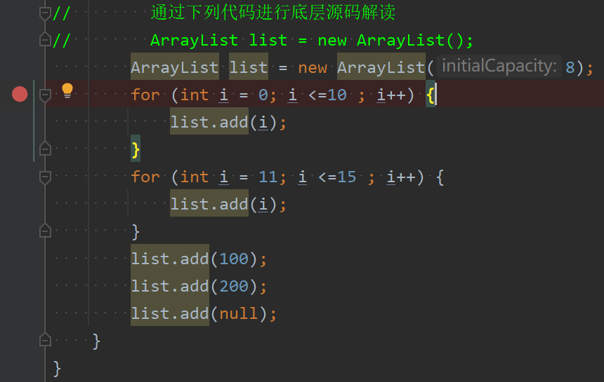

1. 通过断点调试源源码可以知道，当使用无参构造器new一个ArrayList对象时，会执行以下代码

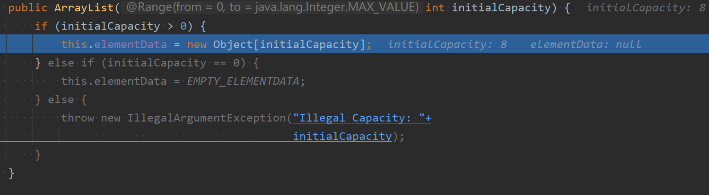
* 从图中可以看出：创建了一个指定大小的`elementData`数组，大小为initialCapacity,也就是说：**对于有参构造器ArrayList(int)，其代表初始化对象的容量为指定大小**

1. 第一次到第八次执行list.add(i)操作时，将会执行以下代码

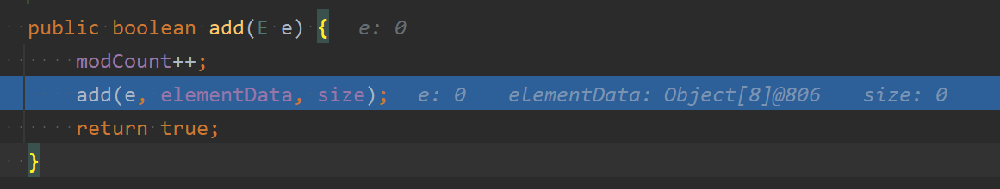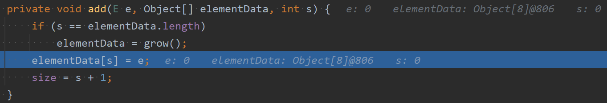
* 由于size为0，并且elementData.length为8，所以不会进入grow()方法。就直接进行后面的赋值操作

2. 第九次执行list.add(i)，将会执行以下代码

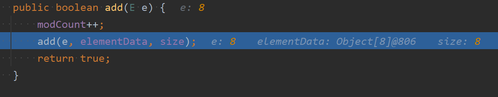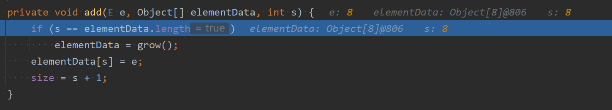
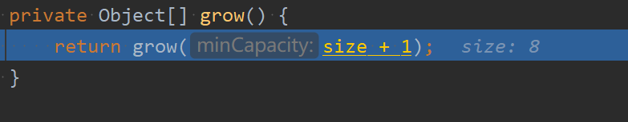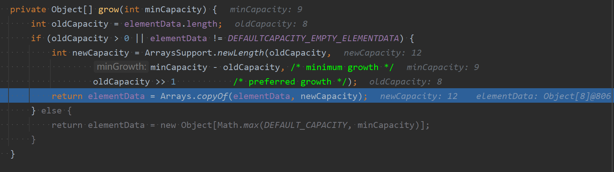
* 可以看出最后newlength同样扩容到了1.5倍，并且用`Arrays.copyOf`方法进行扩容，创建一个新的、长度为12的数组，并将原数组的元素复制到新数组中，从而实现了 “扩容” 的效果
* 所以可以得到结论：**当用有参构造器初始化容量为指定大小后，如果需要扩容，则直接扩容elementData到1.5倍**
* 除了构造器的方法不一样，整个执行的流程与前面一样

## 2）Vector类
### 1.注意事项
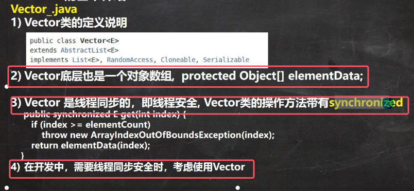

1. 对于第二条我们可以查看源码得知如下

	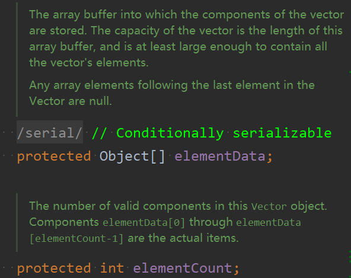

2. 对于第三条和第四条我们可以随便查看一个方法如下图所示：

	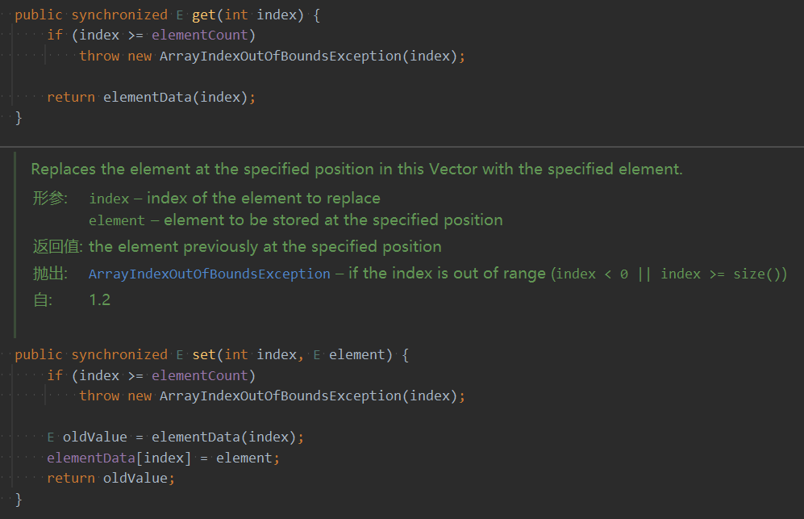

Vector和ArrayList的比较如下图所示（记忆）：

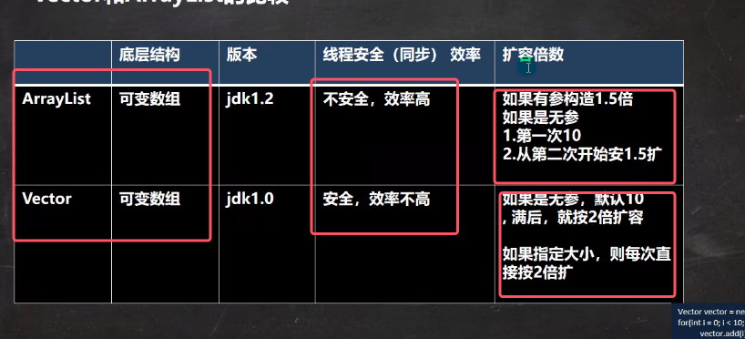

### 2.底层操作机制
**有上面图可知：Vector基本等同于ArrayList，除了一个线程安全与不安全的区别，其他基本一样，包括构造器、方法等**

我们将以下面的代码为例子，来断点调试讲解底层源码

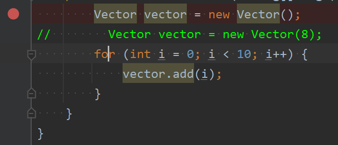

接下来直接上底层源码图，不去进行细致讲解，其中用到的方法和ArrayList大致相同

##### 情况1：使用无参构造器创建对象，并进行扩容
1. 创建对象
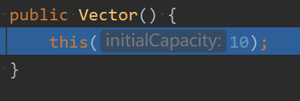
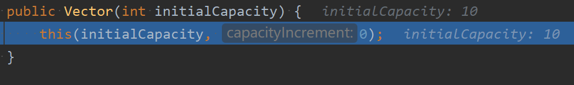
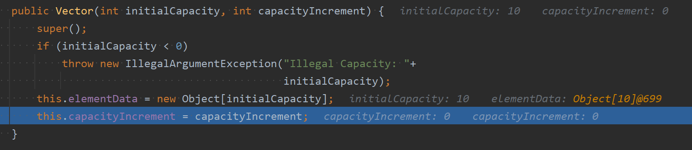
* 从上图可以看出：**当使用无参构造器创建 `Vector` 对象时，它会直接将内部数组的初始容量设置为 10，这与ArrayList不同（初0扩10）**

2. 第一次到第十次进行vector.add

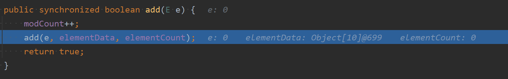
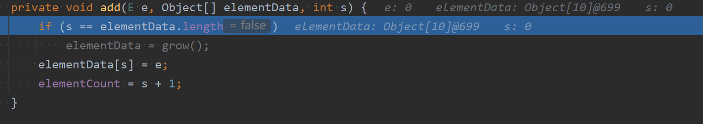
* 第一次到第十次add元素并不会调用grow()方法，也就是

3. 第11次进行vector.add

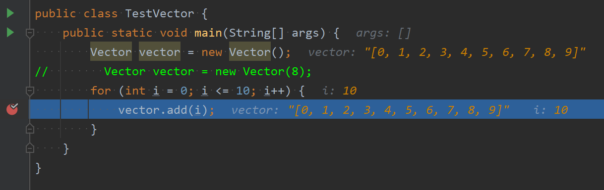
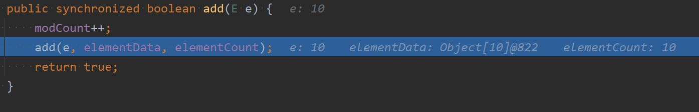
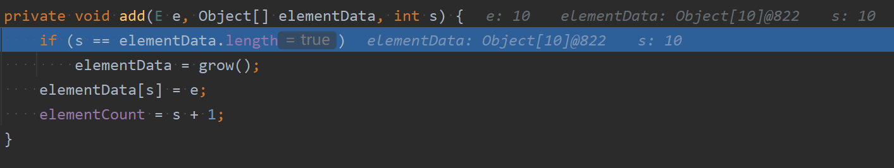
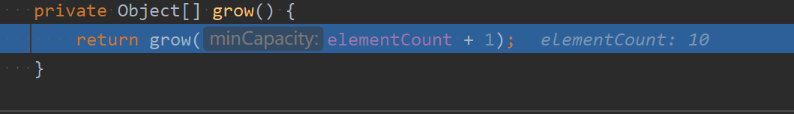
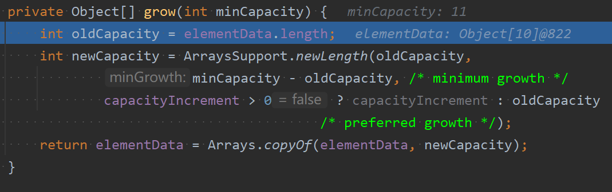
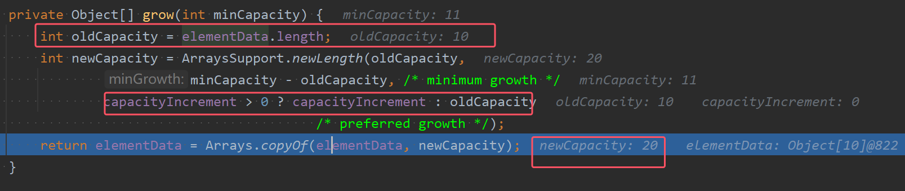
* 可以发现：此时的capacityIncrement是oldCapacity，那么就可以说明：**Vector容量满后，每次都是扩容2倍**

#### 情况2：使用有参构造器创建对象并进行扩容
根据ArrayList可知：使用有参构造器创建对象并进行扩容，除了构造器的方法不一样，整个执行的流程与前面一样，所以此处只讲解构造方法的底层源码，后面同上。

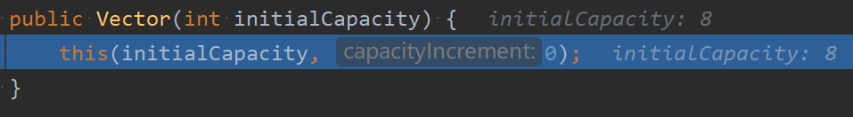
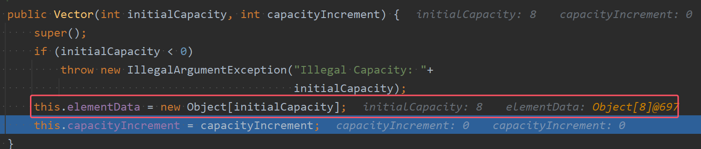

## 3)LinkedList类
### 1.注意事项
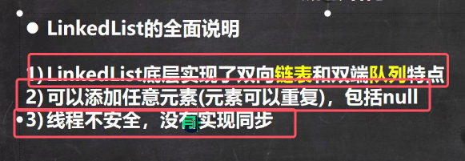
* **注意LinkedList线程不安全**
* **底层的数据结构是双向链表**

### 2.底层操作机制
#### （1）补充：java模拟一个双向链表，代码如下图所示：

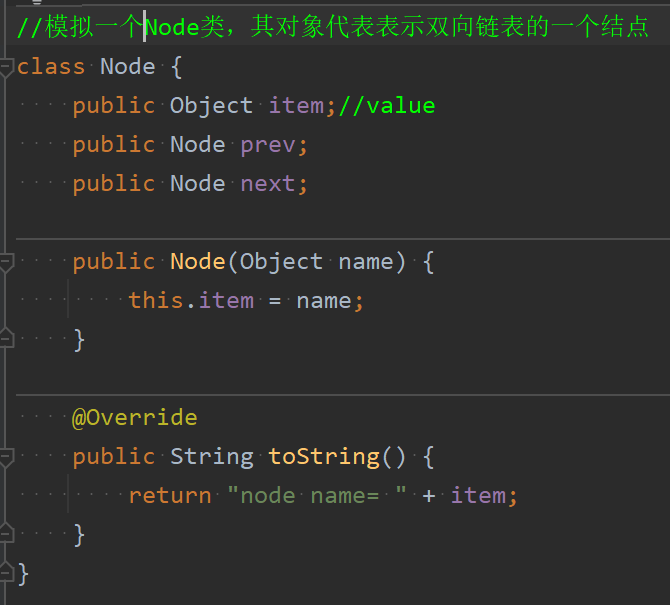
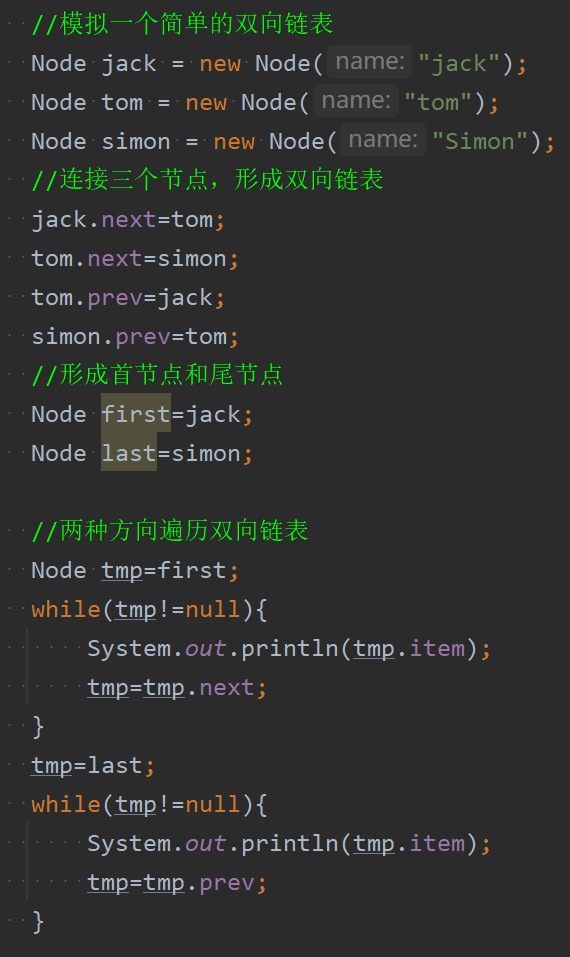

#### （2）底层操作机制
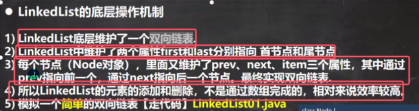
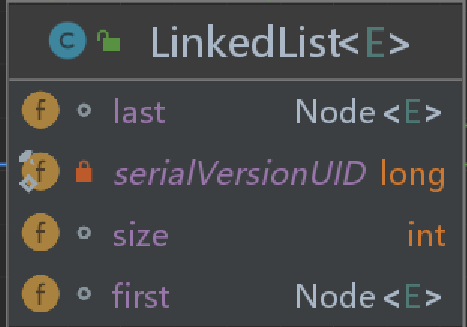
* 阅读底层代码可知，LinkedList类其中有两个属性，first用于指向底层维护链表的首节点；last指向尾节点
* 属性size记录当前链表内有多少个元素
* Node类是一个内部类，是一个用于表示节点的内部类

接下来通过以下列代码为例子进行断点调试，对底层源码进行讲解

1. 当创建一个LinkedList类的对象，调用无参构造器时的底层源码如下图所示：

	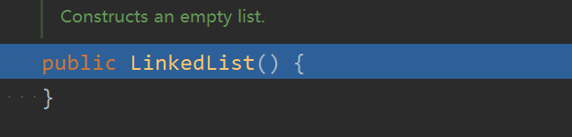
	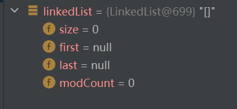
	* 此无参构造器相当于创建了一个空的LinkedList，其属性first、last都为null

2. 当第一次调用add方法时的底层源码如下所示

	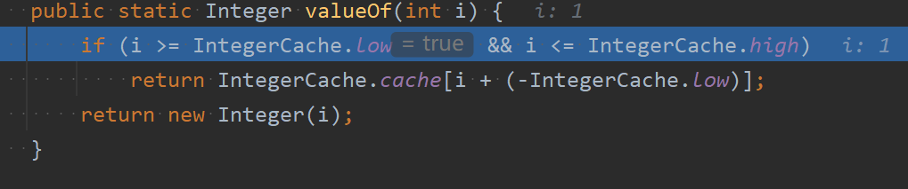
	* 先对1进行自动装箱
	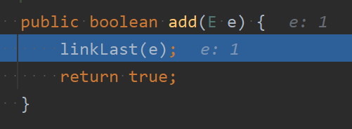
	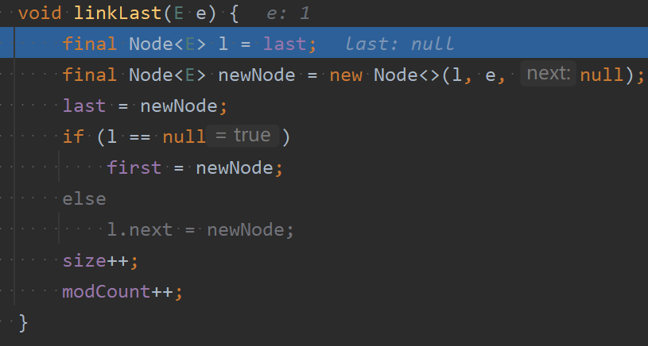
	*  将新的结点，加入到双向链表的最后，此时last和first都指向新节点newNode

3. 当第二次调用add方法时的底层源码如下所示：与上述执行的代码一致，只有linkLast有区别

	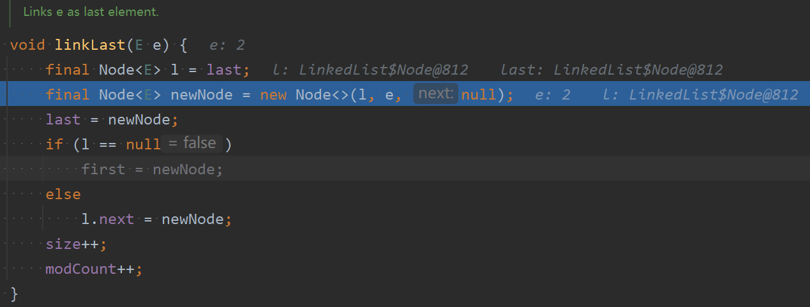

### 4）ArrayList和LinkedList作比较
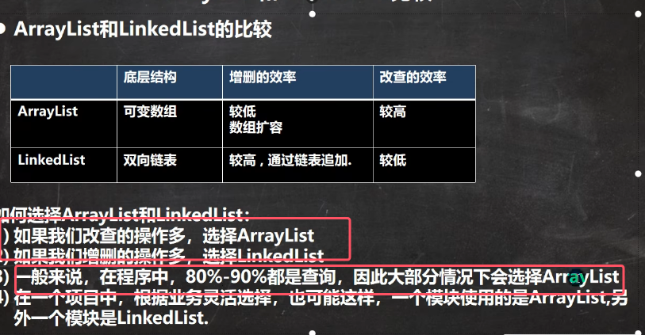
* 注意：**ArrayList和LinkedList都是线程不安全的**