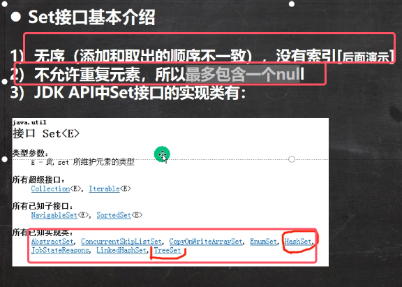
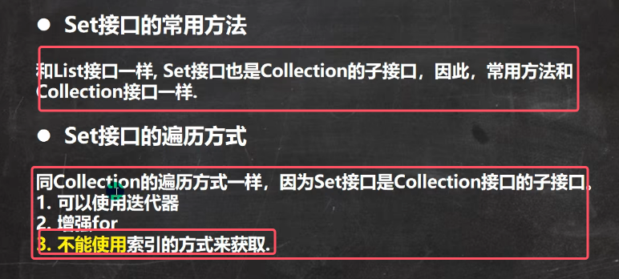

* set的所有实现类为**无序、无下标、无重复元素**
* Set接口的所有实现类都可以存放null，但最多只能存放一个null

* Set接口是Collection的子接口，因为**常用方法与collection接口一样**
* 由于Set接口的实现类都无下标，所以不能使用普通for+索引的方式来实现（也就是没有get方法）

以下面代码为例测试常用方法add，得到如下结果

从结果可以得到如下结论：
1. set接口的实现类对象(Set接口对象)，**不能存放重复的元素，可以添加一个null**（重复添加多个虽然不会报错，但是内内部并没有添加成功）
2. set接口对象存放的数据是无序的（**添加顺序和去除顺序不一致**）
3. 注意：**取出的顺序虽然不是添加的顺序，但是取出的顺序是固定的**
4. **set接口对象只能使用迭代器遍历和增强for遍历**
