## 1）HashSet
### 1.HashSet综述

* 对于第二点，经过调试其构造器创建过程发现其构造器内容如下，也就是底层是HashMap

	
	
* 对于第三代和第五点，这与Set接口是一样的，因为HashSet为Set接口的实现类
* 对于第四点，不保证存放元素的顺序与取出顺序不一致（Set也说过）

###  2.对于不能有重复元素的深入理解
说明：对于add方法，执行后会返回一个boolean值。如果添加成功，返回true，否则返回false


下面采用例题的形式进行逐层深入讲解


那么对于例一如下图，就会有以下结果


* 注意：Set的实现类的存放元素的顺序与取出顺序不一致

答案：依据在第3部分阅读底层代码详解的最后。此处有一个false是因为，两个john的指向的地址相同，都指向常量池。**`String` 类的 `hashCode()` 方法重写了Object类的`hashCode()` 方法，计算的是字符串内容的哈希码，而不是字符串对象地址的哈希码**。所以由于二者字符串内容相同，所以hashcode()方法得到的值也相同，hash()方法调用完得到的值相同，并且由于二者指向同一地址，所以key值也相同，所以是重复元素


例2：


* 输出结果如图中所示

答案：依据在第3部分阅读底层代码详解的最后。此处两个都ok是因为：首先两个Dog是两个不同的对象，所以指向的地址首先不同。由于Dog类并未重写hashcode()方法和equals()方法，所以二者hash()方法得到的值不同（碰撞概率很小，就算恰巧相同，那么由于二者不是相同对象也会判断为假），所以不是重复元素。


例3：


* 按照例2的逻辑，创建两个新的对象应该都能加进去，但此处却又加入不了
* 这取决于add的底层代码是怎么加入的（也就是是如何定重复元素的），后面会讲解底层代码，讲解完底层代码以后就会明白此处。
* 详情见add的底层实现（后面讲）

答案：依据在第3部分阅读底层代码详解的最后。此处不能加入是因为：首先这两个对象在堆中的地址是不同的，但是它们两个的属性value指向的常量池中的地址是相同的。**`String` 类的 `hashCode()` 方法重写了Object类的`hashCode()` 方法，计算的是字符串内容的哈希码，而不是字符串对象地址的哈希码**。所以由于二者字符串内容相同，所以hashcode()方法得到的值也相同，hash()方法调用完得到的值相同。虽然二者的key值不相同，也就是不是同一对象，但是由于 **`String` 类的 `equals()` 方法重写了Object类的`equals()` 方法，判断的是字符串内容是否相等**。所以由于二者字符串内容相同，那么最终也会被判为重复元素

### 3.HashSet的底层结构模拟
之前我们分析出HashSet的底层是HashMap，所以接下来会通过讲解HashMap的底层结构，这样就相当于知道啦HashSet的底层结构

**HashMap底层是：数组+链表+红黑树**（记住这句话，后面底层代码分析会讲如何运作）


接下来以上图为例子模拟一个HashMap的底层结构


### 4.HashSet的底层结构和操作机制讲解
以HashSet的添加元素方法add为例子来讲解HashMap的底层结构和操作机制

**添加元素的方法的步骤如下图所示**（记忆的话下图就够）


*  **注意：euqals方法到底按什么标准来比较，也就是没有重写情况下是比较的对象地址是否相等，重写后比较内容是否相等，这是程序员可以控制的*
* **注意：此处树化的超过8是包括8的**
* 总结就是hash()来得到索引值，然后使用equals方法进行比较，如果元素过多就会进行树化


接下来通过上图源代码对HashMap的底层结构和操作机制进行详细讲解

###### 执行第一个add语句：`set.add("java");`


* 在执行第一个add语句之前，首先调用构造器创建了一个HashSet，就相当于创建了一个HashMap，其中map是HashSet中的属性


* add方法内部会执行HashMap的put方法


* 此put方法的key，其实就是add方法中的e，也就是`"java"`。
* 而value就是add方法中传进来的`PRESENT`，这个`PRESENT`没有什么意义，只是起到占位的作用。`PRESENT`是一个静态的，是类共享的，也就是说，不管map执行多少次put，这个key是变化的，但是value是固定不变的，起到占位的作用
* 该put方法会执行hash(key)得到key的对应hash值
* 该方法求key对应的hash值的逻辑主要是以下语句：`(h = key.hashCode()) ^ (h >>> 16)`，首先求出传入值的hashcode，然后再与让其与hashcode无符号右移16位的接过进行异或，这是为了避免哈希碰撞


* 说明：其中的`table`就是HashMap的属性，是放Node结点的数组table
```java
if ((tab = table) == null || (n = tab.length) == 0)  
	n = (tab = resize()).length;
```
* 此时让tab指向数组table，它没用进行任何操作默认初始化为空，会执行resize()方法
* 通过下面的resize方法的分析，可以得知如果当前table时null，或者table的大小为0，那么就会通过resize方法扩容到16个空间，此处会这么去做。

```java
if ((p = tab[i = (n - 1) & hash]) == null)  
	tab[i] = newNode(hash, key, value, null);
```
* 上面代码块中的代码首先计算key对应的hash值应该存放在table表的哪个索引位置存放，然后赋值给p。并且判断如果p是否为空。
* 如果为空，代表此处没有存放元素，就创建一个node存放在此处，该node存放着该元素的hash值、key（也就是存放的内容，此处为“java”）、value(都是PRESENT)和next（指向下一个node的指针，默认为null）。此处第一次执行add，肯定为空所以执行此代码块，并存放在tab\[3]中
* 那么下面else的代码块也就不执行

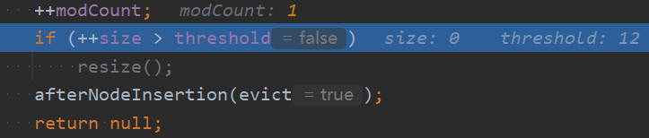
```java
if (++size > threshold)  
	resize();
afterNodeInsertion(evict);
```
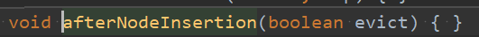
* 在放入元素后判断是否需要扩容，如果需要扩容那么就调用resize进行扩容
* `afterNodeInsertion(evict)`方法是HashMap留给其子类（比如LinkedHashMap）去重写实现一些动作（比如形成一个有序的链表等）的。对于HashMap，该方法方法体为空，什么都没干
* 此处putVal返回空给put方法，那么put方法也会返回给add方法，用于在add方法中判断。也就是如果返回null，则代表add成功，返回true；如果没返回null，则返回false


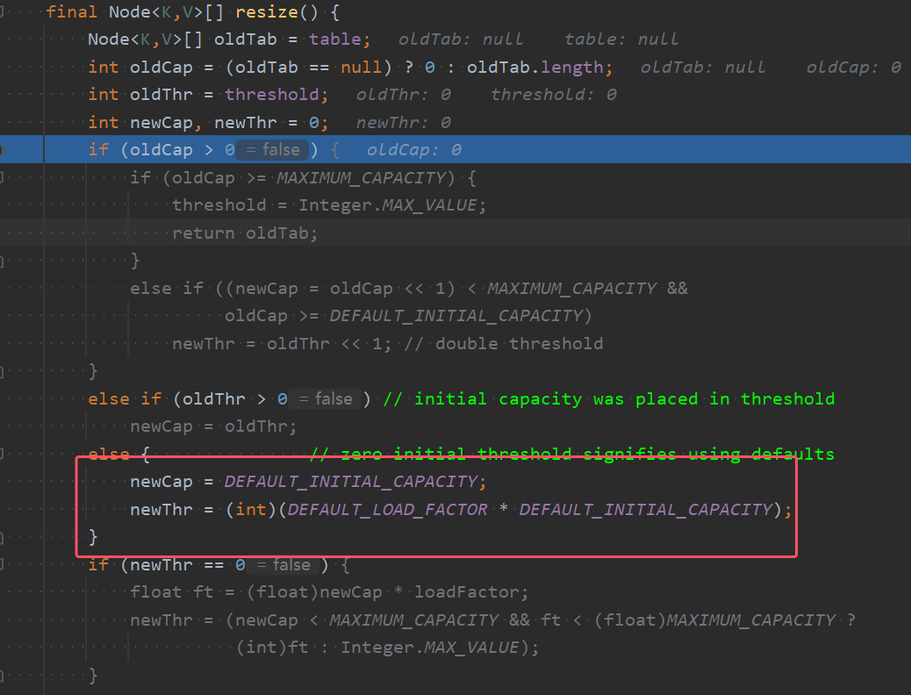
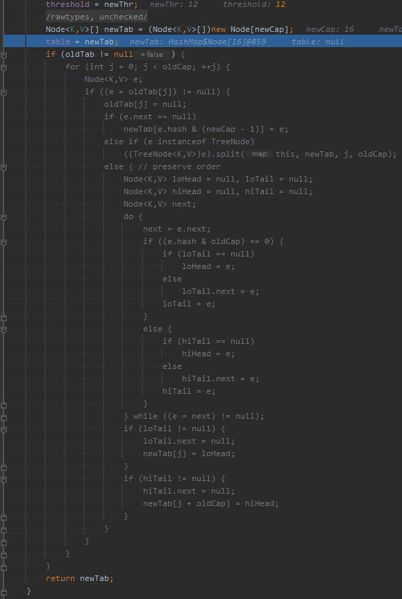
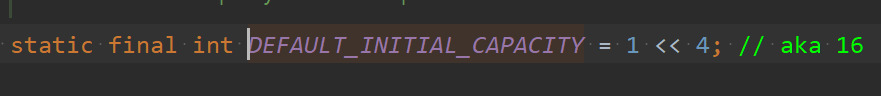
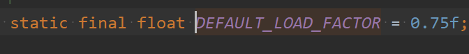
* `DEFAULT_INITIAL_CAPACITY`为默认的初始容量，为16
* `DEFAULT_LOAD_FACTOR`为默认的缩放因子，为0.75
* HashMap类中的属性`threshold` 表示哈希表进行扩容操作的阈值。当哈希表中的元素数量达到这个阈值时，就会触发哈希表的扩容操作（resize），以保证哈希表的性能。
* 图中的新容量为16，新阈值为16\*0.75=12
* 暗处代码的主要作用为：通过扩容可以重新分配元素，减少哈希冲突。使得每个链表下的元素少于8个
* 暗处代码第一次执行add时不会执行，会直接返回newTab。


###### 执行第二个add语句：`set.add("php");`

* add方法内部会执行HashMap的put方法


* 此put方法的key，其实就是add方法中的e，也就是`"php"`
* 此处的hash()方法的内容在第一个语句已经详细讲过，此处就不在赘述，直接看`putval`的业务逻辑


* 说明：其中的`table`就是HashMap的属性，是放Node结点的数组table
```java
if ((tab = table) == null || (n = tab.length) == 0)  
	n = (tab = resize()).length;
```
* 此处table已经进行了扩容并且已经存了元素，所以并不会进行执行resize()方法

```java
if ((p = tab[i = (n - 1) & hash]) == null)  
	tab[i] = newNode(hash, key, value, null);
```
* 此处经过计算，得到i=9，tab\[9]为空，代表此处没有存放元素，就创建一个node存放在此处，该node存放着该元素的hash值、key（也就是存放的内容，此处为“java”）、value(都是PRESENT)和next（指向下一个node的指针，默认为null）。此处会将该元素放入tab\[9]
* 那么下面else的代码块也就不执行


```java
if (++size > threshold)  
	resize();
afterNodeInsertion(evict);
```

* 此处size为2，未超过12，也不需要扩容。
* `afterNodeInsertion(evict)`方法是HashMap留给其子类（比如LinkedHashMap）去重写实现一些动作（比如形成一个有序的链表等）的。对于HashMap，该方法方法体为空，什么都没干
* 此处putVal返回空给put方法，那么put方法也会返回给add方法，用于在add方法中判断。也就是如果返回null，则代表add成功，返回true；如果没返回null，则返回false


###### 执行第三个add语句：`set.add("java");`


* add方法内部会执行HashMap的put方法

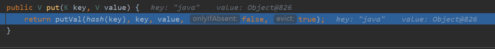
* 此put方法的key，其实就是add方法中的e，也就是`"java"`
* 此处的hash()方法的内容在第一个语句已经详细讲过，此处就不在赘述，直接看`putval`的业务逻辑


* 说明：其中的`table`就是HashMap的属性，是放Node结点的数组table
```java
if ((tab = table) == null || (n = tab.length) == 0)  
	n = (tab = resize()).length;
```
* 此处table已经进行了扩容并且已经存了元素，所以并不会进行执行resize()方法

```java
if ((p = tab[i = (n - 1) & hash]) == null)  
	tab[i] = newNode(hash, key, value, null);
```
* 此处经过计算，由于key值与第一次添加的相同，也就是`java`。并且hash()方法的计算方法并没有发生改变，所以计算出来的hash值与第一次添加的hash值相同，所以`i = (n - 1) & hash]`算出来i的值都相同，为3。
* 那么此时p也就是tab\[3]肯定不会空，所以if条件不成立，会执行下面的else语句块


* 上图为else语句块的所有内容，接下来对上图中的所有内容进行一一讲解
```java
if (p.hash == hash &&  ((k = p.key) == key || (key != null && key.equals(k))))  
	e = p;
```
* 对于上图中的if语句的判断条件的解读：`p.hash == hash`是如果当前索引位置对应的链表的第一个元素和准备添加的key的hash值一样，并且`((k = p.key) == key || (key != null && key.equals(k)))`也就是满足下面两个条件之一，这样总的逻辑表达式的结果就为true：
	1. 准备加入的key和 p 指向的Node结点的key是同一个对象
	2. p指向的node结点的中的key的equals() 和准备加入的key比较后相同（**这里equals()方法的具体实现依赖与key对象的类是否重写了euqals方法，也就是equals()方法动态绑定了key**）

```java
else if (p instanceof TreeNode)  
	e = ((TreeNode<K,V>)p).putTreeVal(this, tab, hash, key, value);
```
* 对于上图中else if语句的判断条件的解读：如果p是一颗红黑，那么此时p就是这颗红黑树的根节点。就调用putTreeVal()方法来继续在红黑树中，进行添加元素（并判断是否可以添加）

```java
else {  
	for (int binCount = 0; ; ++binCount) {  
		if ((e = p.next) == null) {  
			p.next = newNode(hash, key, value, null);  
			if (binCount >= TREEIFY_THRESHOLD - 1) // -1 for 1st  
				treeifyBin(tab, hash);  
			break;  
		}  
		if (e.hash == hash && ((k = e.key) == key || (key != null && key.equals(k))))  
			break;  
		p = e;  
	}  
}
```
* 当要添加的节点与当前数组中的结点p不相同，并且p的后面又不是一颗红黑树的时候，此时剩下的情况就是，p的后面接的是一个链表。那么上面else的代码块就是处理的这种情况
* 对于该代码块内容的解读：如果table对应索引位置已经是一个链表，就使用for循环比较。会发生以下情况
	1. 依次和该链表的每一个元素比较后，都不相同，则加入到该链表的末尾，并且紧接着判断链表元素是否到了8个(`TREEIFY_THRESHOLD`为8)，如果到了就调用`treeifyBin()`将当前链表进行树化，也就是转成红黑树。
		*  并且`treeifyBin()`方法内部在转成红黑树之前，检查哈希表 `tab` 是否为空，或者哈希表的长度是否小于 `MIN_TREEIFY_CAPACITY`（默认值为 64）。如果满足上述条件，说明哈希表还比较小，此时不进行链表转红黑树的操作，而是调用 `resize()` 方法对哈希表进行扩容。因为在哈希表较小时，链表长度过长可能是由于哈希冲突较为集中导致的，通过扩容可以重新分配元素，减少哈希冲突。
		* 如果不满足上述条件，才进行转成红黑树
		
	2. 依次和该链表的每一个元素比较过程中，如果有相同情况（就是有相同元素，具体的刻画就是代码中的长if逻辑表达式），就直接break

那么对于第三个add语句`set.add("java");`来说，在进行else语句块的时候，第一个if语句就已经成立，所以就会将p的值赋值给e，图中灰色的代码块就都不会执行，然后执行下面的代码块


* 此时进入到这个语句块，就已经代表在整个底层存储数据的结构当中找到了相同元素，那么就会返回一个oldvalue，也就是占位符`PRESENT`的值

那么此时此处putVal返回占位符`PRESENT`的值给put方法，那么put方法将其也会返回给add方法，用于在add方法中判断。也就是如果返回null，则代表add成功，返回true；如果没返回null，则返回false。此处返回的是不是null，所以返回false，也就意味着没有加入成功


总结：**判断是否是相同元素的依据是下列代码，也就是说不能有重复元素的筛选条件如下**
```java
if (p.hash == hash &&  ((k = p.key) == key || (key != null && key.equals(k))))
```
对于上图中的if语句的判断条件的解读：`p.hash == hash`是如果当前索引位置对应的链表的第一个元素和准备添加的key的hash值一样，并且`((k = p.key) == key || (key != null && key.equals(k)))`也就是满足下面两个条件之一，这样总的逻辑表达式的结果就为true：
	1. 准备加入的key和 p 指向的Node结点的key是同一个对象
	2. p指向的node结点的中的key的equals() 和准备加入的key比较后相同（**这里equals()方法的具体实现依赖与key对象的类是否重写了euqals方法，也就是equals()方法动态绑定了key**）
#### （2）HashSet的扩容机制的总结（图理解记忆即可）


下面将通过以下图的代码详细测试HashSet的扩容机制（主要的方法为resize()方法）

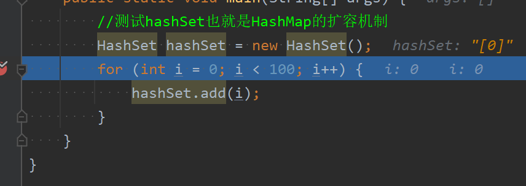

1. 当i=0,时，hasSet中的属性map中的数组table将会扩容到16个，并且将内0自动装箱后加入到table当中

	

2. 当i=12使，再进行插入时，执行完add方法，table数组就会扩容至之前的两倍，临界值threshold也会变成24。**所以对于第二点：table数组是到临界值12之后（对于table数组临界值的理解：意思就是每加入一个Node，不管这个Node是加在table数组中，还是链表上，他都算数），如果再要加入元素使得table数组到了13，那么在putVal()方法内部调用resieze()进行扩容**)。后面的以此类推

	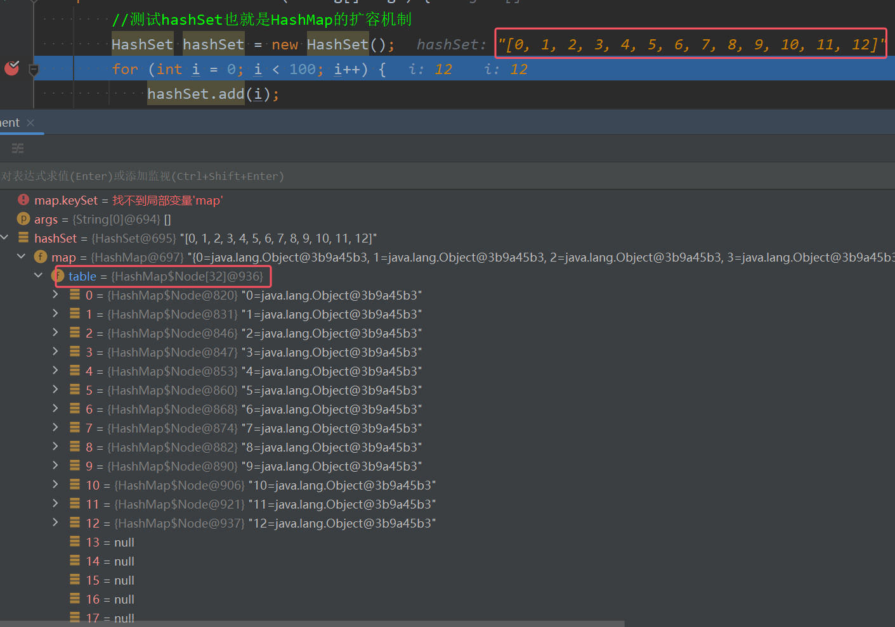
	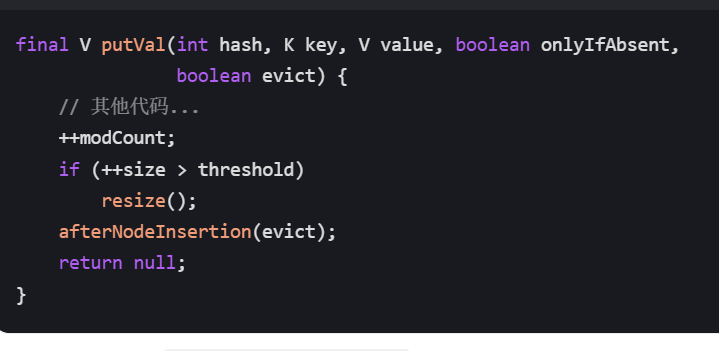

3. 对于第三条，详情可以见putVal()中的treeifyBin()方法

	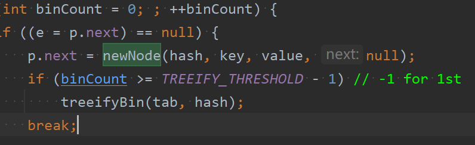
	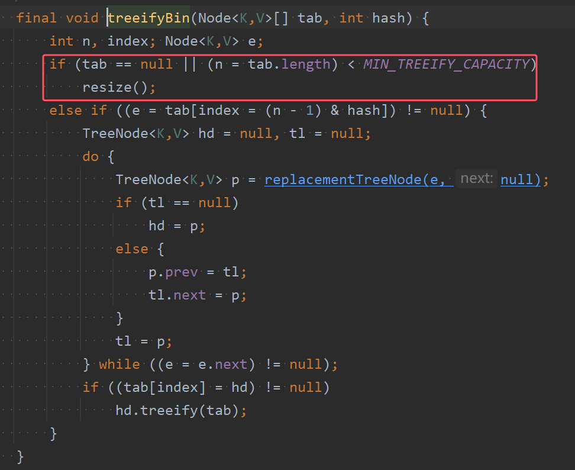
	
	

#### （3）HashSet的转成红黑树机制的总结（图理解记忆即可）

HashSet的转成红黑树机制的就是HashMap的转红黑树机制，所以此处不讲，详情请看HashMap的底层机制详解


## 2）LinkedHashSet
### 1.LinkedHashSet要点综述
LinkedHashSet的类继承关系图如下图所示;


* LinkedHashSet 的**底层结构是LinkedHashMap，其底层维护了一个数组+双向链表**
* 对于第三点，LinkedHashSet 也是根据hashcode确定索引位置这与HashSet相同。对于后一句，意思就是由于有双向链表在维护元素的次序，**所以在遍历LinkedHashMap时，取出数据的顺序与添加的顺序相同**
* 对于LinkedHashSet （LinkedHashMap）的底层结构视图如下图所示

	

### 2.底层机制分析

对于光记忆来说，只需要下面这张图即可，并且只需要知道很多地方与HashSet基本相同，多出来的业务逻辑就只是存在在与putVal方法中的afterNodeInsertion()方法当中。所以接下来只讲解与HashMap不同的地方 


* 注意：第一点中的head和tail是用于指向双向链表的头结点和尾结点的
* 而before和after是每个结点都有的，用于指向上一个结点和下一个结点


以下图代码为例进行断点调试来进行底层机制分析


###### 执行构造器创建对象


* 通过调试LinkedHashSet的构造器内容可以看出：**能看出来LinkedHashSet的底层结构是LinkedHashMap**

###### 执行第一个add语句

* 当执行完第一个add语句时，数组table被扩容到16（这于HashMap一样，在刚刚开始默认初始化为null在添加第一个元素时会先被扩容到16个）
* 但是此时LinkedHashMap放的结点类型是LinkedHashMap$Entry而不是和HashMap一样里面放的是HashMap\$node了
* LinkedHashMap的table的类型HashMap\$node，存放的元素类型是LinkedHashMap\$Entry类型，这实际上就是多态数组的体现，也就是可以说明LinkedHashMap$Entry是HashMap\$node的子类

	

