Map接口的实现类为下图所示

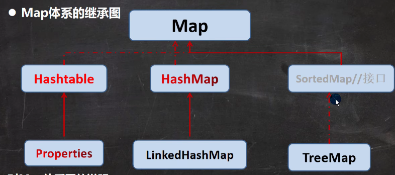

### 1.Map接口特点（无序、无下标、键不可重复，值可重复）
Map接口特点如下图所示，接下来会一一对其进行讲解

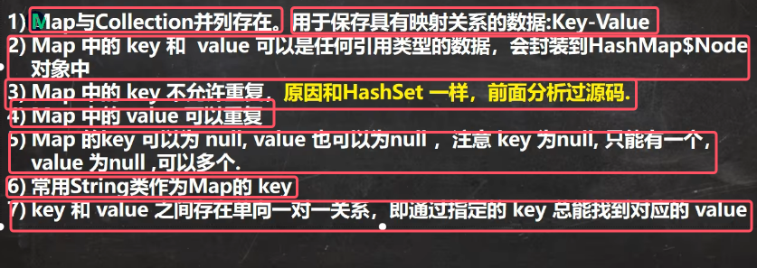
1. **Map和Collection并列存在，保存的是映射关系的键值对K-V**

	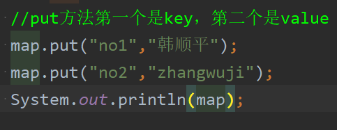

2. Map中的**key和value必须都得是引用类型，但key和value的类型可以一样也可以不一样**
3. **Map中的key不允许重复但value可以重复，原因是·：和HashSet一样，其底层判断重复元素的时候会判断key是否相同，但并不会判断value是否相同**
4. **当向Map中添加key相同的元素时，就等价于替换掉旧的元素（也就是将value值进行了替换）。（下图是put()中putVal的内部业务代码）

	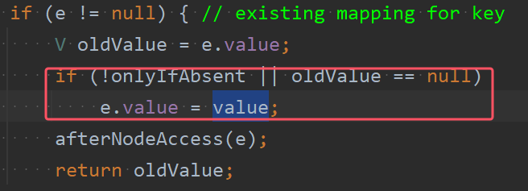
	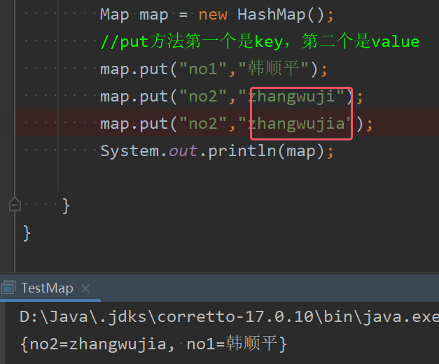

5. Map中的key可以为null，value也可以为null；但key为null只能有一个，value为null，可有多个
6. **常用String作为Map的key**，其他类型也可以

	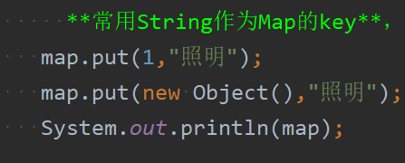

7. **key和value存在单向一对一关系，即可以通过指定的key总能找到对应的value**；但不能通过value找key，因为value可重复，但key不能重复

	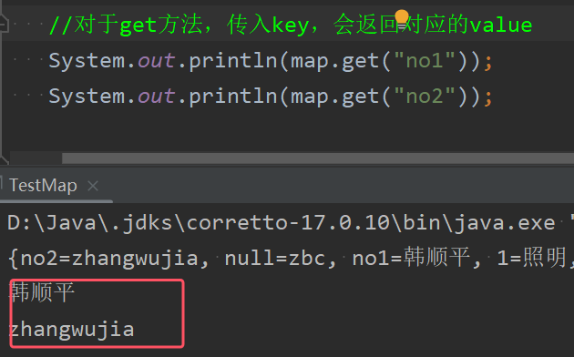
	* 具体的方法是使用get()方法：传入key，会返回对应的value

### 2）Node、Entry、EntrySet、KeySet和Values之间的关系

以HashMap为例来讲解此内容。说明：此处说的所有内容对于其他Map同样适用

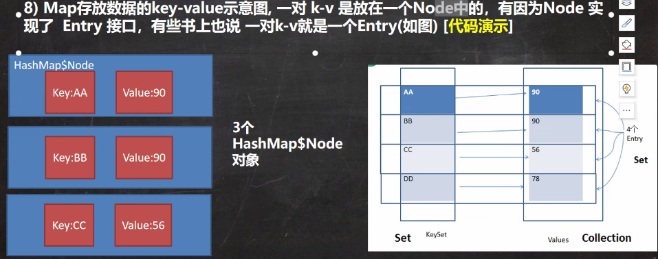
8. **一对k-v键值对是放在一个HashMap$Node(代表HashMap的内号类Node)中的**，它实现了 `Map.Entry` 接口，并实现了对于键值对的基本操作

	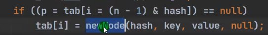
	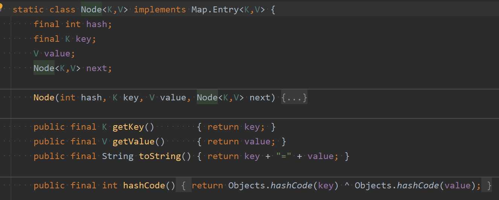

9. **`Entry` 是 `Map` 接口中的一个内部接口，它定义了键值对的基本操作**，如获取键、获取值、设置值等。`Node` 类实现了 `Map.Entry` 接口

	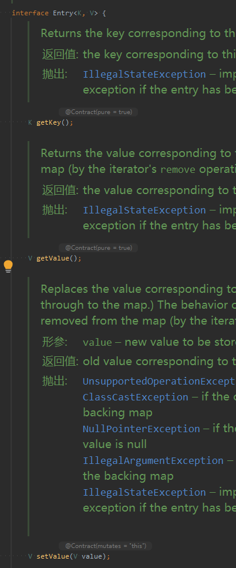

为了方便程序员的遍历，所有Map的实现类中都会存放有三个内部类，分别是EntrySet、KeySet和Values。接下来将分别讲解这三个内部类

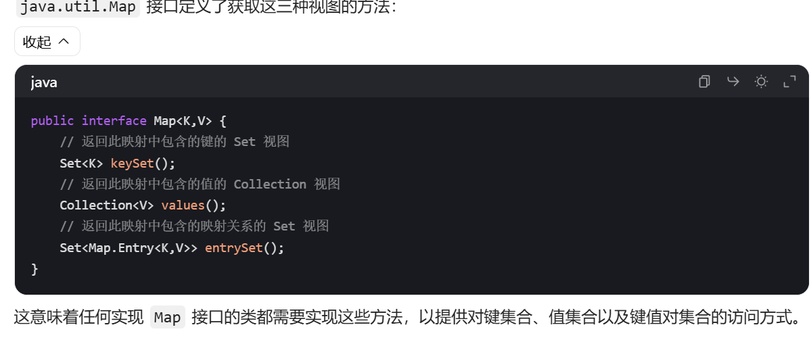

10. HashMap中创建了一个EntrySet类集合，实现了 `Set` 接口，用于表示 `HashMap` 中所有键值对的集合。该集合存放的元素类型是Map.Entry（Node的父接口）。

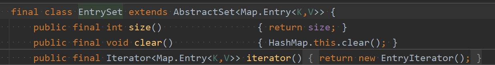
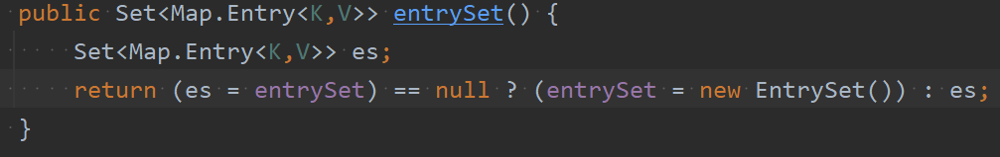
* 注意：**`EntrySet` 不会在 `HashMap` 添加键值对时将元素存储到自身，而是指向 `HashMap` 底层的 `Node`节点**
* 上图的`entrySet()` 方法：用于获取 `EntrySet` 实例。如果 `entrySet` 还未初始化，则创建一个新的 `EntrySet` 实例并返回；否则，直接返回已有的 `EntrySet` 实例。
* EntrySet能够遍历HashMap中的所有键值对的原因：
	1. 因为`EntrySet`指向 `HashMap` 底层的 `Node`节点，并且`EntrySet` 实现了 `Set` 接口，所以可以使用增强for循环或者Iterator来进行对Map的遍历
	2. 并且在 `HashMap` 中，`Node` 类实现了 `Map.Entry` 接口，而 `Map.Entry` 接口定义了键值对的基本操作，包含获取键（`getKey()`）和获取值（`getValue()`）的方法。Nede类会对这些方法有具体的实现，就可以使用for-each进行遍历
	3. 因为`EntrySet`是实现了Set接口，所以也是Collection的实现类，也可以使用迭代器来进行遍历
* **使用EntrySet内部类来进行遍历的具体办法**：首先通过`entrySet()` 方法在获取 `EntrySet` 实例，这样就相当于拿到全部元素；并且由于EntrySet是Set的子类，那么此时就可以使用增强for或者迭代器来遍历。虽然entryset的元素类型是Map.Entry，但是实际上还是存放的HashMap\$Node，所以根据动态绑定机制，会实现`1.getKey()   2.geyValue()`，然后通过这两个方法就可以遍历

	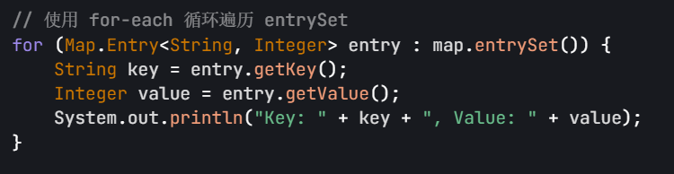

11. **`KeySet` 是一个存储 `HashMap` 中所有键的集合**
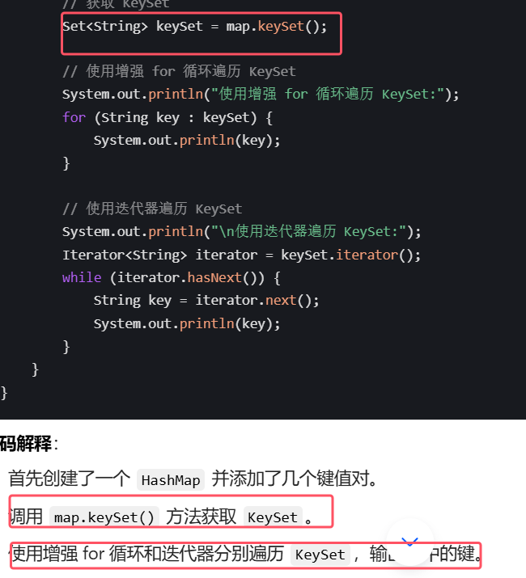

1. `Values` 是一个存储 `HashMap` 中所有值的集合。
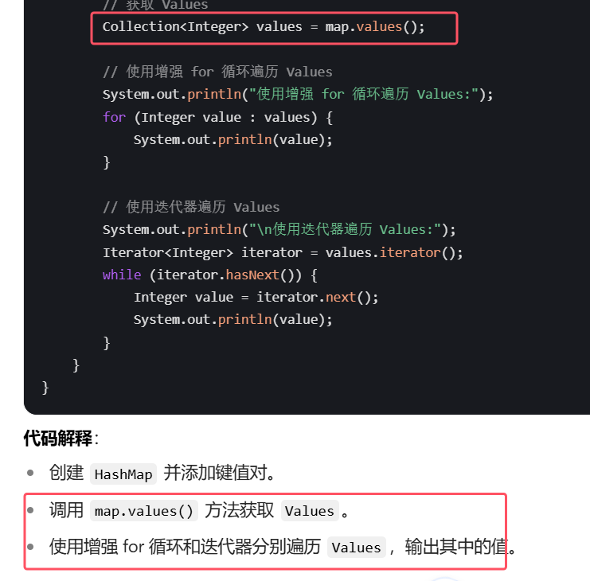

总结：当需要同时处理 `Map` 中的键和值时，使用 `EntrySet` 比 `KeySet` 和 `Values` 更加高效、简洁。但在只需要处理键或只需要处理值的场景下，使用 `KeySet` 或 `Values` 则更为合适。

### 3.Map接口常用方法
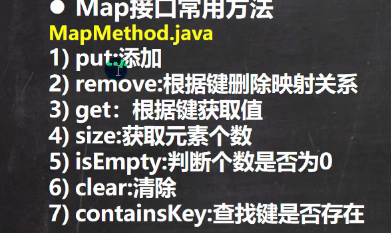

get方法的更安全版本如下：

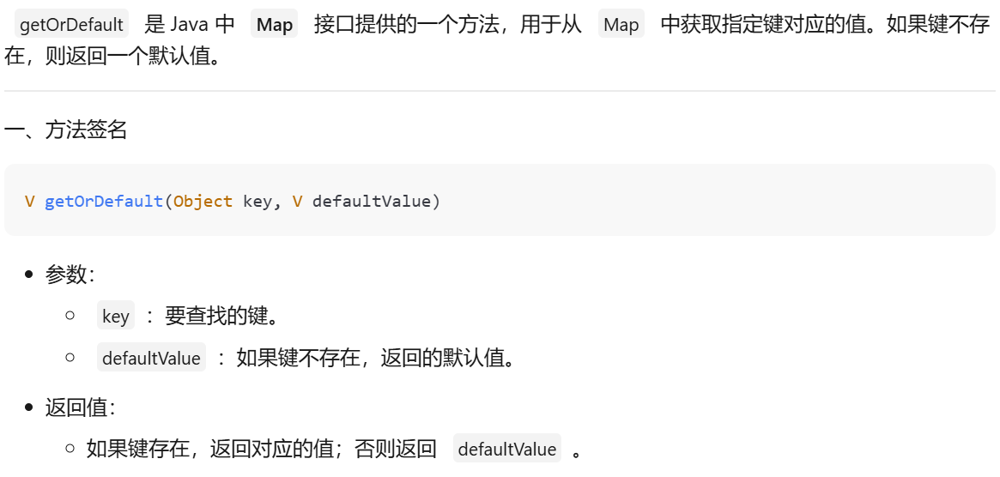

push添加元素这里就不多讲，上面已经使用过，接下来从第二个开始讲

2. **remove():根据键删除元素，可任意只输入键也可以输入键值对**

	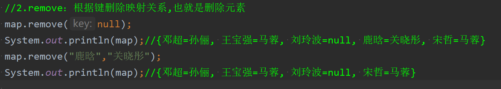

3. get():根据键获得值

	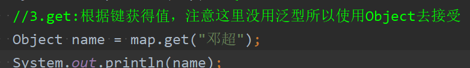

4. size():获取元素个数
5. isEmpty()：判断元素个数是否为0
6. clear()：清空map
7. containsKey()：查找键是否存在

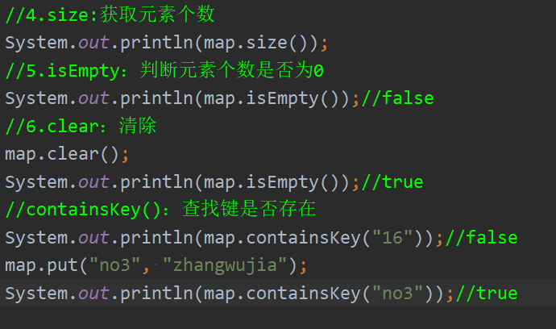

### 4.Map接口六大遍历方式
遍历时所用到的方法如下图所示：

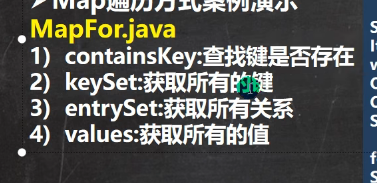

1. 通过keyset来进行遍历，有for-each和迭代器两种遍历方式

	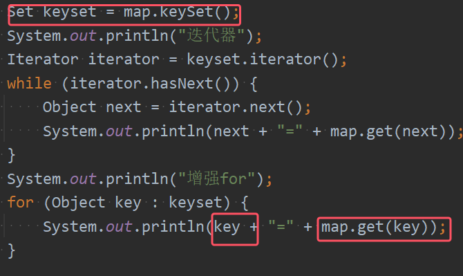

2. 通过values来进行遍历，通过value没办法反向取key，所以只能遍历value。  
* 有for-each和迭代器两种遍历方式,不能使用普通for循环

	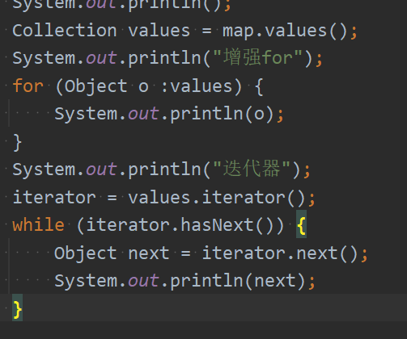

3. 通过entryset来进行遍历，有for-each和迭代器两种遍历方式

	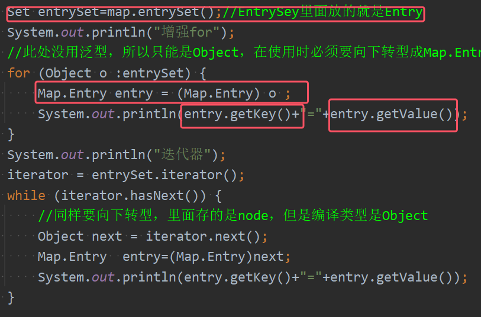