## 1）HashMap

### 1.HashMap综述
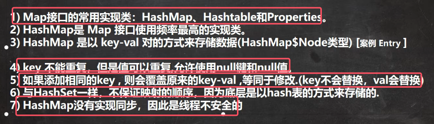
* 对于第五点，其底层源码如下图所示：

	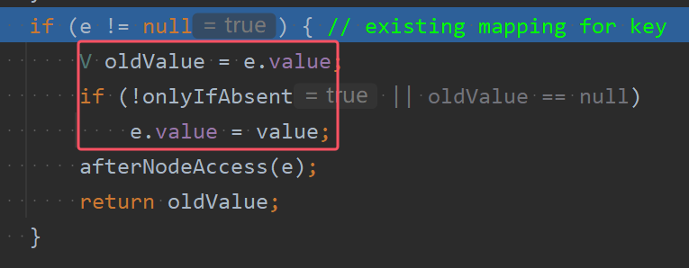

* 对于第七点，因为方法没做同步互斥的操作，即没有加synchronized关键字，所以**hashMap是线程不安全的**

	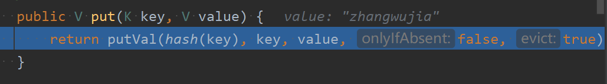

### 2.HashMap底层机制解读


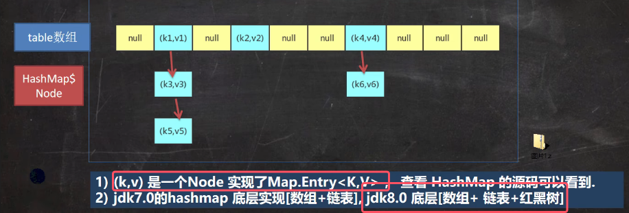

#### 1.HashMap扩容机制解读
扩容机制总的内容如下：（记忆的话背这个图片即可）
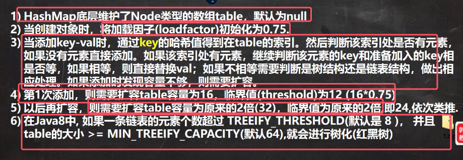
以一下代码为例进行讲解扩容机制

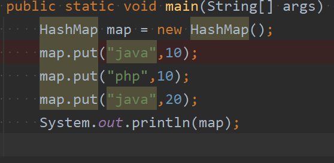
###### 执行第一个put语句：`map.put("java",10);`

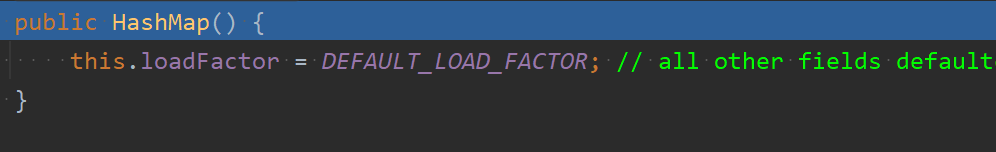
* 在执行第一个add语句之前，首先调用构造器创建了一个HashMap，并且初始化加载因子loadFactor为默认值0.75
* 其中map的属性HashMap$Node\[]   table=null；

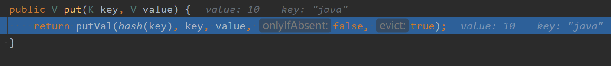
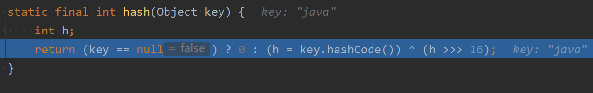
* 在进入put方法之前会计入valueOf()对10进行装箱操作，此处略去不写
* 此put方法的key，其实就是put方法中的key，也就是`"java"`。
* 该put方法会执行hash(key)得到key的对应hash值
* 该方法求key对应的hash值的逻辑主要是以下语句：`(h = key.hashCode()) ^ (h >>> 16)`，首先求出传入值的hashcode，然后再与让其与hashcode无符号右移16位的接过进行异或，这是为了避免哈希碰撞

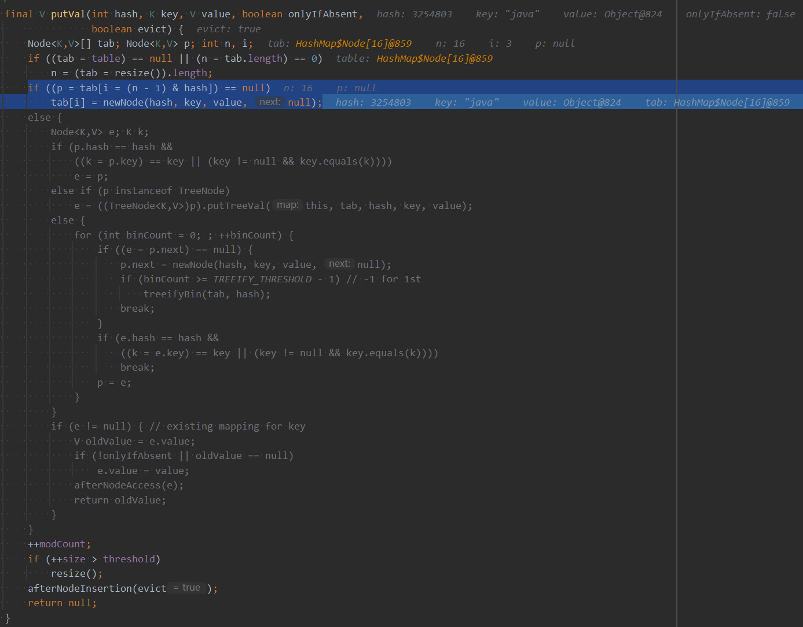
* 说明：其中的`table`就是HashMap的属性，是放Node结点的数组table
```java
if ((tab = table) == null || (n = tab.length) == 0)  
	n = (tab = resize()).length;
```
* 此时让tab指向数组table，它没用进行任何操作默认初始化为空，**会执行resize()方法，用于对table表进行扩容**
* 通过下面的resize方法的分析，**可以得知如果当前table时null，或者table的大小为0，那么就会通过resize方法扩容到16个空间**，此处会这么去做。

```java
if ((p = tab[i = (n - 1) & hash]) == null)  
	tab[i] = newNode(hash, key, value, null);
```
* 上面代码块中的代码首先计算key对应的hash值应该存放在table表的哪个索引位置存放，然后赋值给p。并且判断如果p是否为空。
* 如果为空，代表此处没有存放元素，就创建一个node存放在此处，该node存放着该元素的hash值、key（也就是存放的内容，此处为“java”）、value为10和next（指向下一个node的指针，默认为null）。此处第一次执行put，肯定为空所以执行此代码块，并存放在tab\[3]中
* 那么下面else的代码块也就不执行

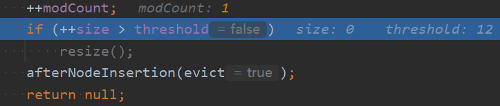
```java
if (++size > threshold)  
	resize();
afterNodeInsertion(evict);
```
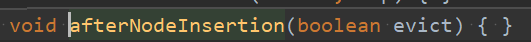
* 在放入元素后判断是否需要扩容也就是元素个数是否到达阈值，如果需要扩容那么就调用resize进行扩容
* `afterNodeInsertion(evict)`方法是HashMap留给其子类（比如LinkedHashMap）去重写实现一些动作（比如形成一个有序的链表等）的。对于HashMap，该方法方法体为空，什么都没干

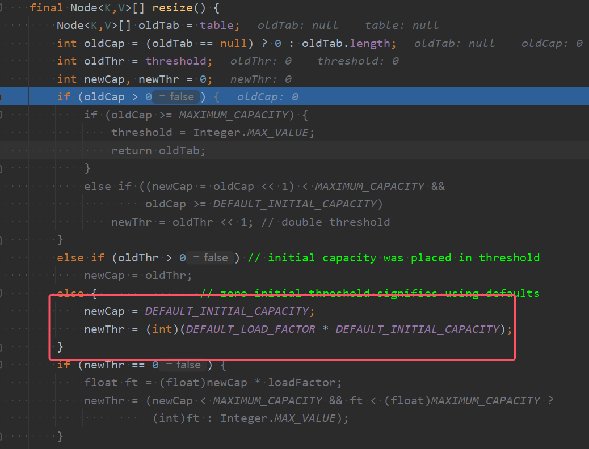
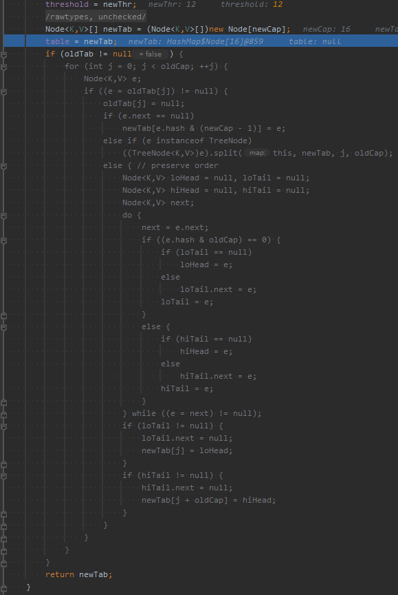
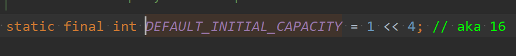
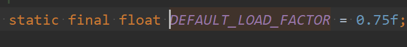
* `DEFAULT_INITIAL_CAPACITY`为默认的初始容量，为16
* `DEFAULT_LOAD_FACTOR`为默认的缩放因子，为0.75
* HashMap类中的属性`threshold` 表示哈希表进行扩容操作的阈值。当哈希表中的元素数量达到这个阈值时，就会触发哈希表的扩容操作（resize），以保证哈希表的性能。
* 图中的新容量为16，新阈值为16\*0.75=12
* 暗处代码的主要作用为：通过扩容可以重新分配元素，减少哈希冲突。使得每个链表下的元素少于8个
* 由于oldCap和oldThr都为0，所以只执行暗处代码第一次执行add时不会执行，会直接返回newTab。


###### 执行第二个add语句：`map.put("php",10);`
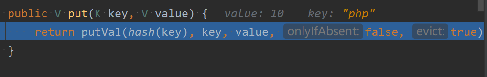
* 此put方法的key，其实就是“php”，value就是10
* 此处的hash()方法的内容在第一个语句已经详细讲过，此处就不在赘述，直接看`putval`的业务逻辑

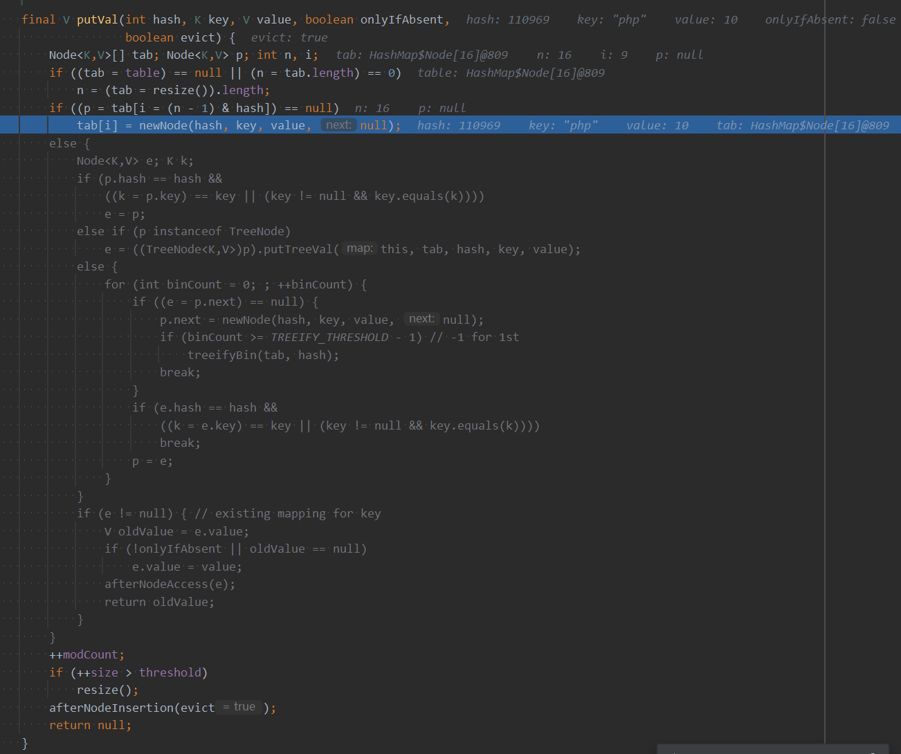
* 说明：其中的`table`就是HashMap的属性，是放Node结点的数组table
```java
if ((tab = table) == null || (n = tab.length) == 0)  
	n = (tab = resize()).length;
```
* 此处table已经进行了扩容并且已经存了元素，所以并不会进行执行resize()方法

```java
if ((p = tab[i = (n - 1) & hash]) == null)  
	tab[i] = newNode(hash, key, value, null);
```
* 此处经过计算，得到i=9，tab\[9]为空，代表此处没有存放元素，就创建一个node存放在此处，该node存放着该元素的hash值、key（也就是存放的内容，此处为“java”）、value(都是PRESENT)和next（指向下一个node的指针，默认为null）。此处会将该元素放入tab\[9]
* 那么下面else的代码块也就不执行

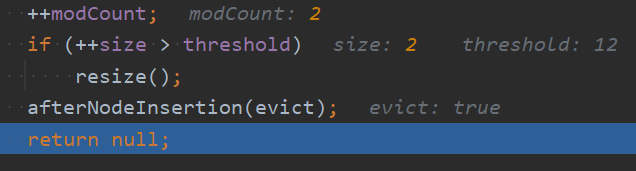
```java
if (++size > threshold)  
	resize();
afterNodeInsertion(evict);
```

* 此处size为2，未超过12，也不需要扩容。
* `afterNodeInsertion(evict)`方法是HashMap留给其子类（比如LinkedHashMap）去重写实现一些动作（比如形成一个有序的链表等）的。对于HashMap，该方法方法体为空，什么都没干
* 此处putVal返回空给put方法，那么put方法也会返回给add方法，用于在add方法中判断。也就是如果返回null，则代表add成功，返回true；如果没返回null，则返回false


###### 执行第三个add语句：`map.put("java",20)`

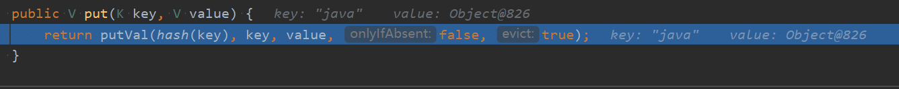
* 此put方法的key，也就是`"java"`，valuje是20
* 此处的hash()方法的内容在第一个语句已经详细讲过，此处就不在赘述，直接看`putval`的业务逻辑

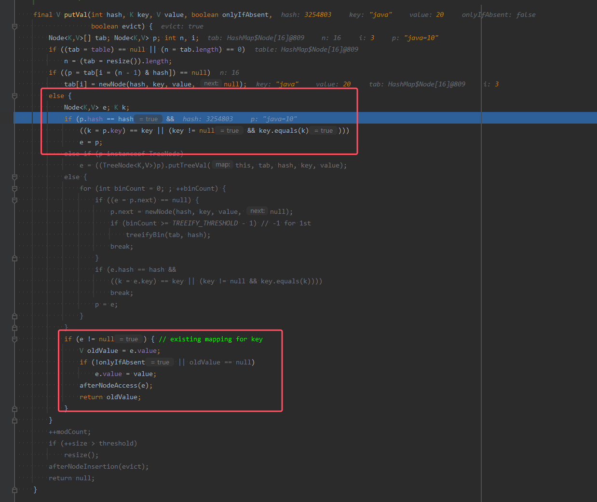
* 说明：其中的`table`就是HashMap的属性，是放Node结点的数组table
```java
if ((tab = table) == null || (n = tab.length) == 0)  
	n = (tab = resize()).length;
```
* 此处table已经进行了扩容并且已经存了元素，所以并不会进行执行resize()方法

```java
if ((p = tab[i = (n - 1) & hash]) == null)  
	tab[i] = newNode(hash, key, value, null);
```
* 此处经过计算，由于key值与第一次添加的相同，也就是`java`。并且hash()方法的计算方法并没有发生改变，所以计算出来的hash值与第一次添加的hash值相同，所以`i = (n - 1) & hash]`算出来i的值都相同，为3。
* 那么此时p也就是tab\[3]肯定不会空，所以if条件不成立，会执行下面的else语句块

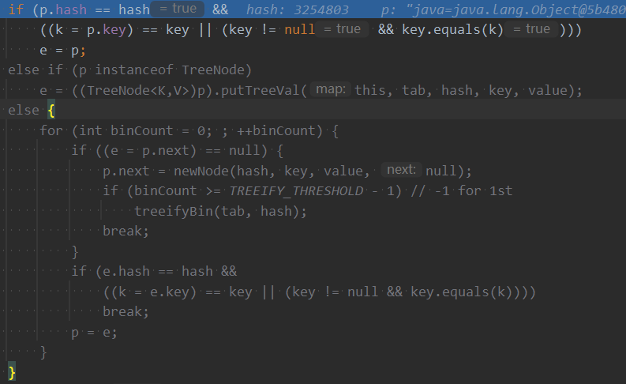
* 上图为else语句块的所有内容，接下来对上图中的所有内容进行一一讲解
```java
if (p.hash == hash &&  ((k = p.key) == key || (key != null && key.equals(k))))  
	e = p;
```
* 对于上图中的if语句的判断条件的解读：`p.hash == hash`是如果当前索引位置对应的链表的第一个元素和准备添加的key的hash值一样，并且`((k = p.key) == key || (key != null && key.equals(k)))`也就是满足下面两个条件之一，这样总的逻辑表达式的结果就为true：
	1. 准备加入的key和 p 指向的Node结点的key是同一个对象
	2. p指向的node结点的中的key的equals() 和准备加入的key比较后相同（**这里equals()方法的具体实现依赖与key对象的类是否重写了euqals方法，也就是equals()方法动态绑定了key**）

```java
else if (p instanceof TreeNode)  
	e = ((TreeNode<K,V>)p).putTreeVal(this, tab, hash, key, value);
```
* 对于上图中else if语句的判断条件的解读：如果p是一颗红黑树，那么此时p就是这颗红黑树的根节点。就调用putTreeVal()方法来继续在红黑树中，进行添加元素（并判断是否可以添加）

```java
else {  
	for (int binCount = 0; ; ++binCount) {  
		if ((e = p.next) == null) {  
			p.next = newNode(hash, key, value, null);  
			if (binCount >= TREEIFY_THRESHOLD - 1) // -1 for 1st  
				treeifyBin(tab, hash);  
			break;  
		}  
		if (e.hash == hash && ((k = e.key) == key || (key != null && key.equals(k))))  
			break;  
		p = e;  
	}  
}
```
* 当要添加的节点与当前数组中的结点p不相同，并且p的后面又不是一颗红黑树的时候，此时剩下的情况就是，p的后面接的是一个链表。那么上面else的代码块就是处理的这种情况
* 对于该代码块内容的解读：如果table对应索引位置已经是一个链表，就使用for循环比较。会发生以下情况
	1. 依次和该链表的每一个元素比较后，都不相同，则加入到该链表的末尾，并且紧接着判断链表元素是否到达8个(`TREEIFY_THRESHOLD`为8)，如果到了就调用`treeifyBin()`将当前链表进行树化，也就是转成红黑树。
		*  并**且`treeifyBin()`方法内部在转成红黑树之前，检查哈希表 `tab` 是否为空，或者哈希表的长度是否小于 `MIN_TREEIFY_CAPACITY`（默认值为 64）。如果满足上述条件，说明哈希表还比较小，此时不进行链表转红黑树的操作，而是调用 `resize()` 方法对哈希表进行扩容**。因为在哈希表较小时，链表长度过长可能是由于哈希冲突较为集中导致的，通过扩容可以重新分配元素，减少哈希冲突。
		* 如果不满足上述条件，才进行转成红黑树
		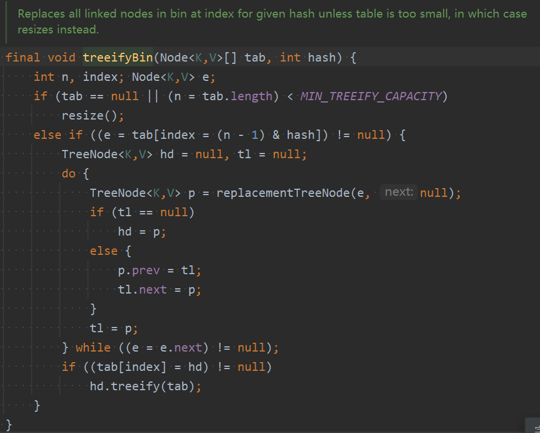
	2. 依次和该链表的每一个元素比较过程中，如果有相同情况（就是有相同元素，具体的刻画就是代码中的长if逻辑表达式），就直接break

那么对于第三个add语句`set.add("java");`来说，在进行else语句块的时候，第一个if语句就已经成立，所以就会将p的值赋值给e，图中灰色的代码块就都不会执行，然后执行下面的代码块

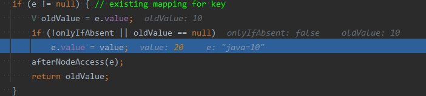
* 此时进入到这个语句块，就已经代表在整个底层存储数据的结构当中找到了相同元素，那么就会返回一个oldvalue，也就是10。将新的value值存入node

那么此时此处putVal返回oldVal的值给put方法，那么put方法将其也会返回给add方法，用于在add方法中判断。也就是如果返回null，则代表add成功，返回true；如果没返回null，则返回false。此处返回的是不是null，所以返回false，也就意味着没有加入成功


总结：**判断是否是相同元素的依据是下列代码，也就是说不能有重复元素的筛选条件如下**
```java
if (p.hash == hash &&  ((k = p.key) == key || (key != null && key.equals(k))))
```
对于上图中的if语句的判断条件的解读：`p.hash == hash`是如果当前索引位置对应的链表的第一个元素和准备添加的key的hash值一样，并且`((k = p.key) == key || (key != null && key.equals(k)))`也就是满足下面两个条件之一，这样总的逻辑表达式的结果就为true：
	1. 准备加入的key和 p 指向的Node结点的key是同一个对象
	2. p指向的node结点的中的key的equals() 和准备加入的key比较后相同（**这里equals()方法的具体实现依赖与key对象的类是否重写了euqals方法，也就是equals()方法动态绑定了key**）

###### 对于扩容机制的总结

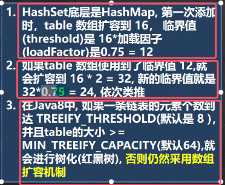
下面将通过以下图的代码详细测试HashMap的扩容机制（主要的方法为resize()方法）

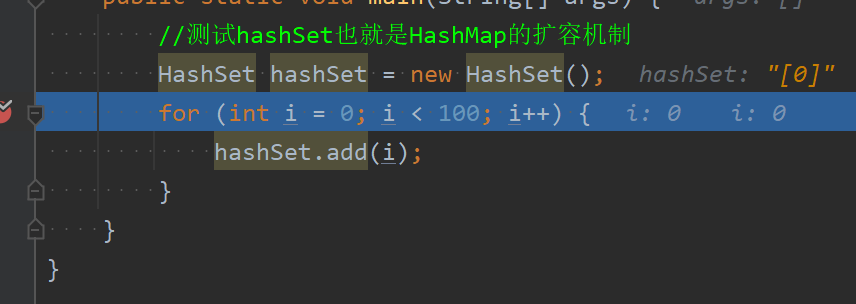

1. 当i=0,时，hasSet中的属性map中的数组table将会扩容到16个，并且将内0自动装箱后加入到table当中

	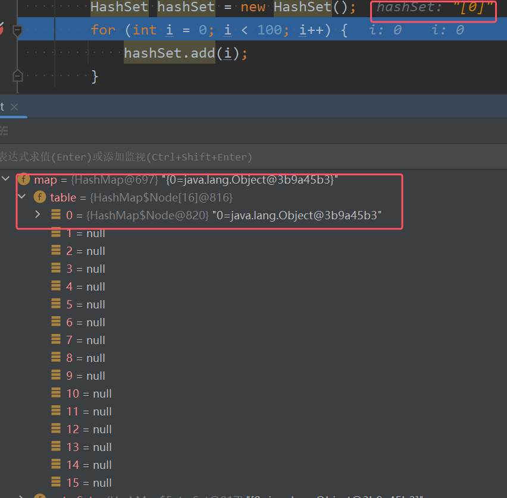

2. 当i=12使，再进行插入时，执行完add方法，table数组就会扩容至之前的两倍，临界值threshold也会变成24。**所以对于第二点：table数组是到临界值12之后（对于table数组临界值的理解：意思就是每加入一个Node，不管这个Node是加在table数组中，还是链表上，他都算数），如果再要加入元素使得table数组到了13，那么在putVal()方法内部调用resieze()进行扩容**)。后面的以此类推

	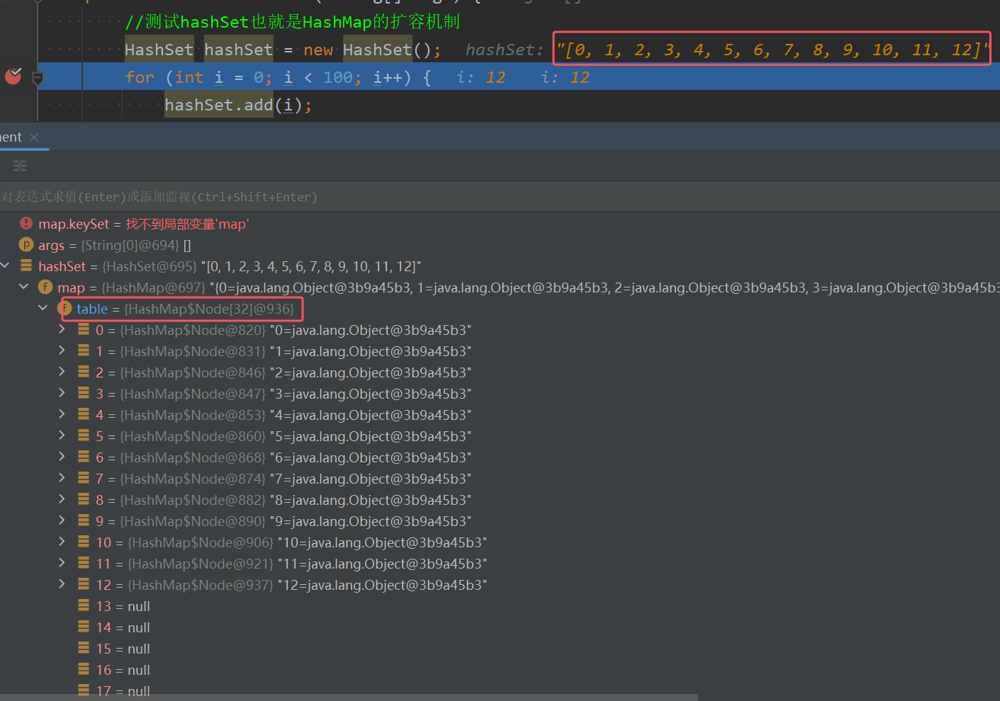
	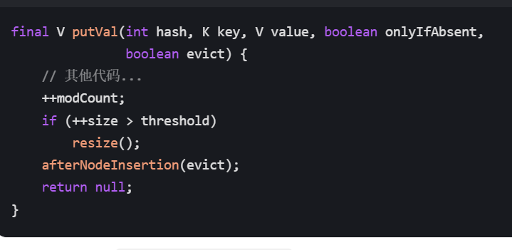

3. 对于第三条，详情可以见putVal()中的treeifyBin()方法

	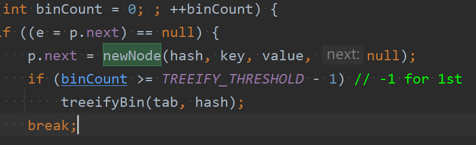
	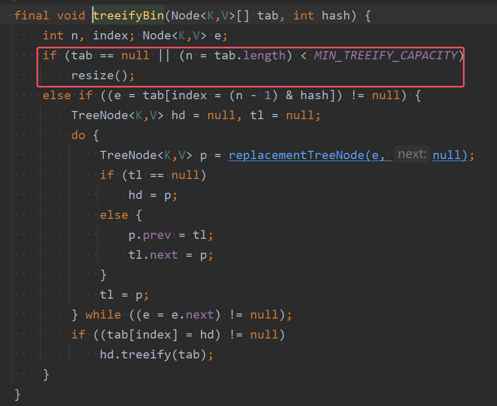


## 2）Hashtable
Hashtable类的继承关系如下图所示：

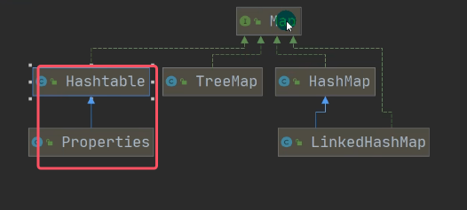

Hashtable使用要点如下图所示：

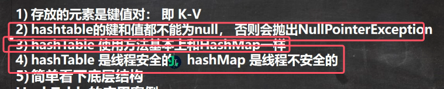
* 对于第二点：**注意HashMap键只能有一个为空，值可以多个为空；而Hashtable键和值都不能为空**
* **Hashtable相当于是HashMap的线程安全版本，因为使用Hashtable使用方法和HashMap基本一样**

	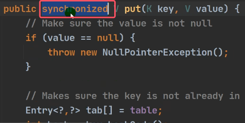


### 2.Hashtable底层机制剖析
以下面代码进行底层机制剖析

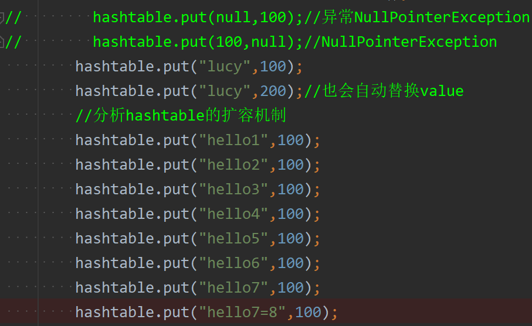

###### 执行第一个put语句：`hashtable.put("lucy",100)`

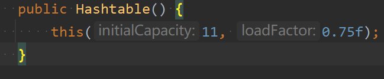
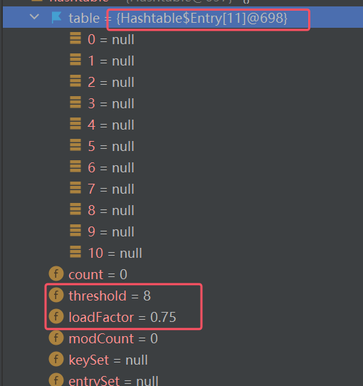
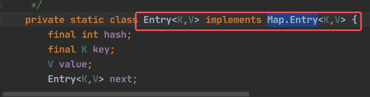
* 在执行第一个add语句之前，首先调用构造器创建了一个Hashtable，**并且初始化加载因子loadFactor为默认值0.75，并初始化大小为11，临界值threshold为11\*0.75=8***
* 其中map的属性Hashtbale$Entry\[]  table\[11]=null；

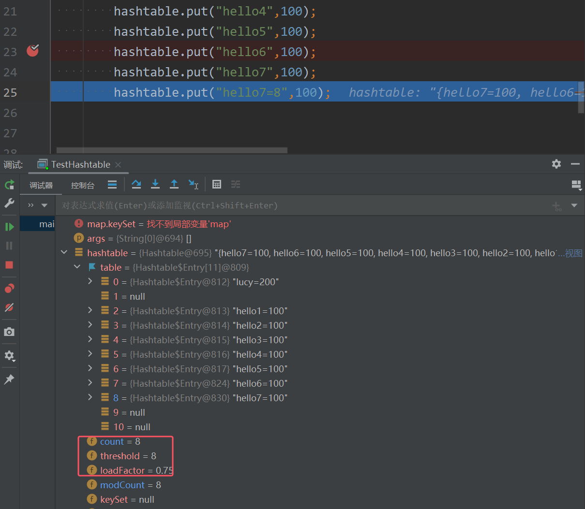
 * 当count=8时，此时并未扩容进行扩容，但是已经到达临界值8。接下来执行第九次put

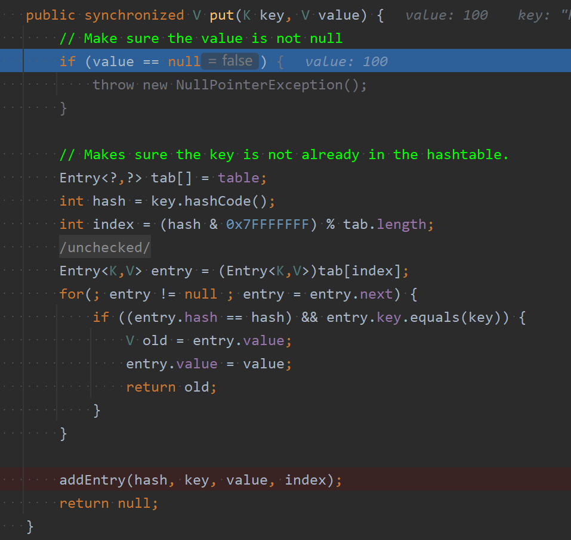
* Hashtable类的put方法内部有一个`addEntry(hash, key, value, index);`，是主要方法，用于添加到k-v到table中

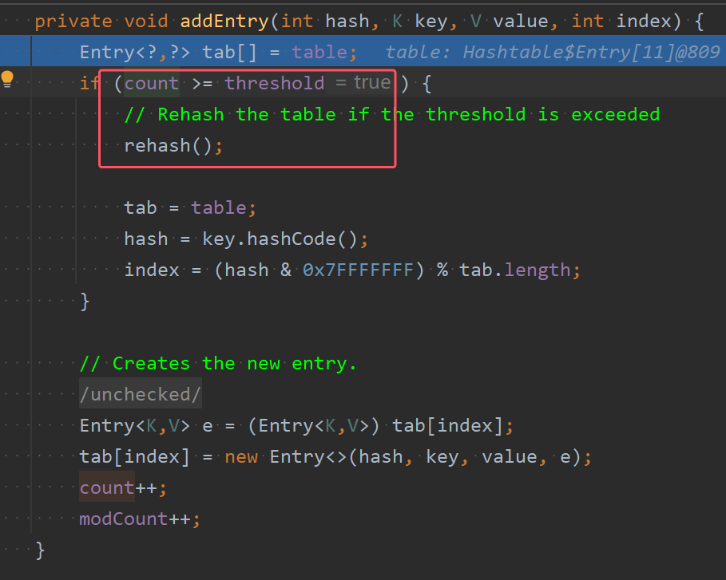
* 在addEntry内部，当table中的元素个数count大于等于threshold时，**会执行rehash()方法，由该方法进行一个扩容**

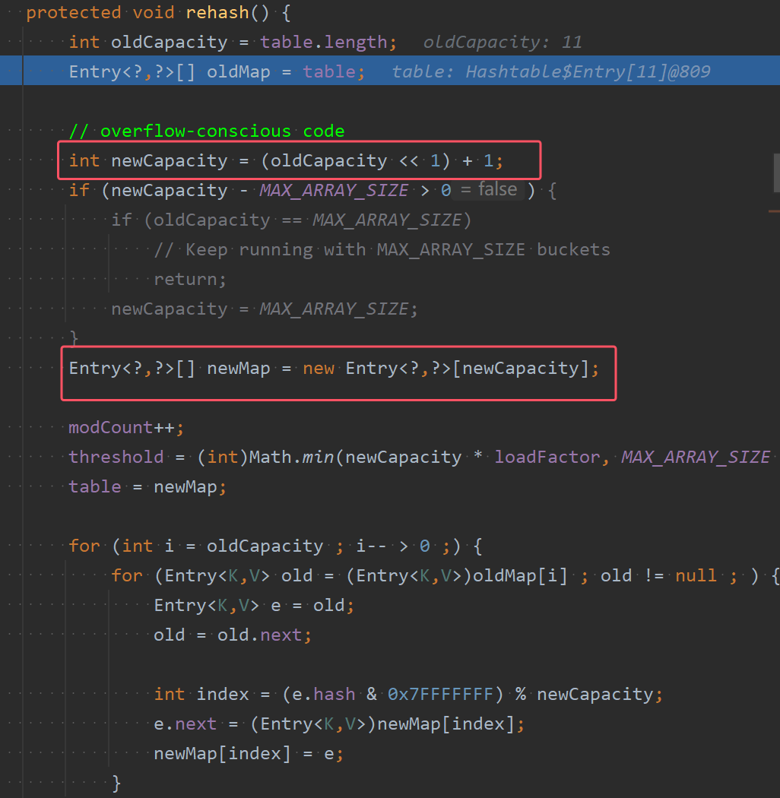
* 从rehash()方法中可以看到，**Hashtable的扩容机制为`(oldCapacity << 1) + 1;`，也就是2n+1**


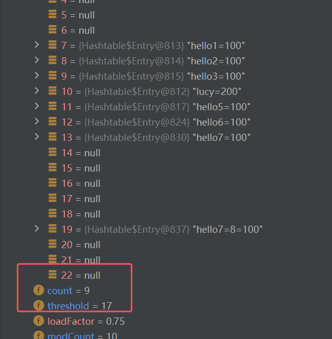
* 当i=9时，超过临界值8，hashtable扩容到23个，并且临界值调整为23\*0.75=17,


HashMap与Hashtable的对比如下图所示：

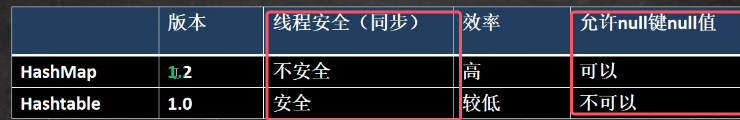


##  3）Properties
该类的继承关系如下图所示：

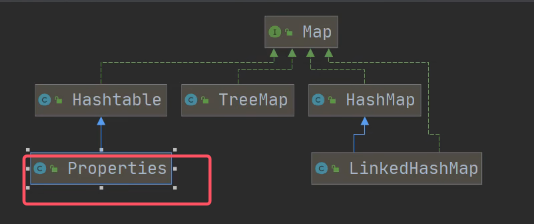

Properties的基本介绍如下：

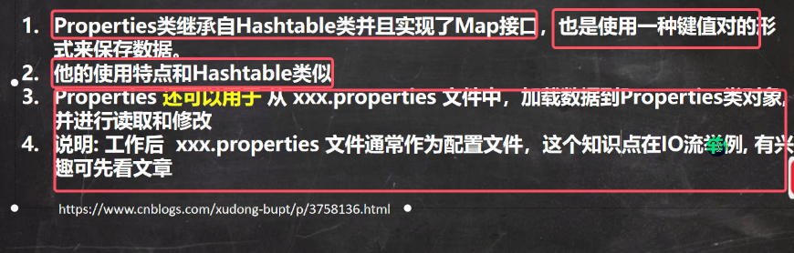
* 对于第三条：这是Properties类的更多的用法，知道就行，后面会在IO流的地方讲到

以以下代码对Properties进行讲解

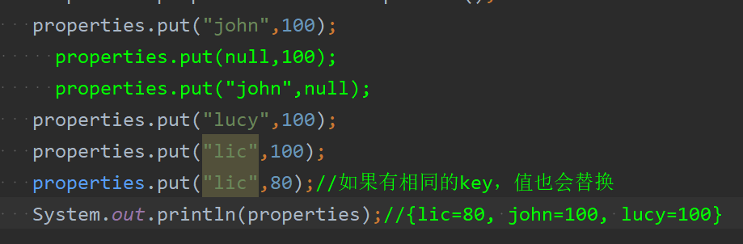
* 可以通过k-v存放数据，并且key和value与Hashtable一样不能都不能为空，不然回抛出空指针异常
* 如果有相同的key的元素put进来，value’同样会被替换

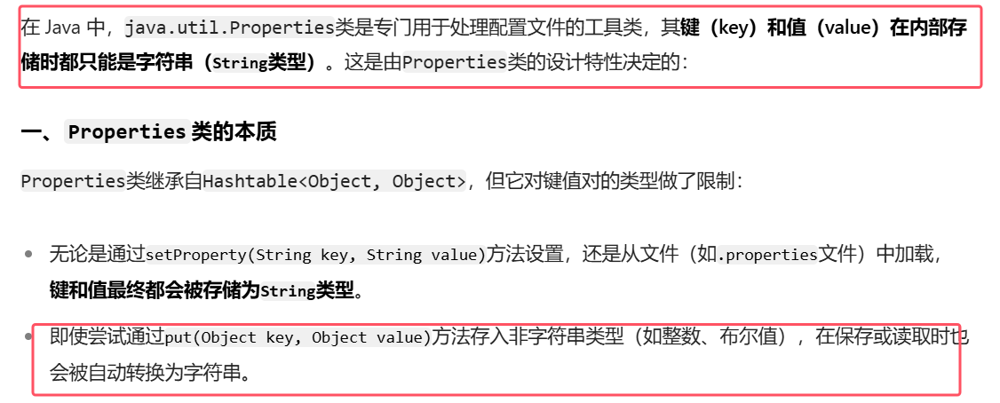