## 1)集合的选择
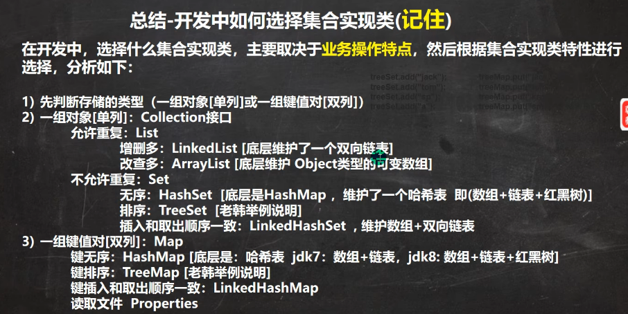
* treeSet和TreeMap的键排序的意思是取出顺序按照某个规则进行排序
* 而LinkedHashMap是保证了取出顺序与存放顺序一致
* **TreeSet和TreeMap最大的特点是键排序：即取出顺序是按照键来排序进行取出**
* **TreeSet的底层结构是TreeMap**

## 2）TreeSet
其类集成图如下图所示：

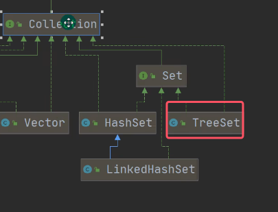

下图为TreeSet类的构造器一览

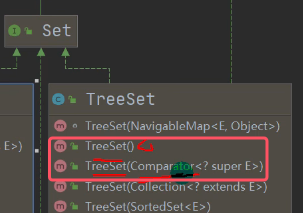
* 图中红框内的两个是十分常用的两个构造器，接下来会一一进行讲解

### 1.构造器讲解
#### （1）无参构造器
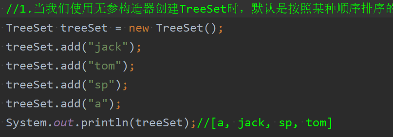
* 从图中可以看到，当调用无参构造器创建TreeSet对象时，打印的结果是无序的

#### （2）有参构造器
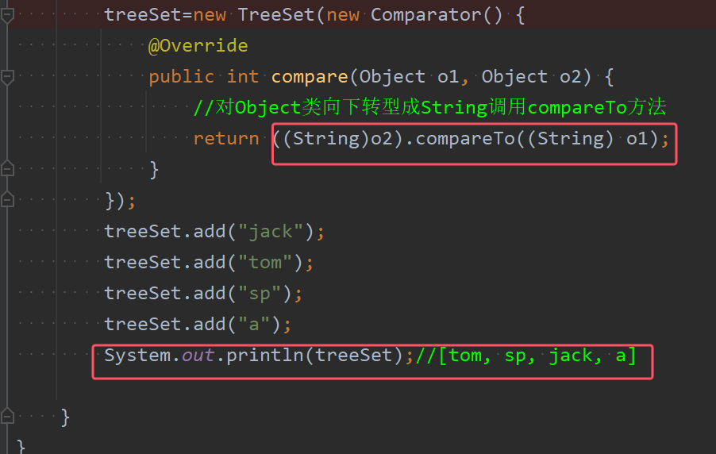
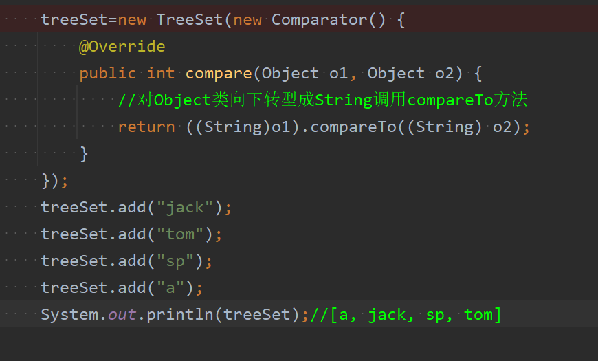
* 如果希望treeSet元素，按照字符串大小（即一个一个字母来比较，按照字母表来排序）来排序，就需要**使用TreeSet提供的一个构造器，可以传入一个比较器Comparator（即匿名内部类），并制定排序规则（比如按照compare的方法去比较，按照字符串长度去比较）**，具体指定的排序在下面源码解析时会进行讲述
* 对于compareTo()方法的具体用法，详情请见[03String类](../04常用类/03String类.md)

### 2.底层代码解读

以下下列代码为例来讲解传入Comparator接口的匿名内部类的机制

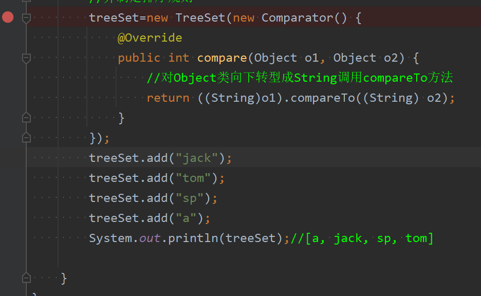

1. 首先进行断点调试进入该有参构造器的内部，得到下面的底层代码

	
	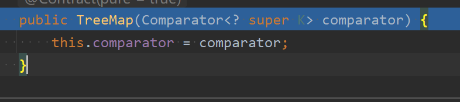
	*  TreeSet类的有参构造器会把传入的比较器对象，赋给了TreeSet底层的TreeMap的属性this.comparator
	* 所以可以得到以下结论：**TreeSet的底层结构是TreeMap*

2. 接下来执行第一个add方法`treeSet.add("jack");`

	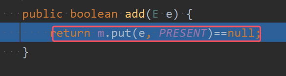

	下面图片已经进入到TreeMap的put方法  
	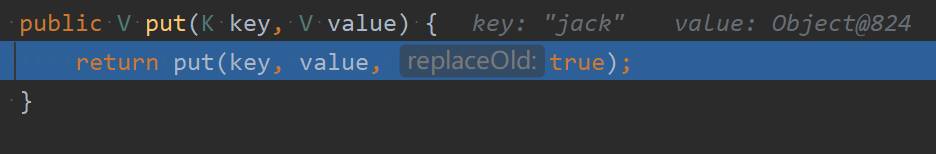
	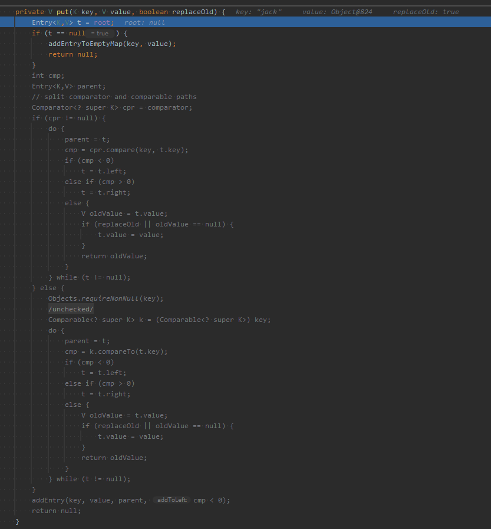
	* 此时进入到TreeMap的put方法，由于**TreeMap的底层实现是红黑树，是一种自平衡的二叉搜索树**，所以他会有一个根节点root。由于之前没有任何元素的插入，所以root肯定为空，所以调用`addEntryToEmptyMap(key, value);`将该节点加入的空数当中
	* 涂黑的代码就不会执行

3. 执行第二个add方法`treeSet.add("tom");`

	
	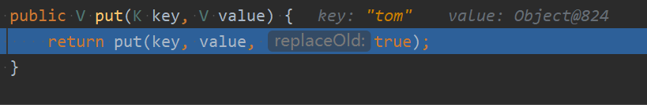
	* 同样执行上述代码

	
	* 此时root不再为空，所以不执行`addEntryToEmptyMap(key, value);`，直接进入比较，也就是红框的代码
	* 因为我们传入的有参构造器是传了一个Comparator的匿名内部类进行，所以图中的cpr并不为空，会进入if依据的代码块。不会进入到else的代码块。接下来会向详细讲述if语句块

	
	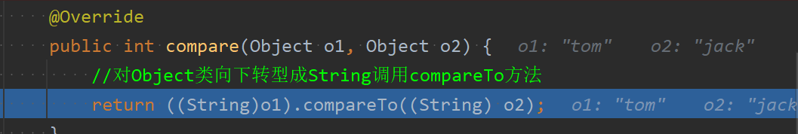
	* 可以从图中看出，cpr就是我们的匿名内部类（对象），执行cpr.compare()方法时会动态绑定到匿名内部类（对象）comapre，那么就会调用到匿名内部类重写的compare方法
	* 因为红黑树是一棵平衡二叉搜索树，再加上阅读源码可以知道：**如果comapre方法中写的是`((String)o1).compareTo((String) o2)`,即用o1去比较o2，那么比较完的排序效果就是：逐字符比较它们的 Unicode 值，按照Unicode 值从低到高升序排列；反之则从高到低排序

#### 变式：假如将制定的规则如下图所示，那么产生的效果如下：

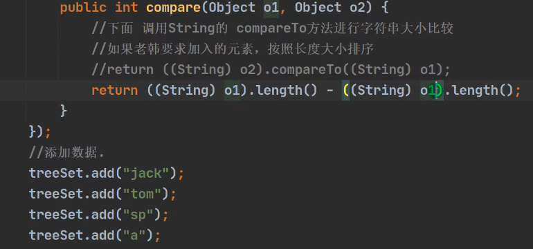
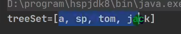
* 那么对于上图的数据，就会有以下的输出结果

那么如果此时向set中添加一个abc会产生什么样的效果呢？

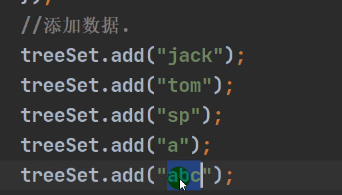
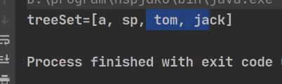
* 没有加入进去的原因：由于匿名内部类中重写compare()方法，其指定的规则为：返回二者字符串长度的差值。也就是说改规则认为：只要长度相等，就是相同的元素。
* 所以对于相同的两个字符串执行下图代码时，他会通过compare(0比较后返回0，即cmp=0。所以会执行setValue()方法，但是由于在set中的value都是由占位符`PRESENT`来占位，所以相当于没有任何操作，key值并没有发生替换，所以相当于什么都没发生。所以并没有将abc加入到treeSet中。

	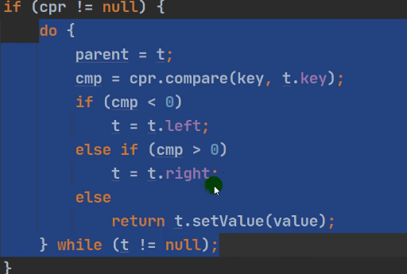

注：对于TreeSet的底层结构详解将在TreeMap详细讲解，因为TreeSet的底层结构就是TreeMap。此处只重点讲解了这个Comparator的匿名内部类在底层源码的作用以及应用位置

## 3）TreeMap
TreeMap类的类继承关系如下图所示

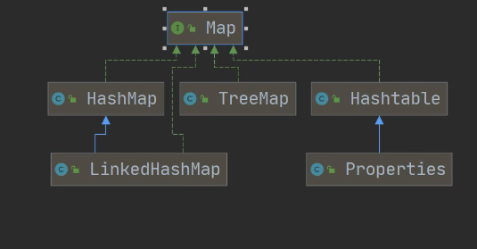

下图为TreeSet类的构造器一览

* 图中红框内的两个是十分常用的两个构造器，接下来会一一进行讲解

### 1.构造器讲解
#### （1）无参构造器
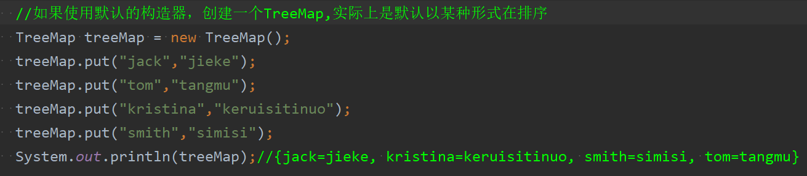
* 从图中可以看到，当调用无参构造器创建TreeMap对象时，打印的结果是无序的
#### （2）有参构造器
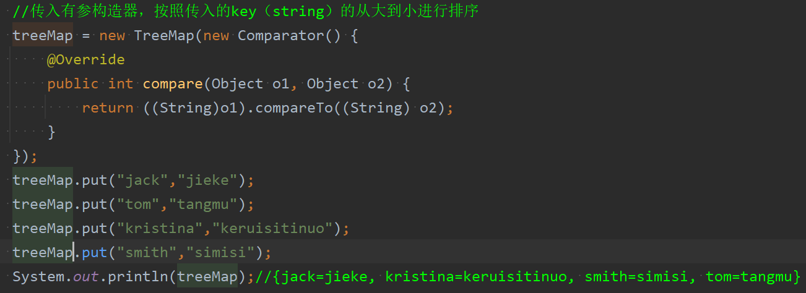
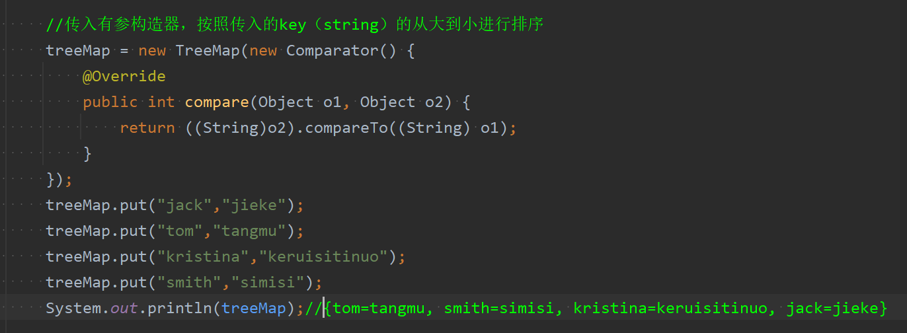
* 如果希望treeSet元素，按照字符串大小（即一个一个字母来比较，按照字母表来排序）来排序，就需要**使用TreeSet提供的一个构造器，可以传入一个比较器Comparator（即匿名内部类），并制定排序规则（比如按照compare的方法去比较，按照字符串长度去比较）**，具体指定的排序在下面源码解析时会进行讲述
* 对于compareTo()方法的具体用法，详情请见[03String类](../04常用类/03String类.md)

### 2.底层代码解读
首先必须要记住的一点是：**`TreeMap` 的底层实现是 **红黑树（Red-Black Tree），它是平衡二叉搜索树的一种，能够保证插入、删除和查找操作的时间复杂度为 O(log n)**。

以下下列代码为例来讲解传入Comparator接口的匿名内部类的机制

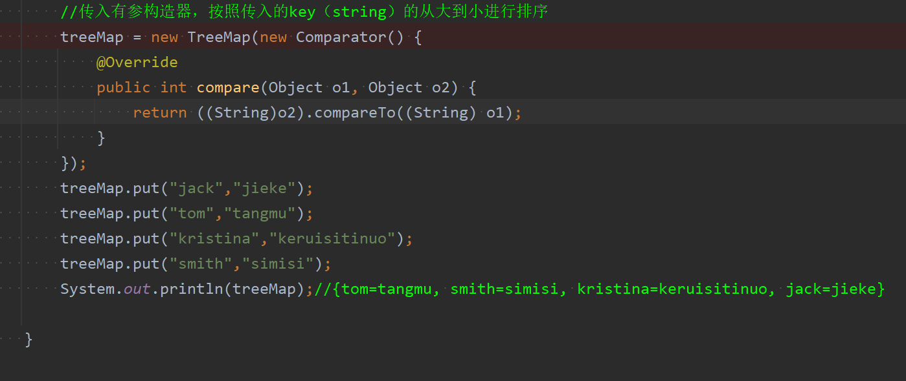

1. 首先进行断点调试进入该有参构造器的内部，得到下面的底层代码
	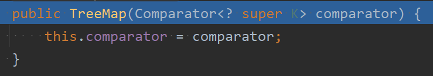
	*  TreeMap类的有参构造器会把传入的实现了Comparator接口的匿名内部类（对象），赋给了TreeMap的属性this.comparator
	

2. 接下来执行第一个put方法`treeMap.put("jack","jieke");`

	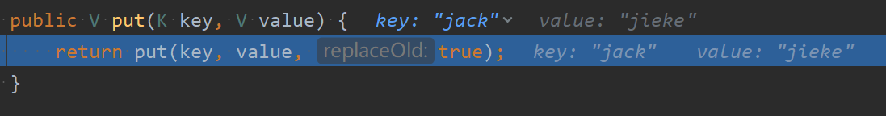
	
	* 此时进入到TreeMap的put方法，由于**TreeMap的底层实现是红黑树，是一种自平衡的二叉搜索树**，所以他会有一个根节点root。由于之前没有任何元素的插入，所以root肯定为空，所以调用`addEntryToEmptyMap(key, value);`将该节点加入的空数当中
	* 涂黑的代码就不会执行

3. 执行第二个put方法`treeSet.add("tom");`

	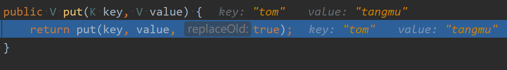
	* 同样执行上述代码

	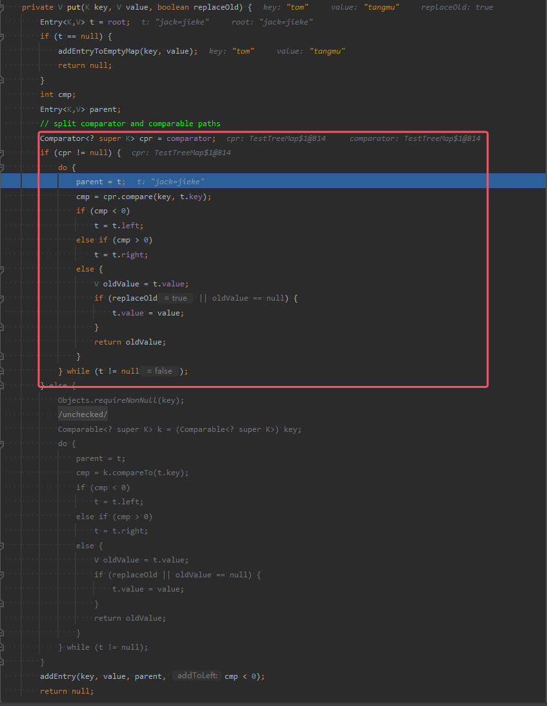
	* 此时root不再为空，所以不执行`addEntryToEmptyMap(key, value);`，直接进入比较，也就是红框的代码
	* 因为我们传入的有参构造器是传了一个Comparator的匿名内部类进行，所以图中的cpr并不为空，会进入if依据的代码块。不会进入到else的代码块。接下来会向详细讲述if语句块

	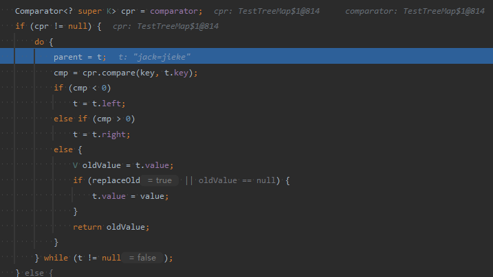
	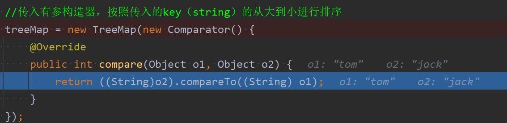
	* 可以从图中看出，cpr就是我们的匿名内部类（对象），执行cpr.compare()方法时会动态绑定到匿名内部类（对象）comapre，那么就会调用到匿名内部类重写的compare方法
	* 因为红黑树是一棵平衡二叉搜索树，再加上阅读源码可以知道：**如果comapre方法中写的是`((String)o1).compareTo((String) o2)`,即用o1去比较o2，那么比较完的排序效果就是：逐字符比较它们的 Unicode 值，按照Unicode 值从低到高升序排列；反之则从高到低排序
	* **如果cmp为0，也就是当前key和准备添加的key被判定为找到相同元素，那么则替换改Entry结点的value，并返回oldvalue

