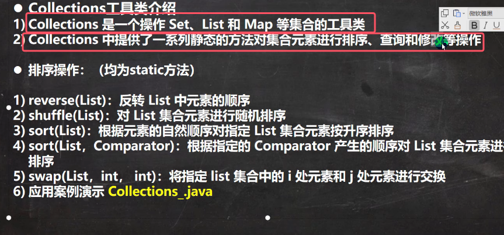
* 注意：**Collections类与Collection接口不是一个东西，一个是工具类，一个是Set和List的父接口**
* **Collections工具类的方法都是静态方法，他的应用范围为所有集合（包括List、Set、Map）**、
* 注意**上图中的所有方法都是只有LIst集合可以用，因为只有List集合有序**

接下来以下面的代码为例讲解常用到的几个该类的静态方法：

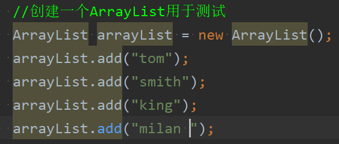

1. reverse(List)：反转集合中的元素顺序

	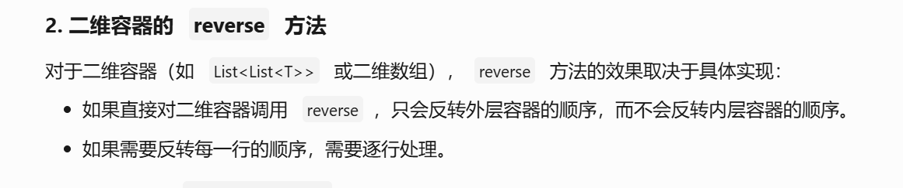
	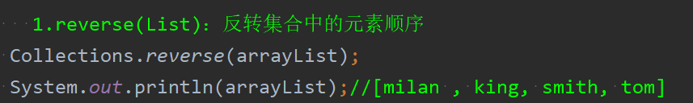
	* 注意：对于一维容器来说，该方法就是翻转集合中的元素顺序；而对于二维容器来说，只会翻转外层容器的顺序，而不会翻转内层容器的顺序

2. shuffle(List):对List集合进行随机排序

	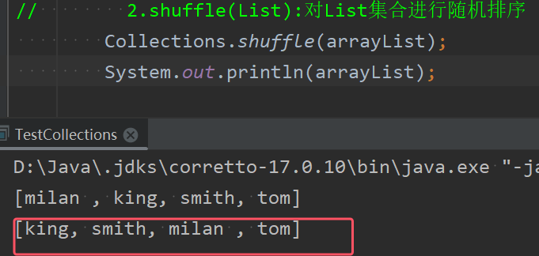
	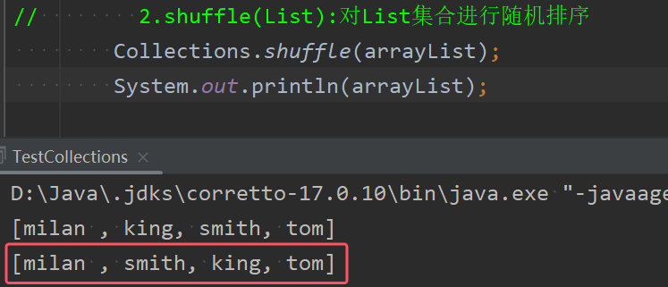
	* 可以从图中看出确实是对List集合进行了随机排序

3. sort(List):根据元素自然排序对制定List集合元素按升序排序

	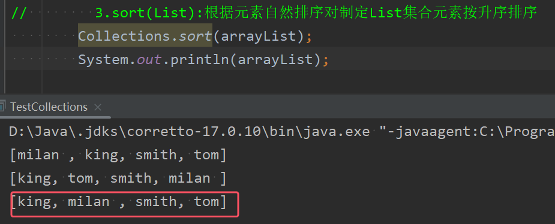
	* 自然排序就是按照字符串大小升序进行排列

4. sort(List, Comparator):根据制定的Comparator产生的顺序对List集合元素进行排序 。比如按照字符串长度大小来排序

	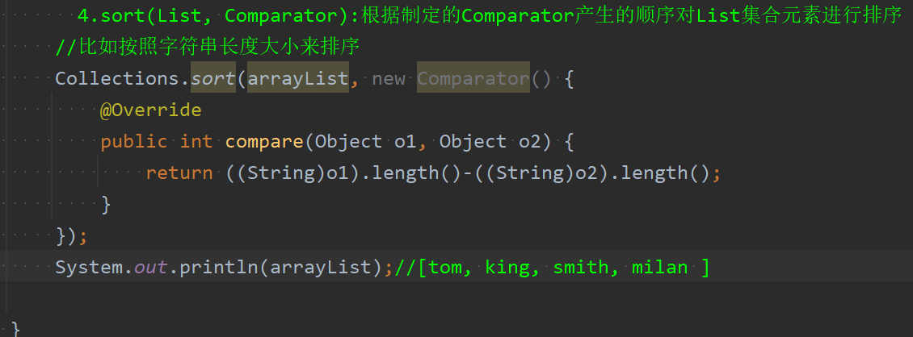
	* 注意：无论是怎么样的排序规则，o1-o2就是升序排列，反之就是降序

5. swap(List,int,int):指定List集合中的i处元素和j处元素进行交换

	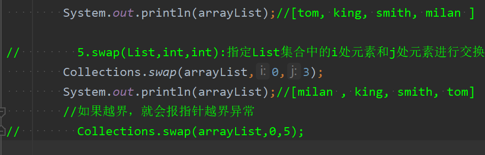
	* 如果越界操作，那么就会报指针越界异常

****

1. Object max(Collection):根据元素的自然顺序，返回给定集合中的最大元素

	

2. Object max(Collection,Comparator):根据Comparator指定的顺序，返回给定集合中最大元素，比如返回字符串长度最大的元素

	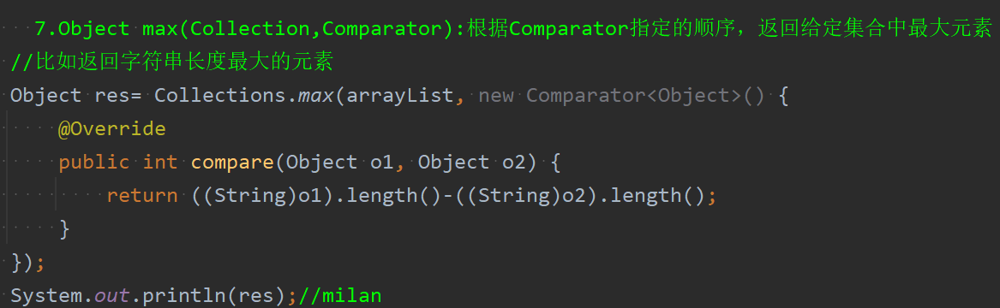

3. min与max同理，都有上面两个重载的方法，此处就补在赘述
4. int frequency(Collection Object)，返回指定集合中指定元素的出现次数

	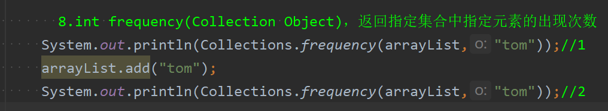

5. void copy(List dest, List src):将src的内容拷贝到dest中

	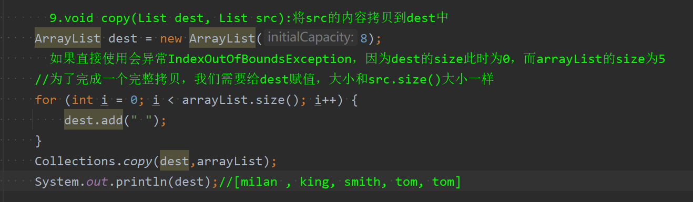
	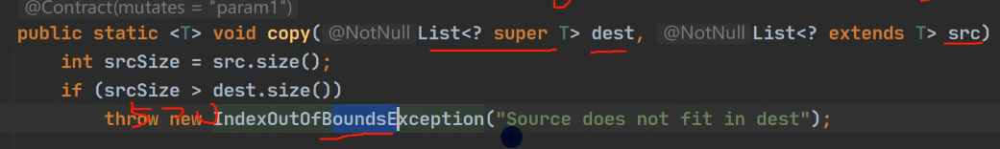
	* 如果直接使用会异常IndexOutOfBoundsException，因为dest的size此时为0，而arrayList的size为5
	* 为了完成一个完整拷贝，我们需要给dest赋值，大小和src.size()大小一样

6. boolean replaceAll(List list,Object oldVal,Object newval):使用新值替换List对象中的所有旧值

	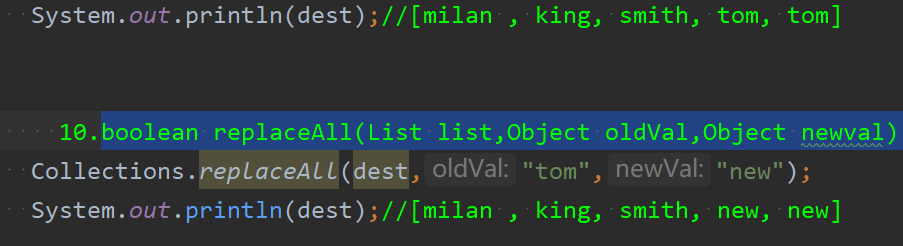