## 1）泛型综述

* 对于第四点的具体体现如下图所示：

	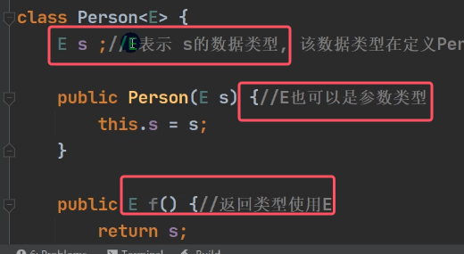

泛型的理解：**泛型的具体数据类型在类声明或者实例化的时候指定即可。也就是在编译期间，编译器就会确定E是什么类型**。具体的例子如下图所示

	
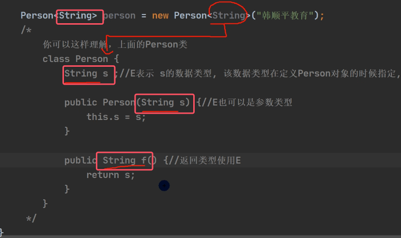
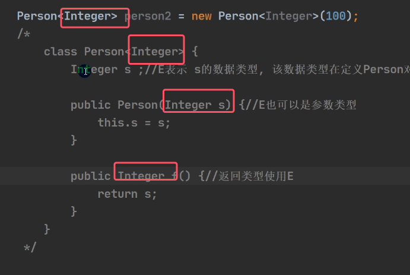

## 2）使用细节
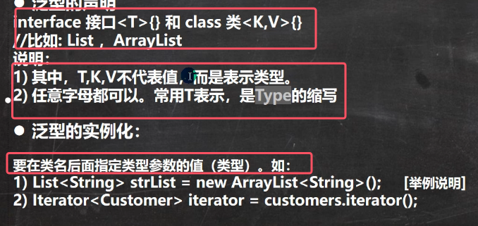
 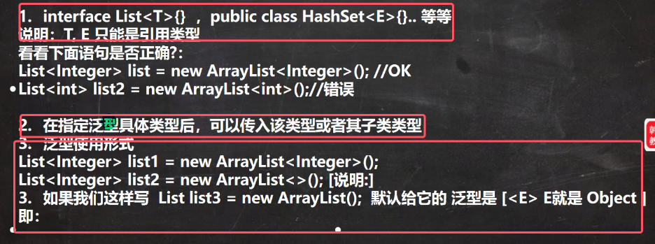
 * **泛型的具体指定类型只能是引用数据类型，而不能是基本数据类型**
 * **在指定泛型的具体类型后，可以传入该类或者该类型子类都行**

	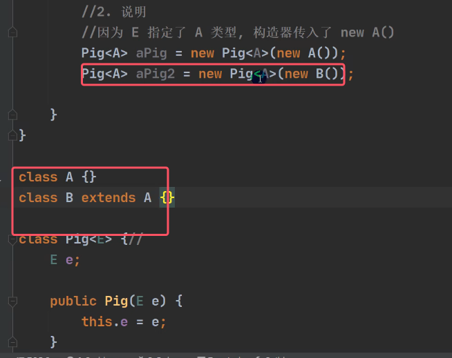
 * 实际开放中往往简写成以下形式，推荐使用；

	
* 如果未用`<>`的给泛型指定类型的话，那么就默认为Object

	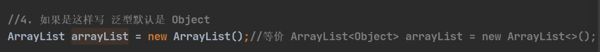

## 3）自定义泛型

### 1.自定义泛型类
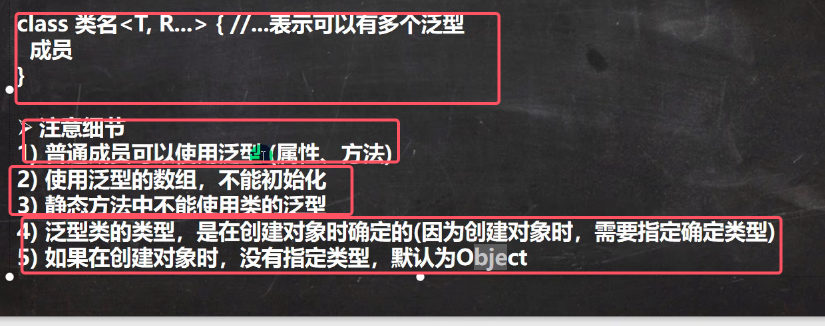
* **普通成员可以使用泛型（普通成员包括属性和方法）**，属性就可以指定泛型类型的变量，方法使用泛型包括参数使用泛型，返回类型使用泛型。

	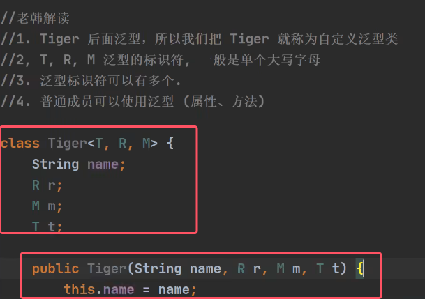
* **在使用泛型的数组，不能初始化（实例化)**（因为不确定到底是什么类型的值，无法为其分配内存空间）

	
* **静态成员（属性和方法）不能使用类的泛型**，原因如图所示（因为静态是和类的相关的，在类加载时，对象还没有创建，而泛型只有在对象被创建时才被指定什么类型）

	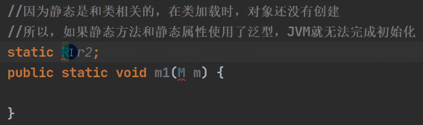

### 2.自定义泛型接口
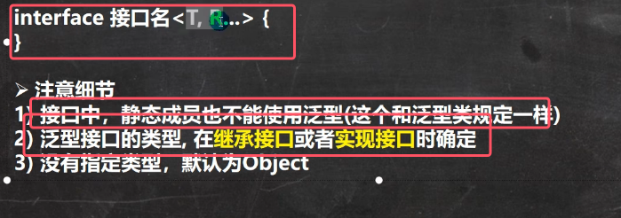
* 接口中同样的，静态成员不能使用泛型

	
* **泛型接口的类型，在继承接口或者实现接口时确定**

	
	
* 没有指定类型，默认为Object

	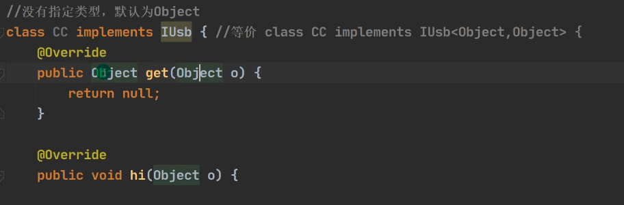

### 3）自定义泛型方法
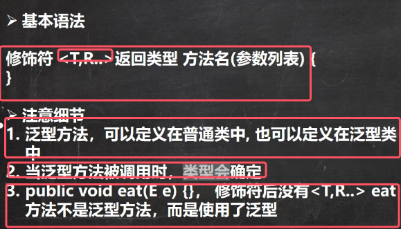
* 泛型方法可以定义在泛型类中，也可以定义在普通类中。**一旦在方法中定义了泛型，那么这个方法的参数和返回值都可以设置为泛型**

	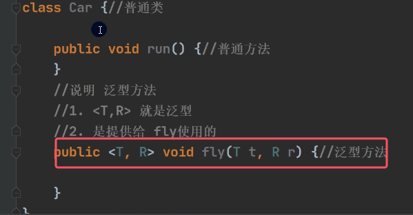
	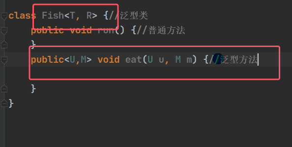

* 对于第二点，调用泛型方法时，不需要像泛型类那样告诉编译器是什么类型，编译器可以自动推断出类型来。

	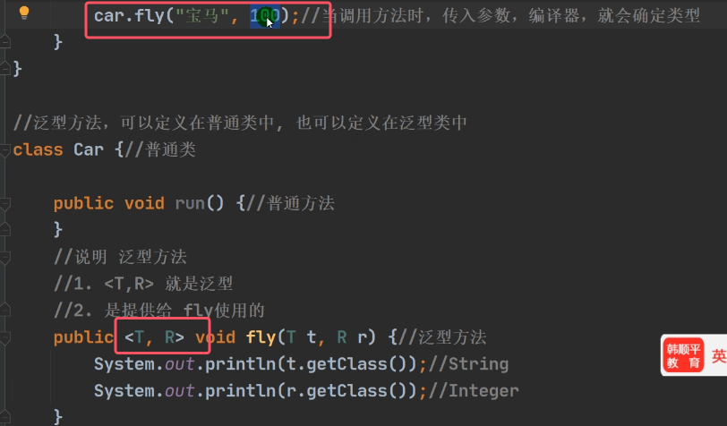

* 注意：**对于第三点，一定要分清楚泛型方法和使用泛型的差别**

	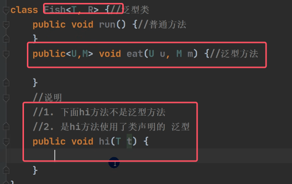
	

* 对于泛型方法，可以同时使用类声明的泛型和自己声明的泛型

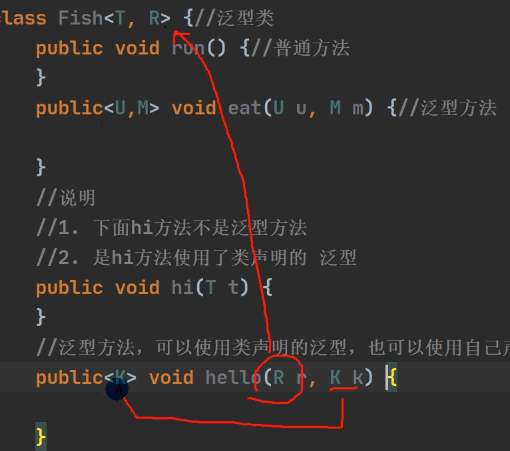

### 4）通配符

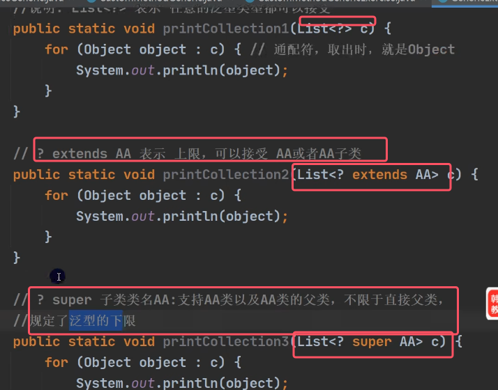
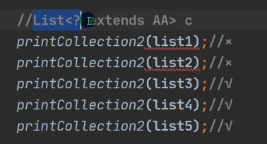
