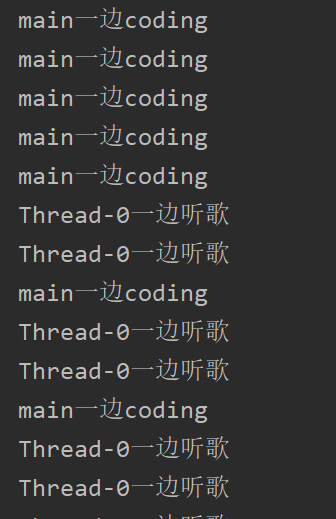
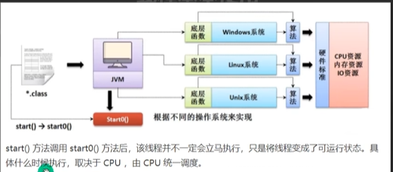
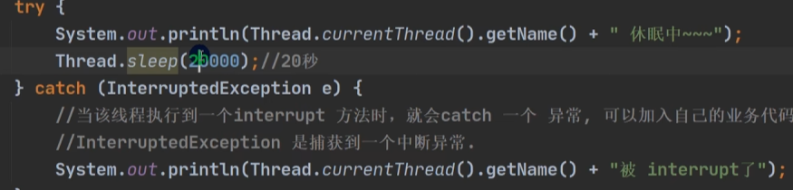

## 1）多线程机制

### 1.继承Thread类来创建线程
下面以例子的形式来来讲解如何创建线程来

1. 让一个类继承Thread类，并重写run方法

说明：  
* Thread类属于java.lang包，继承与Object类，也实现了Runnable接口  
* 2.**每个线程具有优先级，优先级越高的CPu可能分配的概率就大一点，但不代表就一定会优先执行  **
* 3.**run方法写的就是需要开辟线程同时进行的代码块**

2. 接着在main方法中该类对象，并且调用start()方法来启动线程

* 说明：在**调用start()方法启动线程**后，后面会跟一个for循环20次打印不同的内容

3. 输出结果如下图所示：

#### （1）上面的现象进行分析
首先对上面的代码画出程序的示意图，具体如下图所示

* 当main线程(主线程名字默认就叫main)启动一个子线程thread-0(调用`Thread.currentThread().getName()`获得的子线程名字)后，**主线程不会阻塞，会继续执行。这是主线程和子线程交替执行(并发)**
* **多线程里面，主方法main结束，该进程不一定结束了，因为还有子线程在继续运行，并不会造成整个应用程序的结束**。所以可以看到上面的输出结果中，在main方法执行完，子线程thread-0还在执行

#### （2）解释为什么调用的是start()而不是run()方法
我们不是继承的Thread类并且实现的run(0方法吗，为什么是调用satart()方法来启动线程呢？接下来会对该问题进行剖析

对上述代码进行断点调试来看一下源码，具体如下图所示：

* 从图中可以看出，start()方法调用了start0()方法
* `private native void start0();`是本地方法，由JVM调用，底层是c/c++实现
* 换言之：真正实现多线程的效果的方法是start0方法，而不是start0方法。start2内部会调用run方法
* **得到结论：start()方法首先启动线程，然后会自己调用run方法 **

那么随之而来的疑问就是：那我直接调用run()方法会怎么样呢？下面就是将上图代码中的`st.start();`换为`st.run();`的结果。

对上图的输出结果的分析：  
* **run(）方法本身就是第一个普通的方法，没有真正的启动一个线程。所以对于上面的代码，就会吸先把润方法执行完毕，再向下执行，并且调用**`Thread.currentThread().getName()`得到的线程名是main而不是thread-0

 
#### (3)  start方法的使用细节
 * start方法会自己调用run方法  
* start方法不保证立即执行，CPu调度器来调度。因为开启线程后，具体什么时候执行是交给CPu调度器去调度的  主程序不
* 会等start()执行完在执行，而是交给CPu调度器以后直接往下继续执行  两个线程各运行各的  
* 普通run方法调用,此时必须执行完run方法才会继续往下执行

#### （4）总结：创建线程的方式一

1. 创建：继承Thread+重写Run,  
 2. 启动：创建子类对象+调用start方法  

### 2.继承runnable接口来创建线程

* 因为java具有单继承的缺点，当需要类继承其他类时需要重构代码

下面以例子的形式来来讲解如何通过实现Runnable接口创建线程

* 由上面的类继承关系可以知道，Runnable接口只有run方法，但没有start方法。所以会用以下的方式来启动县城

1. **创建一个thread对象，把实现Runnable接口的对象放入thread对象的构造器**
2. **利用然后调用thread的对象的start方法，就可以启动县城**

##### 接下来讲解为什么可以这么用的原因
**首先明确：这里的底层使用了设计模式：静态代理模式**

用代码模拟实现Runnable开发线程的机制。具体如下

* 只要thread的构造器传了实现Runnable接口的实现类对象，那么就会像图中那样去执行代码

##### 总结实现Runnable接口，来创建线程的方式
1. 创建：实现Runnable接口，重写run方法  
2. 启动：创建实现类对象（构造器传实现类对象），+Thread对象+调用Thread对象的start

## 2）终止线程的做法

通知线程终止的做法：  
1. 提供的stop和destroy方法（已过时,不要使用）  
2. 给循环加一个控制中指的变量boolean，当为false时停止循环

* flag变量为对外提供的表示，并且提供了更改falg变量值的方法`Terminate()`

* 外界通过该方法来使得线程终止

### 3）线程常用方法
#### 第一组方法 

##### 1. set和getPriority方法
1. java提供一个线程调度器来监控简称启动后进入就绪状态的所有线程，线程调度器按照线程的优先级决定优先调度哪个线程来执行  
2. 注意：优先级低只是意味着获得优先调度的可能性低，并不是绝对先调用优先级高后调用优先级低的线程
3. 线程的优先级用三个常量表示，范围从1到10  
	* Thread.MIN_PRIORITY=1  
	* Thread.NORM_PRIORITY=5(默认)  
	* Thread.MAX_PRIORITY=10  
4. 优先级的调用设定建议在start()之前  
##### 2.sleep()是现成的静态方法,用于使该线程休眠

##### 3.get和set线程的name

* sleep()方法必须要用try-catch块去包围，用于捕获异常

###### 4.interrupt用法
用于中断线程，但没有真正的结束线程，**所以一般用于中断正在休眠的线程**，

* 从上面的图可以看出：当子线程在休眠时，父线程可以调用interrupt方法用于来使子线程结束休眠，但是这是一个异常，子线程会捕获这个异常然后执行catch块，然后接下来继续执行语句，相当于中断该线程的休眠

#### 第二组方法

##### 5.yield()方法

注意点：
1. yield()方法是静态方法
2. 礼让线程，是让当前正在执行的线程暂停，并不是阻塞线程，而是将**当前线程线程从运行状态转入就绪状态**，   
3. cpu调度器重新调度，有可能重新调度以后还是自己的线程（这就是为什么图中，让出cpu不一定会让成功）

	

##### 6.join()方法
以下面的代码为例讲解

* 从图中可以得到如下结论：
1. join是THread类的成员方法，所以使用需要用实例对象
2. **调用线程会被阻塞**：  
    当线程 A 调用线程 B 的`join()`时，**线程 A 会被阻塞**，直到线程 B 执行完毕或超时。
   **其他线程不受影响**：  
    其他未调用`join()`的线程（如线程 C、线程 D）仍会正常运行，不会被阻塞。

### 4）守护线程

* 守护线程：是为用户线程服务的，比如后台记录操作日志、监控内存使用等
* **若有其他用户线程在运行**，守护线程会继续执行，直到所有用户线程结束。
* - **无法阻止 JVM 退出**：守护线程的存在不影响 JVM 的关闭，即使它们处于死循环中。

*  当没有设置god线程为守护线程时，主线程结束退出以后，子线程由于不是守护线程，其会一只执行下去
* 当把god线程设置为守护线程时，当me线程和主线程执行完退出以后，此时所有的用户线程都已经退出，所以JVM就停止执行程序，守护线程god线程自动终止

### 5）线程七大状态
线程的状态转换图图下图所示：

注：**官方文档是将Ready就绪和Running正在运行两个状态合称为Runnable状态，所以官方文档为6个状态**
* 线程对象一旦创建(Thread t=new Thread(st);)  
就进入新生状态--NEW 
* 就绪状态：当调用start方法，线程就进入就绪状态——READY，  但并不意味是会立即调度执行
* 运行状态：进入运行状态，线程才会执行线程体
* **阻塞状态：当该线程视图获得同步代码块的所，但该锁被其他线程占有，就回去进入BlOCKED状态**，**阻塞状态接触后，会重新进入就绪状态，等待CPu调度执行才进入运行状态  **
* 死亡状态：也就是线程体的代码执行完毕。一旦进入死亡状态，不能再调用start（）再次启动线程，如果在开启，那是一个新线程，而不是这个线程

