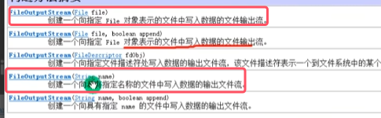
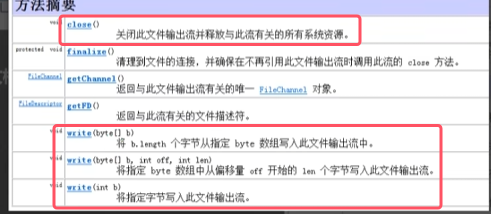
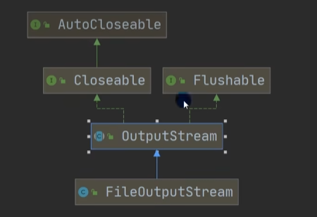
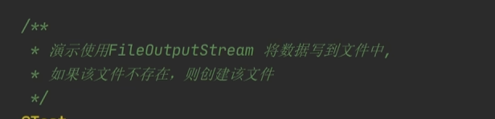
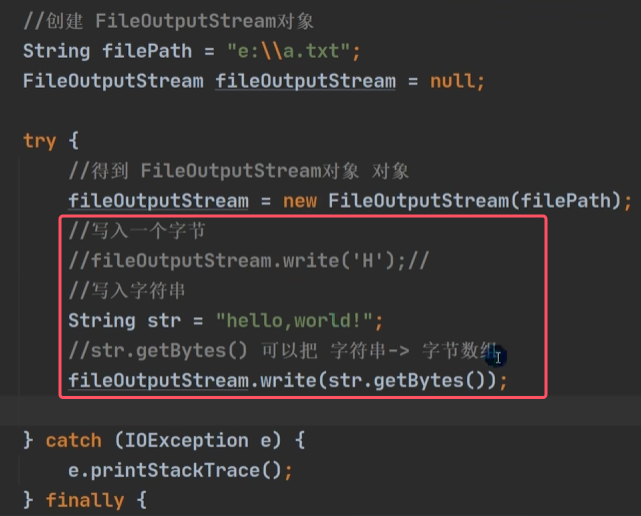
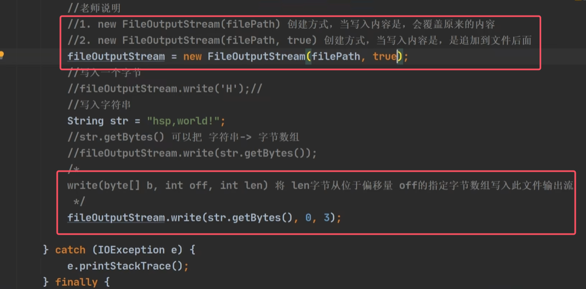
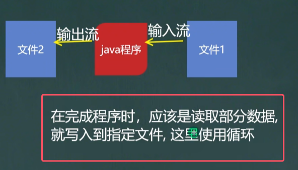
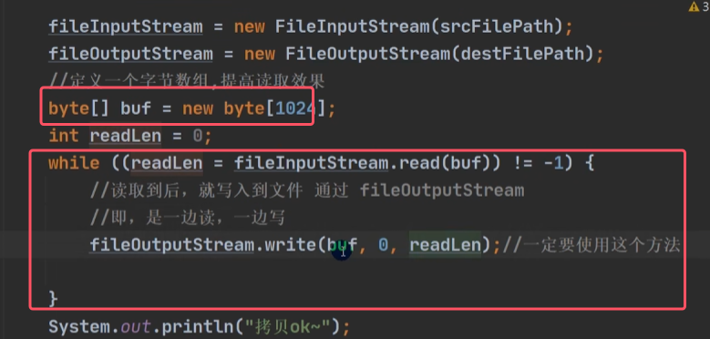
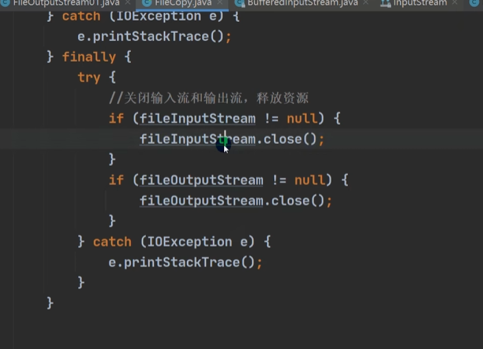
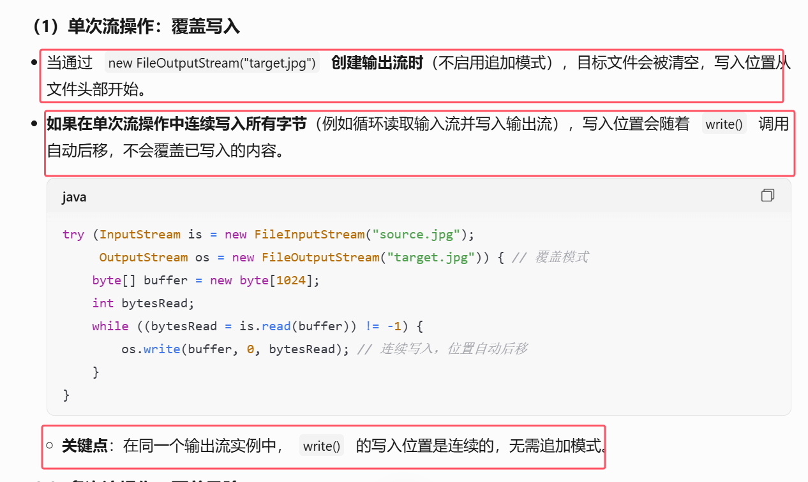

## 1）FileOutputStream

* FileOutputStream用于项文件中写入数据
* **无论是使用哪个构造器，如果该流在打开文件进行输出时，目标文件不存在，那么该流会创建该文件**

OutputStream子类继承图如下图所示

使用实例1：

使用实例2：

* 构造器中第二个属性是`boolean append`，代表是否是追加在文件的末尾

字节输入流输出流的综合应用如下图所示：

