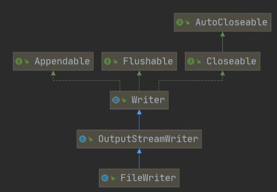
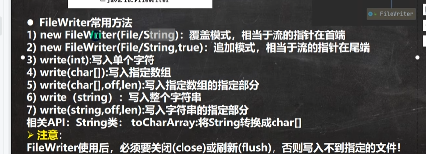
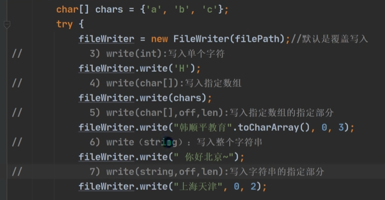
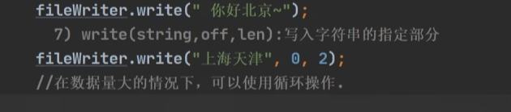
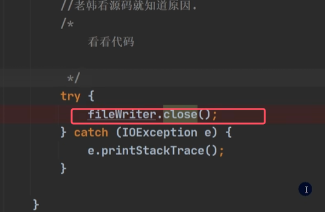
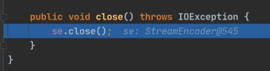
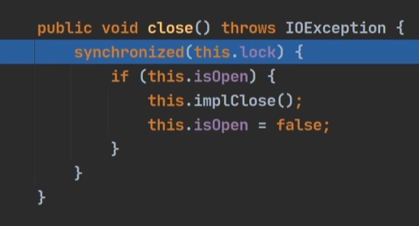
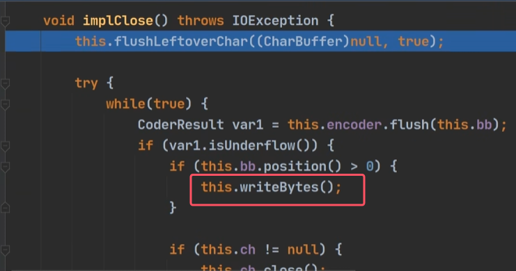
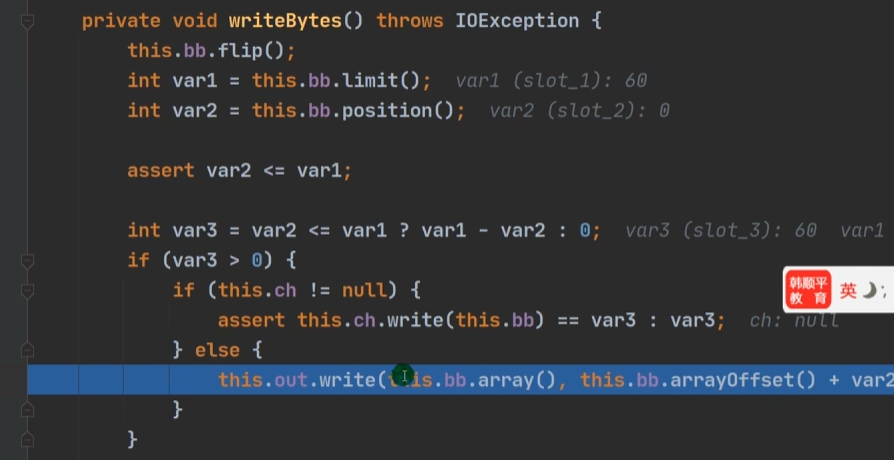

## 1）FileWriter

该类的构造器和相关方法

* **当使用write方法之后，写入的数据还没有真正写入，而是在内存当中，只有使用`close()`或者`flush`之后才会写入到指定文件**
* **无论是使用哪个构造器，如果该流在打开文件进行输出时，目标文件不存在，那么该流会创建该文件**

使用实例：

对于为什么只有使用`close()`或者`flush`之后才会写入到指定文件，原因如下：

进行调试源码分析

* 这个writebytes方法才是在真正的向文件里面写入数据，flush方法也是也是同样调用该方法。所以只有调用它们才会向文件中写入内容

