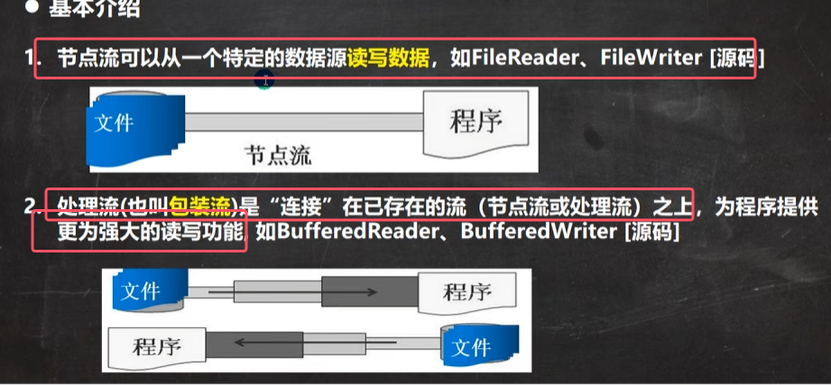
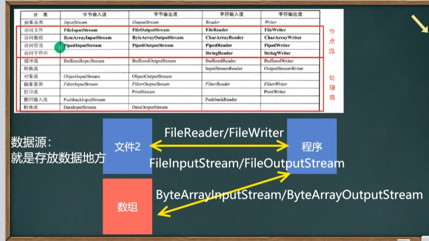
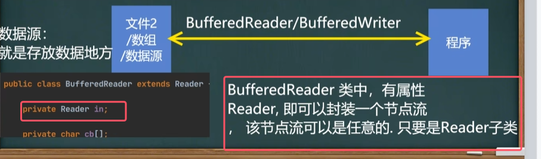
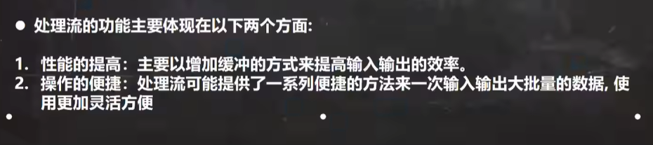
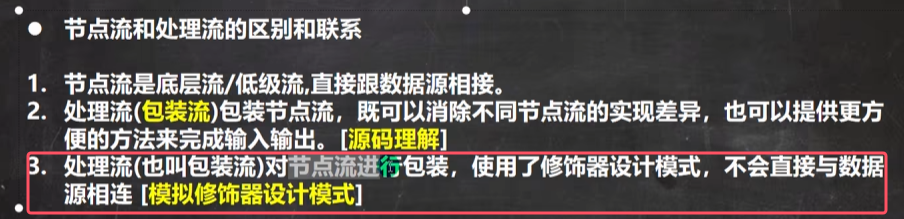

* 对于数据源的具体理解，可以看下面的图

* **包装流就是对节点流进行一个包装，拥有更加强强大的读写功能**
* 注意：图中只给出了字符流对应的包装流，其实字节流也有对应的包装流

包装流都是对应抽象类的子类，比如BufferedWriter就是Writer的子类，相当于和FileWriter同级

* 注：那个char[]就是所谓的buffer的缓冲
* **并且包装流可以对任何一种节点流可以包装，可以是对任何数据源进行读写，只需要包装对应的节点流**
* 节点流不只是有BufferedWriter，还有其他的，后面学的都是包装流

