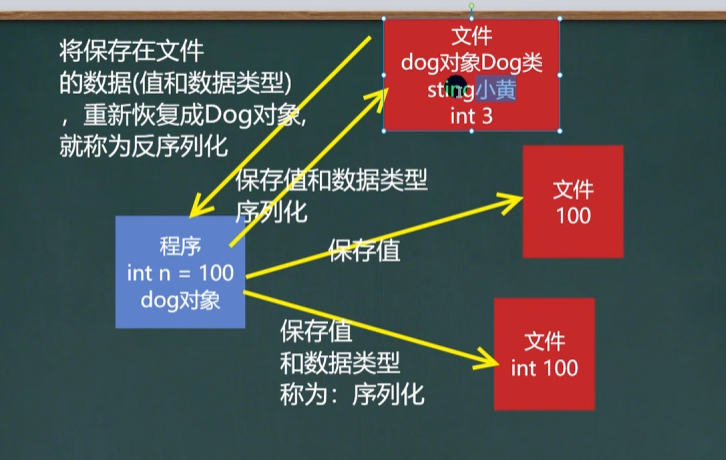
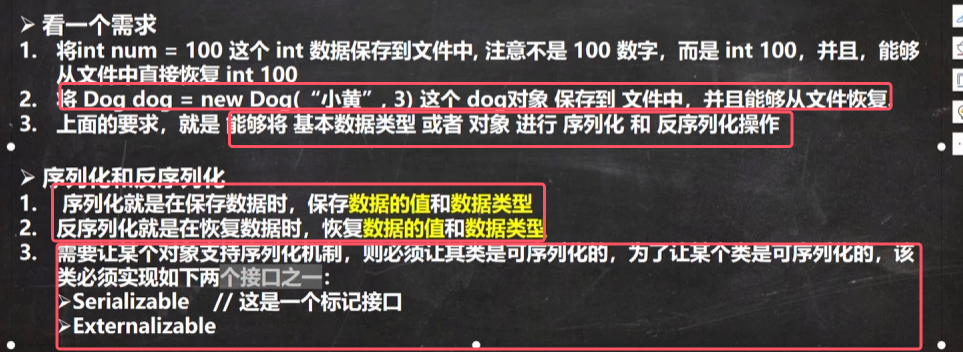
* 推荐使用Serializable，是一个标记接口，里面没有使用方法；而Externalizable接口有方法需要实现，因此我们一般使用Serializable

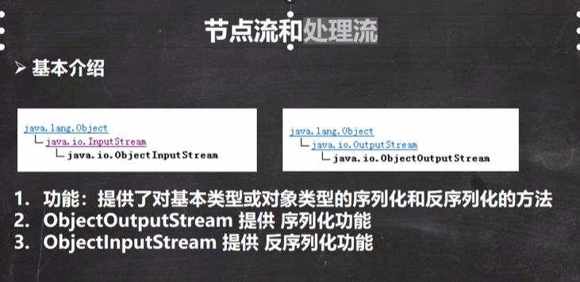
* **ObjectInputStream和ObjectOuyputStream是包装流**
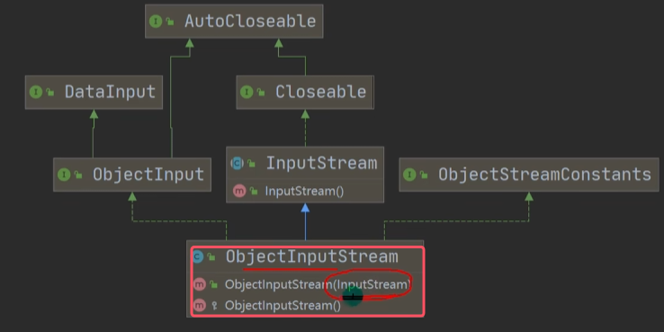
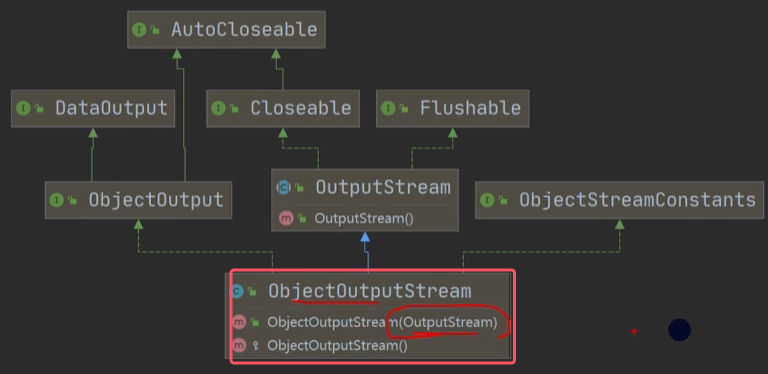

* ObjectOutputStream使用实例
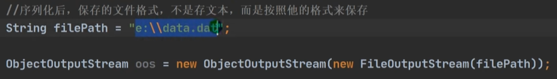
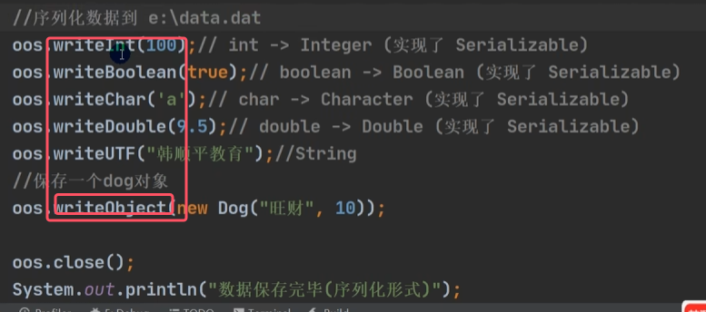
* **写进文件的对象的所属于的类必须实现Serializable接口或者Externalizable接口**
* 序列化写入的文件里面的内容直接看是乱码，而不是说文件名是按照它的格式去保存，而是文件内容按照他的格式去保存

* ObjectInputStream反序列化使用实例
 
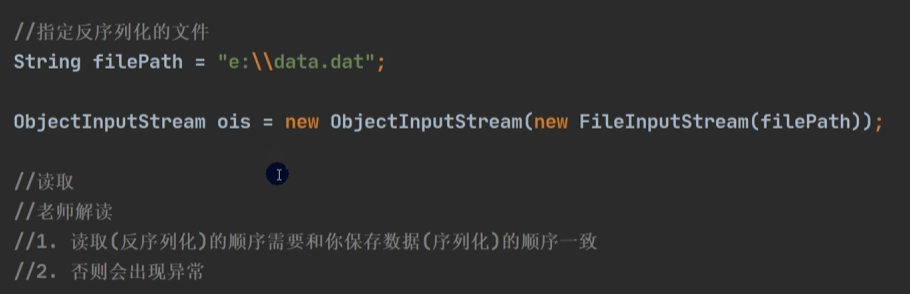
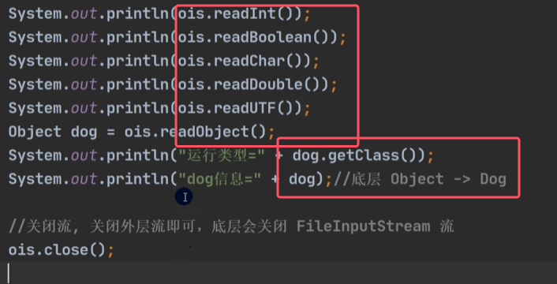
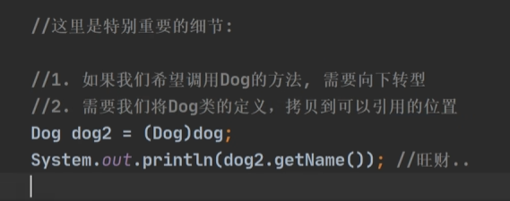

二者的使用细节：

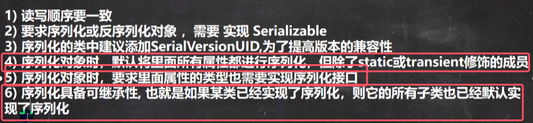
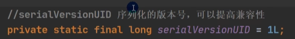
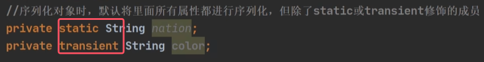