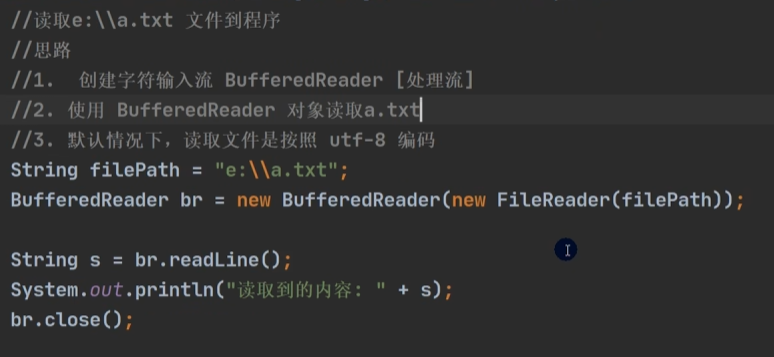
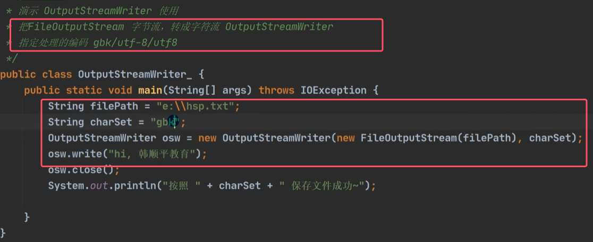

乱码问题引出转换流

* 编码方式改为gbk时会出现乱码，因为默认的读取文件是按照utf-8编码

* 二者都是包装流/处理流
* 两个转换流并且都是字符流
## 1）InputStreamReader

* 将传入的字节流对象，以指定的编码方式去读取，并且（包装）转换为字符流InputStreamReader

## 2）OutputStreamWriter
 
 将传入的字节流对象，以指定的编码方式去写入，并且（包装）转换为字符流OutputputStreamWriter

应用实例： 

