## 1.反射机制
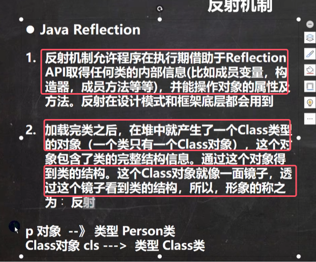 
* **Class对象时在堆里面，一个类只有一个class对象**

Java的**反射机制的原理示意图**下图所示

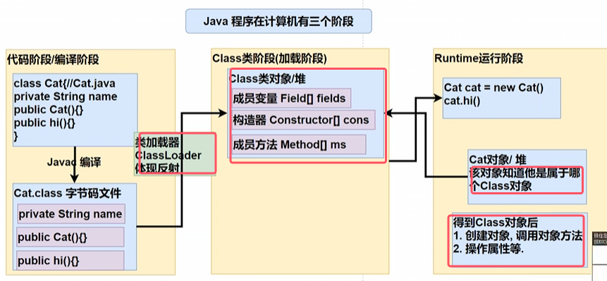

反射的用处：

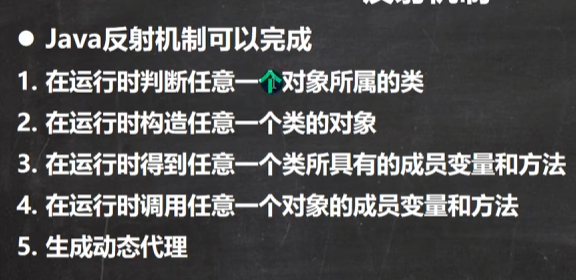

反射的优缺点：

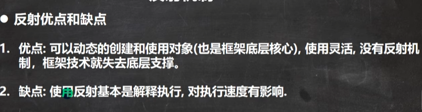
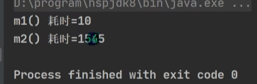

接下来进行反射调用优化，加快执行速度

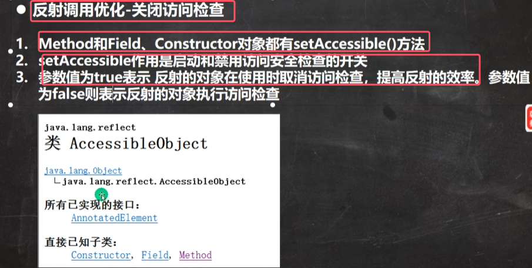
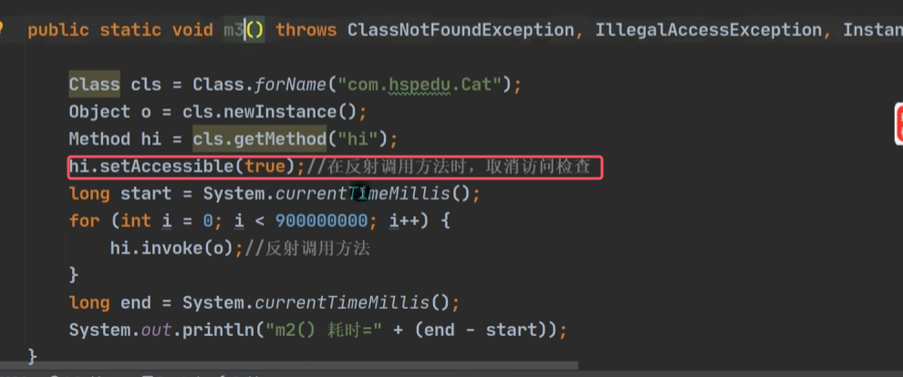

优化后的结果为m3

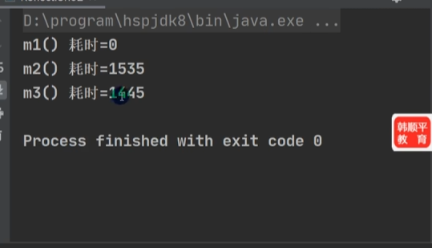
## 2.反射相关类
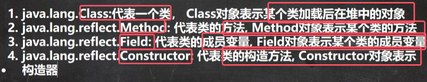

使用实例如下图所示

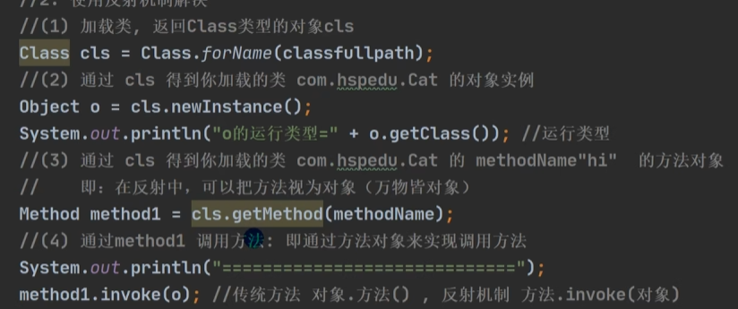

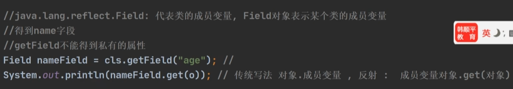
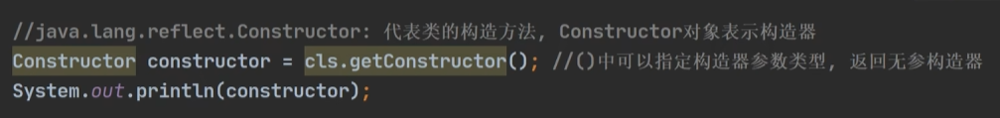
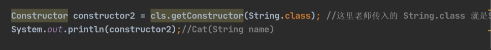
* 图中传入的String.class就是String类的class对象

 
