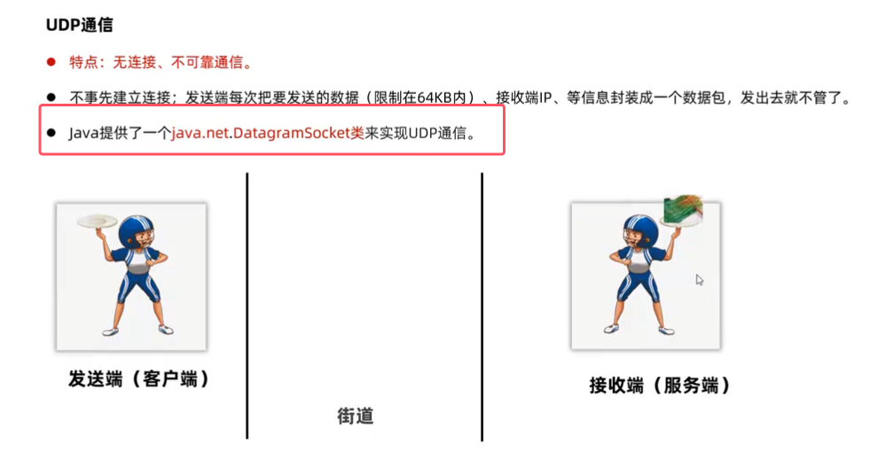
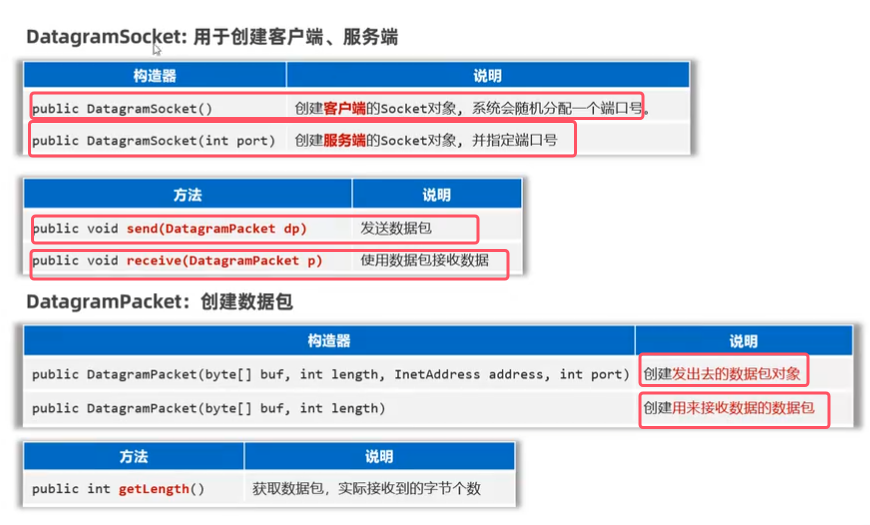
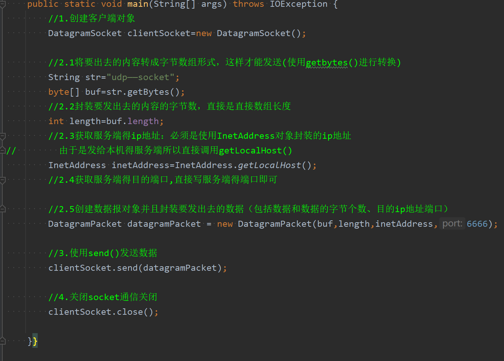
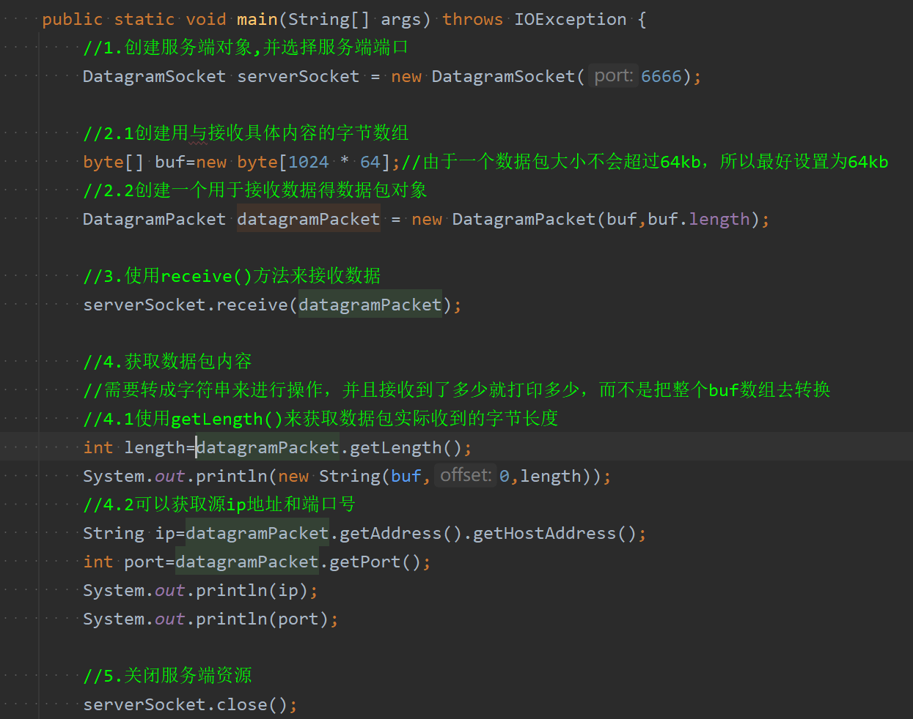
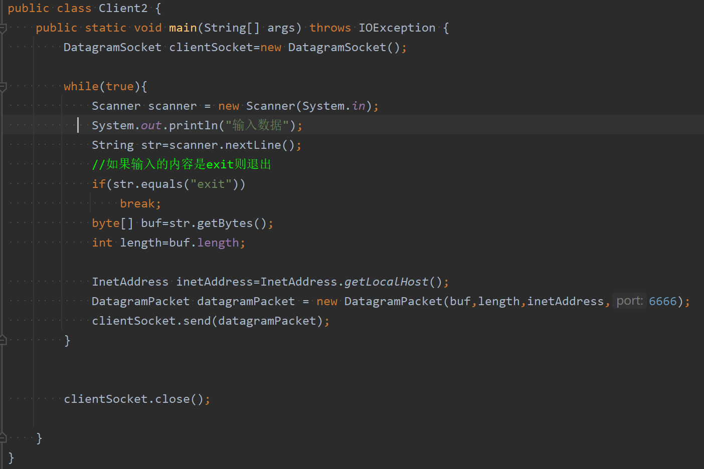
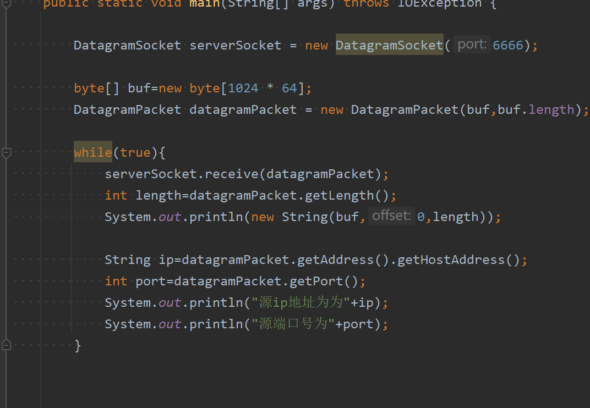

* 只要使用上图中的`DatagramSocket`类来进行网络通信，底层就会自动选择使用UDP协议来进行通信

#### 应用实例1——一发一收

* 应该先启动服务端程序，不然客户端发出去的数据包没有到服务端来接受
* `receive`方法在没有收到消息时**默认会进入阻塞状态，一直等待直到有数据报到达**。

### 应用实例2——多发多收

只需要使用使用一个while循环即可

