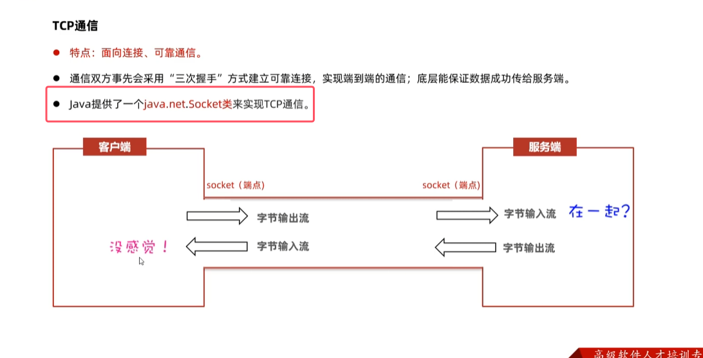
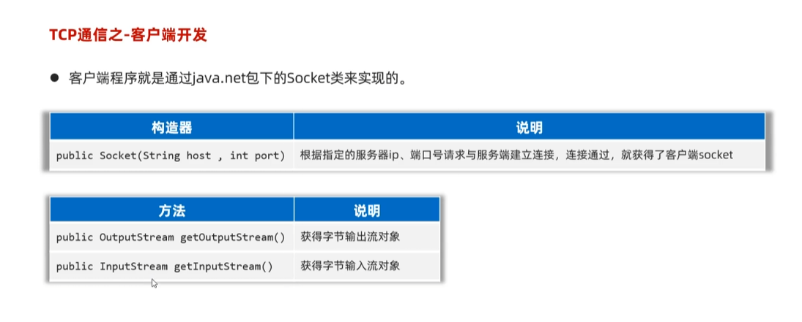
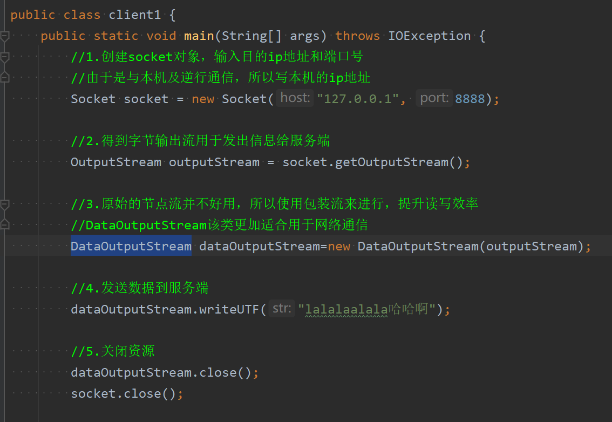
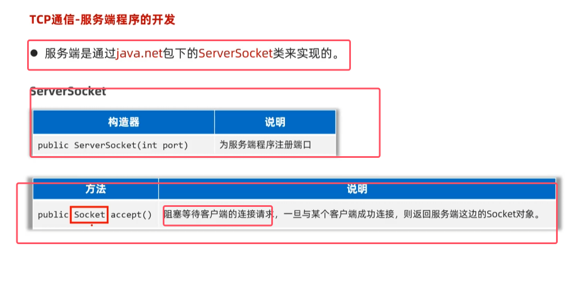
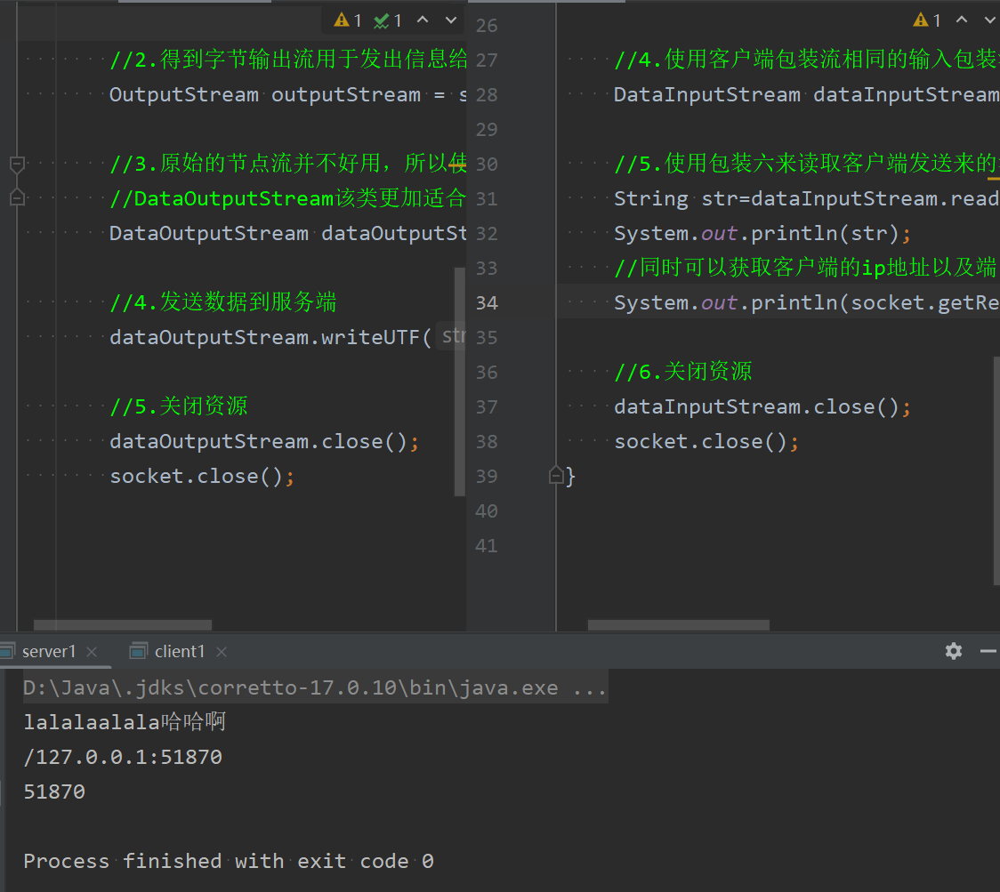
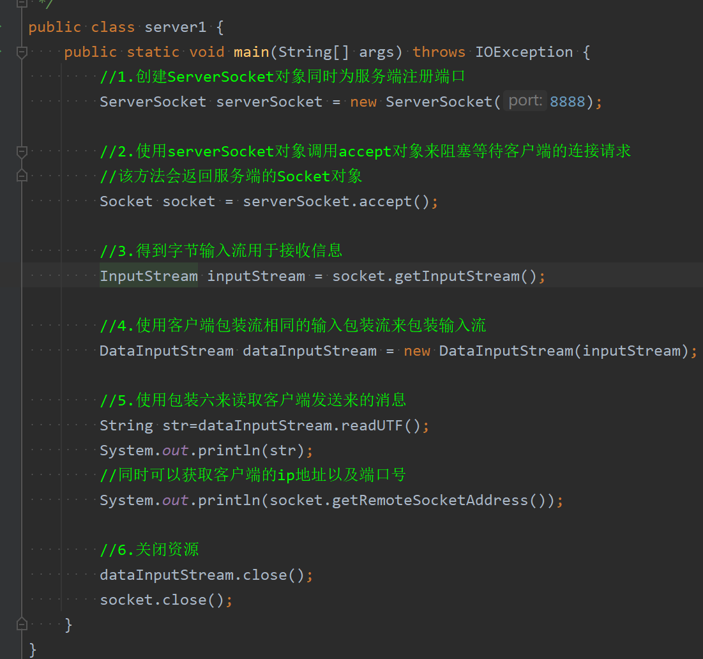
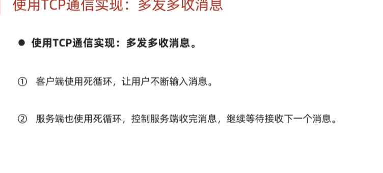
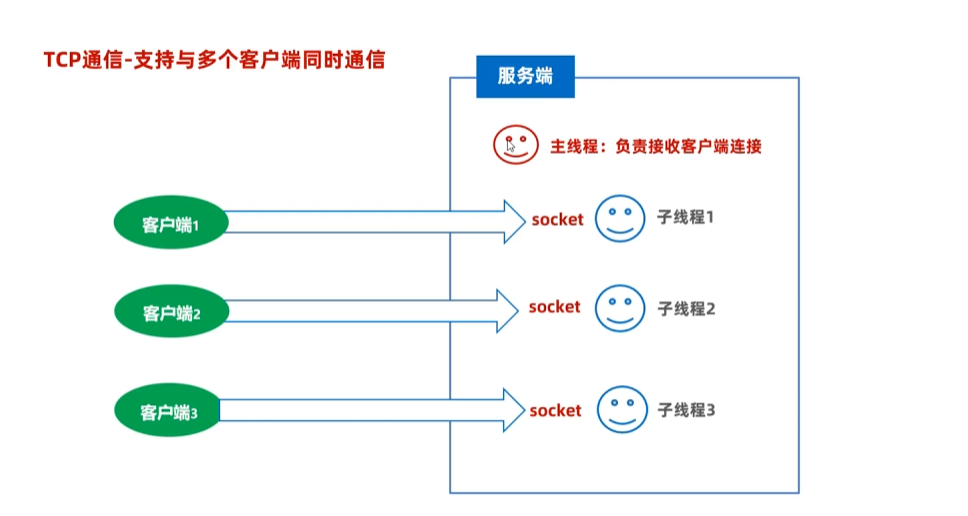
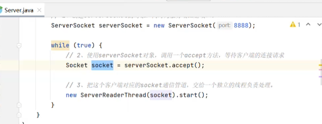
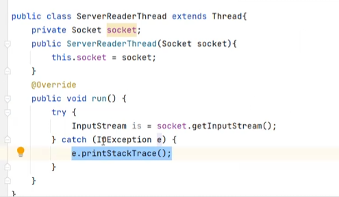

* 注意tcp通信时使用Socket类进行通信，而udp通信是使用DatagramSocket进行通信

### 客户端开发

* 在创建socke对象的时候就是与目的ip进行三次握手
* 在获得字节流后，最好使用包装流来进行包装，提升读写效率

### 服务端开发

* accept会阻塞等待客户端的连接请求

变式：多发多收的例子如下图所示

##### 实现服务端与多个客户端实现通信

* 主线程负责接收客户端请求。子线程负责接收客户端内容

* 处理数据的逻辑与上面相同