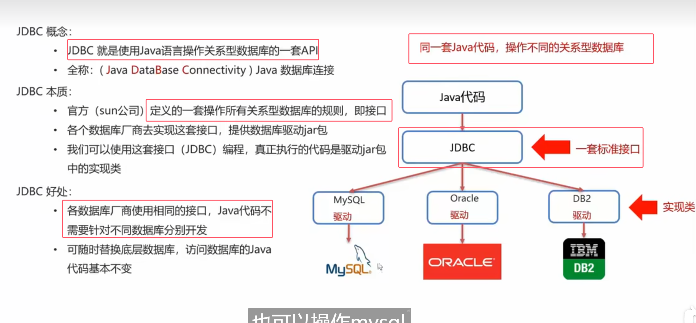
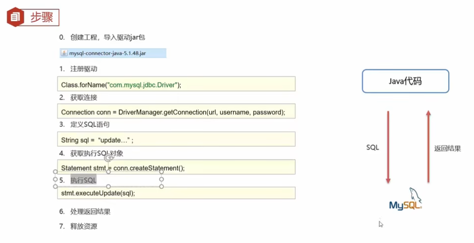
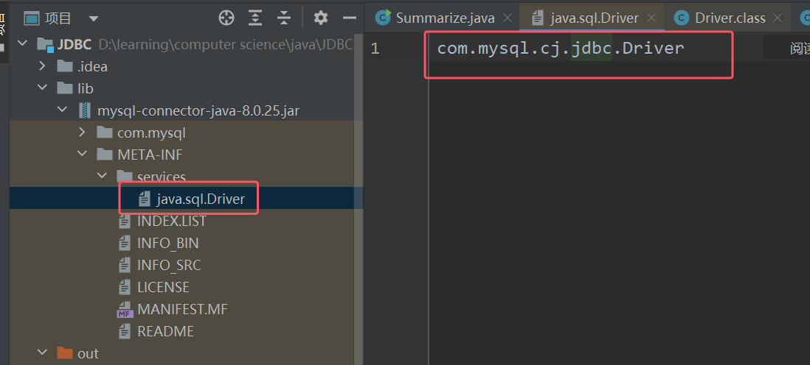
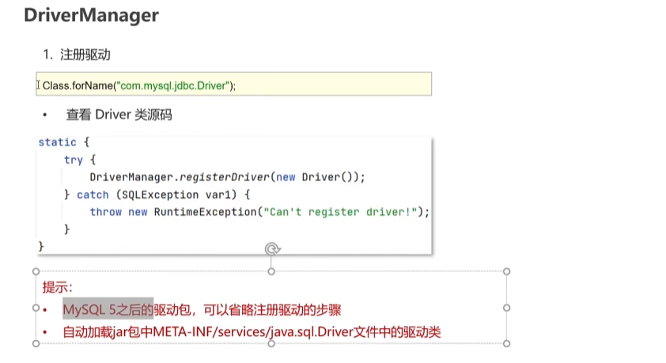

* 将来如果需要更换地才让数据库，代码基本不变，只需要切换导入的jar包即可
* **JDBC就是官方定义的一套用Java操作关系型数据库的接口**
* **每个关系型数据库的驱动通俗的讲就是对于JDBC接口的一个实现类**

### JDBC的快速入门


```java
//1.注册驱动：使用反射获得类,mysql的驱动是固定的.  
// com.mysql.jdbc.Driver是mysql5.版本的驱动，com.mysql.cj.jdbc.Driver是mysql8.0版本的驱动  
Class.forName("com.mysql.cj.jdbc.Driver");  
  
//2.获取连接的对象：DriverManager类的静态方法getConnection  
//参数：url：指定连接的数据库的ip地址、端口、数据路名称。user：用户名 password：密码，  
//返回一个Connection 对象  
String url="jdbc:mysql://127.0.0.1:3306/community";  
//用户名和密码用自己的就行  
Connection connection = DriverManager.getConnection(url, username, password);  
  
//3.定义sql语句,sql带不带“;”都可以  
String sql="update user set username='zhangfei' where id=101;";  
  
//4.获取执行sql的对象 
StatementStatement statement = connection.createStatement();  
  
//5.执行sql语句：不同的语句有不同的方法，比如update语句由executeUpdate方法  
//execute方法是有返回值的，返回的是影响的行数  
int count = statement.executeUpdate(sql);  
  
//6.处理结果  
System.out.println(count);  
  
//释放资源：和栈一样，先获取connection，再获取statement，所以先释放statement对象，后释放connection对象  
statement.close();  
connection.close();
```
* 在mysql5之后，第一步`Class.forName("com.mysql.cj.jdbc.Driver");  `可以省略注册驱动的步骤
* 原因是我们是将jar包放在lib目录下，而在该jar的META-INF/services/目录下有一个配置文件，该文件中就纪录了的驱动类的名称。
* 该配置文件在主程序启动后会自动被扫描（即SPI机制，知道即可），之后加载该类，从而达到了第一步注册驱动的作用

	
	