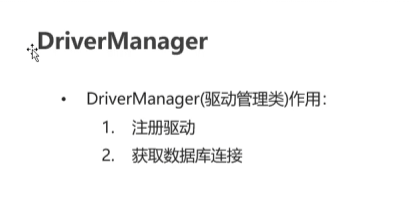
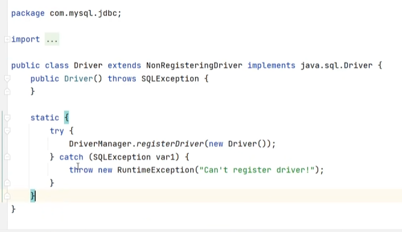
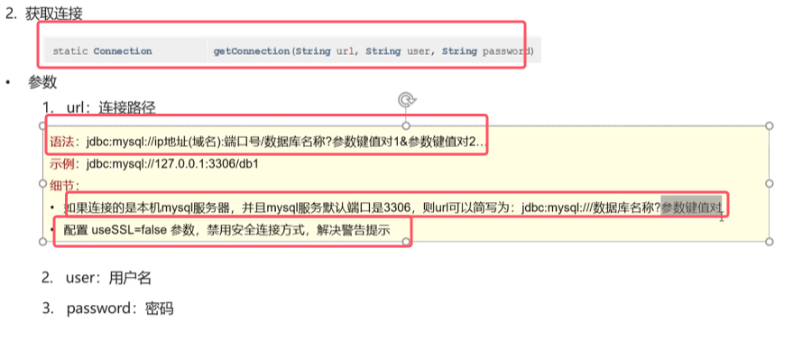
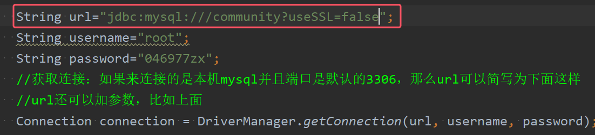

* 该类的是一个工具类，**它的方法都是静态方法。**
* 十分重要的两个方法是
1. `getConnection()`:获取数据库连接
2. `registerDriver()`：注册驱动

com.mysql.cj.jdbc.Driver类的代码如下图所示

* 快速入门中是通过Class.forName()将Driver类的Class对象,即加载进内存（会有类的加载）。
* 该类的静态代码块中有`DriverManager.registerDriver(new Driver())`的语句，所以**真正的注册驱动是由DriverManager来做的**，该静态代码块会在Driver类的加载自动被执行，从而注册了驱动

* url固定的语法如上图所示，IP地址可以写域名，本机的域名为`localhost
* 数据库名称后面还可以使用`?`加上参数键值对，多个参数键值对之间使用`&`进行连接
* 如果来连接的是本机mysql并且端口是默认的3306，那么url可以简写为下面这样 ，并且url还可以加参数，比如上面
	