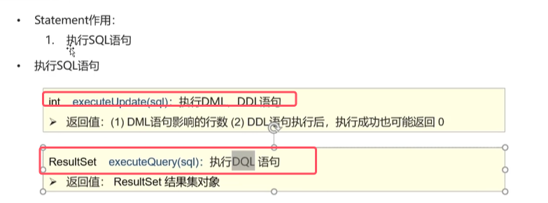
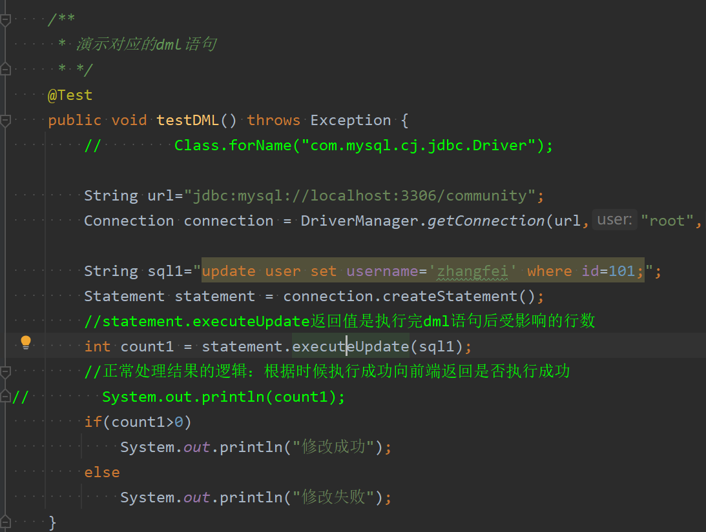
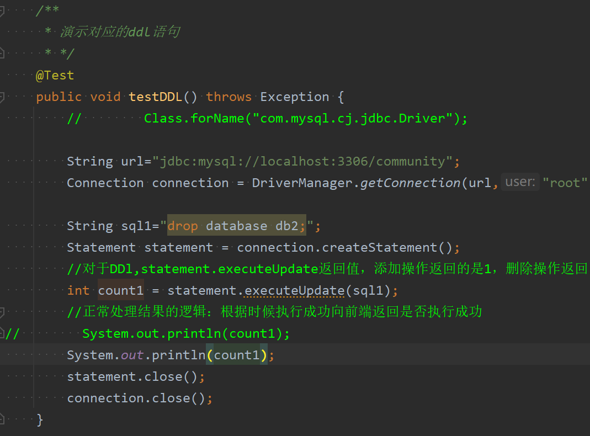

* `statement.executeUpdate(sql)`用于执行数据库内容的增删改操作（DML）和数据库结构的的操作（DDL）

	* 对于DML语句，返回值是DML执行后成功影响的行数
	

	* 对于DDL语句，即使执行成功，返回值也可能为0。
	
	

* `statement.executeQuery(sql)`用于执行普通查询操作（DQL）， 因为查询的结果可能会有多个，所以用`ReseultSet`类去接收，具体后面讲该类的时候具体讲述

