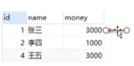
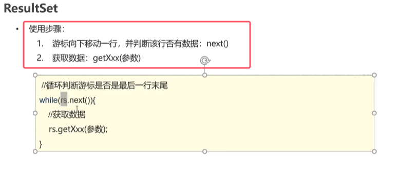
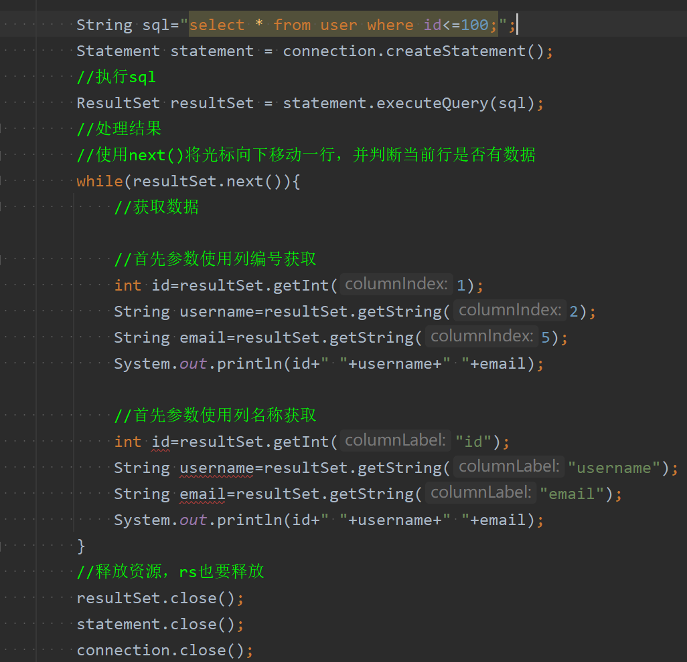
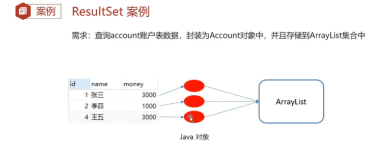
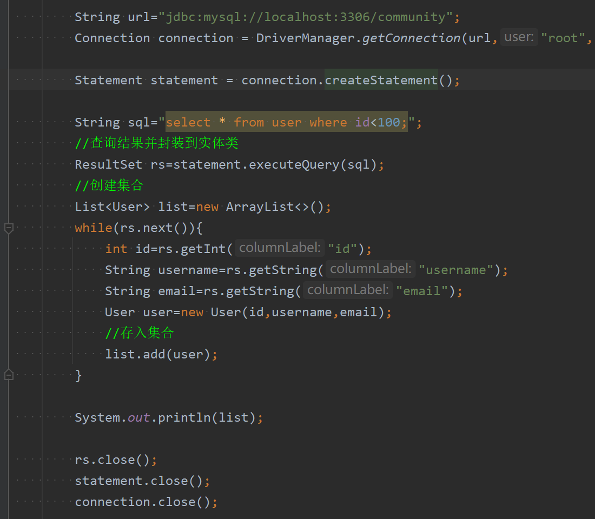

* 查询结果的结果集封装在该类的中，**并且会有一个游标，默认指向的是第一个数据行的上一行，其用于获取查询结果**

	
* **next()方法就是先将光标向下移动一行，再判断光标指向的当前行是否还有数据，并返回**
* **getXXX()用于获取数据，XXX就代表数据类型。而里面穿的参数可以传列名，也可以传列编号，注意是从1开始，而不是从0开始**。返回值是你要获取什么数据，就返回什么类型的数据

使用步骤如下：

