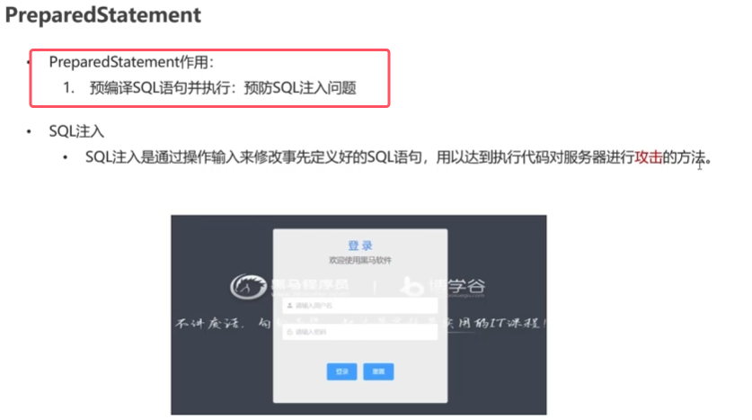

### 1.sql注入攻击
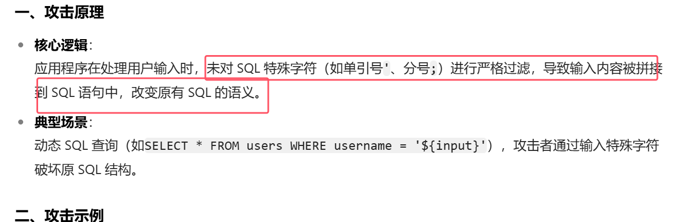

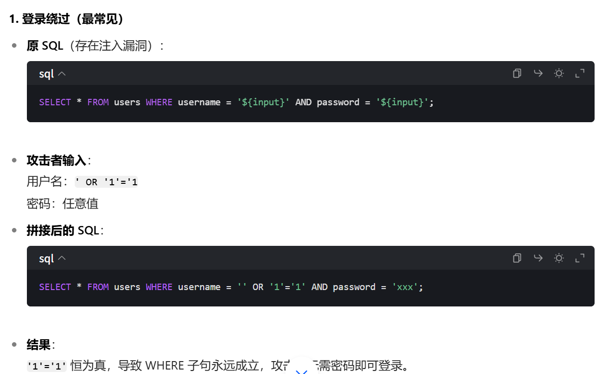

使用前端提交内容来做登陆内容的方法如下所示

* **使用sql语句查询时，使用前端发来的参数的sql语句格式如下图所示**，字符串类型是''中嵌套双引号，然后两个加号，里面写参数

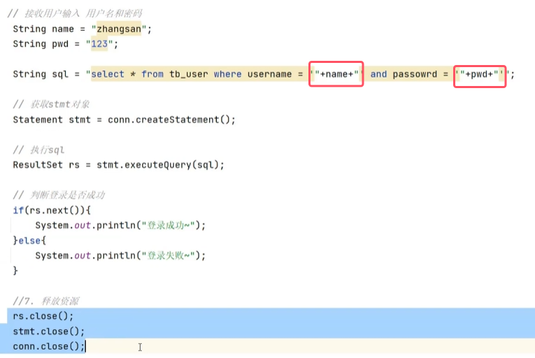
* 如果再数据库中查到有该记录那就登陆成功，如果没有就登陆失败

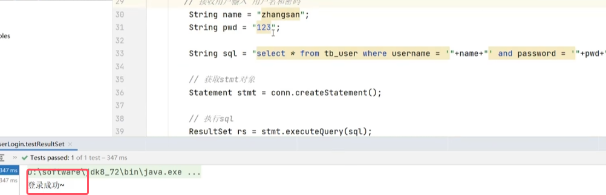
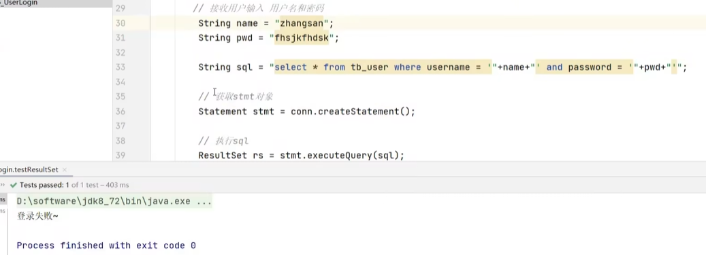

sql注入攻击的做出的改编如下所示

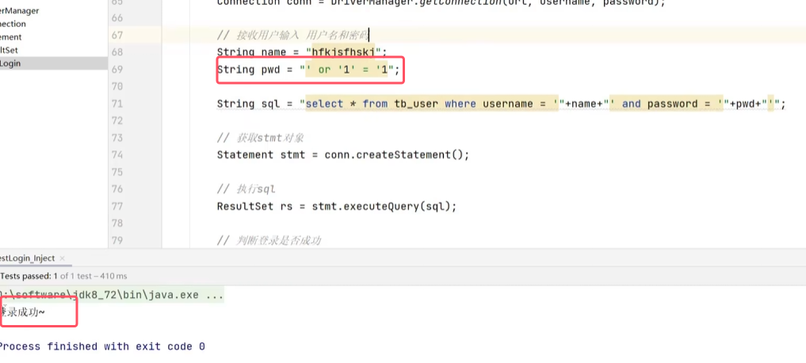
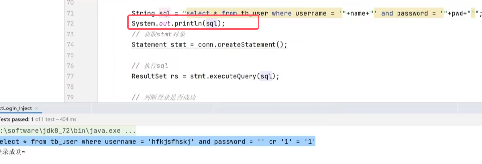
* and优先级比or高，所以限制性and来凝结的两个条件为false，or由右边的条件恒真，所以整体为真，查询有内容，所以登陆成功

### 2.PreparedStatement类

#### 使用方式
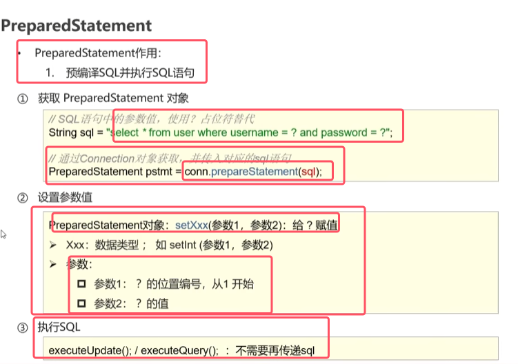

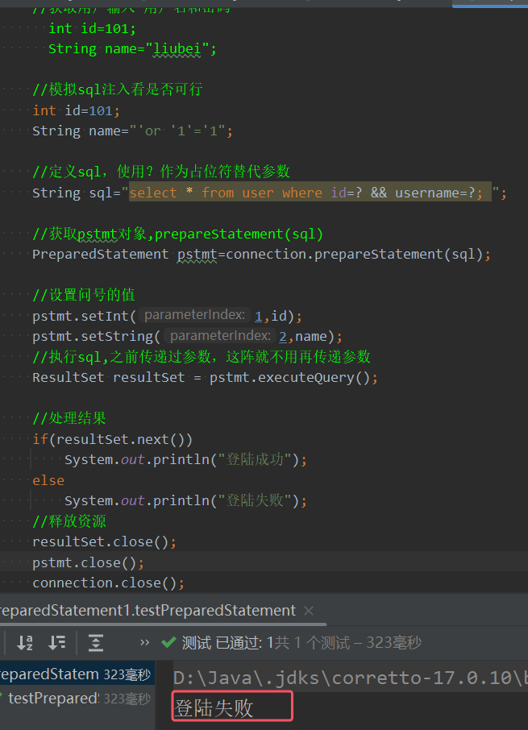
* **PreparedStatement类防范sql注入的原理：再使用setXXX方法设置参数值之后，会将传入sql语句中的参数值中的特殊字符做一个转义，从而对这些字符进行了过滤**

### 预编译sql以及防止sql注入的原理

* 预编译：**再创建PreparedStatement对象传入sql语句，这行代码在执行完的时候，该java程序已经将sql语句发送给了服务器，mysql服务器就可以提前检查语法和编译sql，这样在调用executeQuery()的时候就直接执行sql即可**，而不再走前两个步骤，性能更高。
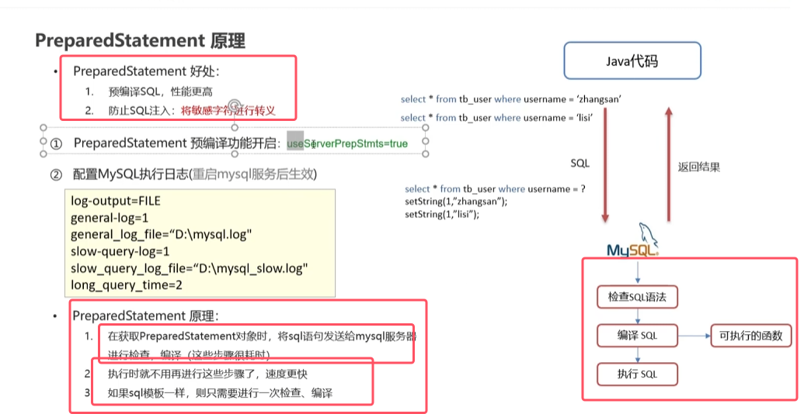
* 预编译功能默认是关闭的，所以需要在url上加上图中参数才能进型预编译
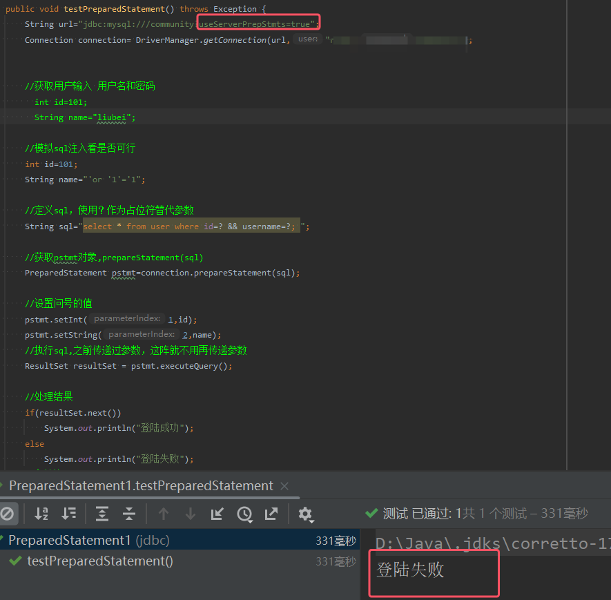

