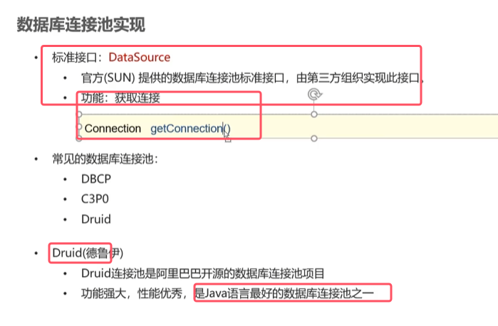

* 数据库连接池：在数据库系统启动之前，初始化该连接池（容器），在连接池中提前申请多个数据库连接，之后有用夫需要与数据库建立连接，此时就从连接池中取出一个连接给该用户，使用完后将该链接归还到连接池当中

* **使用了连接池技术以后，我们可以直接使用DataSourse接口实现类的getConnection()方法从连接池中获得数据库连接就行了**。就不用再从驱动管理类DriverManager中获取数据库连接了

 
 