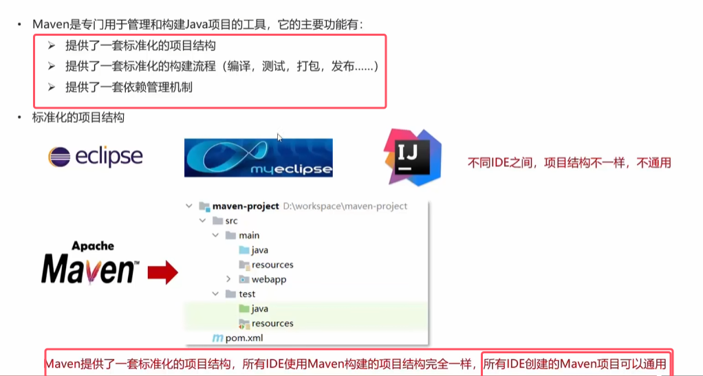

### Maven概述

标准化的项目结构具体如下图

标准化的项目构建流程如下图所示

 

* **有了maven，不再需要手动下载并将jar包加入工作环境了**

### Maven简介

* POM：项目对象模型（project object module）

* **依赖只要写完一刷新就外部库终究会有对应的jar包，这都要归功于仓库，通过依赖项然后去仓库中找到对应的jar包进行引用**
* **坐标就是依赖项中的具体信息**

对于私有仓库来说，他的仓库的传递流程如下图所示

