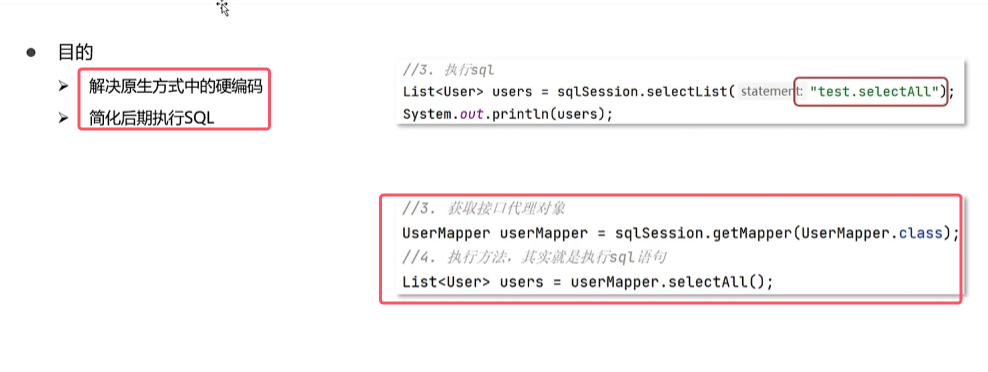
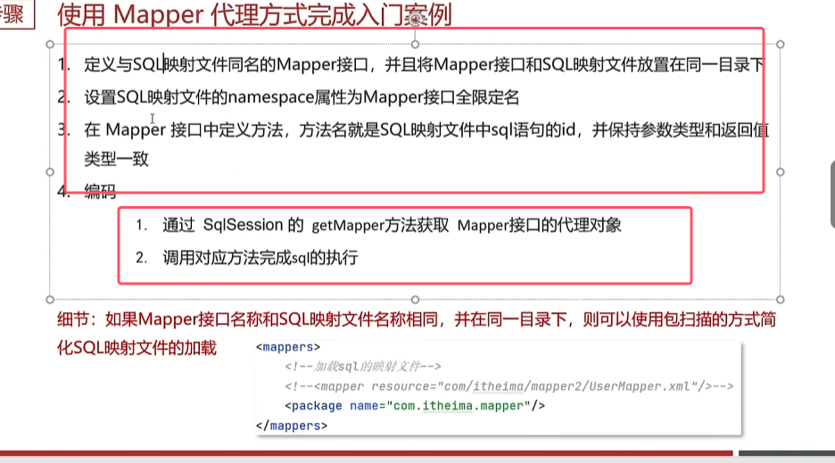
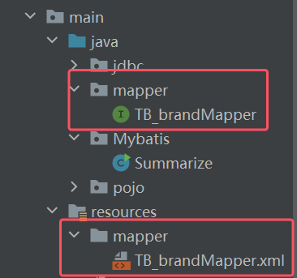
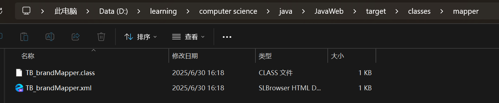
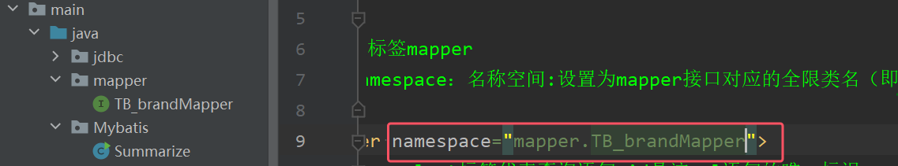
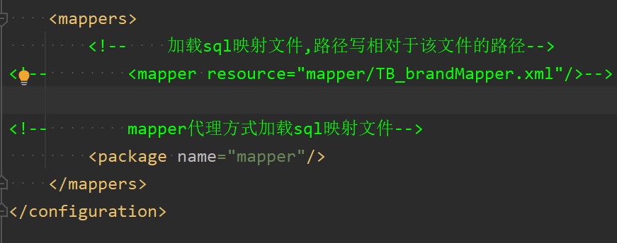

  

* Mapper代理开发的规则如下图到1-3条所示

	1. 定义与sql映射文件同名的mapper接口，并且将Mapper接口和sql映射文件放在同一目录下（具体做法：在java下创建mapper里面对应的接口的路径位置要与sql映射文件在resources下面的路径位置相同）**使用斜杠而不是.来创建resources中的多级目录**。编译后的结果如下图所示
		
		
	2. 设置sql映射文件中的namespace属性为Mapper接口的全限定名

		
	3. 在mapper中定义方法，方法名就是sql映射文件对应的id，并保证参数类型和返回值类型与sql中的resultType一致。
	4. 遵守上面三点之后，在核心配置文件当中就可以使用包扫描的方式加载sql映射文件

	
