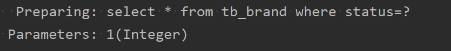

### 查询练习

#### 1.查询所有数据

#### 2.查看详情

* 参数占位符：  
	1. #{}：预编译会将参数先替换成？，然后将参数在带入，和JDBC中的preparedStatement作用一样，都防止sql注入  
	2. ${}：直接拼接参数，会存在sql注入问题  
	3. 使用时机：参数传递的时候使用#{},表名或者列名不固定的情况下使用${}  
  * 参数类型：parameterType可以省略不写
  * 特殊字符处理：  
	1. 转义字符,例如<为&lt;  

	
	2. CDATA区：使用大写CD就可以代码自动补全

	
#### 3.条件查询

* .Mybatis传递多个参数的方法：
	1. 散装参数：如果要传多个参数的话，需要用`@param`注解来标注一下每个参数都是传递给哪个参数占位符，注解中的内容与sql中的参数占位符需要保持一致

	
	
	
	2. 如果传递进来的参数都属于同一个对象的话，那么就直接把它封装成一个对象，把对象传递到方法里，参数占位符的内容要和实体类中属性名保持一致

	
	
	3. 将参数封装成一个map，键的名称需要与sql语句中的参数占位符保持一致，值就是参数

	
	

#### 4.动态条件查询（使用动态sql）

##### 多条件动态查询——多个条件里面多个

* 用户在上图的前端网页查询的时候，条件查询可能只会用其中几个参数，而不是每个条件都会用，所以此时需要用到动态参数

* if是用于逻辑判断的
	* if标签来做条件判断，test属性里面写逻辑表达式进行判断即可,并且使用的是参数占位符的名字而不能使用表的列名
	 * 对于字符串的内容不仅要判空，还需要判一下是否为空字符串，因为后面要做模糊查询，会拼接%。逻辑连接符使用sql语句的逻辑连接符
		
	* 问题：如果第一个status条件为null不执行的话，整体sql语句就会出错因为就会演变成如下的sql语句  
		
	* 解决方式：
		1. 每个条件都加and，然后第一个条件是用一个恒等式进行过渡连接，这样就不会有语法错误

			
			
		 2. 通过where标签，具体如下

			

* 使用\<where\>标签来替代where，会根据实际情况自动去掉条件第一个条件前面的and，并且会更具实际情况看是否加where

##### 单条件动态查询——多个条件只能里面选一个

* 或者可以使用where标签，这对于就不用去写<otherwise\>了，也不用写再去写一个恒等式了，会更加方便（可以做到什么条件都不选也可以运行的情况）

### 添加练习

* **注意使用opensqlsession()是默认开启事务，在执行完之后还需要调用commit方法去提交事务**。（虽然可以直接设置为自动提交，但是一般不这么做）

**注意：在insert之后，我们无法直接通过brand.getId()来获取id，导致我们无法完成某些业务场景下的操作，比如一个事务内有多个语句，第二个语句要依赖于前一个语句获取的主键id**

解决方法和知识点如下图所示：

* **使用图中红框的两个属性，keyProperty表示将插入之后获取的主键,指向order对象中的对应字段，这样就可以把id拿出来设置到属性上**，这样再通过getid()，就可以获取到id值

### 修改练习
#### 修改全部字段

#### 修改动态字段

* 与where标签同理，使用set标签来规避逗号和是否存在set的问题

### 删除练习

###### 删除一个

###### 删除批量内容

* mybatis提供了foreach标签来提供数组和集合的遍历以完成批量删除的功能（删除数量不确定）
* 其中collection属性指定的是要遍历的集合或者是数组，item属性就是遍历的每一个元素，也就是参数占位符
* **mybatis会将数组参数封装为一个map集合，默认情况下key的值为array，而value就是对应的数组**，**所以要根据key来获取数组，所以collection属性值为map集合的key值，默认为array。**
* **或者使用@param注解来改变map集合当中的key的名称，比如说改变为ids**
* 将来在预编译的时候，sql语句会使用？作为占位符来进行占位，如果原数组中三个元素，会变成如下图所示，这样语法是有问题的，所以需要用，隔开，所以需要使用separator属性设置隔开使用的字符

	
* 并且左括号右括号显得不是那么和谐，我们可以用open属性和close属性，写明

	

使用@param注解改变key的方式如下图所示

演示使用array而不使用@param得到的使用例子

* **注意图中的携带被选中的id数据的方式**